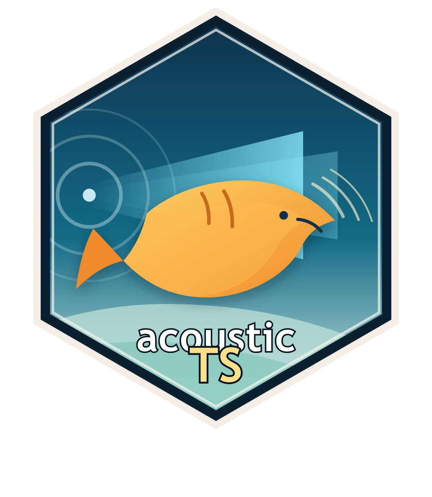

```{r, echo = FALSE}
knitr::opts_chunk$set(
  collapse = TRUE,
  comment = "##",
  fig.retina = 2,
  fig.path = "README_figs/README-"
)
```

# acousticTS 

[](https://doi.org/10.5281/zenodo.7855558) [](https://brandynlucca.github.io/acousticTS/) [](https://github.com/brandynlucca/acousticTS/actions/workflows/R-CMD-check.yaml) [](https://github.com/brandynlucca/acousticTS/actions/workflows/test-coverage.yaml)

## Overview

acousticTS is an R package for estimating the acoustic target strength (TS) of aquatic organisms and objects using physics-based scattering models. It supports a range of scatterer types: fluid-like bodies (e.g., fish, zooplankton), gas-filled bodies (e.g. swimbladders), elastic shells (e.g. pteropods, euphausiids), and calibration spheres. It further provides a unified interface for parameterizing, running, and comparing models across frequencies, orientations, and morphologies. Acoustic backscatter from a single target is expressed as the *backscattering cross-section* ($\sigma_\text{bs}$, m²). Target strength ($TS$, dB re. 1 m²) is its logarithmic form:

$$
  TS = 10 \log_{10}(\sigma_\text{bs})
$$

$TS$ is used to:

- Convert integrated backscatter (e.g. $S_\mathrm{A}$, NASC) or volumetric backscatter ($S_\text{V}$) into number density or biomass
- Classify backscatter by species or taxon based on multi-frequency response
- Parameterize and evaluate physics-based scattering models over statistical distributions of organism size and orientation

## Installation

Install the latest release from GitHub:

```r
# install.packages("devtools")
devtools::install_github("brandynlucca/acousticTS")
```

## Scatterer classes

acousticTS organizes targets into five `S4` classes:

| Class | Description | Example taxa |
|-------|-------------|--------------|
| `FLS` | Fluid-like scatterer | Euphausiids, myctophids, decapod shrimp |
| `SBF` | Swimbladder-bearing fish | Herring, cod, sardine |
| `GAS` | Gas-filled body | Siphonophore pneumatophores |
| `ESS` | Elastic-shelled scatterer | Pteropods, juvenile bivalves |
| `CAL` | Calibration sphere | Tungsten carbide, copper spheres |

Each class stores a shape (position matrix + morphometrics), body material properties (density and sound speed contrasts), and model
results in a structured `S4` object.

## Models

| Model | Abbreviation | Scatterer type | Boundary |
|-------|-------------|----------------|----------|
| Distorted-wave Born approximation | `DWBA` | FLS | Fluid |
| Stochastic DWBA | `SDWBA` | FLS | Fluid |
| Kirchhoff-ray mode | `KRM` | FLS, SBF | Fluid + gas |
| High-pass approximation | `HPA` | FLS, GAS | Fluid / gas |
| Two-ray cylinder model | `TRCM` | FLS | Fluid |
| Modal series solution (sphere) | `SPHMS` | CAL, ESS | Multiple |
| Modal series solution (prolate spheroid) | `PSMS` | FLS | Fluid |
| Modal series solution (elastic shell) | `ESSMS` | ESS | Elastic |
| Finite-cylinder modal series | `FCMS` | CAL | Rigid / fluid |
| Resonance model (gas sphere) | `SOEMS` | GAS, CAL | Gas |

## Quick start

```{r example, eval=FALSE}
library(acousticTS)

# Build a fluid-like scatterer (e.g. krill) with a cylinder shape
krill <- cylinder(
  length = 0.03,          # 30 mm body length
  radius = 0.003,         # 3 mm max radius
  g = 1.0357,             # density contrast
  h = 1.0279,             # sound speed contrast
  theta = pi / 2          # broadside incidence
)

# Run the DWBA model from 1 kHz to 300 kHz
krill <- target_strength(krill, frequency = seq(1e3, 300e3, by = 1e3),
                          model = "DWBA")

# Plot TS vs frequency
plot(krill, type="model")
```

## Shapes and reforging

Scatterer shapes are created via dedicated constructors:

```{r shapes, eval=FALSE}
# Cylinder (used by FLS / CAL)
fish_shape <- cylinder(length = 0.25, radius = 0.02)

# Prolate spheroid (used by FLS / PSMS)
ps_shape   <- prolate_spheroid(length = 0.02, radius = 0.002)

# Arbitrary shape from digitized position matrix
arb_shape  <- arbitrary(rpos = my_matrix)
```

Existing scatterer objects can be resized or re-discretized without reconstructing them from scratch using `reforge()`:

```{r reforge, eval=FALSE}
# Rescale a krill to 40 mm
krill_40mm <- reforge(krill, length = 0.04)

# Change segment count
krill_fine <- reforge(krill, n_segments = 200)
```

## Configuring simulations

`simulate_ts()` runs repeated model evaluations across distributions of input parameters, supporting both vectorized and batch modes:

```{r simulate, eval=FALSE}
results <- simulate_ts(
  krill,
  model = "DWBA",
  frequency = 120e3,
  n = 1000,
  parameters = list(
    theta = function() rnorm(1, pi / 2, pi / 18),
    length = function() rnorm(1, 0.03, 0.003)
  )
)
```

## Built-in datasets

| Dataset | Description |
|---------|-------------|
| `krill` | Antarctic krill (*Euphausia superba*) shape and material properties |
| `cod` | Atlantic cod (*Gadus morhua*) shape and swimbladder |
| `sardine` | Pacific sardine (*Sardinops sagax*) shape and swimbladder |
| `benchmark_ts` | Benchmark TS values for model validation |

```{r data, eval=FALSE}
data(krill)
data(cod)
data(sardine)
data(benchmark_ts)
```

## Citation

If you use `acousticTS` in published work, please cite:

```{r citation, eval=FALSE}
citation("acousticTS")
```

> Lucca, B. (2023). acousticTS: Estimating Acoustic Target Strength via
> Physics-Based Scattering Models.
> <https://doi.org/10.5281/zenodo.7600660>

## Contributing and bug reports

Bug reports and feature requests are welcome via the [GitHub Issues page](https://github.com/brandynlucca/acousticTS/issues). Please include a minimal reproducible example when reporting bugs.

## License

GPL-3. See [LICENSE](LICENSE) for details.

