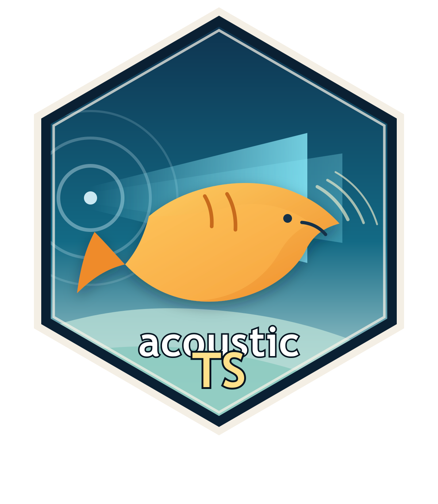
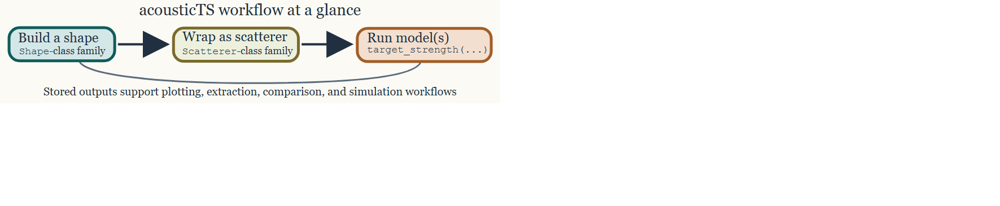

```{r, echo = FALSE}
knitr::opts_chunk$set(
  collapse = TRUE,
  comment = "##"
)
```

# acousticTS 

[](https://doi.org/10.5281/zenodo.7600659)
[](https://brandynlucca.github.io/acousticTS/)
[](https://github.com/brandynlucca/acousticTS/actions/workflows/R-CMD-check.yaml)
[](https://app.codecov.io/gh/brandynlucca/acousticTS?branch=main)
[](LICENSE)

`acousticTS` estimates the acoustic target strength of aquatic organisms,
calibration spheres, and other individual scatterers with physics-based
models. It provides one interface for defining geometry and material
properties, running compatible scattering models, and comparing results across
frequency, orientation, and morphology.

## Package workflow

The package separates geometry, physical interpretation, and model execution:

[](https://brandynlucca.github.io/acousticTS/articles/getting-started/getting-started.html)

Shapes and scatterers are implemented as S4 objects. A
[`Shape`](https://brandynlucca.github.io/acousticTS/reference/Shape-class.html)
stores geometry. A
[`Scatterer`](https://brandynlucca.github.io/acousticTS/reference/Scatterer-class.html)
adds the physical properties, orientation, model inputs, and results needed for
an acoustic calculation.

## Installation

Install the current GitHub version without building the full documentation
site:

```r
install.packages("remotes")
remotes::install_github(
  "brandynlucca/acousticTS",
  build_vignettes = FALSE
)
```

> **Installation note:** `acousticTS` contains C++17 and Fortran source code.
> Windows users need the version of
> [Rtools](https://cran.r-project.org/bin/windows/Rtools/) matching their R
> installation. macOS users need the Xcode Command Line Tools and a compatible
> GNU Fortran compiler. Linux users need a C++17 compiler, `make`, and
> `gfortran`. See
> [Troubleshooting](https://brandynlucca.github.io/acousticTS/articles/faq-troubleshooting/faq-troubleshooting.html)
> if compilation fails.

## Quick start

Build a shape, attach its acoustic properties, and run a model:

```{r quick-start, eval=FALSE}
library(acousticTS)

# 1. Build a geometric Shape
krill_shape <- cylinder(
  length_body = 0.03,
  radius_body = 0.003
)

# 2. Wrap it as a fluid-like Scatterer
krill_target <- fls_generate(
  shape = krill_shape,
  g_body = 1.0357,
  h_body = 1.0279,
  theta_body = pi / 2
)

# 3. Calculate and plot target strength
krill_target <- target_strength(
  object = krill_target,
  frequency = seq(38e3, 120e3, by = 2e3),
  model = "dwba"
)

plot(krill_target, type = "model")
```

The result remains attached to `krill_target`, so the same object can be
plotted, inspected with `extract()`, or reused in a simulation.

## What is included

- Constructors for canonical and arbitrary
  [shapes](https://brandynlucca.github.io/acousticTS/articles/building-shapes/building-shapes.html),
  including spheres, spheroids, cylinders, and digitized body profiles.
- S4 scatterer classes for fluid-like, gas-filled, elastic, composite, and
  calibration targets.
- Exact, modal-series, T-matrix, weak-scattering, high-frequency, and composite
  [model families](https://brandynlucca.github.io/acousticTS/articles/model-library/model-library.html).
- Shape manipulation and `reforge()` workflows for resizing, resampling,
  bending, and repositioning targets.
- Repeated parameter studies with
  [`simulate_ts()`](https://brandynlucca.github.io/acousticTS/reference/simulate_ts.html).
- Stored-state T-matrix tools for angular scattering, bistatic summaries, and
  orientation averages.
- Validation registries, benchmark datasets, and documented implementation
  checks.

Use [`available_models()`](https://brandynlucca.github.io/acousticTS/reference/available_models.html)
for the current model registry and accepted aliases.

## Example data

The package includes ready-to-use biological targets and benchmark results:

```{r data, eval=FALSE}
data(krill, package = "acousticTS")
data(cod, package = "acousticTS")
data(sardine, package = "acousticTS")
data(benchmark_ts, package = "acousticTS")

plot(krill, type = "shape")
```

See [Example Data](https://brandynlucca.github.io/acousticTS/articles/example-data/example-data.html)
for the contents and intended use of each object.

## Documentation

- [Quick Start](https://brandynlucca.github.io/acousticTS/articles/getting-started/getting-started.html)
- [Build Targets](https://brandynlucca.github.io/acousticTS/articles/building-shapes/building-shapes.html)
- [Run Models](https://brandynlucca.github.io/acousticTS/articles/running-models/running-models.html)
- [Model Library](https://brandynlucca.github.io/acousticTS/articles/model-library/model-library.html)
- [Function Reference](https://brandynlucca.github.io/acousticTS/reference/index.html)

The documentation explains package conventions, supported formulations, and
validation scope. It complements the original scattering literature rather
than replacing it.

## Citation

To cite `acousticTS`, run:

```{r citation, eval=FALSE}
citation("acousticTS")
```

The Zenodo concept DOI, which resolves to the latest archived release, is
[10.5281/zenodo.7600659](https://doi.org/10.5281/zenodo.7600659).

## Contributing

Bug reports and feature requests are welcome through
[GitHub Issues](https://github.com/brandynlucca/acousticTS/issues). Please
include a minimal reproducible example and `sessionInfo()` when reporting a
problem.

`acousticTS` is licensed under GPL-3. See [LICENSE](LICENSE).
