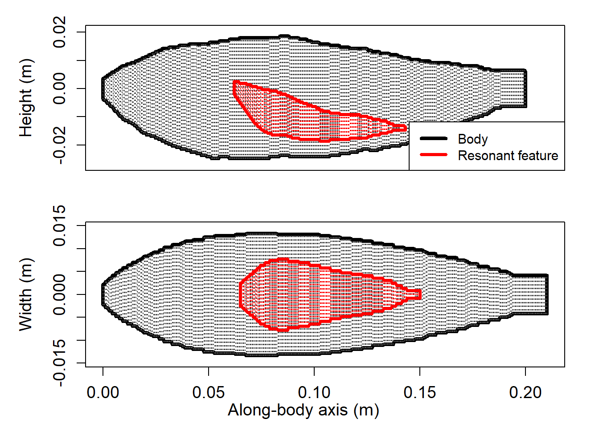
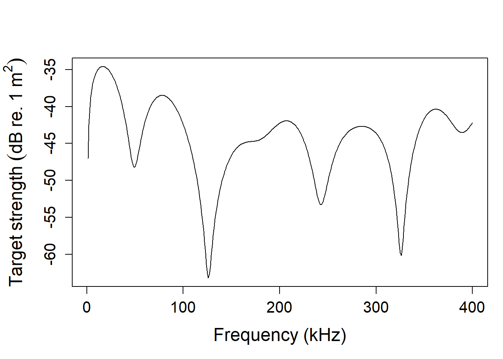
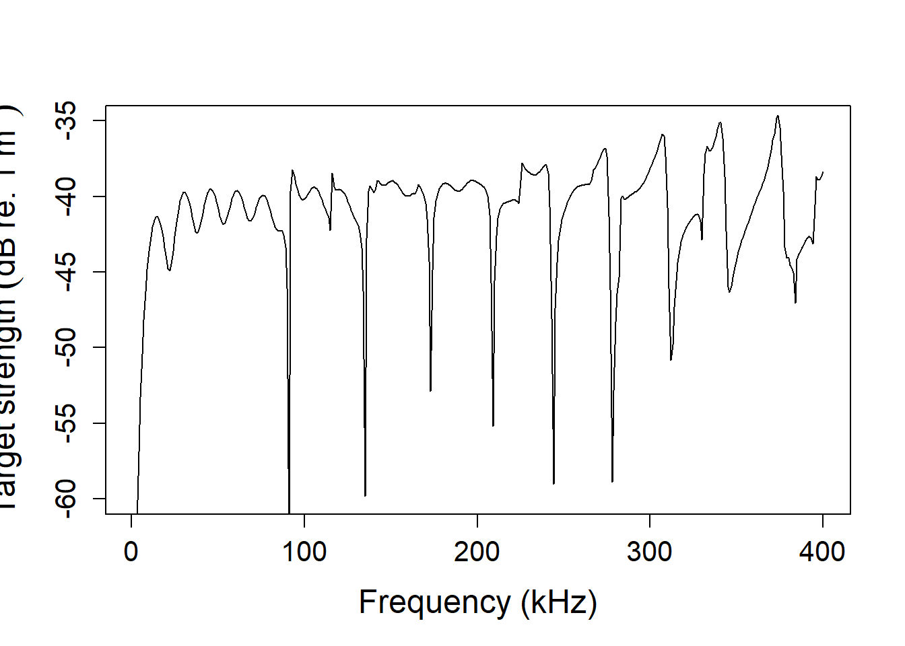
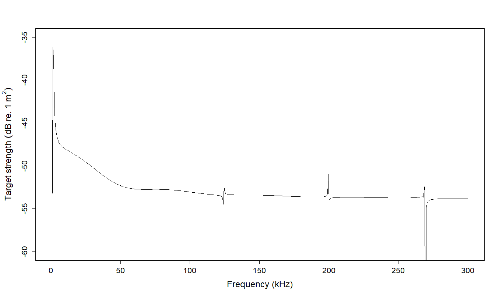
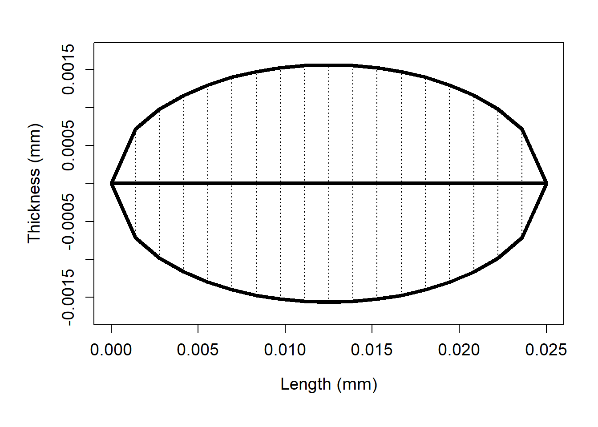

# acousticTS

Acoustic backscatter from a single target or organism is expressed as
the intensity of an echo typically denoted as the *backscattering
cross-section* (σ<sub>bs</sub>, m<sup>2</sup>). Target strength (TS, dB
re. 1 m<sup>2</sup>) is the logarithmic representation of σ<sub>bs</sub>
where: TS = 10 log<sub>10</sub> (σ<sub>bs</sub>). TS can be used to
convert integrated (e.g. nautical area scattering coefficient,
S<sub>A</sub>, dB re. 1(m<sup>2</sup> nmi<sup>-2</sup>) or volumetric
backscatter (e.g. S<sub>v</sub>, dB re. 1 m<sup>-1</sup>) collected from
fisheries acoustic surveys into units of number density, such as the
volumetric density of a fish school (i.e. animals m<sup>-3</sup>). This
parameter can also aid in classifying backscatter based on the
multifrequency response of targets, such as separating likely echoes of
large predatory fish from smaller prey. While there are several
approaches for estimating TS, one common method is to apply
physics-based models to predict theoretical TS that comprise exact and
approximate solutions. The models provided in the `acousticTS` package
can help provide TS estimates parameterized using broad statitsical
distributions of inputs. This package is in a constant state of
development with updates to the available model library, computational
efficiency, and quality-of-life improvements.

*General DOI* <https://doi.org/10.5281/zenodo.7600659>

*Latest release DOI*
[](https://zenodo.org/badge/latestdoi/161965429)

## Installation

You can install the current released version of acousticTS via:

``` r
devtools::install_github("brandynlucca/acousticTS")
```

Or you can install the development version of acousticTS like so:

``` r
devtools::install_github("brandynlucca/acousticTS@test-branch")
```

## <u>Models currently available</u>

#### Two-ray model for uniformly bent fluid-like cylinders (<u>DCM</u>)

*Stanton, T.K., Clay, C.S., and Chu, D. (1993). Ray representation of
sound scattering by weakly scattering deformed fluid cylinders: Simple
physics and application to zooplankton. J. Acoust. Soc. Am., 94,
3454-3462.*

#### Distorted wave Born approximation (<u>DWBA</u>)

*Stanton, T.K., Chu, D., and Wiebe, P.H. (1998). Sound scattering by
several zooplankton groups. II. Scattering models. J. Acoust. Soc. Am.,
103, 236-253.*

#### Stochastic distorted wave Born approximation (<u>SDWBA</u>)

*Demer, D.A., and Conti, S.G. 2003. Reconciling theoretical versus
empirical target strengths of krill: effects of phase variability on the
distorted-wave Born approximation. ICES J. Mar. Sci., 60, 429-434.*

#### SDWBA for uniformly bent scatterers (<u>SDWBA_curved</u>)

*Demer, D.A., and Conti, S.G. 2003. Reconciling theoretical versus
empirical target strengths of krill: effects of phase variability on the
distorted-wave Born approximation. ICES J. Mar. Sci., 60, 429-434.*

*Stanton, T.K., Chu, D., and Wiebe, P.H. (1998). Sound scattering by
several zooplankton groups. II. Scattering models. J. Acoust. Soc. Am.,
103, 236-253.*

#### Kirchoff-ray mode approximation (<u>KRM</u>)

*Clay C.S. and Horne J.K. (1994). Acoustic models of fish: The Atlantic
cod (Gadus morhua). J. Acoust. Soc. Am., 96, 1661-1668.*

#### Modal series solution for gas-filled fluid spheres (<u>MSS_anderson</u>)

*Anderson, V.C. (1950). Sound scattering from a fluid sphere. J. Acoust.
Soc. Am., 22, 426-431.*

#### Homogeneous solid sphere (<u>calibration</u>)

*MacLennan D. N. (1981). The theory of solid spheres as sonar
calibration targets. Scottish Fisheries Research No. 22, Department of
Agriculture and Fisheries for Scotland.*

## <u>Examples</u>

Below are examples of different models used to predict TS for a sardine
with a gas-filled swimbladder, a tungsten carbide calibration sphere, a
crustacean modeled as a prolate spheroid, and a generic gas-filled
bubble.

### Kirchoff Ray-Mode approximation for a Sardine with a gas-filled swimbladder

``` r
library( acousticTS )
## 
## Attaching package: 'acousticTS'
## The following object is masked from 'package:base':
## 
##     kappa
### Call in the built-in sardine shape dataset
data( sardine )
### Inspect the object
print( sardine )
## SBF-object 
##   Fluid-like scatterer 
##    ID: Sardinops sagax caerulea (Conti and Demer, 2003) 
##  Body dimensions:
##   Length: 0.21 m (n = 379 cylinders) 
##   Mean radius: 0.0097 m | Max radius: 0.0133 m 
##  Bladder dimensions:
##   Length: 0.085 m (n = 154 cylinders) 
##   Mean radius: 0.0048 m | Max radius: 0.0078 m 
##  Body material properties:
##   Density: 1070 kg m^-3 | Sound speed: 1570 m s^-1 
##  Bladder fluid material properties:
##   Density: 1.24 kg m^-3 | Sound speed: 345 m s^-1 
##  Body orientation (relative to transducer face/axis): 1.571 radians
plot( sardine )
```



``` r
### We will now define a frequency range to predict TS over
frequency <- seq( 1e3 , 400e3 , 1e3 )
### And now we use the target_strength(...) function to model TS for this fish
sardine <- target_strength( sardine, 
                            frequency = frequency, 
                            model = "KRM" )
## KRM model for SBF-object: Sardinops sagax caerulea (Conti and Demer, 2003) initialized.
### Plot results
plot( sardine, type = 'model' )
```



``` r
### Extract model results
sardine_ts <- extract( sardine , "model") $KRM
```

### Calibration sphere

``` r
### Let's create a calibration sphere 
### Default inputs here are a 38.1 mm diameter and a tungsten carbide 
### (WC) material properties.
cal_sphere <- cal_generate( )
### We will use the same frequency range as the previous example
### Calculate TS
cal_sphere <- target_strength( object = cal_sphere,
                               frequency = frequency,
                               model = "calibration" )
## CALIBRATION model for CAL-object: Calibration sphere initialized.
### Plot results
plot( cal_sphere , type = 'model' )
```



``` r
### Extract model results
calibration_ts <- extract( cal_sphere , "model" )$calibration
```

### Fluid sphere (Anderson, 1950)

``` r
### Let's create a gas-filled bubble with a raidus of 4 mm
### This defaults to a density contrast, g_body, of 0.0012
### This defaults to a soundspeed contrast, h_body, of 0.220
bubble <- gas_generate( radius = 4e-3 ,
                        ID = "gas bubble" )
print( bubble )
## GAS-object 
##   Gas- and fluid-filled scatterer 
##    ID: gas bubble 
##  Body dimensions:
##   Diameter: 0.008 m 
##   Radius: 0.004 m 
##  Material properties:
##   g: 0.0012 
##   h: 0.22
### Model TS using the Anderson (1950) model
bubble <- target_strength( bubble,
                           frequency = seq( 1e3 , 300e3 , 0.5e3 ) ,
                           model = "MSS_anderson" )
## MSS_ANDERSON model for GAS-object: gas bubble initialized.
### Plot results
plot( bubble , type = 'model' )
```



### Fluid-like crustacean (prolate spheroid) using the distorted Born wave approximation (DWBA) and ray-based deformed cylinder model (DCM)

``` r
### First let's create a prolate spheroid shape 
### 25 mm long with a length-to-radius ratio of 16
crustacean <- fls_generate( shape = "prolate_spheroid" ,
                            length_body = 25.0e-3 , 
                            length_radius_ratio = 16 ,
                            radius_curvature_ratio = 3.3 ,
                            g_body = 1.03 ,
                            h_body = 1.02 )
print( crustacean )
## FLS-object 
##   Fluid-like scatterer 
##    ID: UID 
##  Body dimensions:
##   Length: 0.025 m (n = 19 cylinders) 
##   Mean radius: 0.0011 m 
##   Max radius: 0.0016 m 
##  Shape parameters:
##   Defined shape: prolate_spheroid 
##   L/a ratio: 16 
##   Taper order:  
##  Material properties:
##   g: 1.03 
##   h: 1.02 
##  Body orientation (relative to transducer face/axis): 1.571 radians
plot( crustacean )
```



``` r
### Model TS using the ray-path deformed cylinder model (DCM), distorted wave
### Born approximation (DWBA), the stochastic variation of the DWBA (SDWBA) , 
### and specifically curved versions of both the DWBA and SDWBA 
crustacean <- target_strength( crustacean ,
                               frequency = seq( 1e3 , 200e3 , 1e3 ) ,
                               model = c( "DCM" , "DWBA" , "SDWBA" ,
                                          "DWBA_curved" , "SDWBA_curved" ) )
## DCM model for FLS-object: UID initialized.
## 
## DWBA model for FLS-object: UID initialized.
## 
## SDWBA model for FLS-object: UID initialized.
## 
## DWBA_CURVED model for FLS-object: UID initialized.
## 
## SDWBA_CURVED model for FLS-object: UID initialized.
## 
## Beginning TS modeling via DCM model for FLS-object: UID 
## DCM TS model predictions for FLS-object: UID complete.
## 
## Beginning TS modeling via DWBA model for FLS-object: UID 
## DWBA TS model predictions for FLS-object: UID complete.
## 
## Beginning TS modeling via SDWBA model for FLS-object: UID 
## SDWBA TS model predictions for FLS-object: UID complete.
## 
## Beginning TS modeling via DWBA_CURVED model for FLS-object: UID 
## DWBA_CURVED TS model predictions for FLS-object: UID complete.
## 
## Beginning TS modeling via SDWBA_CURVED model for FLS-object: UID 
## SDWBA_CURVED TS model predictions for FLS-object: UID complete.
### Plot results
plot( crustacean , type = 'model' )
```
