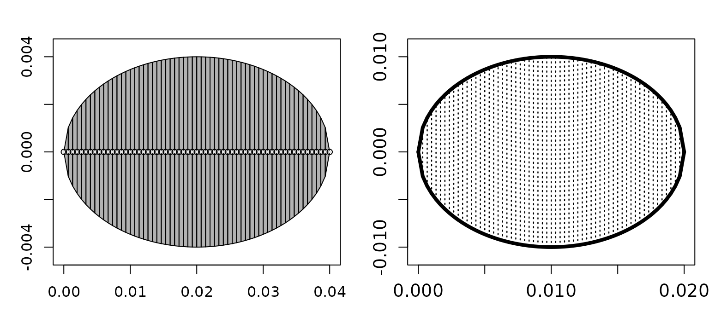

# Building scatterers

## Introduction

The scatterer classes in `acousticTS` are organized around target types
that recur across fisheries and zooplankton acoustics, from calibration
spheres to weakly scattering elongated bodies and composite fish
targets.

Once a geometry exists, it still has to be assigned a physical
interpretation before most models in acousticTS can be run. That is the
role of a scatterer object. A shape answers the geometric question, but
a scatterer answers the acoustic one: what is the target made of, which
interfaces matter, how should the surrounding medium be interpreted, and
which class of model assumptions is meant to apply?

This distinction matters because the same outline can support several
different physical interpretations. A smooth elongated body might be
treated as a weakly scattering fluid-like target, as a gas-filled
inclusion, or as part of a composite fish-like target with an internal
swimbladder. The geometry by itself does not decide among those cases.
Scatterer construction is the step where the reader turns a geometric
description into a model-ready acoustic object.

[](https://brandynlucca.github.io/acousticTS/reference/Scatterer-class.md "Scatterer class")[](https://brandynlucca.github.io/acousticTS/reference/FLS-class.md "FLS class")[](https://brandynlucca.github.io/acousticTS/reference/GAS-class.md "GAS class")[](https://brandynlucca.github.io/acousticTS/reference/CAL-class.md "CAL class")[](https://brandynlucca.github.io/acousticTS/reference/ELA-class.md "ELA class")[](https://brandynlucca.github.io/acousticTS/reference/CSC-class.md "CSC class")[](https://brandynlucca.github.io/acousticTS/reference/SBF-class.md "SBF class")[](https://brandynlucca.github.io/acousticTS/reference/BBF-class.md "BBF class")[](https://brandynlucca.github.io/acousticTS/reference/ESS-class.md "ESS class")

## Quick constructor examples

The fastest way to see the package logic is to build a few small objects
directly.

``` r
library(acousticTS)

shape_obj <- prolate_spheroid(
  length_body = 0.04,
  radius_body = 0.004,
  n_segments = 60
)

fls_obj <- fls_generate(
  shape = shape_obj,
  density_body = 1045,
  sound_speed_body = 1520
)

gas_obj <- gas_generate(
  shape = sphere(radius_body = 0.01, n_segments = 60),
  g_fluid = 0.0012,
  h_fluid = 0.22
)

data.frame(
  object_class = c(class(fls_obj)[1], class(gas_obj)[1]),
  shape = c(
    extract(fls_obj, c("shape_parameters", "shape")),
    extract(gas_obj, c("shape_parameters", "shape"))
  ),
  length_m = c(
    extract(fls_obj, c("shape_parameters", "length")),
    extract(gas_obj, c("shape_parameters", "length"))
  )
)
```

    ##   object_class           shape length_m
    ## 1          FLS ProlateSpheroid     0.04
    ## 2          GAS          Sphere     0.02

That is the core pattern used throughout the package: build a `Shape`,
then assign it a physical interpretation with the relevant scatterer
constructor.

It is also worth checking the geometry visually at this stage because
the scatterer plot reflects the stored object that will be passed into
[`target_strength()`](https://brandynlucca.github.io/acousticTS/reference/target_strength.md),
not just the constructor inputs.

``` r
old_par <- par(no.readonly = TRUE)
on.exit(par(old_par), add = TRUE)

par(mfrow = c(1, 2), mar = c(3, 3, 2.2, 0.8))
plot(fls_obj, type = "shape", main = "FLS object")
plot(gas_obj, type = "shape", main = "GAS object")
```



## Why scatterer construction is separate from shape construction

The package separates shape generation from scatterer generation so that
geometry can be reused across several physical scenarios. That
separation is more than a software convenience. It mirrors the modeling
logic used throughout the package. In acoustics, geometry and material
contrast are related, but they are not the same thing. A user may want
to ask how the same body behaves when interpreted as fluid-like rather
than gas-filled, or how a measured outline behaves when modeled with a
simple weak-scattering approximation versus a more specialized composite
model.

Keeping those stages separate also reduces ambiguity. When the object is
built in two steps, it becomes much easier to see whether a later
disagreement comes from geometry, from material properties, or from
model choice. That is one of the central design ideas behind the
package.

## Main generator families

The most important constructors are
[`fls_generate()`](https://brandynlucca.github.io/acousticTS/reference/fls_generate.md)
for fluid-like segmented bodies,
[`gas_generate()`](https://brandynlucca.github.io/acousticTS/reference/gas_generate.md)
for gas-filled simple bodies,
[`sbf_generate()`](https://brandynlucca.github.io/acousticTS/reference/sbf_generate.md)
for fish-like body-plus-internal-structure targets,
[`ess_generate()`](https://brandynlucca.github.io/acousticTS/reference/ess_generate.md)
for elastic-shelled spheres, and
[`cal_generate()`](https://brandynlucca.github.io/acousticTS/reference/cal_generate.md)
for calibration spheres. Each constructor packages geometry, material
properties, metadata, units, and model-ready parameter fields into a
single scatterer object, but they do so for different acoustic
interpretations.

[`fls_generate()`](https://brandynlucca.github.io/acousticTS/reference/fls_generate.md)
is the general fluid-like constructor and is often the right starting
point for weakly scattering elongated targets used with `DWBA`, `SDWBA`,
`HPA`, `TRCM`, or other fluid-like workflows.
[`gas_generate()`](https://brandynlucca.github.io/acousticTS/reference/gas_generate.md)
is more specialized. It is intended for simple gas-filled objects where
the dominant acoustic contrast comes from the gas-fluid interface.
[`sbf_generate()`](https://brandynlucca.github.io/acousticTS/reference/sbf_generate.md)
is meant for composite fish-like targets where body and internal
structures, especially a swimbladder, need to be represented together
rather than collapsed into one homogeneous body.
[`ess_generate()`](https://brandynlucca.github.io/acousticTS/reference/ess_generate.md)
is reserved for elastic shelled spheres, where shell thickness and
elastic material properties are central to the physics.
[`cal_generate()`](https://brandynlucca.github.io/acousticTS/reference/cal_generate.md)
is the constructor for standard calibration spheres, where the target is
not a biological body at all but a well-defined solid sphere used for
reference and validation work.

The practical consequence is that constructor choice should be driven by
the interface physics that matter most, not only by the overall
silhouette of the target.

The map above makes the class hierarchy explicit as well. `Scatterer`
remains the common parent, but composite targets branch through `CSC`,
elastic-target families branch through `ELA`, and the
swimbladder-bearing and backbone-bearing composite targets are separated
into `SBF` and `BBF` rather than being implied by one generic fish-only
path. That makes the difference between generator choice and class
inheritance much more transparent.

## Recommended constructor convention

The clearest workflow is:

1.  Build geometry with a `Shape` constructor.
2.  Pass that geometry into the relevant scatterer constructor.
3.  Supply material properties either as contrasts or as absolute
    values.

In practice, that means the public convention is:

- single-component targets: `shape = <Shape>`
- composite targets: `body_shape = <Shape>`, `bladder_shape = <Shape>`,
  or `backbone_shape = <Shape>`

For example, a fluid-like target should usually be built with a call
like `fls_generate(shape = my_shape, ...)`, not by asking
[`fls_generate()`](https://brandynlucca.github.io/acousticTS/reference/fls_generate.md)
to also invent the geometry internally. Likewise,
[`sbf_generate()`](https://brandynlucca.github.io/acousticTS/reference/sbf_generate.md)
is clearest when the body and swimbladder are built separately and
passed in explicitly as `body_shape` and `bladder_shape`.

Older entry points remain available for compatibility, but they should
be treated as compatibility-only rather than preferred public
interfaces. Raw coordinate vectors remain a supported manual geometry
pathway. Character shape labels such as `"sphere"` or `"arbitrary"` are
still accepted so that older scripts continue to run, but that
string-dispatch pattern is deprecated. Internally, every accepted
pathway is normalized to the same `Shape`-first geometry contract as the
explicit workflow.

The same simplification applies to units. Scatterer constructors are
standardized to meters for geometry and radians for orientation.
Compatibility arguments like `length_units`, `radius_units`,
`diameter_units`, and `theta_units` are accepted so that older calls do
not fail abruptly, but non-SI values are deprecated compatibility inputs
rather than an encouraged part of the public workflow.

Material inputs remain flexible by design. For each component, density
and sound speed may be supplied either as contrasts (`g_*`, `h_*`) or as
absolute properties (`density_*`, `sound_speed_*`). That flexibility is
useful and does not add the same kind of cognitive overhead as
overloading the geometry interface.

``` r
body_shape <- arbitrary(
  x_body = c(0, 0.08, 0.12),
  zU_body = c(0.001, 0.004, 0.001),
  zL_body = c(-0.001, -0.004, -0.001)
)

bladder_shape <- arbitrary(
  x_bladder = c(0.03, 0.08, 0.1),
  zU_bladder = c(0.0008, 0.0016, 0.0008),
  zL_bladder = c(-0.0008, -0.0016, -0.0008)
)

sbf_obj <- sbf_generate(
  body_shape = body_shape,
  bladder_shape = bladder_shape,
  density_body = 1040,
  sound_speed_body = 1500,
  density_bladder = 1.2,
  sound_speed_bladder = 340
)

data.frame(
  body_length_m = extract(sbf_obj, c("shape_parameters", "body", "length")),
  bladder_length_m = extract(sbf_obj, c("shape_parameters", "bladder", "length")),
  body_theta_rad = extract(sbf_obj, c("body", "theta"))
)
```

    ##   body_length_m bladder_length_m body_theta_rad
    ## 1          0.12             0.07       1.570796

That is the composite pattern: build the components separately, then
hand them to the scatterer generator explicitly as `body_shape`,
`bladder_shape`, or `backbone_shape`.

At that point it is often useful to inspect the object internals
directly so the separation between components is explicit in code as
well as in the plot.

``` r
list(
  body_length_m = extract(sbf_obj, c("shape_parameters", "body", "length")),
  bladder_length_m = extract(sbf_obj, c("shape_parameters", "bladder", "length")),
  body_theta_rad = extract(sbf_obj, c("body", "theta")),
  bladder_x_head = head(extract(sbf_obj, "bladder")$rpos[1, ])
)
```

    ## $body_length_m
    ## [1] 0.12
    ## 
    ## $bladder_length_m
    ## [1] 0.07
    ## 
    ## $body_theta_rad
    ## [1] 1.570796
    ## 
    ## $bladder_x_head
    ## [1] 0.03 0.08 0.10

## Matching class to target type

The scatterer class should match the intended physical interpretation,
not just the geometry. For example, a smooth elongated body may be
represented geometrically by a prolate spheroid, but its scatterer class
still depends on whether it is being treated as fluid-like, gas-filled,
or composite. That distinction is the reason the decision guide branches
from a single geometric starting point into several different scatterer
families. The package is asking not only what the target looks like, but
also which material interfaces and internal components are meant to
matter acoustically.

This is where many avoidable workflow errors begin. A target can have a
reasonable geometric representation and still be assigned to the wrong
scatterer class. When that happens, the later model run may appear to
fail even though the real problem is that the object was given the wrong
physical meaning. For that reason, it is often worth pausing at the
scatterer-construction stage and checking whether the object class truly
matches the intended boundary interpretation and internal structure.

## Common parameter groups

Most scatterer generators require some combination of geometry or a
pre-built `Shape`, density and sound-speed information or their
contrasts, orientation, unit declarations, and optional metadata
identifiers. That recurring structure is intentional. It means that once
a scatterer has been built correctly, the same object can later be
passed through one or several compatible models without rebuilding it
from scratch.

One of the most important practical decisions at this stage is whether
to parameterize the object with absolute properties or with contrasts.
In many workflows the package can derive contrasts internally when only
absolute density and sound speed are supplied, which is convenient when
the underlying data come from direct measurements or literature tables.
In other workflows, the scientifically natural description is already
contrast-based, especially for weakly scattering or gas-filled
approximations. The important point is not that one representation is
always better, but that the chosen representation should remain
physically consistent with the surrounding medium and with the intended
model assumptions.

Orientation and units matter here as well. Scatterer construction is
often where body angle, segment spacing, diameter units, and other
bookkeeping fields first become fixed. If those are wrong at this stage,
the later model output may look implausible for reasons that have
nothing to do with the mathematics of the model itself.

## A practical way to think about the constructors

One useful mental model is that scatterer constructors define the
acoustic identity of the object. If the question is about a weakly
contrasting body, start from the fluid-like constructor. If the dominant
physics is a gas interface, use the gas-filled constructor. If the
target is explicitly composite, use the constructor that keeps those
components separate. If the target is a canonical shell or a calibration
sphere, use the constructor written for that specific physics rather
than forcing the object into a more generic class.

That approach keeps the workflow honest. It also makes later model
selection much easier, because compatible model families become apparent
as soon as the scatterer class is chosen. In that sense, good scatterer
construction is already the beginning of good model selection.

The same shape-first pattern extends to the other target families as
well:

``` r
# Explicit body-plus-backbone target for BBFM workflows
bbf_obj <- bbf_generate(
  body_shape = arbitrary(
    x_body = c(0, 0.04, 0.08),
    zU_body = c(0.001, 0.004, 0.001),
    zL_body = c(-0.001, -0.004, -0.001)
  ),
  backbone_shape = cylinder(
    length_body = 0.05,
    radius_body = 0.0008,
    n_segments = 40
  ),
  density_body = 1070,
  sound_speed_body = 1570,
  density_backbone = 1900,
  sound_speed_longitudinal_backbone = 3500,
  sound_speed_transversal_backbone = 1700
)

# Standard calibration sphere
cal_obj <- cal_generate(
  material = "WC",
  diameter = 38.1e-3,
  n_segments = 120
)

# Elastic-shelled sphere
ess_obj <- ess_generate(
  shape = sphere(radius_body = 0.03, n_segments = 80),
  shell_thickness = 0.001,
  density_shell = 1050,
  sound_speed_shell = 2350,
  density_fluid = 1030,
  sound_speed_fluid = 1500,
  E = 3.5e9,
  nu = 0.34
)
```

``` r
cal_obj <- cal_generate(
  material = "WC",
  diameter = 38.1e-3,
  n_segments = 120
)

ess_obj <- ess_generate(
  shape = sphere(radius_body = 0.03, n_segments = 80),
  shell_thickness = 0.001,
  density_shell = 1050,
  sound_speed_shell = 2350,
  density_fluid = 1030,
  sound_speed_fluid = 1500,
  E = 3.5e9,
  nu = 0.34
)

data.frame(
  object_class = c(class(cal_obj)[1], class(ess_obj)[1]),
  diameter_m = c(
    extract(cal_obj, c("shape_parameters", "diameter")),
    NA_real_
  ),
  shell_thickness_m = c(
    NA_real_,
    extract(ess_obj, c("shell", "shell_thickness"))
  )
)
```

    ##   object_class diameter_m shell_thickness_m
    ## 1          CAL     0.0381                NA
    ## 2          ESS         NA             0.001

## What to check before moving on

Before running a model, it is worth checking a few simple things. The
geometry should be the one you intended to build. The scatterer class
should match the physical target type rather than just the body outline.
Material properties or contrasts should be internally consistent.
Orientation and units should be explicit. If the target is composite,
the components that matter acoustically should still be represented
separately rather than accidentally collapsed into one homogeneous body.

Those checks are simple, but they have a large payoff. Many apparent
modeling problems are actually scatterer-construction problems
discovered too late.

``` r
extract(fls_obj, c("body", "density"))
```

    ## [1] 1045

``` r
extract(fls_obj, c("shape_parameters", "shape"))
```

    ## [1] "ProlateSpheroid"

That kind of quick inspection is usually enough to confirm that the
object you built matches the target type you intended before moving on
to
[`target_strength()`](https://brandynlucca.github.io/acousticTS/reference/target_strength.md).

## Recommended next step

After building a scatterer, the next action is usually to run a
compatible model and inspect `TS`, `sigma_bs`, or any stored
intermediate outputs needed for interpretation. The practical
continuation of this article is [running target strength
models](https://brandynlucca.github.io/acousticTS/articles/running-models/running-models.md),
while the conceptual continuation is [choosing a
model](https://brandynlucca.github.io/acousticTS/articles/model-selection/model-selection.md).
