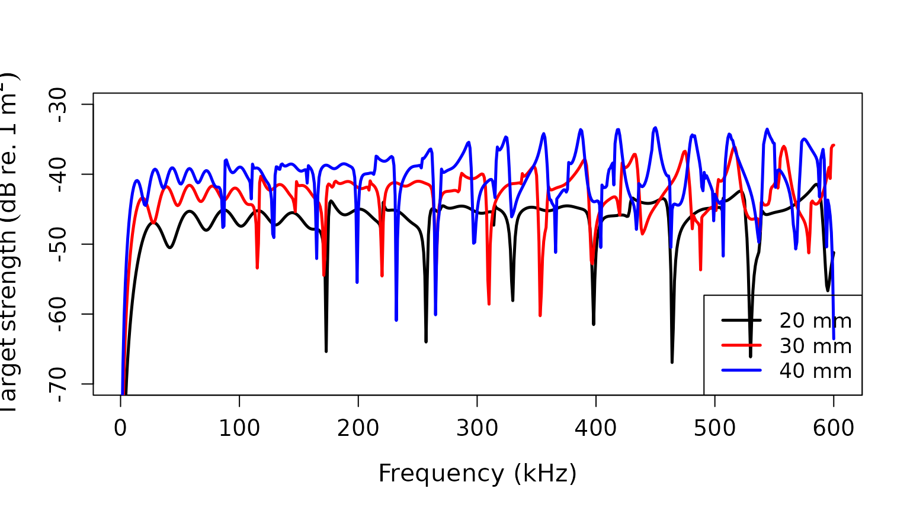
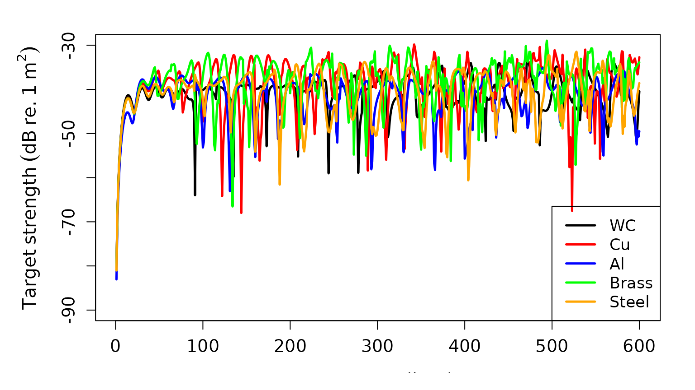

# Target strength for a calibration sphere

## Introduction

Echosounders are often calibrated using standard targets that comprise
strong scatterers with target strengths (TS, dB re. 1 m²) that are
relatively straightforward to model and predict[¹](#fn1). Typically,
this comprises a tungsten carbide (chemical formula: WC) sphere, but
elastic spheres consisting of other materials (e.g. aluminum, Al) can
also be used[²](#fn2).

## acousticTS implementation

The `acousticTS` package adapts the series of equations described in the
literature[³](#fn3) that provide a solution of wave equations based on
the classical theory of elasticity. The object-based approach in
`acousticTS` makes this relatively straightforward by minimizing the
amount of manual coding end-users must write.

### Calibration sphere object generation

First, a calibration sphere object has to be created. This is
represented by the `CAL` object class that contains slots for
`metadata`, `model_parameters`, `model` results, `body` for sphere
dimensions and material properties, and `shape_parameters` for
shape-specific metadata. This object can be created using the
`cal_generate(...)` function that has two required arguments: `material`
and `diameter`. The default diameter is 38.1 mm, or 38.1e⁻³ m. The
`diameter` input is intended to be in meters.The `material` argument
comprises five default options that automatically include their
respective longitudinal and transversal sound speeds (m s⁻¹) and
material density (kg m⁻³):

| Material         | Argument value | Longitudinal sound speed (c_(l)) | Transversal sound speed (c_(t)) | Density (\\\rho\\) |
|------------------|----------------|----------------------------------|---------------------------------|--------------------|
| Tungsten carbide | “WC”           | 6853                             | 4171                            | 8360               |
| Aluminum         | “Al”           | 6260                             | 3080                            | 2070               |
| Stainless steel  | “steel”        | 5980                             | 3297                            | 7970               |
| Brass            | “brass”        | 4372                             | 2100                            | 8360               |
| Copper           | “Cu”           | 4760                             | 2288.5                          | 8947               |

Alternatively, you can define your own material properties by assigning
values to `sound_speed_longitudinal`, `sound_speed_transversal`, and
`density_sphere` within `cal_generate(...)` such as:

`cal_generate(..., density_sphere = 1026)`

When using the default arguments:

``` r
# Call in package library
library(acousticTS)
```

    ## 
    ## Attaching package: 'acousticTS'

    ## The following object is masked from 'package:base':
    ## 
    ##     kappa

``` r
# Create calibration sphere object
cal_sphere <- cal_generate()
# this is equivalent to: cal_generate(material = "WC", diameter = 38.1e-3)
```

### Calculating a TS-frequency spectrum for the calibration sphere

With the calibration sphere object generated, TS can be calculated via
the `target_strength(...)` function, which is a wrapper function that
generally allows for multiple models to be applied to a single scatterer
when needed. In this case, there are three required arguments to
calculate TS: `object`, `frequency`, and `model`. The `object` argument
simply refers to the `CAL` object that we created before
(i.e. `cal_sphere`). Frequency (via `frequency`) can be a `vector` of
values (Hz). Model is a `string` input that refers to the model
end-users would like to use, which would be `model = "calibration"` in
this case. This will update the current `CAL` object when assigned to
the same variable, or can be used to generate a copy of the original
`CAL` object that now includes model parameter and results as a built-in
field.

``` r
# Define frequency vector
frequency <- seq(1e3, 600e3, 1e3)
# Calculate TS; update original CAL object
cal_sphere <- target_strength(
  object = cal_sphere,
  frequency = frequency,
  model = "calibration"
)
# Calculate TS; store in a new CAL object
cal_sphere_copy <- target_strength(
  object = cal_sphere,
  frequency = frequency,
  model = "calibration"
)
```

### Extracting model results

Model results can be extracted either just visually, or can be directly
accessed using the `extract(...)` function.

#### Plotting results

This approach uses the `plot(...)` generic function with additional
arguments for toggling the plot output. The additional arguments to
include here are:

- `type = "shape"` *or* `type = "model"`
- `nudge_y = 1.05` *(default)*
- `nudge_x = 1.01` *(default)*
- `x_units = "frequency"` *or* `x_units = "k_sw"` *or* `x_units = "k_l"`
  *or* `x_units = "k_t"`

Setting `type = "model"` will parse the model results (i.e. TS). The two
`nudge_` arguments allow the end-user to nudge to *x*- and *y*-axes as
they see fit. The `x_units` argument defaults to
`x_units = "frequency"`, but setting it to equal `"k_sw"`, `"k_l"`, or
`"k_t"` will set TS to be a function of the wavenumber of seawater,
longitudinal axis of sphere, and transversal axis of sphere,
respectively multiplied by the sphere’s radius.

``` r
# Plot TS as a function of frequency (kHz)
plot(cal_sphere, type = "model", ylim = c(-70, -30))
```


``` r
# Plot TS as a function of k[sw]*radius, or k[sw]*a
plot(cal_sphere, type = "model", x_units = "k_sw", ylim = c(-70, -30))
```


``` r
# Plot TS as a function of k[l]*radius, or k[sw]*a
plot(cal_sphere, type = "model", x_units = "k_l", ylim = c(-70, -30))
```


``` r
# Plot TS as a function of k[t]*radius, or k[sw]*a
plot(cal_sphere, type = "model", x_units = "k_t", ylim = c(-70, -30))
```


``` r
# Nudge the x-axis more
plot(cal_sphere, type = "model", ylim = c(-70, -30))
```


``` r
# Nudge the y-axis more
plot(cal_sphere, type = "model", ylim = c(-70, -30))
```

#### Accessing results

The model results can also be directly accessed via `extract(...)` which
has the two arguments `object` and `feature`. In this case, `object`
refers to our `CAL` object, `cal_sphere`, and we can set
`feature = "model"` to extract our model results.

``` r
# Extract model results
model_results <- extract(cal_sphere, "model")$calibration
# Peek at the output from extract(...)
head(model_results)
```

    ##   frequency         ka         f_bs     sigma_bs        TS
    ## 1      1000 0.07979645 9.444014e-05 8.918941e-09 -80.49687
    ## 2      2000 0.15959291 3.738998e-04 1.398010e-07 -68.54490
    ## 3      3000 0.23938936 8.269858e-04 6.839055e-07 -61.65004
    ## 4      4000 0.31918581 1.435280e-03 2.060028e-06 -56.86127
    ## 5      5000 0.39898227 2.174015e-03 4.726341e-06 -53.25475
    ## 6      6000 0.47877872 3.012785e-03 9.076873e-06 -50.42064

Here we get seven columns formatted as a `data.frame` object:

- `frequency`: transmit frequency (Hz)
- `k_sw`: acoustic wavenumber for seawater/ambient fluid
- `k_l`: longitudinal axis acoustic wavenumber of sphere
- `k_t`: transversal axis acoustic wavenumber of sphere
- `f_bs`: the complex form function output
- `sigma_bs`: the acoustic cross-section for an elastic sphere (m²)
  where: \\\sigma\_{bs} = \pi a^2 ~\|f\_{bs}\|^2\\
- `TS`: the target strength (dB re. 1 m²) for an elastic sphere where:
  \\TS = 10log\_{10}(\frac{\sigma\_{bs}}{4 \pi})\\

## Material property and sphere shape comparisons

This implementation also allows for comparisons among different model
parameters and diameters suited for specific calibration experiments.

### Comparing different diameters

``` r
# Generate models for calibration spheres
# 20 mm diameter sphere
sphere_20 <- cal_generate(diameter = 20e-3)
sphere_20 <- target_strength(
  object = sphere_20,
  frequency = frequency,
  model = "calibration"
)
ts_mods_20 <- extract(sphere_20, "model")$calibration
# 30 mm diameter sphere
sphere_30 <- cal_generate(diameter = 30e-3)
sphere_30 <- target_strength(
  object = sphere_30,
  frequency = frequency,
  model = "calibration"
)
ts_mods_30 <- extract(sphere_30, "model")$calibration
# 40 mm diameter sphere
sphere_40 <- cal_generate(diameter = 40e-3)
sphere_40 <- target_strength(
  object = sphere_40,
  frequency = frequency,
  model = "calibration"
)
ts_mods_40 <- extract(sphere_40, "model")$calibration
# Plot the three and compare
par(oma = c(0, 0.25, 0, 0), mar = c(5, 6, 4, 2))
plot(
  x = ts_mods_20$frequency * 1e-3,
  y = ts_mods_20$TS,
  type = "l",
  lty = 1,
  lwd = 2.5,
  xlab = "Frequency (kHz)",
  ylab = expression(Target ~ strength ~ (dB ~ re. ~ 1 ~ m^2)),
  cex.lab = 1.3,
  cex.axis = 1.2,
  ylim = c(-70, -30)
)
lines(
  x = ts_mods_30$frequency * 1e-3,
  y = ts_mods_30$TS,
  col = "red",
  lty = 1,
  lwd = 2.5
)
lines(
  x = ts_mods_40$frequency * 1e-3,
  y = ts_mods_40$TS,
  col = "blue",
  lty = 1,
  lwd = 2.5
)
legend("bottomright",
  c("20 mm", "30 mm", "40 mm"),
  lty = c(1, 1, 1),
  lwd = c(2.5, 2.5, 2.5),
  col = c("black", "red", "blue"),
  cex = 1.1
)
```



### Comparing different materials

``` r
# tungsten carbide
ts_mods_WC <- extract(cal_sphere, "model")$calibration
# copper sphere
sphere_copper <- cal_generate(material = "Cu")
sphere_copper <- target_strength(
  object = sphere_copper,
  frequency = frequency,
  model = "calibration"
)
ts_mods_Cu <- extract(sphere_copper, "model")$calibration
# aluminum sphere
sphere_aluminum <- cal_generate(material = "Al")
sphere_aluminum <- target_strength(
  object = sphere_aluminum,
  frequency = frequency,
  model = "calibration"
)
ts_mods_Al <- extract(sphere_aluminum, "model")$calibration
# brass sphere
sphere_brass <- cal_generate(material = "brass")
sphere_brass <- target_strength(
  object = sphere_brass,
  frequency = frequency,
  model = "calibration"
)
ts_mods_brass <- extract(sphere_brass, "model")$calibration
# stainless steel sphere
sphere_steel <- cal_generate(material = "steel")
sphere_steel <- target_strength(
  object = sphere_steel,
  frequency = frequency,
  model = "calibration"
)
ts_mods_steel <- extract(sphere_steel, "model")$calibration
# Plot each and compare
par(
  ask = FALSE,
  oma = c(1, 1, 1, 0),
  mar = c(3, 4.5, 1, 2)
)
plot(
  x = ts_mods_WC$frequency * 1e-3,
  y = ts_mods_WC$TS,
  type = "l",
  lty = 1,
  lwd = 2.5,
  xlab = "Frequency (kHz)",
  ylab = expression(Target ~ strength ~ (dB ~ re. ~ 1 ~ m^2)),
  cex.lab = 1.3,
  cex.axis = 1.2,
  ylim = c(-90, -30)
)
lines(
  x = ts_mods_Cu$frequency * 1e-3,
  y = ts_mods_Cu$TS,
  col = "red",
  lty = 1,
  lwd = 2.5
)
lines(
  x = ts_mods_Al$frequency * 1e-3,
  y = ts_mods_Al$TS,
  col = "blue",
  lty = 1,
  lwd = 2.5
)
lines(
  x = ts_mods_brass$frequency * 1e-3,
  y = ts_mods_brass$TS,
  col = "green",
  lty = 1,
  lwd = 2.5
)
lines(
  x = ts_mods_steel$frequency * 1e-3,
  y = ts_mods_steel$TS,
  col = "orange",
  lty = 1,
  lwd = 2.5
)
legend("bottomright",
  c("WC", "Cu", "Al", "Brass", "Steel"),
  lty = c(1, 1, 1, 1, 1),
  lwd = c(2.5, 2.5, 2.5, 2.5, 2.5),
  col = c("black", "red", "blue", "green", "orange"),
  cex = 1.1
)
```



## Future development

Stay tuned for new methods enabling backscatter simulations for
calibration spheres of different materials, sizes, etc., from a single
function rather than repeating the same dataflow.

------------------------------------------------------------------------

1.  Foote, K.G. (**1990**). *Spheres for calibration an eleven-frequency
    acoustic measurement system*. J. Cons. int. Explor. Mer., 46:
    284-286.

2.  Hickling, R. (**1962**). *Analysis of echoes from a solid elastic
    sphere in water*. J. Acoust. Soc. Am., 45: 1582-1592.

3.  MacLennan, D.N. (**1981**). *Target strength measurements on metal
    spheres*. Scottis Fish. Res. Rep., 25, 11 pp. 
