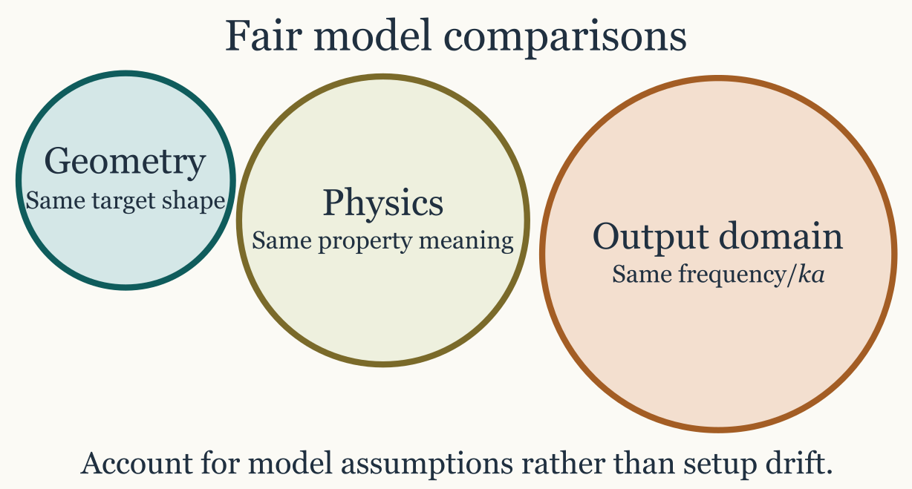

# Comparing models on the same target

## Introduction

Cross-model comparison is most informative when the candidate families
are read against broader reviews and inter-model benchmark studies
([Jech et al. 2015](#ref-jech_etal_2015); [Stanton
1996](#ref-stanton_acoustic_1996)).

One of the strongest uses of acousticTS is not simply running a single
model, but asking how several models behave on the same target
description. That is often the clearest way to separate geometric
effects from boundary-condition effects and approximation effects. A
well-designed comparison can show whether two models are telling the
same physical story in different mathematical languages or whether they
are diverging because they are built for genuinely different regimes.

At the same time, model comparison is easy to do badly. If two models
are run on different geometries, different frequency grids, different
material assumptions, or different reporting quantities, the resulting
curves may still be interesting, but they no longer isolate model
behavior alone. At that point the comparison has become a mixture of
model differences and setup differences, which is a much harder thing to
interpret honestly.



Model-comparison framework

## Why compare models at all

Model comparison is especially helpful when more than one model is
physically defensible for the same target, when a target sits between
canonical and approximate regimes, when the user wants a sensitivity
study rather than a single definitive prediction, or when the scientific
question is about stability across assumptions rather than about a
single favored formulation.

It is also one of the best ways to decide whether added model complexity
is buying genuinely new physical insight or simply reproducing the same
qualitative answer at greater cost. If a simpler model and a more
elaborate one agree closely over the part of parameter space that
matters, that agreement is informative. If they diverge strongly, the
disagreement is informative too, provided the comparison was built
fairly.

## What a fair comparison requires

A useful comparison should keep fixed, as much as possible, the target
geometry, the material-property interpretation, the frequency or
orientation grid, and the reporting quantity being compared. In
practice, that usually means creating one object, running several models
on that same object, and extracting the results only after the model
runs are complete.

``` r
library(acousticTS)

shape_obj <- cylinder(
  length_body = 0.03,
  radius_body = 0.0025,
  n_segments = 60
)

obj <- fls_generate(
  shape = shape_obj,
  density_body = 1045,
  sound_speed_body = 1520,
  theta_body = pi / 2
)

frequency <- seq(38e3, 120e3, by = 6e3)

obj <- target_strength(
  object = obj,
  frequency = frequency,
  model = c("dwba", "hpa")
)

dwba_out <- extract(obj, "model")$DWBA
hpa_out <- extract(obj, "model")$HPA
```

That workflow is preferable to building two nearly identical objects
independently, because it reduces the chance of silent setup drift. If
the object is reused, then any later disagreement is more likely to be
telling the user something about the models themselves rather than about
mismatched preprocessing choices.

## Compare the same quantity

The same target can be compared in several output domains, but that
choice should be deliberate rather than habitual. `TS` is the natural
quantity for reporting differences in dB and for visual communication.
`sigma_bs` is often better when the question is whether differences
remain large on a linear scale or when later averaging is needed.
Complex amplitude is required when phase and interference are part of
the scientific question.

This distinction matters because two curves can look dramatically
different in `TS` while corresponding to modest differences on a linear
scale, or they can look similar in `TS` while still implying important
phase behavior that is invisible in a purely logarithmic plot. That is
one reason model comparison is closely related to the [combining
components](https://brandynlucca.github.io/acousticTS/articles/combining-components/combining-components.md)
article. Once phase-sensitive interpretation matters, comparing only
`TS` curves can become too coarse.

## Comparing fits quantitatively

Once two model outputs have been aligned on the same grid, it is often
useful to move beyond visual comparison and compute simple discrepancy
measures such as mean absolute deviation (MAD), root mean square error
(RMSE), or related summary statistics. Those summaries can be very
informative, but only if they are computed in a domain that matches the
scientific question. The same pair of curves can produce a small RMSE in
one domain and a large RMSE in another, not because one calculation is
wrong, but because the domains weight error differently.

When the question is about energetic or scattering-strength agreement,
those metrics are usually more meaningful in the linear domain. In that
setting, one compares `sigma_bs` values directly and computes quantities
such as:

\mathrm{MAD}\_{\sigma} = \frac{1}{N} \sum\_{j=1}^{N} \left\|
\sigma\_{\mathrm{bs},1,j} - \sigma\_{\mathrm{bs},2,j} \right\|,

The corresponding linear-domain root mean square error is:

\mathrm{RMSE}\_{\sigma} = \left\[ \frac{1}{N} \sum\_{j=1}^{N} \left(
\sigma\_{\mathrm{bs},1,j} - \sigma\_{\mathrm{bs},2,j} \right)^2
\right\]^{1/2}.

These linear-domain summaries are the more natural choice when the goal
is to compare scattering strength, when later averaging is expected, or
when one wants differences to scale directly with the physical size of
the backscattering response. They are also the safer choice when
comparing model fits to linear-domain observations or when the workflow
later combines or averages responses across realizations.

By contrast, when the question is about agreement in reported target
strength, then it is reasonable to compare in the logarithmic domain and
compute quantities such as:

\mathrm{MAD}\_{TS} = \frac{1}{N} \sum\_{j=1}^{N} \left\| TS\_{1,j} -
TS\_{2,j} \right\|,

The corresponding logarithmic-domain root mean square error is:

\mathrm{RMSE}\_{TS} = \left\[ \frac{1}{N} \sum\_{j=1}^{N} \left(
TS\_{1,j} - TS\_{2,j} \right)^2 \right\]^{1/2}.

These dB-domain summaries are often the more interpretable choice when
the comparison is tied to reporting practice, calibration-style
tolerances, or questions framed explicitly in terms of target strength
rather than linear scattering cross-section.

The practical rule is therefore straightforward. If the scientific
question is about physical scattering magnitude, fitting in the linear
domain is usually the better default. If the scientific question is
about agreement in reported target strength, fitting in the logarithmic
domain may be the more natural summary. What should be avoided is
switching domains casually and then interpreting the resulting RMSE or
MAD as if it had an invariant meaning across both.

This is also the reason one should decide on the comparison domain
before fitting or ranking models. A model that minimizes RMSE in `TS` is
not guaranteed to minimize RMSE in `sigma_bs`, because the logarithmic
transform changes the weighting of discrepancies across low- and
high-amplitude parts of the response. In practical terms, dB-domain
fitting tends to emphasize relative agreement across a broad dynamic
range, while linear-domain fitting gives more weight to regions where
the absolute scattering strength is large.

If reference observations are available, the safest procedure is to
compute the comparison metric in the same domain in which the scientific
conclusion will be drawn. If the conclusion is about reported target
strength, use `TS`. If the conclusion is about linear scattering
strength, use `sigma_bs`. If both matter, it is often worth reporting
both rather than pretending that one metric answers every comparison
question.

## Compare like regimes, not just like shapes

Even on the same object, some model comparisons are more meaningful than
others. A fair comparison asks whether the two models are actually
intended to approximate the same underlying regime. Geometry alone is
not enough.

`DWBA` versus `SDWBA` is a natural comparison because the second extends
the first by relaxing deterministic phase behavior. `TRCM` versus `FCMS`
is natural because both describe cylindrical targets but from different
physical reductions. `PSMS` versus `HPA` is informative when the
question is how much is lost by leaving an exact prolate-spheroidal
treatment for a simpler asymptotic approximation. In each case, the
comparison is meaningful because the two models are close enough in
intended use that their disagreement can be interpreted physically.

By contrast, a comparison between models with unrelated boundary
assumptions or incompatible approximation regimes may still be
interesting, but it should be described honestly as a sensitivity study
rather than as a pure model-performance comparison. If the physical
assumptions differ, then the comparison is partly about workflow choice
rather than about model behavior in isolation.

## A practical comparison workflow

A robust comparison workflow usually starts by building one target
object whose geometry and material properties are already physically
defensible. The next step is to run all candidate models on one matched
frequency grid. Only after that is it worth extracting the outputs into
comparable data frames and examining both the overplotted curves and
their pairwise differences.

That order matters because pairwise differences often reveal more than
overplotted curves alone. A comparison that looks modest by eye may
contain a systematic offset, a frequency-localized resonance mismatch,
or a regime boundary where one approximation begins to fail.

``` r
comparison <- data.frame(
  frequency = dwba_out$frequency,
  TS_DWBA = dwba_out$TS,
  TS_HPA = hpa_out$TS,
  delta_TS = dwba_out$TS - hpa_out$TS
)

head(comparison)
```

Once those aligned outputs exist, interpretation becomes much easier
because the user can ask whether the disagreement is global, localized,
monotonic, oscillatory, or tied to a known physical feature of one of
the models.

## How to interpret disagreement

When two models disagree, the next question is not automatically which
one is right. The more useful sequence is to ask whether the geometry
and properties were truly matched, whether the models are intended for
the same regime, whether the disagreement is systematic or localized,
and whether the difference tracks a known approximation such as weak
scattering, high-frequency structure, phase randomization, or boundary
simplification.

That sequence turns comparison from a plotting exercise into a modeling
argument. A systematic offset might suggest a scaling or normalization
difference. A localized mismatch might point to resonance behavior or to
a limited approximation regime. A disagreement that grows steadily with
acoustic size may indicate the point at which one model has left its
most reliable operating range.

## Recommended comparison sets

Some side-by-side comparisons are especially natural because they answer
clear physical questions. `DWBA` versus `SDWBA` is useful for weak
fluid-like elongated bodies when the question is whether unresolved
phase variability matters. `TRCM` versus `FCMS` is useful for locally
cylindrical targets when the question is whether a high-frequency
two-ray picture is adequate. `SPHMS` versus `HPA` is useful for
spherical screening problems when a full modal treatment is being
compared against a faster approximation. `PSMS` versus `HPA` is
informative for smooth elongated targets, and `ESSMS` versus
solid-sphere or limiting sphere models is informative when shell
elasticity is the feature under examination.

Those pairings are not exhaustive, but they tend to produce comparisons
that answer a well-posed question rather than a vague request to see how
different the models are.

## Connection to other workflow pages

This article should be used together with [choosing a
model](https://brandynlucca.github.io/acousticTS/articles/model-selection/model-selection.md),
[combining scattering
components](https://brandynlucca.github.io/acousticTS/articles/combining-components/combining-components.md),
and the individual theory pages for the models being compared. The
workflow logic is different in each case. Choosing a model narrows the
candidate set. Comparing models evaluates several plausible candidates
on one shared target. Combining components asks a different question
entirely and should not be confused with model comparison.

## Final rule

A model comparison is most informative when it keeps the target fixed
and varies the model assumptions deliberately. If the target, grid,
medium, or reporting quantity changes at the same time, the comparison
may still be useful, but it is no longer isolating model behavior alone.
The safest workflow is therefore simple: hold the target definition
steady, compare one quantity at a time, and interpret disagreement in
terms of the physical assumptions each model was designed to represent.

## References

Jech, J. Michael, John K. Horne, Dezhang Chu, David A. Demer, David T.
I. Francis, Natalia Gorska, Benjamin Jones, et al. 2015. “Comparisons
Among Ten Models of Acoustic Backscattering Used in Aquatic Ecosystem
Research.” *The Journal of the Acoustical Society of America* 138 (6):
3742–64. <https://doi.org/10.1121/1.4937607>.

Stanton, T. 1996. “Acoustic Scattering Characteristics of Several
Zooplankton Groups.” *ICES Journal of Marine Science* 53 (2): 289–95.
<https://doi.org/10.1006/jmsc.1996.0037>.
