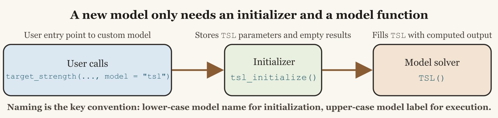

# Creating a Model from Scratch

## Introduction

Building a model from scratch is easiest when the geometry, basis, and
approximation regime stay aligned with the canonical scattering
literature ([Morse and Ingard 1986](#ref-morse_theoretical_1986);
[Waterman 2009](#ref-waterman_t_2009)).

One of the most useful features of acousticTS is that a new
target-strength model does not need package-file edits just to be tried.
The package has a runtime model registry, so a user-defined model can be
registered for the current session and then used through the same
[`target_strength()`](https://brandynlucca.github.io/acousticTS/reference/target_strength.md)
wrapper as the built-in models. To add a new model, the minimum
requirement is still that two functions exist and follow the expected
naming convention:

1.  A lower-case initialization function named `*_initialize()`
2.  A model function whose name is literally the model name in the form
    that
    [`target_strength()`](https://brandynlucca.github.io/acousticTS/reference/target_strength.md)
    will call

For a toy target strength-length model called `TSL`, that means
defining:

``` r
tsl_initialize <- function(...) {
  ...
}
TSL <- function(object) {
  ...
}
```

This vignette walks through that pattern and builds a simple example
model from scratch. The example is intentionally simple. It is not meant
to be a physically complete scattering model. Its purpose is to show how
model dispatch, registration, parameter storage, and result storage work
inside the package.



Dispatch path for a new model.

## How `target_strength()` finds your model

The important part of
[`target_strength()`](https://brandynlucca.github.io/acousticTS/reference/target_strength.md)
is that it does two passes. First, it resolves the requested model in
the registry. Second, it initializes the object and runs the solver for
that registered model. Conceptually, the workflow is:

1.  The user calls
    `target_strength(object, frequency, model = "tsl", ...)`
2.  acousticTS resolves `"tsl"` through the model registry
3.  The registry entry points to an initializer such as
    `tsl_initialize()`
4.  That initializer stores the model parameters and creates an empty
    results slot under `$TSL`
5.  The registry entry then points to a solver such as `TSL()`
6.  `TSL()` computes the model output and fills in the stored results
    table

This is exactly the same pattern used by the existing model files. The
details differ from model to model, but the basic workflow is the same
in `R/acoustics.R` and in model files such as `R/model-dwba.R`.

For a simple model name like `"tsl"`, a minimal user-defined
registration looks like this:

``` r
register_model(
  name = "tsl",
  initialize = tsl_initialize,
  solver = TSL,
  slot = "TSL"
)
```

The practical consequence is straightforward. If you create
`tsl_initialize()` and `TSL()`, register them, and store their
parameters and results under `$TSL`, the wrapper can find and run them.
The built-in package models are shipped in the same registry; user
models are simply added at run time rather than hard-coded into the
package source.

## What the initializer is responsible for

The initializer does not calculate target strength itself. Its job is
to:

1.  Validate the incoming object and any model-specific arguments
2.  Extract the geometric or material properties the model needs
3.  Store those quantities in `slot(object, "model_parameters")`
4.  Create an empty results table in `slot(object, "model")`

This separation is useful because it keeps argument parsing and object
preparation out of the model solver itself. Existing models use the same
pattern. In `dwba_initialize()`, for example, the function parses the
scatterer, derives contrasts, computes wavenumbers, and creates empty
result storage before
[`DWBA()`](https://brandynlucca.github.io/acousticTS/reference/DWBA.md)
is ever called.

## A minimal `TSL` example

Suppose we want a simple empirical target strength-length model. We will
define it in the logarithmic domain as:

TS = a + b \log\_{10}(L\_{mm})

where `a` is an intercept, `b` is a slope, and `L_{mm}` is body length
in millimeters. This is a deliberately simple example because it shows
the package mechanics cleanly. The model uses length only, so frequency
is accepted for interface consistency but does not alter the prediction.

### Step 1: create `tsl_initialize()`

The initializer below assumes that the target has a shape parameter
called `length`. It stores frequency, the extracted length, and the
empirical coefficients in the `$TSL` model-parameter slot, then creates
an empty result table in the `$TSL` model slot.

``` r
tsl_initialize <- function(object,
                           frequency,
                           intercept = -70,
                           slope = 20) {
  shape <- acousticTS::extract(object, "shape_parameters")

  if (is.null(shape$length) || is.na(shape$length)) {
    stop(
      "TSL requires the target shape to have a defined length."
    )
  }

  model_params <- list(
    parameters = data.frame(
      frequency = frequency
    ),
    body = data.frame(
      length_m = shape$length
    ),
    coefficients = data.frame(
      intercept = intercept,
      slope = slope
    )
  )

  methods::slot(object, "model_parameters")$TSL <- model_params

  methods::slot(object, "model")$TSL <- data.frame(
    frequency = frequency,
    sigma_bs = rep(NA_real_, length(frequency))
  )

  object
}
```

There are three details here that matter a great deal.

First, the name has to be `tsl_initialize`, not `TSL_initialize` and not
`initialize_tsl`. The wrapper looks for the lower-case model name with
`"_initialize"` appended to it.

Second, the stored slot name has to match the model label that the
wrapper will later use, which in this case is `$TSL`.

Third, the initializer should create the model result table even though
it is still empty. That makes the object structure consistent before the
model solver runs.

### Step 2: create `TSL()`

The model function itself should be simple. It pulls the prepared
parameters out of `$TSL`, computes `TS`, converts to `sigma_bs`, and
stores the finished results back into the model slot.

``` r
TSL <- function(object) {
  model <- acousticTS::extract(object, "model_parameters")$TSL

  length_mm <- model$body$length_m * 1e3
  intercept <- model$coefficients$intercept
  slope <- model$coefficients$slope

  TS <- intercept + slope * log10(length_mm)
  sigma_bs <- acousticTS::linear(TS)

  methods::slot(object, "model")$TSL <- data.frame(
    frequency = model$parameters$frequency,
    f_bs = rep(sqrt(sigma_bs), nrow(model$parameters)),
    sigma_bs = rep(sigma_bs, nrow(model$parameters)),
    TS = rep(TS, nrow(model$parameters))
  )

  object
}
```

This is enough for the solver itself. To make the model callable through
[`target_strength()`](https://brandynlucca.github.io/acousticTS/reference/target_strength.md),
register it:

``` r
register_model(
  name = "tsl",
  initialize = tsl_initialize,
  solver = TSL,
  slot = "TSL",
  aliases = "toy_tsl"
)
```

At that point `target_strength(..., model = "tsl")` and
`target_strength(..., model = "toy_tsl")` both resolve to the same
registered model.

The example above repeats the same `TS` value across all requested
frequencies because this toy model does not use frequency. That is
acceptable for a pedagogical example. A frequency-dependent model would
instead calculate a vector whose length matches the input `frequency`
vector.

## Session registration versus package registration

There are two clean ways to use a new model.

1.  Session registration: define the functions in the current session or
    in another package, then call
    [`register_model()`](https://brandynlucca.github.io/acousticTS/reference/register_model.md).
2.  Package registration: if you are extending acousticTS itself, add
    the model file to the package source and add a built-in registry
    entry in `R/models.R`.

For a package-style source file, a minimal version would look like this:

``` r
#' Target strength-length model (TSL)
#'
#' @description
#' A simple empirical target strength-length relationship.
#'
#' @section Usage:
#' This model is accessed via:
#' \preformatted{
#' target_strength(
#'   ...,
#'   model = "tsl",
#'   intercept,
#'   slope
#' )
#' }
#'
#' @name TSL
#' @aliases tsl TSL
NULL

tsl_initialize <- function(object,
                           frequency,
                           intercept = -70,
                           slope = 20) {
  ...
}

TSL <- function(object) {
  ...
}
```

That is the same broad organization used by the existing `model-*.R`
files: roxygen block first, initializer next, solver function after
that. If the model lives in another package, the usual pattern is to
call
[`register_model()`](https://brandynlucca.github.io/acousticTS/reference/register_model.md)
from that package’s `.onLoad()` hook so the model becomes available
automatically when the extension package is attached.

## Calling the new model

Once the functions are defined and registered, the new model can be
called through the standard wrapper:

``` r
target <- target_strength(
  object = target,
  frequency = seq(38000, 120000, by = 1000),
  model = "tsl",
  intercept = -68,
  slope = 19.5
)
```

From the user’s perspective, `TSL` then behaves like any other model.
The results live in the model slot and can be inspected with:

``` r
extract(target, "model")$TSL
```

The currently available built-in and user-registered models can be
listed with:

``` r
available_models()
```

If the model should survive across sessions without editing the
acousticTS install tree,
[`register_model()`](https://brandynlucca.github.io/acousticTS/reference/register_model.md)
also supports `persist = TRUE`. Persistent registrations are written to
the user’s `R_user_dir()` config path, not into the package library
itself, so package updates do not require users to modify installed
package files.

## Practical rules to keep in mind

When creating a new model, the following rules are the ones most likely
to prevent headaches later.

1.  The initializer name should usually be lower-case model name plus
    `_initialize()`.
2.  The solver function name should usually match the upper-case slot
    label, such as `TSL()`.
3.  Both functions must store and retrieve values under the same slot
    name, such as `$TSL`.
4.  The model must be registered before
    [`target_strength()`](https://brandynlucca.github.io/acousticTS/reference/target_strength.md)
    or
    [`simulate_ts()`](https://brandynlucca.github.io/acousticTS/reference/simulate_ts.md)
    can resolve it.
5.  The initializer should prepare parameters and an empty result table,
    not perform the actual model calculation.
6.  The model function should return the updated object after filling in
    the result table.
7.  Any extra arguments the user supplies either through
    `target_strength(..., model = "tsl", ...)` or through
    `target_strength(..., model_args = list(tsl = list(...)))` need to
    appear as formal arguments in `tsl_initialize()`.

## Where to go next

Once the minimal pattern is working, the next steps are usually:

1.  Add roxygen documentation for the new model topic.
2.  Add a theory or implementation vignette if the model is more than a
    toy example.
3.  Add tests that check initialization, result-slot structure, and at
    least one reproducible output case.
4.  Decide whether the model should report only `TS`, or whether it
    should also provide `f_bs`, `sigma_bs`, or any model-specific
    diagnostics.

The key point is that the package architecture is already set up for
this pattern. If you provide a correctly structured initializer and
solver, and register the model in the registry,
[`target_strength()`](https://brandynlucca.github.io/acousticTS/reference/target_strength.md)
and
[`simulate_ts()`](https://brandynlucca.github.io/acousticTS/reference/simulate_ts.md)
can use it just like a built-in family.

## References

Morse, Philip M., and K. Uno Ingard. 1986. *Theoretical Acoustics*.
Princeton, N.J: Princeton University Press.

Waterman, P. C. 2009. “T -Matrix Methods in Acoustic Scattering.” *The
Journal of the Acoustical Society of America* 125 (1): 42–51.
<https://doi.org/10.1121/1.3035839>.
