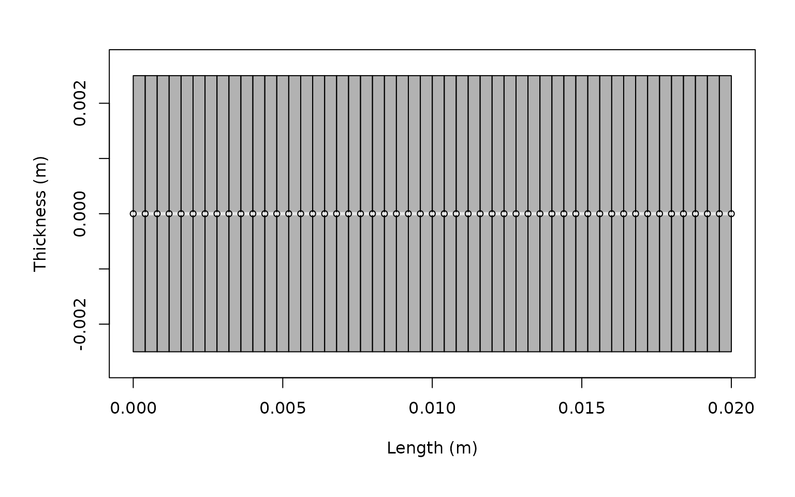
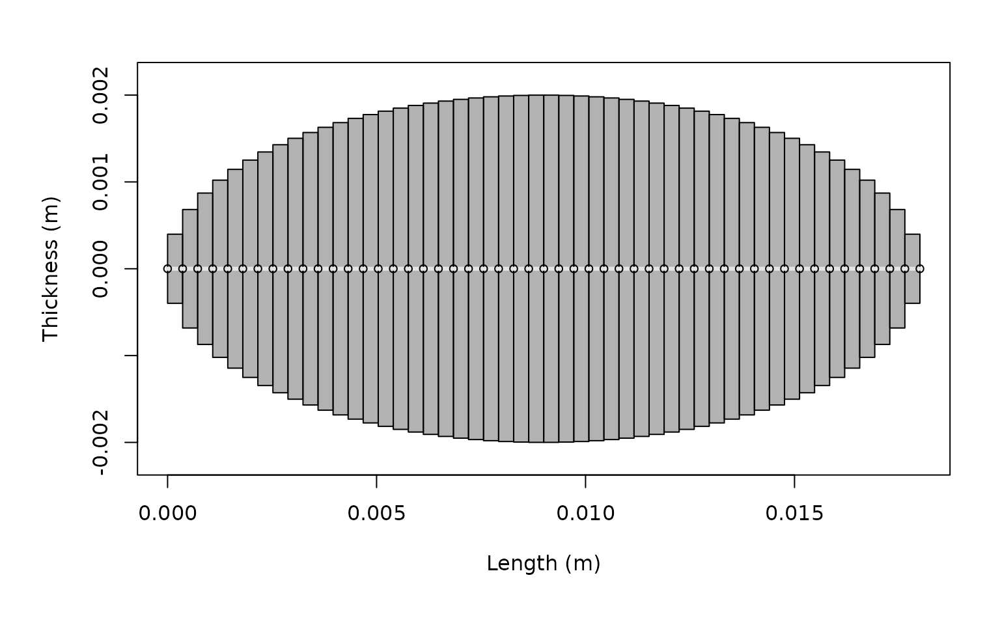
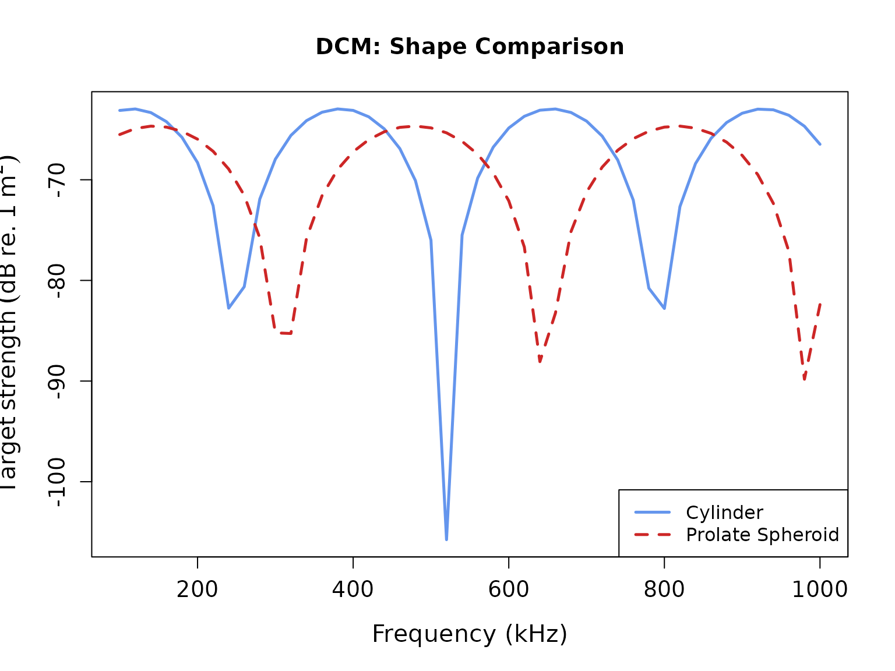
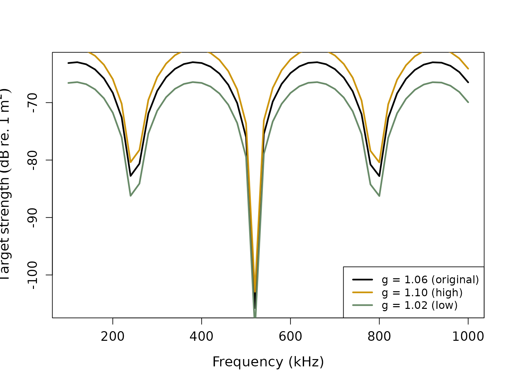
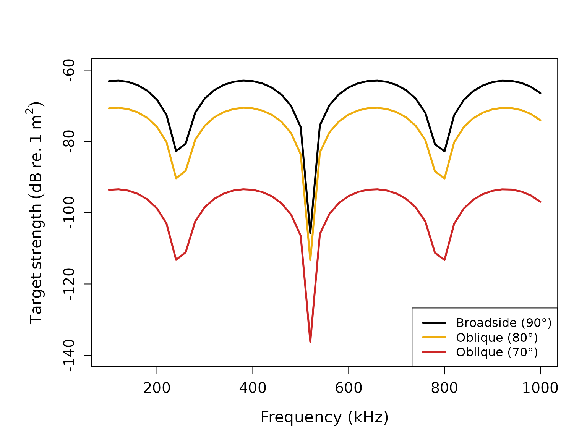
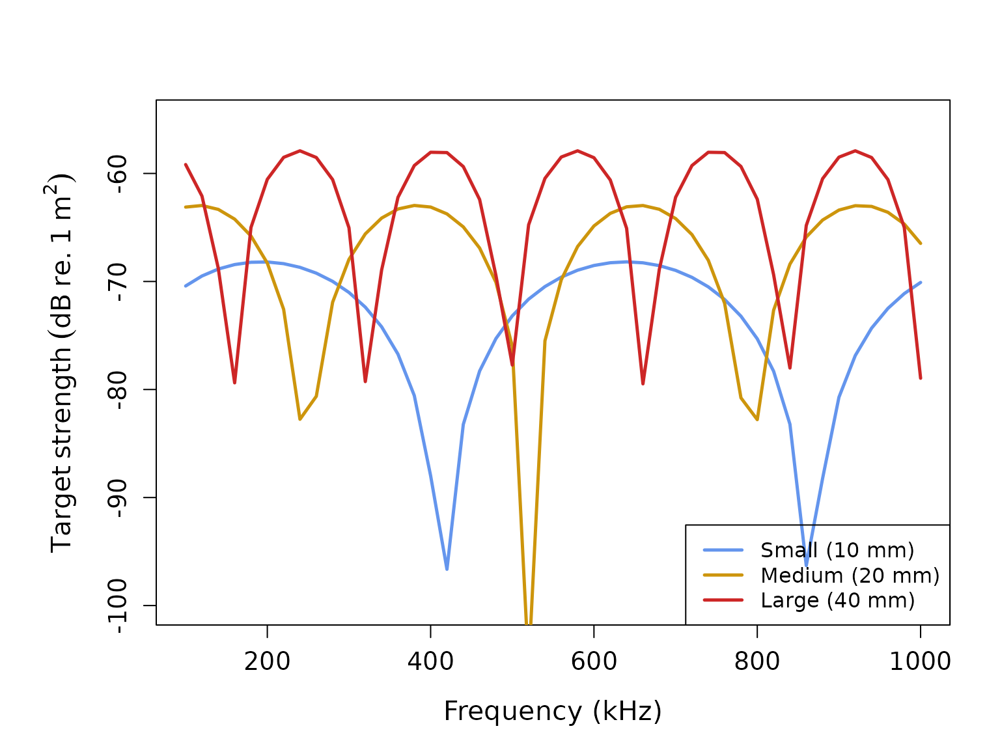
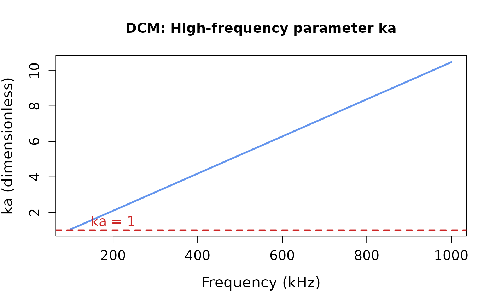

# Target strength modeling with the Deformed Cylinder Model (DCM)

## Introduction

The Deformed Cylinder Model (DCM) is a high-frequency approximation for
modeling acoustic backscatter from elongated fluid-like organisms such
as zooplankton[¹](#fn1). The DCM treats scatterers as deformed cylinders
with curved bodies, incorporating both geometric and material properties
to predict target strength. This model is particularly effective for
modeling crustacean zooplankton like copepods and krill at high
frequencies where the acoustic wavelength is much smaller than the
organism size.

## acousticTS implementation

The `acousticTS` package provides the DCM implementation for fluid-like
scatterers of the `FLS` (Fluid-Like Scatterer) class. The DCM
incorporates:

- **Geometric properties**: Body length, radius, and radius of curvature
- **Material properties**: Density and sound speed contrasts relative to
  seawater
- **Orientation effects**: Scatterer orientation relative to the
  incident sound wave
- **High-frequency approximations**: Ray-based approach with
  interference terms

``` r
# Call in package library
library(acousticTS)
```

    ## 
    ## Attaching package: 'acousticTS'

    ## The following object is masked from 'package:base':
    ## 
    ##     kappa

## Creating DCM scatterer objects

### Basic cylindrical scatterer

Let’s create a simple cylindrical scatterer representing a generic
zooplankton organism:

``` r
# Create a simple cylinder shape
cylinder_shape <- cylinder(
  length_body = 20e-3, # 20 mm length
  radius_body = 2.5e-3, # 2.5 mm radius
  n_segments = 50 # 50 discrete segments
)

# Create FLS object with the cylinder shape
cylinder_scatterer <- fls_generate(
  shape = cylinder_shape,
  g_body = 1.06, # Density contrast (ρ_body/ρ_water)
  h_body = 1.06, # Sound speed contrast (c_body/c_water)
  theta_body = pi / 2 # Broadside orientation
)

# Display the object
cylinder_scatterer
```

    ## FLS-object 
    ##   Fluid-like scatterer 
    ##    ID: UID 
    ##  Body dimensions:
    ##   Length: 0.02 m (n = 50 cylinders) 
    ##   Mean radius: 0.0025 m 
    ##   Max radius: 0.0025 m 
    ##  Shape parameters:
    ##   Defined shape: Cylinder 
    ##   L/a ratio: 8 
    ##   Taper order: NA 
    ##  Material properties:
    ##   g: 1.06 
    ##   h: 1.06 
    ##  Body orientation (relative to transducer face/axis): 1.571 radians

### Using realistic zooplankton shapes

Let’s also create a more realistic curved zooplankton using a prolate
spheroid:

``` r
# Create a prolate spheroid shape (more realistic for many zooplankton)
prolate_shape <- prolate_spheroid(
  length_body = 18e-3, # 18 mm length
  radius_body = 2e-3, # 2 mm maximum radius
  n_segments = 50
)

# Create FLS object with prolate spheroid shape
prolate_scatterer <- fls_generate(
  shape = prolate_shape,
  g_body = 1.058, # Slightly different material properties
  h_body = 1.058,
  theta_body = pi / 2
)

prolate_scatterer
```

    ## FLS-object 
    ##   Fluid-like scatterer 
    ##    ID: UID 
    ##  Body dimensions:
    ##   Length: 0.018 m (n = 50 cylinders) 
    ##   Mean radius: 0.0015 m 
    ##   Max radius: 0.002 m 
    ##  Shape parameters:
    ##   Defined shape: ProlateSpheroid 
    ##   L/a ratio: 9 
    ##   Taper order:  
    ##  Material properties:
    ##   g: 1.058 
    ##   h: 1.058 
    ##  Body orientation (relative to transducer face/axis): 1.571 radians

Let’s visualize these shapes:

``` r
# Plot both shapes for comparison
plot(cylinder_scatterer, type = "shape")
```



``` r
plot(prolate_scatterer, type = "shape")
```



## DCM model calculations

The DCM is designed for high-frequency applications where ka \>\> 1
(where k is the acoustic wavenumber and a is the characteristic radius).
Let’s calculate target strength over a frequency range appropriate for
the DCM:

``` r
# Define frequency vector focused on higher frequencies
frequency <- seq(100e3, 1000e3, 20e3) # 100 kHz to 1 MHz

# Calculate TS using DCM for cylinder
cylinder_scatterer <- target_strength(
  object = cylinder_scatterer,
  frequency = frequency,
  model = "DCM"
)

# Calculate TS using DCM for prolate spheroid
prolate_scatterer <- target_strength(
  object = prolate_scatterer,
  frequency = frequency,
  model = "DCM"
)
```

## Visualizing DCM results

### Individual scatterer results

``` r
# Plot TS for the cylindrical scatterer
plot(cylinder_scatterer, type = "model")
```


``` r
# Plot TS for the prolate spheroid scatterer
plot(prolate_scatterer, type = "model")
```


### Shape comparison

``` r
# Extract model results for comparison
ts_cylinder <- extract(cylinder_scatterer, "model")$DCM
ts_prolate <- extract(prolate_scatterer, "model")$DCM

# Create comparison plot
plot(
  x = ts_cylinder$frequency * 1e-3,
  y = ts_cylinder$TS,
  type = "l",
  lty = 1,
  lwd = 2.5,
  col = "cornflowerblue",
  xlab = "Frequency (kHz)",
  ylab = expression(Target ~ strength ~ (dB ~ re. ~ 1 ~ m^2)),
  cex.lab = 1.3,
  cex.axis = 1.2,
  main = "DCM: Shape Comparison"
)

lines(
  x = ts_prolate$frequency * 1e-3,
  y = ts_prolate$TS,
  col = "firebrick3",
  lty = 2,
  lwd = 2.5
)

legend("bottomright",
  c("Cylinder", "Prolate Spheroid"),
  lty = c(1, 2),
  lwd = c(2.5, 2.5),
  col = c("cornflowerblue", "firebrick3"),
  cex = 1.0
)
```



## DCM parameter sensitivity

### Material property effects

The DCM is sensitive to the material property contrasts. Let’s explore
this:

``` r
# Create scatterers with different density contrasts
high_contrast <- fls_generate(
  shape = cylinder_shape,
  g_body = 1.10, # Higher density contrast
  h_body = 1.06,
  theta_body = pi / 2
)

low_contrast <- fls_generate(
  shape = cylinder_shape,
  g_body = 1.02, # Lower density contrast
  h_body = 1.06,
  theta_body = pi / 2
)

# Calculate TS for both
high_contrast <- target_strength(high_contrast, frequency, "DCM")
low_contrast <- target_strength(low_contrast, frequency, "DCM")

# Extract results
ts_high <- extract(high_contrast, "model")$DCM
ts_low <- extract(low_contrast, "model")$DCM
ts_original <- extract(cylinder_scatterer, "model")$DCM

# Plot comparison
par(oma = c(0, 0.25, 0, 0), mar = c(5, 6, 4, 2))
plot(
  x = ts_original$frequency * 1e-3,
  y = ts_original$TS,
  type = "l",
  lty = 1,
  lwd = 2.5,
  xlab = "Frequency (kHz)",
  ylab = expression(Target ~ strength ~ (dB ~ re. ~ 1 ~ m^2)),
  ylim = c(-115, -55),
  cex.lab = 1.3,
  cex.axis = 1.2
)

lines(
  x = ts_high$frequency * 1e-3,
  y = ts_high$TS,
  col = "darkgoldenrod3",
  lty = 1,
  lwd = 2.5
)

lines(
  x = ts_low$frequency * 1e-3,
  y = ts_low$TS,
  col = "darkseagreen4",
  lty = 1,
  lwd = 2.5
)

legend("bottomright",
  c("g = 1.06 (original)", "g = 1.10 (high)", "g = 1.02 (low)"),
  lty = c(1, 1, 1),
  lwd = c(2.5, 2.5, 2.5),
  col = c("black", "darkgoldenrod3", "darkseagreen4"),
  cex = 1.0
)
```



### Orientation effects

The DCM includes a directivity function that accounts for the
scatterer’s orientation:

``` r
# Create scatterers at different orientations
broadside <- fls_generate(
  shape = cylinder_shape,
  g_body = 1.06, h_body = 1.06,
  theta_body = pi / 2 # 90° - broadside
)

oblique_80 <- fls_generate(
  shape = cylinder_shape,
  g_body = 1.06, h_body = 1.06,
  theta_body = radians(80) # 80° - oblique
)

oblique_70 <- fls_generate(
  shape = cylinder_shape,
  g_body = 1.06, h_body = 1.06,
  theta_body = radians(70) # 70° - more oblique
)

# Calculate TS for all orientations
broadside <- target_strength(broadside, frequency, "DCM")
oblique_80 <- target_strength(oblique_80, frequency, "DCM")
oblique_70 <- target_strength(oblique_70, frequency, "DCM")

# Extract results
ts_broadside <- extract(broadside, "model")$DCM
ts_80 <- extract(oblique_80, "model")$DCM
ts_70 <- extract(oblique_70, "model")$DCM

# Plot orientation comparison
par(oma = c(0, 0.25, 0, 0), mar = c(5, 6, 4, 2))
plot(
  x = ts_broadside$frequency * 1e-3,
  y = ts_broadside$TS,
  type = "l",
  lty = 1,
  lwd = 2.5,
  xlab = "Frequency (kHz)",
  ylab = expression(Target ~ strength ~ (dB ~ re. ~ 1 ~ m^2)),
  cex.lab = 1.3,
  cex.axis = 1.2,
  ylim = c(-140, -60)
)

lines(
  x = ts_80$frequency * 1e-3,
  y = ts_80$TS,
  col = "darkgoldenrod2",
  lty = 1,
  lwd = 2.5
)

lines(
  x = ts_70$frequency * 1e-3,
  y = ts_70$TS,
  col = "firebrick3",
  lty = 1,
  lwd = 2.5
)

legend("bottomright",
  c("Broadside (90°)", "Oblique (80°)", "Oblique (70°)"),
  lty = c(1, 1, 1),
  lwd = c(2.5, 2.5, 2.5),
  col = c("black", "darkgoldenrod2", "firebrick3"),
  cex = 1.0
)
```



### Size effects

Let’s examine how organism size affects DCM predictions:

``` r
# Create scatterers of different sizes
small_shape <- cylinder(
  length_body = 10e-3,
  radius_body = 1.5e-3,
  n_segments = 50
)
medium_shape <- cylinder(
  length_body = 20e-3,
  radius_body = 2.5e-3,
  n_segments = 50
)
large_shape <- cylinder(
  length_body = 40e-3,
  radius_body = 4e-3,
  n_segments = 50
)

small_scatterer <- fls_generate(
  shape = small_shape,
  g_body = 1.06, h_body = 1.06,
  theta_body = pi / 2
)
medium_scatterer <- fls_generate(
  shape = medium_shape,
  g_body = 1.06, h_body = 1.06,
  theta_body = pi / 2
)
large_scatterer <- fls_generate(
  shape = large_shape,
  g_body = 1.06, h_body = 1.06,
  theta_body = pi / 2
)

# Calculate TS
small_scatterer <- target_strength(small_scatterer, frequency, "DCM")
medium_scatterer <- target_strength(medium_scatterer, frequency, "DCM")
large_scatterer <- target_strength(large_scatterer, frequency, "DCM")

# Extract results
ts_small <- extract(small_scatterer, "model")$DCM
ts_medium <- extract(medium_scatterer, "model")$DCM
ts_large <- extract(large_scatterer, "model")$DCM

# Plot size comparison
par(oma = c(0, 0.25, 0, 0), mar = c(5, 6, 4, 2))
plot(
  x = ts_small$frequency * 1e-3,
  y = ts_small$TS,
  type = "l",
  lty = 1,
  lwd = 2.5,
  col = "cornflowerblue",
  xlab = "Frequency (kHz)",
  ylab = expression(Target ~ strength ~ (dB ~ re. ~ 1 ~ m^2)),
  cex.lab = 1.3,
  cex.axis = 1.2,
  ylim = c(-100, -55)
)

lines(
  x = ts_medium$frequency * 1e-3,
  y = ts_medium$TS,
  col = "darkgoldenrod3",
  lty = 1,
  lwd = 2.5
)

lines(
  x = ts_large$frequency * 1e-3,
  y = ts_large$TS,
  col = "firebrick3",
  lty = 1,
  lwd = 2.5
)

legend("bottomright",
  c("Small (10 mm)", "Medium (20 mm)", "Large (40 mm)"),
  lty = c(1, 1, 1),
  lwd = c(2.5, 2.5, 2.5),
  col = c("cornflowerblue", "darkgoldenrod3", "firebrick3"),
  cex = 1.0
)
```



## Model parameters and output

### Extracting DCM results

The DCM results contain key information about the scattering
calculations:

``` r
# Extract DCM results
dcm_results <- extract(cylinder_scatterer, "model")$DCM
head(dcm_results)
```

    ##   frequency       ka                        f_bs     sigma_bs        TS
    ## 1    100000 1.047198 -0.0004572902-5.284175e-04i 4.883393e-07 -63.11278
    ## 2    120000 1.256637 -0.0005527027-4.467593e-04i 5.050742e-07 -62.96645
    ## 3    140000 1.466077 -0.0005984079-3.266647e-04i 4.648018e-07 -63.32732
    ## 4    160000 1.675516 -0.0005838636-1.920562e-04i 3.777823e-07 -64.22758
    ## 5    180000 1.884956 -0.0005089931-6.887569e-05i 2.638178e-07 -65.78696
    ## 6    200000 2.094395 -0.0003841709+1.926275e-05i 1.479584e-07 -68.29860

The DCM results include: - `frequency`: transmit frequency (Hz) - `ka`:
dimensionless frequency parameter (k × radius) - `f_bs`: complex
backscattering amplitude - `sigma_bs`: backscattering cross-section
(m²) - `TS`: target strength (dB re. 1 m²)

### Understanding DCM physics

The DCM incorporates several physical processes:

1.  **Reflection from front and back interfaces**: Based on material
    property contrasts
2.  **Interference effects**: Between front and back echoes
3.  **Ray bending**: Due to sound speed differences inside the scatterer
4.  **Directivity pattern**: Frequency-dependent scattering pattern

``` r
# Let's examine how ka varies with frequency
dcm_results <- extract(cylinder_scatterer, "model")$DCM

# Plot ka vs frequency to show the high-frequency regime
par(oma = c(0, 0.25, 0, 0), mar = c(5, 6, 4, 2))
plot(
  x = dcm_results$frequency * 1e-3,
  y = dcm_results$ka,
  type = "l",
  lwd = 2.5,
  col = "cornflowerblue",
  xlab = "Frequency (kHz)",
  ylab = "ka (dimensionless)",
  cex.lab = 1.3,
  cex.axis = 1.2,
  main = "DCM: High-frequency parameter ka"
)

# Add horizontal line at ka = 1 for reference
abline(h = 1, lty = 2, col = "firebrick3", lwd = 2)
text(x = 200, y = 1.5, "ka = 1", col = "firebrick3", cex = 1.2)
```



## Model applications and validity

### When to use the DCM

The DCM is most appropriate when:

- **High frequencies**: ka \>\> 1 (typically ka \> 3-5)
- **Elongated organisms**: Length-to-width ratio \> 3
- **Weak scattering**: Material contrasts are small (g, h ≈ 1)
- **Computational efficiency**: Faster than full DWBA calculations

### Biological applications

The DCM is particularly well-suited for:

- **Large copepods**: Calanus species and other large calanoid copepods
- **Krill**: Euphausiid species, especially at high frequencies
- **Mysid shrimp**: Small shrimp-like crustaceans
- **Fish larvae**: When swim bladders are not present or significant

### Model limitations

The DCM has several important limitations:

1.  **Ray approximation**: Assumes geometric acoustics principles
2.  **Shape assumptions**: Best for elongated, approximately cylindrical
    shapes
3.  **Material constraints**: Assumes weak scattering (small contrasts)

### Comparison with other models

- **vs. DWBA**: DCM is faster but less accurate at lower frequencies
- **vs. exact solutions**: DCM is approximate but computationally
  efficient
- **vs. empirical models**: DCM provides physical insight into
  scattering mechanisms

## Advanced DCM applications

### Custom radius of curvature

The DCM allows specification of the radius of curvature, which affects
the directivity pattern:

``` r
# Create objects with different curvature ratios
straight_shape <- cylinder(
  length_body = 20e-3,
  radius_body = 2.5e-3,
  n_segments = 50
)

# For DCM, we can specify different radius of curvature ratios
# This will be handled in the DCM initialization
straight_scatterer <- fls_generate(
  shape = straight_shape,
  g_body = 1.06, h_body = 1.06,
  theta_body = pi / 2
)

# The radius of curvature affects the directivity pattern width
# Smaller curvature = more directional scattering
```

## Future development

Future enhancements to the DCM implementation may include:

- **Variable curvature**: Support for non-uniform radius of curvature
  along the body
- **Temperature effects**: Temperature-dependent material properties
- **Multi-frequency optimization**: Automatic parameter fitting to
  empirical data
- **Hybrid approaches**: Combining DCM with other models for different
  frequency ranges

The DCM provides a computationally efficient approach for modeling
high-frequency acoustic scattering from elongated zooplankton, making it
valuable for both research applications and operational acoustic
surveys.

------------------------------------------------------------------------

1.  Stanton, T.K., Chu, D., and Wiebe, P.H. (1998). *Sound scattering by
    several zooplankton groups. II. Scattering models*. Journal of the
    Acoustical Society of America, 103(1), 236-253.
