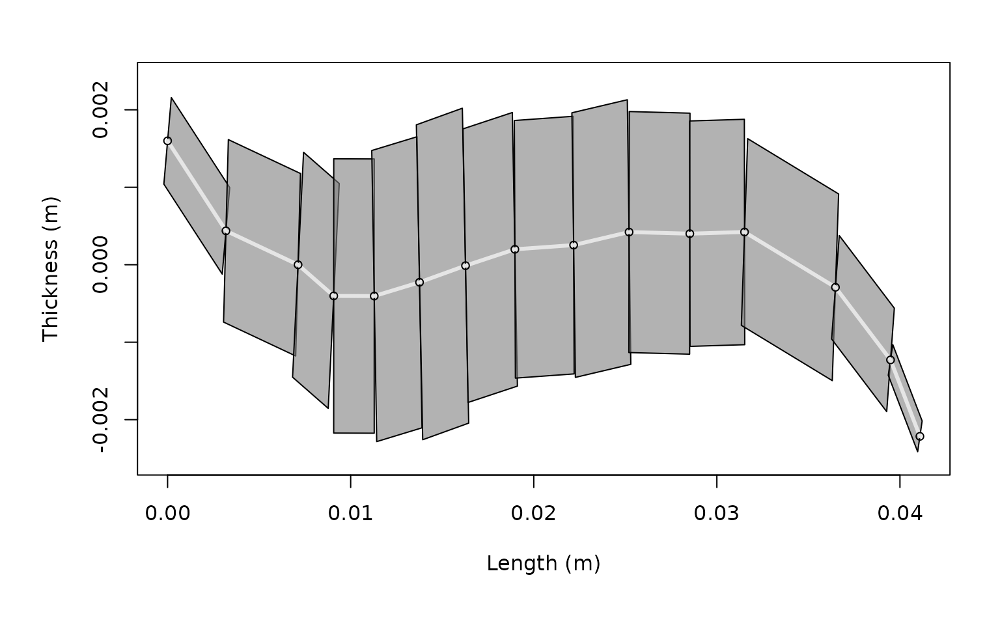
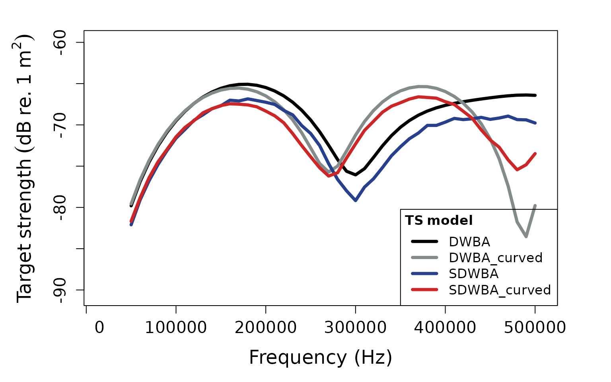
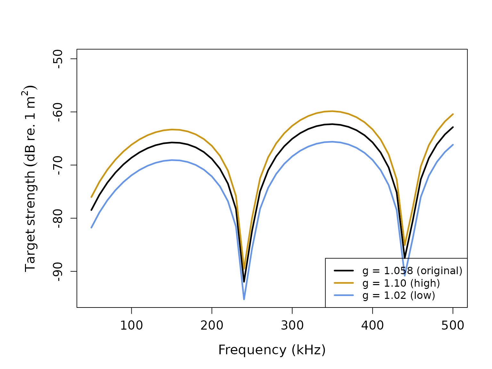
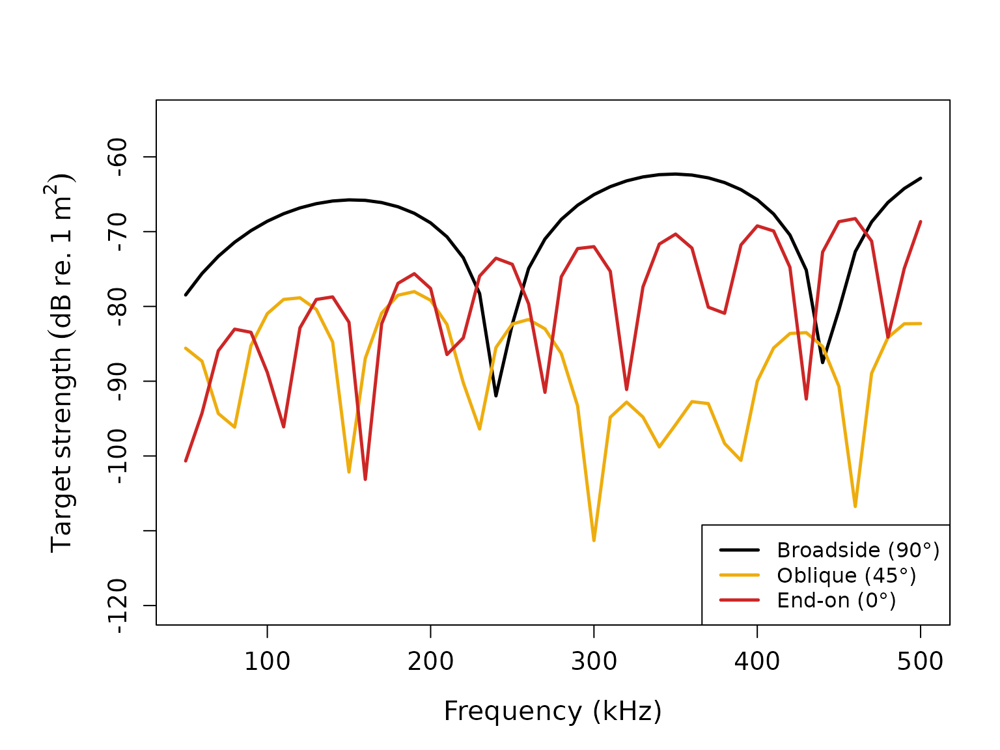
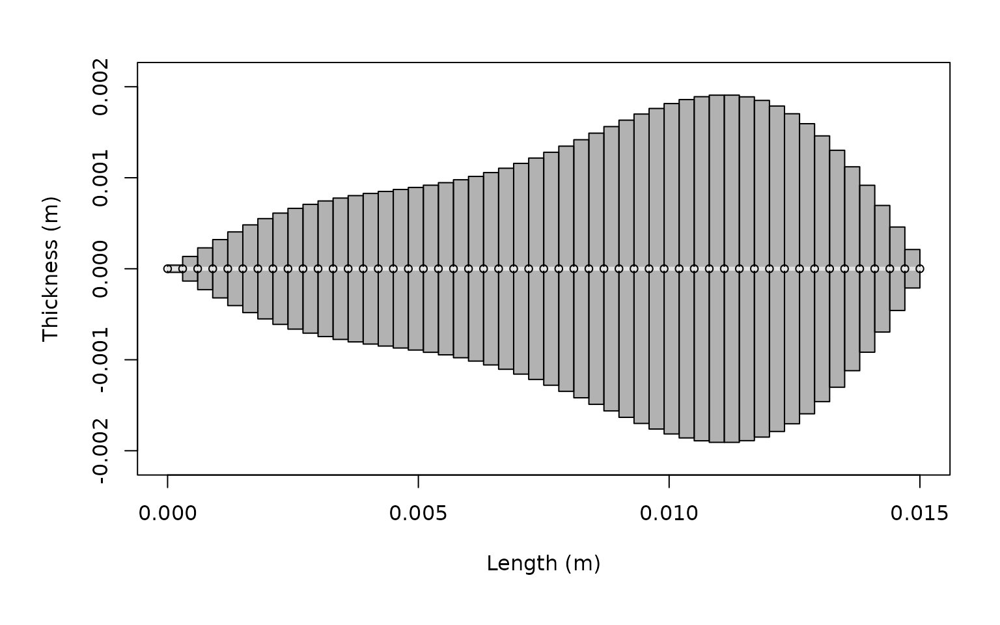
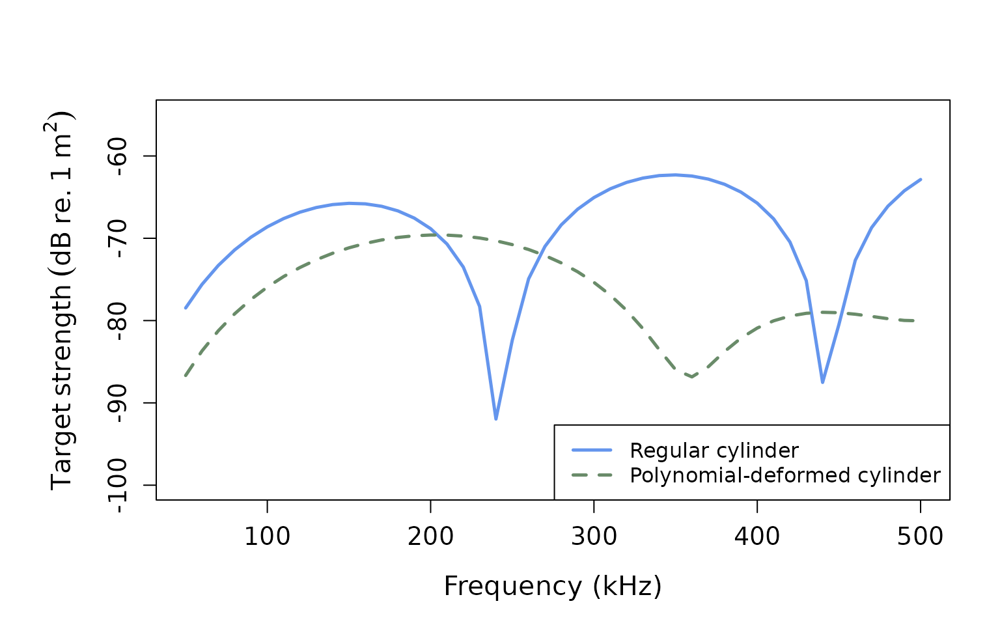

# DWBA and SDWBA models for fluid-like scatterers

## Introduction

The Distorted-Wave Born Approximation (DWBA) is a widely used
theoretical framework for modeling acoustic backscatter from fluid-like
organisms such as zooplankton[¹](#fn1)[²](#fn2). The DWBA treats
scatterers as weakly-scattering objects with material properties that
differ only slightly from the surrounding seawater. This approximation
is particularly well-suited for modeling crustacean zooplankton like
copepods and krill, which have body densities and sound speeds close to
those of seawater.

## acousticTS implementation

The `acousticTS` package provides four DWBA implementations for
fluid-like scatterers:

1.  **DWBA**: Standard DWBA for straight-bodied organisms
2.  **DWBA_curved**: DWBA for organisms with curved body shapes
3.  **SDWBA**: Stochastic DWBA accounting for phase variability in
    straight bodies
4.  **SDWBA_curved**: Stochastic DWBA for curved organisms with phase
    variability

Both deterministic (DWBA) and stochastic (SDWBA) models are applied to
objects of the `FLS` (Fluid-Like Scatterer) class, which can represent
various zooplankton shapes from simple cylinders to complex curved
forms.

``` r
# Call in package library
library(acousticTS)
```

    ## 
    ## Attaching package: 'acousticTS'

    ## The following object is masked from 'package:base':
    ## 
    ##     kappa

``` r
# Create a simple cylinder shape
cylinder_shape <- cylinder(
  length_body = 15e-3, # 15 mm length
  radius_body = 2e-3, # 2 mm radius
  n_segments = 50 # 50 discrete segments
)

# Create FLS object with the cylinder shape
cylinder_scatterer <- fls_generate(
  shape = cylinder_shape,
  g_body = 1.058, # Density contrast (ρ_body/ρ_water)
  h_body = 1.058, # Sound speed contrast (c_body/c_water)
  theta_body = pi / 2 # Broadside orientation
)

# Display the object
cylinder_scatterer
```

    ## FLS-object 
    ##   Fluid-like scatterer 
    ##    ID: UID 
    ##  Body dimensions:
    ##   Length: 0.015 m (n = 50 cylinders) 
    ##   Mean radius: 0.002 m 
    ##   Max radius: 0.002 m 
    ##  Shape parameters:
    ##   Defined shape: Cylinder 
    ##   L/a ratio: 7.5 
    ##   Taper order: NA 
    ##  Material properties:
    ##   g: 1.058 
    ##   h: 1.058 
    ##  Body orientation (relative to transducer face/axis): 1.571 radians

### Using the krill dataset

The `acousticTS` package includes a built-in krill dataset based on the
digitized body shape from McGehee et al. (1998)[³](#fn3), which provides
realistic morphological and material properties for Antarctic krill:

``` r
# Load the krill dataset
data(krill)

# Display basic information about the krill object
krill
```

    ## FLS-object 
    ##   Fluid-like scatterer 
    ##    ID: Antarctic Euphausia superba (McGehee et al., 1998) 
    ##  Body dimensions:
    ##   Length: 0.041 m (n = 14 cylinders) 
    ##   Mean radius: 0.0013 m 
    ##   Max radius: 0.002 m 
    ##  Shape parameters:
    ##   Defined shape: arbitrary 
    ##   L/a ratio: 20.1 
    ##   Taper order:  
    ##  Material properties:
    ##   g: 1.0357 
    ##   h: 1.0279 
    ##  Body orientation (relative to transducer face/axis): 1.571 radians

Let’s examine the krill shape:

``` r
# Plot the krill shape
plot(krill, type = "shape")
```



## DWBA model calculations

### Standard DWBA for cylindrical scatterer

The standard DWBA model assumes straight-bodied organisms and is
appropriate for simple cylindrical shapes:

``` r
# Define frequency vector
frequency <- seq(50e3, 500e3, 10e3) # 50 kHz to 500 kHz

# Calculate TS using standard DWBA
cylinder_scatterer <- target_strength(
  object = cylinder_scatterer,
  frequency = frequency,
  model = "DWBA"
)
```

### DWBA models for krill

For the krill dataset, we can apply all four DWBA models to compare
their performance. The curved models are more appropriate for krill due
to their naturally curved body shape, while the stochastic models
account for phase variability:

``` r
# Define radius-of-curvature for curved models
krill@body$radius_curvature_ratio <- 3.0

# Apply all DWBA models to krill
krill <- target_strength(
  object = krill,
  frequency = frequency,
  model = c("DWBA", "DWBA_curved", "SDWBA", "SDWBA_curved")
)
```

## Visualizing results

### Cylindrical scatterer results

``` r
# Plot TS for the cylindrical scatterer
plot(cylinder_scatterer, type = "model")
```


### Krill model comparison

``` r
# Plot all DWBA models for krill
plot(krill, type = "model")
```



## Model parameters and sensitivity

### Extracting model results

Model results contain detailed information about the scattering
calculations:

``` r
# Extract DWBA results for krill
dwba_results <- extract(krill, "model")$DWBA
head(dwba_results)
```

    ##   frequency        ka         f_bs     sigma_bs        TS
    ## 1     5e+04 0.3104522 0.0001023018 1.046565e-08 -79.80234
    ## 2     6e+04 0.3725426 0.0001431207 2.048355e-08 -76.88595
    ## 3     7e+04 0.4346331 0.0001882204 3.542691e-08 -74.50667
    ## 4     8e+04 0.4967235 0.0002361991 5.578999e-08 -72.53444
    ## 5     9e+04 0.5588139 0.0002855616 8.154545e-08 -70.88600
    ## 6     1e+05 0.6209044 0.0003347646 1.120673e-07 -69.50521

``` r
# Extract curved DWBA results
dwba_curved_results <- extract(krill, "model")$DWBA_curved
head(dwba_curved_results)
```

    ##   frequency        ka         f_bs     sigma_bs        TS
    ## 1     5e+04 0.3104522 0.0001050585 1.103729e-08 -79.57138
    ## 2     6e+04 0.3725426 0.0001466901 2.151797e-08 -76.67199
    ## 3     7e+04 0.4346331 0.0001924496 3.703684e-08 -74.31366
    ## 4     8e+04 0.4967235 0.0002408010 5.798511e-08 -72.36683
    ## 5     9e+04 0.5588139 0.0002901058 8.416137e-08 -70.74887
    ## 6     1e+05 0.6209044 0.0003386728 1.146992e-07 -69.40439

The DWBA results include: - `frequency`: transmit frequency (Hz) -
`k_sw`: acoustic wavenumber for seawater - `f_bs`: complex
backscattering amplitude - `sigma_bs`: backscattering cross-section
(m²) - `TS`: target strength (dB re. 1 m²)

### Material property effects

Let’s explore how different material properties affect the target
strength:

``` r
# Create scatterers with different density contrasts
high_contrast <- fls_generate(
  shape = cylinder_shape,
  g_body = 1.10, # Higher density contrast
  h_body = 1.058,
  theta_body = pi / 2
)

low_contrast <- fls_generate(
  shape = cylinder_shape,
  g_body = 1.02, # Lower density contrast
  h_body = 1.058,
  theta_body = pi / 2
)

# Calculate TS for both
high_contrast <- target_strength(high_contrast, frequency, "DWBA")
low_contrast <- target_strength(low_contrast, frequency, "DWBA")

# Extract results
ts_high <- extract(high_contrast, "model")$DWBA
ts_low <- extract(low_contrast, "model")$DWBA
ts_original <- extract(cylinder_scatterer, "model")$DWBA

# Plot comparison
par(oma = c(0, 0.25, 0, 0), mar = c(5, 6, 4, 2))
plot(
  x = ts_original$frequency * 1e-3,
  y = ts_original$TS,
  type = "l",
  lty = 1,
  lwd = 2.5,
  xlab = "Frequency (kHz)",
  ylab = expression(Target ~ strength ~ (dB ~ re. ~ 1 ~ m^2)),
  cex.lab = 1.3,
  cex.axis = 1.2,
  ylim = c(-95, -50)
)

lines(
  x = ts_high$frequency * 1e-3,
  y = ts_high$TS,
  col = "darkgoldenrod3",
  lty = 1,
  lwd = 2.5
)

lines(
  x = ts_low$frequency * 1e-3,
  y = ts_low$TS,
  col = "cornflowerblue",
  lty = 1,
  lwd = 2.5
)

legend("bottomright",
  c("g = 1.058 (original)", "g = 1.10 (high)", "g = 1.02 (low)"),
  lty = c(1, 1, 1),
  lwd = c(2.5, 2.5, 2.5),
  col = c("black", "darkgoldenrod3", "cornflowerblue"),
  cex = 1.0
)
```



### Orientation effects

The DWBA is highly sensitive to the orientation of the scatterer
relative to the incident sound wave. Let’s examine this effect:

``` r
# Create scatterers at different orientations
broadside <- fls_generate(
  shape = cylinder_shape,
  g_body = 1.058, h_body = 1.058,
  theta_body = pi / 2 # 90° - broadside
)

oblique <- fls_generate(
  shape = cylinder_shape,
  g_body = 1.058, h_body = 1.058,
  theta_body = pi / 4 # 45° - oblique
)

end_on <- fls_generate(
  shape = cylinder_shape,
  g_body = 1.058, h_body = 1.058,
  theta_body = 0 # 0° - end-on
)

# Calculate TS for all orientations
broadside <- target_strength(broadside, frequency, "DWBA")
oblique <- target_strength(oblique, frequency, "DWBA")
end_on <- target_strength(end_on, frequency, "DWBA")

# Extract results
ts_broadside <- extract(broadside, "model")$DWBA
ts_oblique <- extract(oblique, "model")$DWBA
ts_end_on <- extract(end_on, "model")$DWBA

# Plot orientation comparison
par(oma = c(0, 0.25, 0, 0), mar = c(5, 6, 4, 2))
plot(
  x = ts_broadside$frequency * 1e-3,
  y = ts_broadside$TS,
  type = "l",
  lty = 1,
  lwd = 2.5,
  xlab = "Frequency (kHz)",
  ylab = expression(Target ~ strength ~ (dB ~ re. ~ 1 ~ m^2)),
  cex.lab = 1.3,
  cex.axis = 1.2,
  ylim = c(-120, -55)
)

lines(
  x = ts_oblique$frequency * 1e-3,
  y = ts_oblique$TS,
  col = "darkgoldenrod2",
  lty = 1,
  lwd = 2.5
)

lines(
  x = ts_end_on$frequency * 1e-3,
  y = ts_end_on$TS,
  col = "firebrick3",
  lty = 1,
  lwd = 2.5
)

legend("bottomright",
  c("Broadside (90°)", "Oblique (45°)", "End-on (0°)"),
  lty = c(1, 1, 1),
  lwd = c(2.5, 2.5, 2.5),
  col = c("black", "darkgoldenrod2", "firebrick3"),
  cex = 1.0
)
```



## Creating custom shapes

The `acousticTS` package allows for creating custom shapes beyond simple
cylinders. Here’s an example using a polynomial-deformed cylinder based
on Smith et al. (2013)[⁴](#fn4):

``` r
# Create a polynomial deformation vector (example coefficients)
# ---- From: Smith et al. (2013)
poly_coeffs <- c(0.83, 0.36, -2.10, -1.20, 0.63, 0.82, 0.64)

# Create a polynomial-deformed cylinder
poly_shape <- polynomial_cylinder(
  length_body = 15e-3,
  radius_body = 2e-3,
  n_segments = 50,
  polynomial = poly_coeffs
)

# Create FLS object with polynomial shape
poly_scatterer <- fls_generate(
  shape = poly_shape,
  g_body = 1.058,
  h_body = 1.058,
  radius_curvature_ratio = 3.0,
  theta_body = pi / 2
)

# Calculate TS
poly_scatterer <- target_strength(
  object = poly_scatterer,
  frequency = frequency,
  model = "DWBA_curved" # Use curved DWBA for deformed shapes
)
```

``` r
# Plot the polynomial-deformed shape
plot(poly_scatterer, type = "shape")
```



``` r
# Compare with regular cylinder
ts_poly <- extract(poly_scatterer, "model")$DWBA_curved
ts_cylinder <- extract(cylinder_scatterer, "model")$DWBA

par(oma = c(0, 0.25, 0, 0), mar = c(5, 6, 4, 2))
plot(
  x = ts_cylinder$frequency * 1e-3,
  y = ts_cylinder$TS,
  type = "l",
  lty = 1,
  lwd = 2.5,
  col = "cornflowerblue",
  xlab = "Frequency (kHz)",
  ylab = expression(Target ~ strength ~ (dB ~ re. ~ 1 ~ m^2)),
  cex.lab = 1.3,
  cex.axis = 1.2,
  ylim = c(-100, -55)
)

lines(
  x = ts_poly$frequency * 1e-3,
  y = ts_poly$TS,
  col = "darkseagreen4",
  lty = 2,
  lwd = 2.5
)

legend("bottomright",
  c("Regular cylinder", "Polynomial-deformed cylinder"),
  lty = c(1, 2),
  lwd = c(2.5, 2.5),
  col = c("cornflowerblue", "darkseagreen4"),
  cex = 1.0
)
```



## Model applications and validity

### When to use DWBA vs. DWBA_curved

- **DWBA**: Best for straight-bodied organisms or when computational
  speed is important
- **DWBA_curved**: More accurate for naturally curved organisms like
  krill, but computationally more intensive

### Biological applications

The DWBA models are particularly well-suited for:

- **Copepods**: Small crustacean zooplankton with approximately
  cylindrical bodies
- **Krill**: Larger crustaceans with naturally curved body shapes
- **Chaetognaths**: Arrow worms with elongated, transparent bodies
- **Small fish larvae**: When swim bladders are not yet developed

### Model limitations

The DWBA has several important limitations:

1.  **Weak scattering assumption**: Valid only when material contrasts
    are small (g, h ≈ 1)
2.  **Single scattering**: Does not account for multiple scattering
    within the organism
3.  **Shape assumptions**: Assumes cylindrical segments; complex 3D
    shapes may require other approaches

## Future development

Future enhancements may include:

- Stochastic DWBA implementations (SDWBA)
- Integration with empirical orientation distributions
- Automated parameter estimation from morphological data
- Support for temperature and pressure-dependent material properties

------------------------------------------------------------------------

1.  Stanton, T.K., Chu, D., and Wiebe, P.H. (1998). *Sound scattering by
    several zooplankton groups. II. Scattering models*. J. Acoust. Soc.
    Am., 103, 236-253.

2.  Demer, D.A., and Conti, S.G. (2003). *Reconciling theoretical versus
    empirical target strengths of krill: effects of phase variability on
    the distorted-wave Born approximation*. ICES J. Mar. Sci., 60:
    429-434.

3.  McGehee, D.E., O’Driscoll, R.L., and Traykovski, L.V.M. (1998).
    *Effects of orientation on acoustic scattering from Antarctic krill
    at 120 kHz*. Deep Sea Res. Part II: Top. Stud. Oceanogr. 45,
    1273–1294.

4.  Smith, J.N., Ressler, P.H., and Warren, J.D. (2013). *A distorted
    wave Born approximation target strength model for Bering Sea
    euphausiids*. ICES Journal of Marine Science, 70(1): 204-214.
