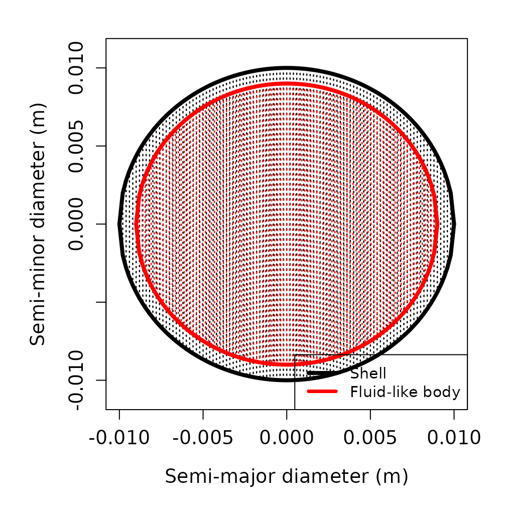
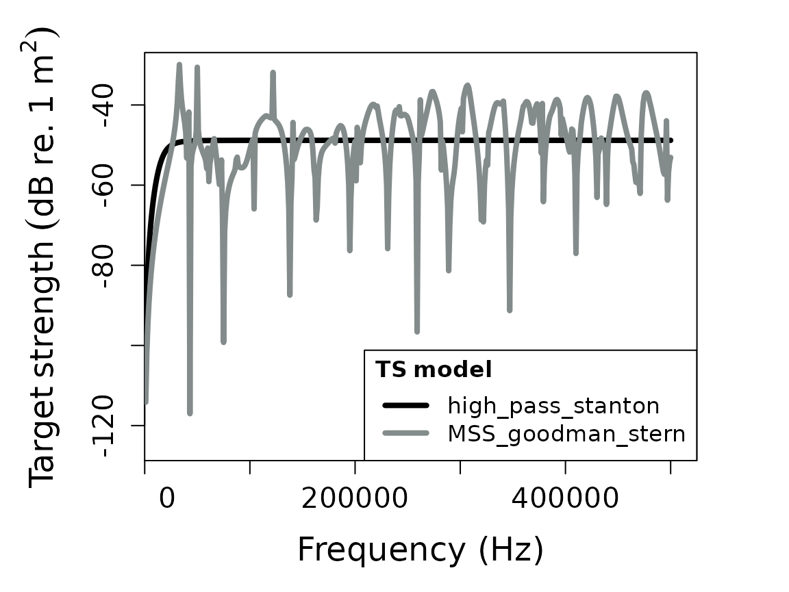
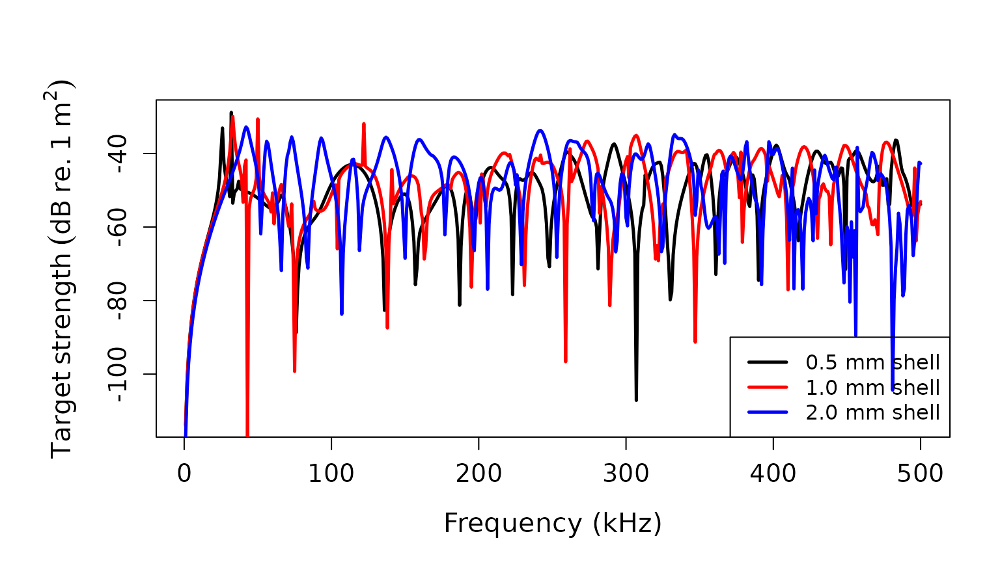
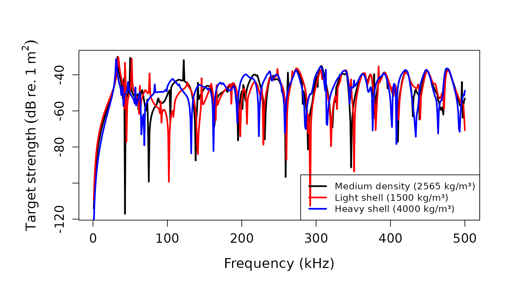

# Target strength for elastic shelled spheres

## Introduction

Elastic shelled spheres are important scatterers in marine acoustics,
representing various zooplankton species and other organisms with hard
exoskeletons or shells. These scatterers consist of an outer elastic
shell surrounding an inner fluid medium. The target strength (TS, dB re.
1 m²) of such scatterers can be modeled using either exact modal series
solutions[¹](#fn1) or high-frequency approximations[²](#fn2).

## acousticTS implementation

The `acousticTS` package provides two main approaches for modeling
elastic shelled spheres: the exact modal series solution from Goodman
and Stern (1962) and the high-frequency ray-based approximation from
Stanton (1989). The object-based approach in `acousticTS` makes
implementing these models straightforward by handling the complex
mathematical calculations internally.

### Elastic shelled sphere object generation

First, an elastic shelled sphere object must be created using the `ESS`
(Elastic Shelled Scatterer) object class. This contains slots for
`metadata`, `model_parameters`, `model` results, `shell` properties,
`fluid` properties, and `shape_parameters`. The object can be created
using the `ess_generate(...)` function.

#### Required parameters

The `ess_generate(...)` function requires several key parameters:

- `radius_shell`: Outer radius of the shell (m)
- `shell_thickness`: Thickness of the shell (m) \[optional, can be
  calculated from inner/outer radii\]
- Shell material properties: density, sound speed, and elastic constants
- Fluid material properties: density and sound speed

#### Material properties for the shell

The shell requires specification of: - `density_shell` or `g_shell`:
Shell density (kg/m³) or density contrast - `sound_speed_shell` or
`h_shell`: Shell sound speed (m/s) or sound speed contrast - Elastic
constants: `K` (bulk modulus), `nu` (Poisson’s ratio), `G` (shear
modulus), or `E` (Young’s modulus)

#### Material properties for the internal fluid

The internal fluid requires: - `density_fluid` or `g_fluid`: Fluid
density (kg/m³) or density contrast - `sound_speed_fluid` or `h_fluid`:
Fluid sound speed (m/s) or sound speed contrast

#### Basic example

``` r
# Call in package library
library(acousticTS)
```

    ## 
    ## Attaching package: 'acousticTS'

    ## The following object is masked from 'package:base':
    ## 
    ##     kappa

``` r
# Create elastic shelled sphere object
shelled_sphere <- ess_generate(
  shape = "sphere",
  radius_shell = 10e-3, # 10 mm outer radius
  shell_thickness = 1e-3, # 1 mm shell thickness
  sound_speed_shell = 3750, # Shell sound speed (m/s)
  sound_speed_fluid = 1575, # Internal fluid sound speed (m/s)
  density_shell = 2565, # Shell density (kg/m³)
  density_fluid = 1077.3, # Internal fluid density (kg/m³)
  K = 70e9, # Bulk modulus (Pa)
  nu = 0.32 # Poisson's ratio
)

# Display the object
shelled_sphere
```

    ## ESS-object 
    ##  Elastic-shelled scatterer 
    ##   ID: UID 
    ##  Material:  
    ##    Shell: 
    ##      Density: 2565 kg m^-3
    ##      Sound speed: 3750 m s^-1
    ##      Poisson's ratio: 0.32
    ##      Bulk modulus (K): 7e+10 Pa
    ##      Young's modulus (E): 7.56e+10 Pa
    ##      Shear modulus (G): 28636363636.3636 Pa  
    ##    Internal fluid-like body: 
    ##      Density: 1077.3 kg m^-3
    ##      Sound speed: 1575 m s^-1  
    ##  Shape: 
    ##    Shell: 
    ##      Radius: 0.01 m  
    ##      Diameter: 0.02 m  
    ##      Outer thickness: 0.001 m 
    ##    Internal fluid-like body: 
    ##      Radius: 0.009 m  
    ##      Diameter: 0.018 m  
    ##  Propagation direction of the incident sound wave: 1.571 radians

### Calculating a TS-frequency spectrum for the elastic shelled sphere

With the elastic shelled sphere object generated, TS can be calculated
using the `target_strength(...)` function. This function supports
multiple models for elastic shelled spheres:

1.  `"MSS_goodman_stern"`: Exact modal series solution[³](#fn3)
2.  `"high_pass_stanton"`: High-frequency ray-based
    approximation[⁴](#fn4)

#### Single model calculation

``` r
# Define frequency vector
frequency <- seq(1e3, 500e3, 1e3) # 1 kHz to 500 kHz

# Calculate TS using the modal series solution
shelled_sphere <- target_strength(
  object = shelled_sphere,
  frequency = frequency,
  model = "MSS_goodman_stern"
)
```

#### Multiple model comparison

``` r
# Calculate TS using both available models
shelled_sphere <- target_strength(
  object = shelled_sphere,
  frequency = frequency,
  model = c("MSS_goodman_stern", "high_pass_stanton")
)
```

### Visualizing results

#### Shape visualization

The shape of the elastic shelled sphere can be visualized using:

``` r
# Plot the shape
plot(shelled_sphere, type = "shape")
```



#### Model results visualization

Model results can be plotted to compare the two approaches:

``` r
# Plot TS as a function of frequency
plot(shelled_sphere, type = "model")
```



### Extracting model results

Model results can be extracted using the `extract(...)` function for
further analysis:

``` r
# Extract modal series solution results
mss_results <- extract(shelled_sphere, "model")$MSS_goodman_stern
head(mss_results)
```

    ##   frequency  ka_shell   ka_fluid            f_bs     sigma_bs         TS
    ## 1      1000 0.0418879 0.03769911 0-1.962401e-06i 3.851016e-12 -114.14425
    ## 2      2000 0.0837758 0.07539822 0-8.001423e-06i 6.402277e-11 -101.93666
    ## 3      3000 0.1256637 0.11309734 0-1.834149e-05i 3.364103e-10  -94.73131
    ## 4      4000 0.1675516 0.15079645 0-3.320975e-05i 1.102888e-09  -89.57469
    ## 5      5000 0.2094395 0.18849556 0-5.284724e-05i 2.792830e-09  -85.53955
    ## 6      6000 0.2513274 0.22619467 0-7.752180e-05i 6.009630e-09  -82.21152

``` r
# Extract high-pass approximation results
hp_results <- extract(shelled_sphere, "model")$high_pass_stanton
head(hp_results)
```

    ##   frequency       k1a      k_s         f_bs     sigma_bs         TS
    ## 1      1000 0.0418879 10.47198 9.723528e-11 9.723528e-11 -100.12176
    ## 2      2000 0.0837758 20.94395 1.555591e-09 1.555591e-09  -88.08104
    ## 3      3000 0.1256637 31.41593 7.871387e-09 7.871387e-09  -81.03949
    ## 4      4000 0.1675516 41.88790 2.484524e-08 2.484524e-08  -76.04757
    ## 5      5000 0.2094395 52.35988 6.049207e-08 6.049207e-08  -72.18302
    ## 6      6000 0.2513274 62.83185 1.248180e-07 1.248180e-07  -69.03723

The modal series solution returns a `data.frame` with columns: -
`frequency`: transmit frequency (Hz) - `k_sw`: acoustic wavenumber for
seawater/ambient fluid - `k_shell_l`: longitudinal acoustic wavenumber
of shell - `k_shell_t`: transversal acoustic wavenumber of shell -
`f_bs`: the complex form function output - `sigma_bs`: the acoustic
cross-section (m²) - `TS`: the target strength (dB re. 1 m²)

## Parameter sensitivity analysis

This implementation allows for exploration of how different material
properties and geometric parameters affect the target strength.

### Effect of shell thickness

``` r
# Create spheres with different shell thicknesses
sphere_thin <- ess_generate(
  radius_shell = 10e-3, shell_thickness = 0.5e-3,
  sound_speed_shell = 3750, sound_speed_fluid = 1575,
  density_shell = 2565, density_fluid = 1077.3,
  K = 70e9, nu = 0.32
)

sphere_medium <- ess_generate(
  radius_shell = 10e-3, shell_thickness = 1.0e-3,
  sound_speed_shell = 3750, sound_speed_fluid = 1575,
  density_shell = 2565, density_fluid = 1077.3,
  K = 70e9, nu = 0.32
)

sphere_thick <- ess_generate(
  radius_shell = 10e-3, shell_thickness = 2.0e-3,
  sound_speed_shell = 3750, sound_speed_fluid = 1575,
  density_shell = 2565, density_fluid = 1077.3,
  K = 70e9, nu = 0.32
)

# Calculate TS for each sphere
sphere_thin <- target_strength(sphere_thin, frequency, "MSS_goodman_stern")
sphere_medium <- target_strength(sphere_medium, frequency, "MSS_goodman_stern")
sphere_thick <- target_strength(sphere_thick, frequency, "MSS_goodman_stern")

# Extract results
ts_thin <- extract(sphere_thin, "model")$MSS_goodman_stern
ts_medium <- extract(sphere_medium, "model")$MSS_goodman_stern
ts_thick <- extract(sphere_thick, "model")$MSS_goodman_stern

# Plot comparison
par(oma = c(0, 0.25, 0, 0), mar = c(5, 6, 4, 2))
plot(
  x = ts_thin$frequency * 1e-3,
  y = ts_thin$TS,
  type = "l",
  lty = 1,
  lwd = 2.5,
  xlab = "Frequency (kHz)",
  ylab = expression(Target ~ strength ~ (dB ~ re. ~ 1 ~ m^2)),
  cex.lab = 1.3,
  cex.axis = 1.2
)

lines(
  x = ts_medium$frequency * 1e-3,
  y = ts_medium$TS,
  col = "red",
  lty = 1,
  lwd = 2.5
)

lines(
  x = ts_thick$frequency * 1e-3,
  y = ts_thick$TS,
  col = "blue",
  lty = 1,
  lwd = 2.5
)

legend("bottomright",
  c("0.5 mm shell", "1.0 mm shell", "2.0 mm shell"),
  lty = c(1, 1, 1),
  lwd = c(2.5, 2.5, 2.5),
  col = c("black", "red", "blue"),
  cex = 1.0
)
```



### Effect of material properties

``` r
# Create spheres with different shell densities
sphere_light <- ess_generate(
  radius_shell = 10e-3, shell_thickness = 1e-3,
  sound_speed_shell = 3750, sound_speed_fluid = 1575,
  density_shell = 1500, density_fluid = 1077.3, # Lighter shell
  K = 70e9, nu = 0.32
)

sphere_heavy <- ess_generate(
  radius_shell = 10e-3, shell_thickness = 1e-3,
  sound_speed_shell = 3750, sound_speed_fluid = 1575,
  density_shell = 4000, density_fluid = 1077.3, # Heavier shell
  K = 70e9, nu = 0.32
)

# Calculate TS
sphere_light <- target_strength(sphere_light, frequency, "MSS_goodman_stern")
sphere_heavy <- target_strength(sphere_heavy, frequency, "MSS_goodman_stern")

# Extract results
ts_light <- extract(sphere_light, "model")$MSS_goodman_stern
ts_heavy <- extract(sphere_heavy, "model")$MSS_goodman_stern

# Plot comparison
par(oma = c(0, 0.25, 0, 0), mar = c(5, 6, 4, 2))
plot(
  x = ts_medium$frequency * 1e-3,
  y = ts_medium$TS,
  type = "l",
  lty = 1,
  lwd = 2.5,
  xlab = "Frequency (kHz)",
  ylab = expression(Target ~ strength ~ (dB ~ re. ~ 1 ~ m^2)),
  cex.lab = 1.3,
  cex.axis = 1.2
)

lines(
  x = ts_light$frequency * 1e-3,
  y = ts_light$TS,
  col = "red",
  lty = 1,
  lwd = 2.5
)

lines(
  x = ts_heavy$frequency * 1e-3,
  y = ts_heavy$TS,
  col = "blue",
  lty = 1,
  lwd = 2.5
)

legend("bottomright",
  c(
    "Medium density (2565 kg/m³)",
    "Light shell (1500 kg/m³)",
    "Heavy shell (4000 kg/m³)"
  ),
  lty = c(1, 1, 1),
  lwd = c(2.5, 2.5, 2.5),
  col = c("black", "red", "blue"),
  cex = 0.9
)
```



## Model validity and applications

### Modal series vs. high-pass approximation

The modal series solution (`"MSS_goodman_stern"`) provides an exact
solution valid across all frequencies, while the high-pass approximation
(`"high_pass_stanton"`) is designed for high-frequency applications
where the wavelength is much smaller than the scatterer size.

### Biological applications

Elastic shelled spheres can represent various marine organisms:

- **Pteropods**: Pelagic gastropods with calcium carbonate and/or
  aragonite shells
- **Molluscs**: Benthic organisms with elastic shells
- **Coccolithophores**: Phytoplankton with calcite plates

The models implemented here provide the theoretical foundation for
understanding acoustic backscatter from these important marine
organisms.

## Future development

Future enhancements may include:

- Additional shape options beyond spheres
- Temperature and pressure dependencies for material properties
- Frequency-dependent material properties
- Integration with empirical scattering databases

------------------------------------------------------------------------

1.  Goodman, R.R., and Stern, R. (1962). *Reflection and transmission of
    sound by elastic spherical shells*. The Journal of the Acoustical
    Society of America, 34, 338-344.

2.  Stanton, T.K. (1989). Simple approximate formulas for backscattering
    of sound by spherical and elongated objects. The Journal of the
    Acoustical Society of America, 86, 1499-1510.

3.  Goodman, R.R., and Stern, R. (1962). *Reflection and transmission of
    sound by elastic spherical shells*. The Journal of the Acoustical
    Society of America, 34, 338-344.

4.  Stanton, T.K. (1989). Simple approximate formulas for backscattering
    of sound by spherical and elongated objects. The Journal of the
    Acoustical Society of America, 86, 1499-1510.
