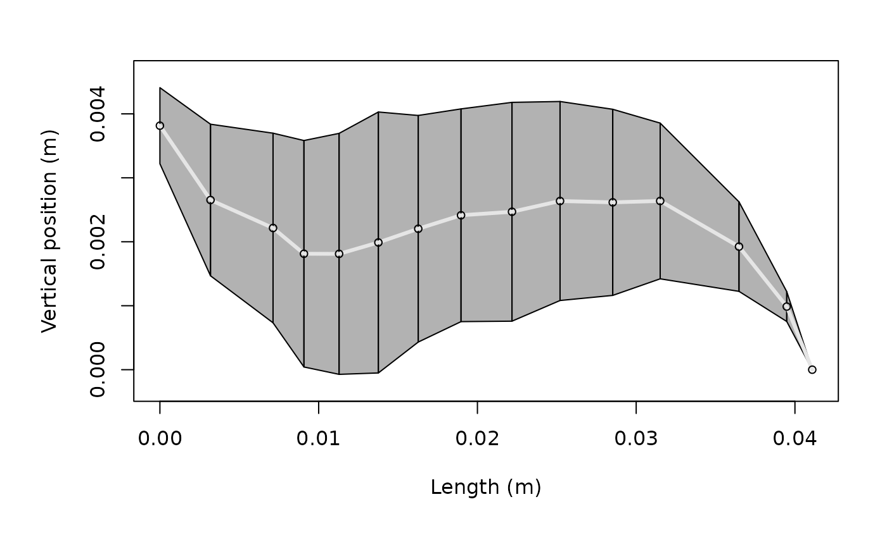

# Working with Example Data

## Overview

`acousticTS` includes three example scatterers and one collection of
benchmark results. They provide known inputs for learning package
workflows, comparing models, and checking calculations before working
with custom targets.


## Included data

| Object | Contents | Primary use |
|----|----|----|
| [`sardine`](https://brandynlucca.github.io/acousticTS/reference/sardine.md) | An `SBF` scatterer with separate body and swimbladder components, based on the NOAA KRM and `echoSMs` resources ([Southwest Fisheries Science Center 2022](#ref-NOAA_KRM_software)). | Composite fish workflows. |
| [`cod`](https://brandynlucca.github.io/acousticTS/reference/cod.md) | An `SBF` scatterer representing the Cod D case, with separate body and swimbladder components ([Clay and Horne 1994](#ref-Clay_1994); [Southwest Fisheries Science Center 2022](#ref-NOAA_KRM_software)). | Composite fish workflows and KRM comparisons. |
| [`krill`](https://brandynlucca.github.io/acousticTS/reference/krill.md) | An `FLS` scatterer based on the krill geometry of McGehee et al. (1998) ([McGehee et al. 1998](#ref-mcgehee_software)). | Fluid-like, elongated-body models. |
| [`benchmark_ts`](https://brandynlucca.github.io/acousticTS/reference/benchmark_ts.md) | Stored target-strength spectra for canonical benchmark cases from Jech et al. (2015) ([Jech et al. 2015](#ref-Jech_2015); [Macaulay and contributors 2024](#ref-echoSMs_software)). | Validation and regression checks. |

The first three objects are S4 scatterers that contain geometry,
physical properties, orientation, metadata, and containers for model
parameters and results. `benchmark_ts` is a list of reference outputs,
not a scatterer. The linked reference pages document each object’s
complete structure and provenance.

## Loading and inspecting an object

Load a dataset explicitly with
[`data()`](https://rdrr.io/r/utils/data.html), then use the same
inspection methods available for other package objects:

``` r

library(acousticTS)

data("krill", package = "acousticTS")
class(krill)
```

    ## [1] "FLS"
    ## attr(,"package")
    ## [1] "acousticTS"

``` r

plot(krill)
```



Use `sardine` or `cod` to examine body-and-swimbladder targets. Use
`krill` for a single fluid-like body. Use `benchmark_ts` when
reproducing a documented benchmark under the same model assumptions,
frequency grid, and numerical settings.

These objects support examples and validation. They are not substitutes
for checking the geometry, material properties, orientation, and model
assumptions required by a new scientific application.

## Related guides

- [Building
  Scatterers](https://brandynlucca.github.io/acousticTS/articles/building-scatterers/building-scatterers.md)
- [Running
  Models](https://brandynlucca.github.io/acousticTS/articles/running-models/running-models.md)
- [Validation and
  Benchmarks](https://brandynlucca.github.io/acousticTS/articles/validation-benchmarks/validation-benchmarks.md)

## References

Clay, Clarence S., and John K. Horne. 1994. “Acoustic Models of Fish:
The Atlantic Cod (*Gadus Morhua*).” *The Journal of the Acoustical
Society of America* 96 (3): 1661–68. <https://doi.org/10.1121/1.410245>.

Jech, J. Michael, John K. Horne, Dezhang Chu, et al. 2015. “Comparisons
Among Ten Models of Acoustic Backscattering Used in Aquatic Ecosystem
Research.” *The Journal of the Acoustical Society of America* 138 (6):
3742–64. <https://doi.org/10.1121/1.4937607>.

Macaulay, Gavin, and contributors. 2024. “echoSMs: Making Acoustic
Scattering Models Available to Fisheries and Plankton Scientists.” In
*GitHub Repository*.
[Https://github.com/ices-tools-dev/echoSMs](https://github.com/ices-tools-dev/echoSMs);
GitHub.

McGehee, D. E., R. L. O’Driscoll, and L. V.Martin Traykovski. 1998.
“Effects of Orientation on Acoustic Scattering from Antarctic Krill at
120 kHz.” *Deep Sea Research Part II: Topical Studies in Oceanography*
45 (7): 1273–94. <https://doi.org/10.1016/S0967-0645(98)00036-8>.

Southwest Fisheries Science Center. 2022. *KRM Model*. National Marine
Fisheries Service, National Oceanic; Atmospheric Administration.
<https://www.fisheries.noaa.gov/data-tools/krm-model>.
