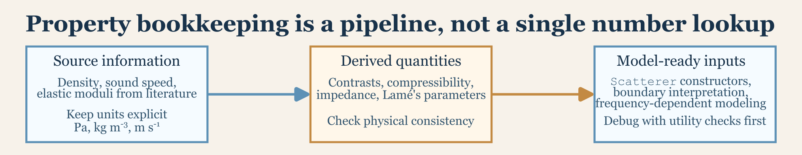

# Material Properties and Acoustic Utilities

## Introduction

The property conventions on this page follow standard acoustics and
elastic-wave references used throughout underwater scattering theory
([Medwin and Clay 1998](#ref-Medwin_1998); [Achenbach
1973](#ref-Achenbach_1973)).

Many modeling errors are not caused by the scattering model itself. They
are caused by incorrect material properties, inconsistent contrasts, or
unit conversion mistakes. This article collects the supporting
acoustic-property functions that feed the model layer and explains how
to think about them physically before they are ever passed into a
target-strength model.

In practice, this page is the bookkeeping companion to the theory pages.
If a model result looks suspicious, one of the first things to check is
whether the object was parameterized with sensible densities, sound
speeds, contrasts, elastic constants, and medium properties. That may
sound secondary compared with model choice, but it often is not. A
theoretically appropriate model will still give an inappropriate answer
if the target and medium properties do not describe the same physical
situation the reader believes they are describing.



## Main utility groups

The package includes utilities for density- and sound-speed-derived
quantities, compressibility- and impedance-related calculations, elastic
moduli such as Lamé parameters, shear modulus, Poisson ratio, and
Young’s modulus, wavenumber and acoustic-size conversions, and
logarithmic and linear-scale conversions. The functions are small, but
they are central. Nearly every model in the package uses some subset of
them, either explicitly or as part of the physical quantities from which
the model inputs are built.

It is useful to think of these utilities as belonging to three different
tasks:

1.  converting between alternative descriptions of the same material,
2.  checking whether target and medium contrasts are physically
    plausible, and
3.  converting between reporting scales so that the model output is
    interpreted in the right domain.

That separation matters because a workflow can fail at any of those
stages. A user may know the correct material but express it in the wrong
parameterization. A user may compute a mathematically valid contrast
that still does not correspond to the intended target. Or a user may
obtain a correct model result and then summarize it in a domain that
answers a different question.

## Contrasts versus absolute properties

One of the most useful design choices in acousticTS is that many
constructors and models accept either contrasts or absolute properties.
A density contrast such as `g_body` expresses target density relative to
the surrounding medium, while a sound-speed contrast such as `h_body`
expresses target sound speed relative to the surrounding medium.
Absolute properties such as `density_body` and `sound_speed_body` can
often be supplied instead, with contrasts derived internally.

This flexibility is convenient, but it also means a user should be
deliberate about which representation is being supplied. The package can
often derive missing pieces, but it cannot rescue physically
inconsistent inputs. If absolute properties imply one contrast and the
manually supplied contrast implies another, the inconsistency belongs to
the setup rather than to the scattering model.

The choice between contrasts and absolute properties is not only a
coding convenience. It changes how the physical problem is being framed.
Contrasts emphasize the target relative to the surrounding medium and
are often the most natural way to think about weak-scattering
approximations. Absolute properties emphasize the target itself and are
often the most natural form when drawing from laboratory measurements or
literature tables. Both are useful, but they should not be mixed
casually.

It is also important to remember that a contrast is meaningless without
an explicit reference medium. A value such as `g_body = 1.02` says very
little by itself unless the medium density is also understood. If the
surrounding water properties change, the same absolute target properties
imply different contrasts. That is one reason medium bookkeeping should
remain visible in the workflow rather than being treated as an
afterthought.

## Acoustic utilities

### Wavenumber

The acoustic wavenumber appears everywhere because it connects frequency
and sound speed to acoustic size.

``` r
library(acousticTS)

frequency <- c(38e3, 70e3, 120e3)
sound_speed_sw <- 1500

wavenumber(frequency, sound_speed_sw)
```

    ## [1] 159.1740 293.2153 502.6548

That quantity underlies ka, reduced frequency, and many truncation
rules. It is one of the simplest examples of why material bookkeeping
matters. Changing only sound speed, while keeping the same nominal
frequency and geometry, changes acoustic size and therefore changes
which asymptotic or modal regime a model may be operating in.

This is also why frequency and sound speed should be checked together
rather than separately. A frequency sequence may look reasonable on
paper, but if the wrong sound speed is being used the implied
acoustic-size range may not match the intended problem at all.

### Linear and logarithmic conversion

Model outputs are often easier to compare in different domains depending
on the question.

``` r
linear(-60)
```

    ## [1] 1e-06

``` r
db(1e-6)
```

    ## [1] -60

The practical rule is simple. Use `TS` in dB for reporting and
communication, and use linear quantities such as `sigma_bs` when
averaging, combining, or checking interference logic. Many avoidable
interpretation errors arise from mixing those two roles.

This distinction matters well beyond plotting. If readers compare two
models with RMSE, MAD, or other residual summaries, they should decide
first whether the scientific question lives in the linear scattering
domain or in the logarithmic reporting domain. A small dB discrepancy
can correspond to a substantial difference in linear cross-section, and
the reverse can also happen.

### Compressibility contrast

The package also exposes simple interface-level calculations that are
useful for sanity checks.

``` r
medium <- data.frame(density = 1026, sound_speed = 1500)
target <- data.frame(density = 1045, sound_speed = 1520)

compressibility(medium, target)
```

    ## [1] -0.04384916

Those utilities are especially helpful when a user wants to understand
why a weak-scattering approximation is or is not plausible for a given
target. Density contrast alone is rarely the whole story.
Compressibility, impedance mismatch, and the joint behavior of density
and sound speed are often the quantities that determine whether a target
behaves as weakly scattering, strongly reflecting, or something in
between ([Medwin and Clay 1998](#ref-Medwin_1998)).

This is one of the most common places where intuition can go wrong. A
target may have density close to water but still differ noticeably in
sound speed, or vice versa. Looking only at one property can therefore
suggest a weak contrast when the combined interface behavior is more
consequential.

## Elastic utilities

Shell and solid-sphere models need elastic constants that are often
reported inconsistently across sources. One paper may give E and \nu,
another may give K and G, and a third may effectively imply Lamé
parameters. The package utilities make it easier to move among those
descriptions.

Representative functions include
[`pois()`](https://brandynlucca.github.io/acousticTS/reference/pois.md)
for Poisson ratio,
[`bulk()`](https://brandynlucca.github.io/acousticTS/reference/bulk.md)
for bulk modulus,
[`young()`](https://brandynlucca.github.io/acousticTS/reference/young.md)
for Young’s modulus,
[`shear()`](https://brandynlucca.github.io/acousticTS/reference/shear.md)
for shear modulus, and
[`lame()`](https://brandynlucca.github.io/acousticTS/reference/lame.md)
for the Lamé parameter ([Achenbach 1973](#ref-Achenbach_1973)).

``` r
E <- 7e10
nu <- 0.32

G <- shear(E = E, nu = nu)
K <- bulk(E = E, nu = nu)
lambda <- lame(E = E, nu = nu)

G
```

    ## [1] 26515151515

``` r
K
```

    ## [1] 64814814815

``` r
lambda
```

    ## [1] 47138047138

That kind of conversion is useful when building `ESS` or
calibration-style objects from literature values that do not already
match the package argument names.

These conversions are not merely notational. Different elastic
quantities emphasize different physical aspects of a material. Young’s
modulus and Poisson ratio are often how a material is reported
mechanically, while shear modulus, bulk modulus, and Lamé parameters are
often closer to the quantities that enter wave propagation and
boundary-condition formulas. A careful workflow therefore converts once,
checks consistency, and then carries the internally consistent elastic
set through the model setup.

Readers should also be cautious about units and admissibility. Elastic
moduli are in pascals, not megapascals unless explicitly converted, and
not every arbitrary pair of elastic constants is physically admissible.
If a conversion produces an obviously implausible modulus or a Poisson
ratio outside its admissible range, the source values should be checked
before the scatterer is built.

## A practical material-property workflow

For most users, a robust material-property workflow begins by deciding
whether the source information is best represented as contrasts or
absolute values. The surrounding medium should then be kept explicit
when deriving contrasts. If the model needs elastic constants, missing
quantities should be derived before the scatterer is built. Simple
utilities such as
[`wavenumber()`](https://brandynlucca.github.io/acousticTS/reference/wavenumber.md),
`reflection_coefficient()`, or
[`compressibility()`](https://brandynlucca.github.io/acousticTS/reference/compressibility.md)
are then worth checking whenever a result looks implausible. Only after
those checks should the scattering model itself be treated as the likely
source of disagreement.

This workflow matters especially when comparing multiple models, because
what looks like a model discrepancy is often really a parameterization
discrepancy. Two models cannot be meaningfully compared if their working
target properties are not describing the same physical object.

A practical sequence is often:

1.  define the surrounding medium explicitly,
2.  express the target either in absolute properties or in contrasts,
    but not in a partially contradictory mix of both,
3.  derive any missing elastic quantities before object construction,
4.  check acoustic size and interface behavior with small utility
    calculations, and
5.  only then run the scattering model and interpret the output.

That sequence may feel slower, but it usually prevents much larger
downstream confusion. It is far easier to catch an inconsistent sound
speed or modulus before object construction than to infer later that an
unexpected target-strength curve was caused by a bookkeeping mismatch
rather than by the model physics.

## Common failure modes

Some of the most common material-property mistakes are mixing units,
especially mm versus m and kHz versus Hz, supplying both contrasts and
absolutes that are inconsistent with each other, forgetting that elastic
moduli are in Pa, treating a gas-filled component as if it were only
slightly different from the surrounding fluid, and interpreting a
target-strength difference caused by material properties as if it were
caused by geometry.

Another common failure mode is importing values from the literature
without checking the associated medium, temperature, salinity, or
measurement context. Material properties reported for a target in one
surrounding medium are not automatically transferable as contrasts to
another. If the package run and the source measurement are not using the
same reference medium, the target can be parameterized incorrectly even
when every individual number has been copied exactly.

## Why this matters

Almost every theory page assumes that material properties are already
correctly specified. In practice, those properties are often the most
fragile part of a workflow. A page dedicated to them makes it easier to
separate physics errors from bookkeeping errors.

That separation is useful both scientifically and practically.
Scientifically, it keeps readers from attributing a contrast-driven
effect to the wrong geometric or model mechanism. Practically, it makes
model debugging much faster. Before concluding that a model is failing,
it is usually worth confirming that the target, the surrounding medium,
and the reporting domain were all defined consistently.

## Companion reading

- [Boundary
  conditions](https://brandynlucca.github.io/acousticTS/articles/boundary_conditions.md)
- [Boundary conditions in
  practice](https://brandynlucca.github.io/acousticTS/articles/boundary-conditions-practice/boundary-conditions-practice.md)
- [FAQ and
  troubleshooting](https://brandynlucca.github.io/acousticTS/articles/faq-troubleshooting/faq-troubleshooting.md)

## References

Achenbach, J. D. 1973. *Wave Propagation in Elastic Solids*.
North-Holland Series in Applied Mathematics and Mechanics, v. 16.
Amsterdam New York: North-Holland Pub. Co. American Elsevier Pub. Co.

Medwin, Herman, and Clarence S. Clay. 1998. *Fundamentals of Acoustical
Oceanography*. Applications of Modern Acoustics. San Diego, CA: Academic
Press.
