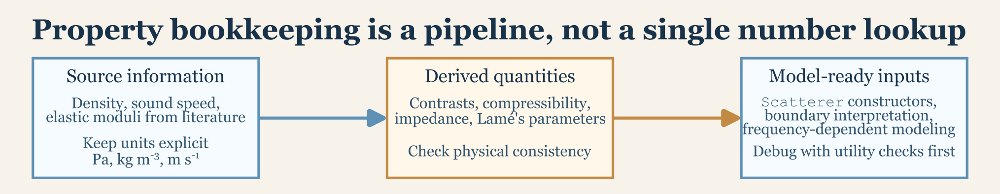

# Preparing Material Properties

## Introduction

Use this guide after choosing a target geometry and before building a
scatterer. It covers how to record, convert, and check the material
values that will be attached to the target. Constructor selection and
object assembly are covered in [Building
Scatterers](https://brandynlucca.github.io/acousticTS/articles/building-scatterers/building-scatterers.md).

See [Scattering Boundary
Conditions](https://brandynlucca.github.io/acousticTS/articles/boundary_conditions.md)
for how material properties enter the interface conditions.



## Record the source values

Record each value with its units, source, and measurement conditions.
Density and sound speed can depend on temperature, salinity, pressure,
and composition. In dispersive or lossy media, effective wave properties
may also depend on frequency. A contrast copied from a publication is
usable only when its reference medium is known ([Medwin and Clay
1998](#ref-Medwin_1998)).

See [Notation and
Symbols](https://brandynlucca.github.io/acousticTS/articles/notation-and-symbols/notation-and-symbols.md)
for the shared material-property definitions and units.

Convert units before constructing the scatterer. In particular, elastic
moduli should be supplied in pascals and geometric dimensions should
follow the units declared in the constructor call.

## Make the reference medium explicit

Absolute target properties remain properties of the target, but their
acoustic interpretation and all derived ratios depend on the exterior
medium used in the calculation. Keep those medium values with the target
setup, even when they are not arguments to the scatterer constructor:

``` r

library(acousticTS)

medium <- data.frame(
  density = 1026,
  sound_speed = 1500
)

body <- data.frame(
  density = 1045,
  sound_speed = 1520
)
```

The same exterior density and sound speed should later be supplied to
the scattering calculation. Otherwise, ratios derived during target
preparation and properties completed during model evaluation can
describe different physical systems.

## Choose absolute properties or ratios

Fluid-like constructors commonly accept either absolute values such as
`density_body` and `sound_speed_body` or directional ratios such as
`g_body` and `h_body`. For a body in the exterior medium, those ratios
are g\_{21}=\rho_2/\rho_1 and h\_{21}=c_2/c_1.

Compute the ratios from the recorded absolute values when both are
available:

``` r

g_body <- body$density / medium$density
h_body <- body$sound_speed / medium$sound_speed

data.frame(g_body, h_body)
```

    ##     g_body   h_body
    ## 1 1.018519 1.013333

Supply one representation for each property. Providing an absolute
density and a contradictory density ratio does not describe a unique
target. The same rule applies to sound speed.

Ratios and perturbation contrasts are also different quantities. The
package helpers
[`rho()`](https://brandynlucca.github.io/acousticTS/reference/rho.md)
and
[`compressibility()`](https://brandynlucca.github.io/acousticTS/reference/compressibility.md)
calculate the density and compressibility perturbations used by
weak-scattering formulations:

``` r

data.frame(
  gamma_rho = acousticTS::rho(medium, body),
  gamma_kappa = compressibility(medium, body)
)
```

    ##    gamma_rho gamma_kappa
    ## 1 0.01818182 -0.04384916

The ratios g\_{21} and h\_{21} approach one for a weak contrast. The
perturbations \gamma\_\rho and \gamma\_\kappa approach zero. They should
not be substituted for one another.

## Check combined fluid properties

Density and sound speed should also be checked together. Acoustic
impedance and absolute compressibility provide compact diagnostics for
an interface:

``` r

property_check <- rbind(
  exterior = medium,
  body = body
)

property_check$impedance <-
  property_check$density * property_check$sound_speed
property_check$compressibility_pa_inverse <-
  1 / (property_check$density * property_check$sound_speed^2)

property_check
```

    ##          density sound_speed impedance compressibility_pa_inverse
    ## exterior    1026        1500   1539000               4.331817e-10
    ## body        1045        1520   1588400               4.141871e-10

A density ratio close to one does not guarantee a small acoustic
contrast if the sound speeds differ materially. Likewise, a gas
component should not be treated as weakly contrasting merely because the
chosen density value has not yet been checked against its sound speed.

## Convert elastic properties

Elastic properties are reported in several equivalent parameterizations.
The package provides
[`pois()`](https://brandynlucca.github.io/acousticTS/reference/pois.md),
[`bulk()`](https://brandynlucca.github.io/acousticTS/reference/bulk.md),
[`young()`](https://brandynlucca.github.io/acousticTS/reference/young.md),
[`shear()`](https://brandynlucca.github.io/acousticTS/reference/shear.md),
and
[`lame()`](https://brandynlucca.github.io/acousticTS/reference/lame.md)
to convert between the common isotropic elastic constants ([Achenbach
1973](#ref-Achenbach_1973)).

For example, Young’s modulus and Poisson ratio can be converted before
an elastic scatterer is built:

``` r

E <- 70e9
nu <- 0.32
density_solid <- 2700

G <- shear(E = E, nu = nu)
K <- bulk(E = E, nu = nu)
lambda <- lame(E = E, nu = nu)

c_L <- sqrt((lambda + 2 * G) / density_solid)
c_T <- sqrt(G / density_solid)

data.frame(E, nu, G, K, lambda, c_L, c_T)
```

    ##       E   nu           G           K      lambda      c_L      c_T
    ## 1 7e+10 0.32 26515151515 64814814815 47138047138 6090.927 3133.756

Supply only the independent values intended for the conversion.
Redundant and inconsistent elastic constants can hide which pair was
actually used. For a stable isotropic linear-elastic material, check
that K\>0, G\>0, and E\>0 as applicable, and that -1\<\nu\<0.5 before
construction. Lamé’s first parameter need not be positive for every
stable auxetic material.

Different target classes expose different elastic inputs. An
elastic-shell constructor may accept a pair such as `E` and `nu`, while
a calibration sphere may be specified by density and longitudinal and
transverse wave speeds. Use the representation supported by the intended
constructor rather than converting values that are already available in
the required form.

## Keep layered components separate

For a layered target, retain one labeled record per physical region. Do
not collapse shell, core, viscous layer, and exterior values into an
unlabeled set of generic properties.

| Region | Values to retain |
|----|----|
| exterior fluid | density and sound speed |
| fluid-like body or core | density and sound speed, or documented ratios |
| elastic solid or shell | density and an independent elastic parameter set |
| viscous layer | density, compressional sound speed, shear viscosity, and bulk viscosity when required |

The theoretical ratios between adjacent media can always be derived from
these labeled absolute values. Constructor argument names may instead
express a component relative to the exterior medium, so check the
constructor documentation before supplying a precomputed ratio.

## Build a constructor-ready target

Once the values are checked, attach them to a compatible shape. Absolute
properties can be supplied directly:

``` r

body_shape <- prolate_spheroid(
  length_body = 0.04,
  radius_body = 0.004,
  n_segments = 60
)

body_target <- fls_generate(
  shape = body_shape,
  density_body = body$density,
  sound_speed_body = body$sound_speed
)

extract(body_target, "body")
```

    ## $rpos
    ##    [,1]         [,2]         [,3]        [,4]         [,5]         [,6]    [,7]
    ## x  0.04  0.039333333  0.038666667  0.03800000  0.037333333  0.036666667  0.0360
    ## y  0.00  0.000000000  0.000000000  0.00000000  0.000000000  0.000000000  0.0000
    ## z  0.00  0.000000000  0.000000000  0.00000000  0.000000000  0.000000000  0.0000
    ## zU 0.00  0.001024153  0.001436044  0.00174356  0.001995551  0.002211083  0.0024
    ## zL 0.00 -0.001024153 -0.001436044 -0.00174356 -0.001995551 -0.002211083 -0.0024
    ##            [,8]         [,9]        [,10]        [,11]        [,12]   [,13]
    ## x   0.035333333  0.034666667  0.034000000  0.033333333  0.032666667  0.0320
    ## y   0.000000000  0.000000000  0.000000000  0.000000000  0.000000000  0.0000
    ## z   0.000000000  0.000000000  0.000000000  0.000000000  0.000000000  0.0000
    ## zU  0.002568181  0.002719477  0.002856571  0.002981424  0.003095516  0.0032
    ## zL -0.002568181 -0.002719477 -0.002856571 -0.002981424 -0.003095516 -0.0032
    ##           [,14]        [,15]        [,16]        [,17]        [,18]
    ## x   0.031333333  0.030666667  0.030000000  0.029333333  0.028666667
    ## y   0.000000000  0.000000000  0.000000000  0.000000000  0.000000000
    ## z   0.000000000  0.000000000  0.000000000  0.000000000  0.000000000
    ## zU  0.003295789  0.003383621  0.003464102  0.003537733  0.003604935
    ## zL -0.003295789 -0.003383621 -0.003464102 -0.003537733 -0.003604935
    ##           [,19]       [,20]        [,21]        [,22]        [,23]        [,24]
    ## x   0.028000000  0.02733333  0.026666667  0.026000000  0.025333333  0.024666667
    ## y   0.000000000  0.00000000  0.000000000  0.000000000  0.000000000  0.000000000
    ## z   0.000000000  0.00000000  0.000000000  0.000000000  0.000000000  0.000000000
    ## zU  0.003666061  0.00372141  0.003771236  0.003815757  0.003855155  0.003889587
    ## zL -0.003666061 -0.00372141 -0.003771236 -0.003815757 -0.003855155 -0.003889587
    ##           [,25]        [,26]        [,27]       [,28]        [,29]        [,30]
    ## x   0.024000000  0.023333333  0.022666667  0.02200000  0.021333333  0.020666667
    ## y   0.000000000  0.000000000  0.000000000  0.00000000  0.000000000  0.000000000
    ## z   0.000000000  0.000000000  0.000000000  0.00000000  0.000000000  0.000000000
    ## zU  0.003919184  0.003944053  0.003964285  0.00397995  0.003991101  0.003997777
    ## zL -0.003919184 -0.003944053 -0.003964285 -0.00397995 -0.003991101 -0.003997777
    ##     [,31]        [,32]        [,33]       [,34]        [,35]        [,36]
    ## x   0.020  0.019333333  0.018666667  0.01800000  0.017333333  0.016666667
    ## y   0.000  0.000000000  0.000000000  0.00000000  0.000000000  0.000000000
    ## z   0.000  0.000000000  0.000000000  0.00000000  0.000000000  0.000000000
    ## zU  0.004  0.003997777  0.003991101  0.00397995  0.003964285  0.003944053
    ## zL -0.004 -0.003997777 -0.003991101 -0.00397995 -0.003964285 -0.003944053
    ##           [,37]        [,38]        [,39]        [,40]        [,41]       [,42]
    ## x   0.016000000  0.015333333  0.014666667  0.014000000  0.013333333  0.01266667
    ## y   0.000000000  0.000000000  0.000000000  0.000000000  0.000000000  0.00000000
    ## z   0.000000000  0.000000000  0.000000000  0.000000000  0.000000000  0.00000000
    ## zU  0.003919184  0.003889587  0.003855155  0.003815757  0.003771236  0.00372141
    ## zL -0.003919184 -0.003889587 -0.003855155 -0.003815757 -0.003771236 -0.00372141
    ##           [,43]        [,44]        [,45]        [,46]        [,47]
    ## x   0.012000000  0.011333333  0.010666667  0.010000000  0.009333333
    ## y   0.000000000  0.000000000  0.000000000  0.000000000  0.000000000
    ## z   0.000000000  0.000000000  0.000000000  0.000000000  0.000000000
    ## zU  0.003666061  0.003604935  0.003537733  0.003464102  0.003383621
    ## zL -0.003666061 -0.003604935 -0.003537733 -0.003464102 -0.003383621
    ##           [,48]   [,49]        [,50]        [,51]        [,52]        [,53]
    ## x   0.008666667  0.0080  0.007333333  0.006666667  0.006000000  0.005333333
    ## y   0.000000000  0.0000  0.000000000  0.000000000  0.000000000  0.000000000
    ## z   0.000000000  0.0000  0.000000000  0.000000000  0.000000000  0.000000000
    ## zU  0.003295789  0.0032  0.003095516  0.002981424  0.002856571  0.002719477
    ## zL -0.003295789 -0.0032 -0.003095516 -0.002981424 -0.002856571 -0.002719477
    ##           [,54]   [,55]        [,56]        [,57]       [,58]        [,59]
    ## x   0.004666667  0.0040  0.003333333  0.002666667  0.00200000  0.001333333
    ## y   0.000000000  0.0000  0.000000000  0.000000000  0.00000000  0.000000000
    ## z   0.000000000  0.0000  0.000000000  0.000000000  0.00000000  0.000000000
    ## zU  0.002568181  0.0024  0.002211083  0.001995551  0.00174356  0.001436044
    ## zL -0.002568181 -0.0024 -0.002211083 -0.001995551 -0.00174356 -0.001436044
    ##            [,60] [,61]
    ## x   0.0006666667     0
    ## y   0.0000000000     0
    ## z   0.0000000000     0
    ## zU  0.0010241528     0
    ## zL -0.0010241528     0
    ## 
    ## $radius
    ##  [1] 0.000000000 0.001024153 0.001436044 0.001743560 0.001995551 0.002211083
    ##  [7] 0.002400000 0.002568181 0.002719477 0.002856571 0.002981424 0.003095516
    ## [13] 0.003200000 0.003295789 0.003383621 0.003464102 0.003537733 0.003604935
    ## [19] 0.003666061 0.003721410 0.003771236 0.003815757 0.003855155 0.003889587
    ## [25] 0.003919184 0.003944053 0.003964285 0.003979950 0.003991101 0.003997777
    ## [31] 0.004000000 0.003997777 0.003991101 0.003979950 0.003964285 0.003944053
    ## [37] 0.003919184 0.003889587 0.003855155 0.003815757 0.003771236 0.003721410
    ## [43] 0.003666061 0.003604935 0.003537733 0.003464102 0.003383621 0.003295789
    ## [49] 0.003200000 0.003095516 0.002981424 0.002856571 0.002719477 0.002568181
    ## [55] 0.002400000 0.002211083 0.001995551 0.001743560 0.001436044 0.001024153
    ## [61] 0.000000000
    ## 
    ## $theta
    ## [1] 1.570796
    ## 
    ## $g
    ## NULL
    ## 
    ## $h
    ## NULL
    ## 
    ## $density
    ## [1] 1045
    ## 
    ## $sound_speed
    ## [1] 1520
    ## 
    ## $radius_curvature_ratio
    ## NULL

The same shape can instead be constructed from ratios derived against
the recorded exterior medium:

``` r

body_target_ratios <- fls_generate(
  shape = body_shape,
  g_body = g_body,
  h_body = h_body
)

extract(body_target_ratios, "body")
```

    ## $rpos
    ##    [,1]         [,2]         [,3]        [,4]         [,5]         [,6]    [,7]
    ## x  0.04  0.039333333  0.038666667  0.03800000  0.037333333  0.036666667  0.0360
    ## y  0.00  0.000000000  0.000000000  0.00000000  0.000000000  0.000000000  0.0000
    ## z  0.00  0.000000000  0.000000000  0.00000000  0.000000000  0.000000000  0.0000
    ## zU 0.00  0.001024153  0.001436044  0.00174356  0.001995551  0.002211083  0.0024
    ## zL 0.00 -0.001024153 -0.001436044 -0.00174356 -0.001995551 -0.002211083 -0.0024
    ##            [,8]         [,9]        [,10]        [,11]        [,12]   [,13]
    ## x   0.035333333  0.034666667  0.034000000  0.033333333  0.032666667  0.0320
    ## y   0.000000000  0.000000000  0.000000000  0.000000000  0.000000000  0.0000
    ## z   0.000000000  0.000000000  0.000000000  0.000000000  0.000000000  0.0000
    ## zU  0.002568181  0.002719477  0.002856571  0.002981424  0.003095516  0.0032
    ## zL -0.002568181 -0.002719477 -0.002856571 -0.002981424 -0.003095516 -0.0032
    ##           [,14]        [,15]        [,16]        [,17]        [,18]
    ## x   0.031333333  0.030666667  0.030000000  0.029333333  0.028666667
    ## y   0.000000000  0.000000000  0.000000000  0.000000000  0.000000000
    ## z   0.000000000  0.000000000  0.000000000  0.000000000  0.000000000
    ## zU  0.003295789  0.003383621  0.003464102  0.003537733  0.003604935
    ## zL -0.003295789 -0.003383621 -0.003464102 -0.003537733 -0.003604935
    ##           [,19]       [,20]        [,21]        [,22]        [,23]        [,24]
    ## x   0.028000000  0.02733333  0.026666667  0.026000000  0.025333333  0.024666667
    ## y   0.000000000  0.00000000  0.000000000  0.000000000  0.000000000  0.000000000
    ## z   0.000000000  0.00000000  0.000000000  0.000000000  0.000000000  0.000000000
    ## zU  0.003666061  0.00372141  0.003771236  0.003815757  0.003855155  0.003889587
    ## zL -0.003666061 -0.00372141 -0.003771236 -0.003815757 -0.003855155 -0.003889587
    ##           [,25]        [,26]        [,27]       [,28]        [,29]        [,30]
    ## x   0.024000000  0.023333333  0.022666667  0.02200000  0.021333333  0.020666667
    ## y   0.000000000  0.000000000  0.000000000  0.00000000  0.000000000  0.000000000
    ## z   0.000000000  0.000000000  0.000000000  0.00000000  0.000000000  0.000000000
    ## zU  0.003919184  0.003944053  0.003964285  0.00397995  0.003991101  0.003997777
    ## zL -0.003919184 -0.003944053 -0.003964285 -0.00397995 -0.003991101 -0.003997777
    ##     [,31]        [,32]        [,33]       [,34]        [,35]        [,36]
    ## x   0.020  0.019333333  0.018666667  0.01800000  0.017333333  0.016666667
    ## y   0.000  0.000000000  0.000000000  0.00000000  0.000000000  0.000000000
    ## z   0.000  0.000000000  0.000000000  0.00000000  0.000000000  0.000000000
    ## zU  0.004  0.003997777  0.003991101  0.00397995  0.003964285  0.003944053
    ## zL -0.004 -0.003997777 -0.003991101 -0.00397995 -0.003964285 -0.003944053
    ##           [,37]        [,38]        [,39]        [,40]        [,41]       [,42]
    ## x   0.016000000  0.015333333  0.014666667  0.014000000  0.013333333  0.01266667
    ## y   0.000000000  0.000000000  0.000000000  0.000000000  0.000000000  0.00000000
    ## z   0.000000000  0.000000000  0.000000000  0.000000000  0.000000000  0.00000000
    ## zU  0.003919184  0.003889587  0.003855155  0.003815757  0.003771236  0.00372141
    ## zL -0.003919184 -0.003889587 -0.003855155 -0.003815757 -0.003771236 -0.00372141
    ##           [,43]        [,44]        [,45]        [,46]        [,47]
    ## x   0.012000000  0.011333333  0.010666667  0.010000000  0.009333333
    ## y   0.000000000  0.000000000  0.000000000  0.000000000  0.000000000
    ## z   0.000000000  0.000000000  0.000000000  0.000000000  0.000000000
    ## zU  0.003666061  0.003604935  0.003537733  0.003464102  0.003383621
    ## zL -0.003666061 -0.003604935 -0.003537733 -0.003464102 -0.003383621
    ##           [,48]   [,49]        [,50]        [,51]        [,52]        [,53]
    ## x   0.008666667  0.0080  0.007333333  0.006666667  0.006000000  0.005333333
    ## y   0.000000000  0.0000  0.000000000  0.000000000  0.000000000  0.000000000
    ## z   0.000000000  0.0000  0.000000000  0.000000000  0.000000000  0.000000000
    ## zU  0.003295789  0.0032  0.003095516  0.002981424  0.002856571  0.002719477
    ## zL -0.003295789 -0.0032 -0.003095516 -0.002981424 -0.002856571 -0.002719477
    ##           [,54]   [,55]        [,56]        [,57]       [,58]        [,59]
    ## x   0.004666667  0.0040  0.003333333  0.002666667  0.00200000  0.001333333
    ## y   0.000000000  0.0000  0.000000000  0.000000000  0.00000000  0.000000000
    ## z   0.000000000  0.0000  0.000000000  0.000000000  0.00000000  0.000000000
    ## zU  0.002568181  0.0024  0.002211083  0.001995551  0.00174356  0.001436044
    ## zL -0.002568181 -0.0024 -0.002211083 -0.001995551 -0.00174356 -0.001436044
    ##            [,60] [,61]
    ## x   0.0006666667     0
    ## y   0.0000000000     0
    ## z   0.0000000000     0
    ## zU  0.0010241528     0
    ## zL -0.0010241528     0
    ## 
    ## $radius
    ##  [1] 0.000000000 0.001024153 0.001436044 0.001743560 0.001995551 0.002211083
    ##  [7] 0.002400000 0.002568181 0.002719477 0.002856571 0.002981424 0.003095516
    ## [13] 0.003200000 0.003295789 0.003383621 0.003464102 0.003537733 0.003604935
    ## [19] 0.003666061 0.003721410 0.003771236 0.003815757 0.003855155 0.003889587
    ## [25] 0.003919184 0.003944053 0.003964285 0.003979950 0.003991101 0.003997777
    ## [31] 0.004000000 0.003997777 0.003991101 0.003979950 0.003964285 0.003944053
    ## [37] 0.003919184 0.003889587 0.003855155 0.003815757 0.003771236 0.003721410
    ## [43] 0.003666061 0.003604935 0.003537733 0.003464102 0.003383621 0.003295789
    ## [49] 0.003200000 0.003095516 0.002981424 0.002856571 0.002719477 0.002568181
    ## [55] 0.002400000 0.002211083 0.001995551 0.001743560 0.001436044 0.001024153
    ## [61] 0.000000000
    ## 
    ## $theta
    ## [1] 1.570796
    ## 
    ## $g
    ## [1] 1.018519
    ## 
    ## $h
    ## [1] 1.013333
    ## 
    ## $density
    ## NULL
    ## 
    ## $sound_speed
    ## NULL
    ## 
    ## $radius_curvature_ratio
    ## NULL

These objects describe the same material only when the later model run
uses the exterior values stored in `medium`.

## Validation checklist

Before moving to scatterer construction or model evaluation, confirm
that:

1.  every dimensional value has been converted to the units expected by
    the package,
2.  the exterior medium used to derive ratios is recorded,
3.  absolute values and ratios do not contradict one another,
4.  g and h ratios have not been confused with perturbation contrasts,
5.  each region of a layered target has its own labeled property set,
6.  elastic constants form a physically admissible independent set, and
7.  frequency-dependent or complex properties have not been replaced
    silently by unrelated static values.

## Next step

Continue to [Building
Scatterers](https://brandynlucca.github.io/acousticTS/articles/building-scatterers/building-scatterers.md)
to select the target class and attach these values to the geometry.

## Related pages

- [Building
  Shapes](https://brandynlucca.github.io/acousticTS/articles/building-shapes/building-shapes.md)
- [Building
  Scatterers](https://brandynlucca.github.io/acousticTS/articles/building-scatterers/building-scatterers.md)
- [Scattering Boundary
  Conditions](https://brandynlucca.github.io/acousticTS/articles/boundary_conditions.md)
- [SOEMS calibration
  spheres](https://brandynlucca.github.io/acousticTS/articles/calibration/index.md)

## References

Achenbach, J. D. 1973. *Wave Propagation in Elastic Solids*.
North-Holland Series in Applied Mathematics and Mechanics, v. 16.
North-Holland Pub. Co. American Elsevier Pub. Co.

Medwin, Herman, and Clarence S. Clay. 1998. *Fundamentals of Acoustical
Oceanography*. Applications of Modern Acoustics. Academic Press.
