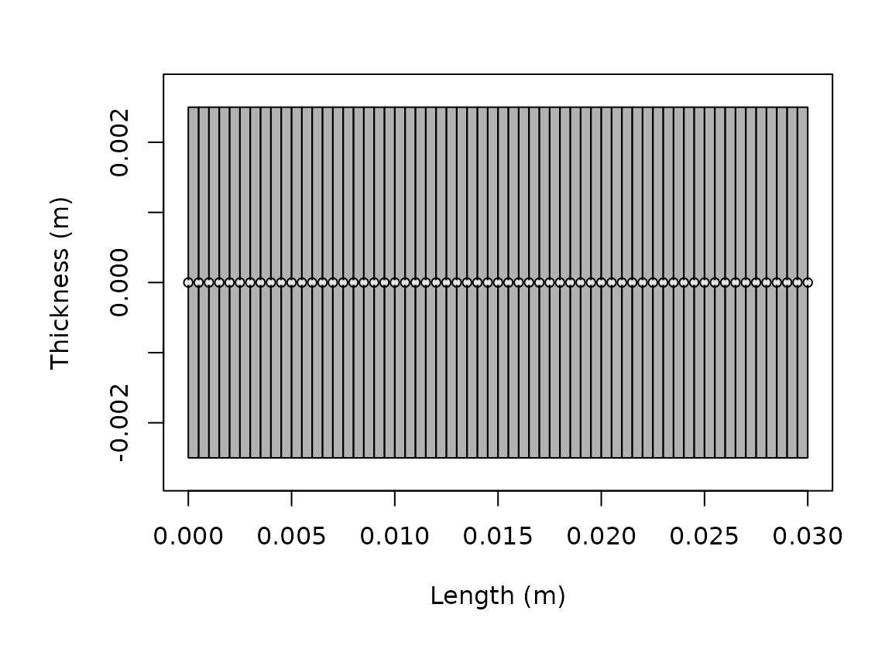

# Running target strength models

## Introduction

The execution patterns shown here are designed to make it easy to
reproduce the same kinds of spectra and angle-series comparisons
reported in benchmark and software papers
([**jech_etal_2015?**](#ref-jech_etal_2015);
[**gastauer_zooscatrspan_2019?**](#ref-gastauer_zooscatrspan_2019)).

Model execution in acousticTS is organized around the target object
rather than around detached parameter tables. A model reads the
scatterer geometry and properties, applies a chosen theoretical or
approximate formulation, and stores the resulting outputs back onto the
object.

This article is the practical bridge between object construction and
result interpretation. It does not try to explain the derivation of any
one model. Instead, it explains how model calls are structured, how
multiple models can be run on the same object, and how to interpret the
stored output consistently.

The central point is that running a model is not just a calculation
step. It is the point at which the package combines geometry, physical
interpretation, acoustic conditions, and model assumptions into a
specific prediction. Because of that, model execution deserves the same
level of care as object construction. A result is only as meaningful as
the object and the model assumptions that were combined to produce it.

## The main entry point: `target_strength()`

Most workflows eventually pass through
[`target_strength()`](https://brandynlucca.github.io/acousticTS/reference/target_strength.md):

``` r
library(acousticTS)

shape_obj <- cylinder(
  length_body = 0.03,
  radius_body = 0.0025,
  n_segments = 60
)

scatterer_obj <- fls_generate(
  shape = shape_obj,
  density_body = 1045,
  sound_speed_body = 1520,
  theta_body = pi / 2
)

frequency <- seq(38e3, 120e3, by = 6e3)

scatterer_obj <- target_strength(
  object = scatterer_obj,
  frequency = frequency,
  model = "dwba"
)
```

The three core arguments are:

1.  `object`, the scatterer to be modeled,
2.  `frequency`, usually a vector in Hz,
3.  `model`, one or more model names.

Additional arguments are model-specific and are forwarded through `...`.
For example, `boundary` matters for `SPHMS`, `PSMS`, and `FCMS`, while
`method` matters for `HPA`, and stochastic controls matter for `SDWBA`.

This structure is important because it makes the function call read like
a compact statement of the modeling problem. The object says what the
target is. The frequency vector says where the target is being
interrogated acoustically. The model name says which physical
approximation or exact solution family is being applied. Model-specific
arguments then refine that statement rather than replacing it.

## Shared and model-specific argument bundles

When only one model is being run, the ordinary `...` interface is
usually sufficient. The more delicate case is when several models are
requested together. In that situation, some inputs are genuinely shared
across all requested models, while others belong only to one model
family.

[`target_strength()`](https://brandynlucca.github.io/acousticTS/reference/target_strength.md)
therefore supports both:

- shared arguments through `...`
- model-specific argument bundles through `model_args`

``` r
comparison_obj <- target_strength(
  object = scatterer_obj,
  frequency = frequency,
  model = c("dwba", "sdwba"),
  density_sw = 1026,
  sound_speed_sw = 1478,
  model_args = list(
    sdwba = list(
      n_iterations = 100,
      n_segments_init = 14,
      phase_sd_init = sqrt(2) / 2,
      length_init = 38.35e-3,
      frequency_init = 120e3
    )
  )
)
```

This pattern avoids duplicating truly shared inputs such as medium
properties, while keeping model-specific controls attached only to the
relevant model. If the same argument appears in both places, the entry
in `model_args[[model_name]]` takes precedence for that model.

That is usually the safer pattern whenever the requested models share
some argument names but not the full same interpretation of every
keyword.

## Typical outputs

Most models ultimately produce some combination of:

- complex backscattering amplitude,
- `sigma_bs`, the backscattering cross-section,
- `TS`, the logarithmic target strength,
- the frequency or acoustic-size domain used in the calculation.

Those quantities answer different questions. `TS` is usually the
reporting quantity, while `sigma_bs` and the complex amplitude are often
more useful when comparing mechanisms or combining components.

Many models also store intermediate acoustic size quantities such as
`ka`, as well as model-specific outputs that are useful for diagnostics.
Because those fields differ by model, it is worth inspecting the result
once before building a larger workflow around it.

This is one of the reasons direct extraction matters. A plotted curve
may be all that is needed for a quick look, but the stored output often
contains the information needed to understand why a model behaved the
way it did. For careful comparison or later reuse, it is usually worth
knowing exactly which variables a given model stores.

``` r
model_output <- extract(scatterer_obj, "model")$DWBA
names(model_output)
```

    ## [1] "frequency" "ka"        "f_bs"      "sigma_bs"  "TS"

``` r
head(model_output)
```

    ##   frequency        ka                        f_bs     sigma_bs        TS
    ## 1     38000 0.3979351 -6.723778e-05-1.940150e-20i 4.520919e-09 -83.44773
    ## 2     44000 0.4607669 -8.773690e-05-2.931388e-20i 7.697764e-09 -81.13635
    ## 3     50000 0.5235988 -1.097965e-04-4.168663e-20i 1.205527e-08 -79.18823
    ## 4     56000 0.5864306 -1.328846e-04-5.650686e-20i 1.765833e-08 -77.53050
    ## 5     62000 0.6492625 -1.564363e-04-7.364911e-20i 2.447231e-08 -76.11325
    ## 6     68000 0.7120943 -1.798640e-04-9.287346e-20i 3.235107e-08 -74.90111

## Running more than one model on the same object

One of the strengths of the package is that several models can be run on
the same target description. That is particularly useful when the
question is about sensitivity to model assumptions rather than about
obtaining only a single curve.

``` r
comparison_obj <- fls_generate(
  shape = shape_obj,
  density_body = 1045,
  sound_speed_body = 1520,
  theta_body = pi / 2
)

comparison_obj <- target_strength(
  object = comparison_obj,
  frequency = frequency,
  model = c("dwba", "hpa")
)

names(extract(comparison_obj, "model"))
```

    ## [1] "DWBA" "HPA"

This works because
[`target_strength()`](https://brandynlucca.github.io/acousticTS/reference/target_strength.md)
initializes the requested model, stores its parameterization in
`model_parameters`, then stores the result in `model`. The original
object remains the anchor that keeps geometry, material properties, and
results tied together.

That design makes model comparison much cleaner than a workflow built
around disconnected result tables. When several models are run on the
same object, the geometry and material assumptions remain fixed in one
place. This reduces the chance that a model comparison is accidentally
turned into a comparison of slightly different targets.

When the same multi-model call needs distinct controls, `model_args`
keeps those differences explicit without forcing every extra argument
into the shared `...` bundle. That is especially helpful when one
requested model needs additional stochastic, numerical, or
boundary-condition inputs that the others do not use.

## Choosing a model call

The package supports both exact modal solutions and approximations. The
correct choice depends on geometry, boundary condition, and acoustic
regime. The practical screening guide is [choosing a
model](https://brandynlucca.github.io/acousticTS/articles/model-selection/model-selection.md).
The mathematical derivations live in the model-specific theory pages.

At a workflow level, there are a few recurring patterns:

1.  `DWBA` and `SDWBA` are natural for weak fluid-like elongated
    targets.
2.  `TRCM` and `FCMS` are natural for cylindrical targets.
3.  `SPHMS` is natural for spherical boundary-value problems.
4.  `PSMS` is natural for prolate spheroids when exact spheroidal
    structure matters.
5.  `ESSMS` and `calibration` are used when shell or calibration-sphere
    physics are central.

The key practical mistake to avoid is choosing a model because the name
sounds familiar rather than because the geometry and boundary
assumptions match the object.

At the execution stage, this usually means pausing long enough to ask a
few questions before running the call:

1.  Is the object geometry actually compatible with the chosen model
    family?
2.  Does the boundary or material interpretation match the physics I
    care about?
3.  Is the selected frequency range inside a regime where this model is
    intended to be informative?
4.  If the model has numerical controls, have I chosen values that are
    at least reasonable as a first pass?

That short check often prevents a lot of downstream confusion.

## Model-specific arguments

Some model calls require only the object, frequency, and model name.
Others require additional inputs. A few representative patterns are:

``` r
# Sphere modal series with an explicit boundary condition
target_strength(gas_sphere, frequency, model = "sphms", boundary = "gas_filled")

# High-pass approximation with explicit method choice
target_strength(fls_obj, frequency, model = "hpa", method = "stanton")

# Stochastic DWBA with phase-variability controls
target_strength(
  fls_obj,
  frequency,
  model = "sdwba",
  n_iterations = 100,
  n_segments_init = 14,
  phase_sd_init = sqrt(2) / 2,
  length_init = 38.35e-3,
  frequency_init = 120e3
)
```

When in doubt, the implementation pages are the best starting point
because they show the model-specific arguments in context rather than in
isolation.

This matters because many of those arguments are not merely optional
toggles. They often encode real physical or numerical assumptions. A
boundary condition changes the underlying scattering problem. A method
choice selects between approximation formulas. A numerical setting can
determine whether a truncated modal system is being solved robustly
enough for interpretation. Reading those arguments in context is
therefore much safer than treating them as anonymous function options.

## Verbose mode and debugging

For larger workflows, `verbose = TRUE` is useful because it prints the
initialization and execution stages. That can help distinguish between
object-construction problems, model-compatibility problems, and
post-processing problems.

``` r
target_strength(
  object = scatterer_obj,
  frequency = frequency,
  model = "dwba",
  verbose = TRUE
)
```

## Interpreting the result

After a model is run, the updated scatterer object can be inspected with
[`extract()`](https://brandynlucca.github.io/acousticTS/reference/extract.md)
or plotted with `plot(..., type = "model")`. That makes it easy to
compare multiple models or to keep geometry and modeled output together.

``` r
plot(scatterer_obj, type = "shape")
```



``` r
plot(scatterer_obj, type = "model")
```


The important practical rule is to compare like with like. If two model
outputs are to be compared, they should usually be compared on the same
object, the same frequency grid, and the same reporting quantity.

It is also worth checking whether the output is being interpreted in the
right domain. For many reporting tasks, `TS` is the natural quantity.
For coherent addition, residual analysis, or mechanism-level
interpretation, linear quantities such as `sigma_bs` or the complex
amplitude may be more informative. A run can be numerically fine and
still be inspected in the wrong domain for the scientific question.

## When a model should be re-run

Because model outputs are stored back onto the object, it is easy to
forget that any substantive change to geometry, material properties,
orientation, frequency grid, or model arguments requires a new run. The
stored result does not update automatically just because an upstream
object or variable in the workflow has changed.

As a practical rule, a model should be re-run whenever:

1.  the geometry or segmentation changes,
2.  any contrast or material property changes,
3.  the frequency vector changes,
4.  the model name changes, or
5.  a model-specific argument such as `boundary`, `method`, `phi_body`,
    `n_integration`, or `precision` changes.

Treating the stored result as tied to a specific run configuration helps
keep later comparisons honest.

## Common pitfalls

The most common execution problems are not numerical failures. They are
setup mismatches. Typical examples are:

1.  using a model that is incompatible with the object class or shape,
2.  mixing contrasts and absolute properties inconsistently,
3.  forgetting that frequencies are in Hz,
4.  forgetting to re-run a model after changing geometry or material
    properties,
5.  comparing outputs from different frequency grids as if they were
    pointwise comparable.

This is one reason the package stores model outputs back on the object:
it keeps the geometry and the result attached to the same record.

Another common pitfall is over-interpreting the first successful run. A
run that completes without error is only the beginning of
interpretation. It should still be checked for model compatibility,
plausible magnitude, stability under modest numerical refinement when
relevant, and consistency with the intended target description.

## Related articles

- [Comparing models on the same
  target](https://brandynlucca.github.io/acousticTS/articles/comparing-models/comparing-models.md)
- [Plotting and inspecting
  results](https://brandynlucca.github.io/acousticTS/articles/plotting-inspecting-results/plotting-inspecting-results.md)
- [Simulation and parameter
  sweeps](https://brandynlucca.github.io/acousticTS/articles/simulation-parameter-sweeps/simulation-parameter-sweeps.md)
