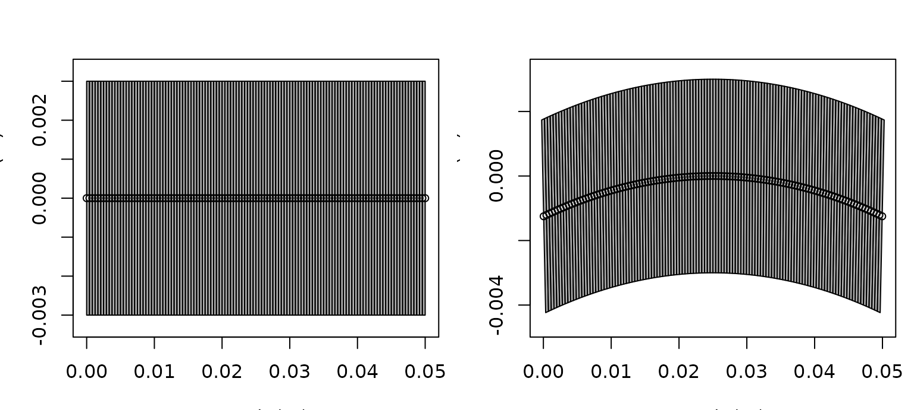

# Shape Manipulation and Reforging

## Introduction

Shape manipulation matters because many published target representations
are built from segmented or reformatted coordinate sets rather than from
canonical closed forms ([**clay_horne_1994?**](#ref-clay_horne_1994);
[**gastauer_australianantarcticdivisionzooscatr_2019?**](#ref-gastauer_australianantarcticdivisionzooscatr_2019)).

Real workflows often begin with a target description that is close to
useful but not quite in the form required for the next model or
comparison step. The package includes tools for reshaping, bending, or
otherwise transforming existing objects rather than rebuilding them from
scratch.

[](https://brandynlucca.github.io/acousticTS/reference/brake.md "brake()")[](https://brandynlucca.github.io/acousticTS/reference/reforge.md "reforge()")

These tools are not cosmetic. They are part of the modeling layer
because curvature, segmentation, and relative body-swimbladder scaling
can all change the resulting backscatter in physically meaningful ways.

That is the key idea behind this vignette. Shape manipulation is not
only about producing a different outline. It is about deciding how a
target should be represented for a specific scientific or modeling
question. A bent body, an inflated swimbladder, or a resampled
segmentation may all be legitimate transformations, but each of them
changes what the object means physically.

## Main ideas

This part of the package is centered on utilities such as
[`brake()`](https://brandynlucca.github.io/acousticTS/reference/brake.md)
and
[`reforge()`](https://brandynlucca.github.io/acousticTS/reference/reforge.md).
Conceptually, these tools let the user keep the same target identity
while changing representation, curvature, or model-facing structure.

The scratch notes make the distinction especially clear:

1.  [`brake()`](https://brandynlucca.github.io/acousticTS/reference/brake.md)
    changes curvature while preserving the target identity,
2.  [`reforge()`](https://brandynlucca.github.io/acousticTS/reference/reforge.md)
    changes scaling, target dimensions, or resolution of an existing
    representation.

The practical distinction is simple:

1.  use
    [`brake()`](https://brandynlucca.github.io/acousticTS/reference/brake.md)
    when the main question is body curvature or pose,
2.  use
    [`reforge()`](https://brandynlucca.github.io/acousticTS/reference/reforge.md)
    when the question is dimensions, proportions, or axial resolution.

## Quick reshaping examples

It helps to see the two workflows immediately in code before discussing
the details.

``` r
library(acousticTS)

data(krill, package = "acousticTS")

krill_40mm <- reforge(krill, body_target = c(length = 0.04))
krill_fine <- reforge(krill, n_segments_body = 200)

data.frame(
  object = c("original", "krill_40mm", "krill_fine"),
  length_m = c(
    extract(krill, c("shape_parameters", "length")),
    extract(krill_40mm, c("shape_parameters", "length")),
    extract(krill_fine, c("shape_parameters", "length"))
  ),
  n_segments = c(
    extract(krill, c("shape_parameters", "n_segments")),
    extract(krill_40mm, c("shape_parameters", "n_segments")),
    extract(krill_fine, c("shape_parameters", "n_segments"))
  )
)
```

    ##       object  length_m n_segments
    ## 1   original 0.0410898         14
    ## 2 krill_40mm 0.0400000         14
    ## 3 krill_fine 0.0410898        200

That is the simplest
[`reforge()`](https://brandynlucca.github.io/acousticTS/reference/reforge.md)
pattern for a one-body `FLS` object: reuse the same target and change
the body target dimensions or axial resolution explicitly without
rebuilding it from scratch.

## Bending with `brake()`

[`brake()`](https://brandynlucca.github.io/acousticTS/reference/brake.md)
applies a smooth curvature transformation to an existing body
description. It can work on a body-style coordinate list or on a full
scatterer object, depending on the workflow.

The key arguments are:

1.  `radius_curvature`, the amount of curvature,
2.  `mode = "ratio"`, which interprets curvature relative to body
    length,
3.  `mode = "measurement"`, which interprets curvature in physical
    units.

Ratio mode is often the more robust choice for comparative studies
because it keeps curvature tied to target size. Measurement mode is more
natural when curvature is known from direct observation.

This distinction matters because the same nominal curvature can mean
very different things for differently sized targets. Ratio mode
preserves geometric interpretation across a size series. Measurement
mode preserves literal physical curvature. Neither is universally
better, but they answer different questions and should not be treated as
interchangeable.

For curved `FLS` objects, the stored body length is treated as the bent
centerline arc length rather than as the flattened `x`-axis span. That
matters for later workflows because
[`reforge()`](https://brandynlucca.github.io/acousticTS/reference/reforge.md)
now uses that same curved centerline directly when a bent `FLS` is
resized. In other words, there is no hidden straight surrogate being
rebuilt behind the scenes. The existing bent `rpos` is what gets
rescaled.

``` r
shape_obj <- cylinder(
  length_body = 0.05,
  radius_body = 0.003,
  n_segments = 120
)

obj <- fls_generate(
  shape = shape_obj,
  density_body = 1045,
  sound_speed_body = 1520
)

bent_ratio <- brake(obj, radius_curvature = 5, mode = "ratio")
bent_measured <- brake(obj, radius_curvature = 0.35, mode = "measurement")

curvature_ratio <- function(x) {
  value <- extract(x, "shape_parameters")$radius_curvature_ratio
  if (is.null(value)) NA_real_ else value
}

data.frame(
  object = c("original", "bent_ratio", "bent_measured"),
  length_m = c(
    extract(obj, c("shape_parameters", "length")),
    extract(bent_ratio, c("shape_parameters", "length")),
    extract(bent_measured, c("shape_parameters", "length"))
  ),
  curvature_ratio = c(
    curvature_ratio(obj),
    curvature_ratio(bent_ratio),
    curvature_ratio(bent_measured)
  )
)
```

    ##          object   length_m curvature_ratio
    ## 1      original 0.05000000              NA
    ## 2    bent_ratio 0.04999999               5
    ## 3 bent_measured 0.05000000               7

Plotting the object before and after bending makes the transformation
much easier to interpret.

``` r
old_par <- par(no.readonly = TRUE)
on.exit(par(old_par))

par(mfrow = c(1, 2), mar = c(3.2, 3.2, 2.6, 0.8))
plot(obj, type = "shape", main = "Original FLS cylinder")
plot(bent_ratio, type = "shape", main = "After brake(mode = \"ratio\")")
```



It is also helpful to inspect the stored position matrix directly. For a
straight cylinder the body centerline stays at `z = 0`, while
[`brake()`](https://brandynlucca.github.io/acousticTS/reference/brake.md)
shifts the centerline into a curved arc and slightly adjusts the `x`
positions accordingly.

``` r
body_before <- extract(obj, "body")$rpos
body_after <- extract(bent_ratio, "body")$rpos
stations <- unique(round(seq(1, ncol(body_before), length.out = 5)))

data.frame(
  station = stations,
  x_before = round(body_before["x", stations], 5),
  z_before = round(body_before["z", stations], 5),
  x_after = round(body_after["x", stations], 5),
  z_after = round(body_after["z", stations], 5)
)
```

    ##   station x_before z_before x_after  z_after
    ## 1       1   0.0500        0 0.04996 -0.00125
    ## 2      31   0.0375        0 0.03749 -0.00031
    ## 3      61   0.0250        0 0.02500  0.00000
    ## 4      91   0.0125        0 0.01251 -0.00031
    ## 5     121   0.0000        0 0.00004 -0.00125

That check is worth doing because a mathematically valid transformation
can still create a geometry that is too coarse for the intended model if
the segmentation is sparse.

It is also worth checking because curvature can alter more than the
silhouette. Depending on the downstream model, bending can change
projected length, local orientation, and the phase relationships among
different parts of the body. A curvature transformation is therefore
best interpreted as a new geometric state of the same target, not just
as a cosmetic deformation of a drawing.

That distinction becomes especially important when a bent object is
later resized. The example below shows that the requested
`body_target["length"]` is matched to the true bent centerline length,
while the projected `x` span stays slightly shorter.

``` r
centerline_arc_length <- function(x) {
  body <- extract(x, "body")
  rpos <- body$rpos
  sum(sqrt(diff(rpos["x", ])^2 + diff(rpos["z", ])^2))
}

bent_rescaled <- reforge(bent_ratio, body_target = c(length = 0.08))
body_bent_rescaled <- extract(bent_rescaled, "body")$rpos

data.frame(
  metric = c(
    "target_length_m",
    "stored_shape_length_m",
    "centerline_arc_length_m",
    "projected_x_length_m"
  ),
  value = c(
    0.08,
    extract(bent_rescaled, c("shape_parameters", "length")),
    centerline_arc_length(bent_rescaled),
    diff(range(body_bent_rescaled["x", ]))
  )
)
```

    ##                    metric      value
    ## 1         target_length_m 0.08000000
    ## 2   stored_shape_length_m 0.08000000
    ## 3 centerline_arc_length_m 0.08000000
    ## 4    projected_x_length_m 0.07986674

This is the behavior to expect for an already bent `FLS`: resizing is
arc-length aware. If the scientific question is instead “what happens if
a straight target of length `L` is bent afterward?”, the safer workflow
is still to
[`reforge()`](https://brandynlucca.github.io/acousticTS/reference/reforge.md)
the straight object first and then apply
[`brake()`](https://brandynlucca.github.io/acousticTS/reference/brake.md).

## Positioning and local profile edits

Not every geometry edit is about bending or global resizing. It is also
useful to have small helpers for positioning, resampling, smoothing, or
locally widening and pinching an existing profile.

``` r
translated_obj <- translate_shape(obj, x_offset = -0.025)
centered_obj <- reanchor_shape(obj, anchor = "center", at = 0)

data.frame(
  object = c("original", "translated", "centered"),
  x_min = c(
    min(extract(obj, "body")$rpos["x", ]),
    min(extract(translated_obj, "body")$rpos["x", ]),
    min(extract(centered_obj, "body")$rpos["x", ])
  ),
  x_max = c(
    max(extract(obj, "body")$rpos["x", ]),
    max(extract(translated_obj, "body")$rpos["x", ]),
    max(extract(centered_obj, "body")$rpos["x", ])
  )
)
```

    ##       object  x_min x_max
    ## 1   original  0.000 0.050
    ## 2 translated -0.025 0.025
    ## 3   centered -0.025 0.025

Those helpers are intentionally simple:

1.  [`translate_shape()`](https://brandynlucca.github.io/acousticTS/reference/translate_shape.md)
    applies a direct offset,
2.  [`reanchor_shape()`](https://brandynlucca.github.io/acousticTS/reference/reanchor_shape.md)
    computes the required offset from a nose, center, or tail anchor.

There are also helpers for local edits to the stored profile:

``` r
obj_inflated <- inflate_shape(
  obj,
  x_range = c(0.015, 0.035),
  scale = 1.35
)
obj_smoothed <- smooth_shape(obj_inflated, span = 7)
obj_dense <- resample_shape(obj_smoothed, n_segments = 120)
obj_flipped <- flip_shape(obj_inflated, axis = "x")

data.frame(
  object = c("original", "inflated", "dense"),
  shape_label = c(
    extract(obj, c("shape_parameters", "shape")),
    extract(obj_inflated, c("shape_parameters", "shape")),
    extract(obj_dense, c("shape_parameters", "shape"))
  ),
  n_segments = c(
    extract(obj, c("shape_parameters", "n_segments")),
    extract(obj_inflated, c("shape_parameters", "n_segments")),
    extract(obj_dense, c("shape_parameters", "n_segments"))
  )
)
```

    ##     object shape_label n_segments
    ## 1 original    Cylinder        120
    ## 2 inflated   Arbitrary        120
    ## 3    dense   Arbitrary        120

In that sequence:

1.  [`inflate_shape()`](https://brandynlucca.github.io/acousticTS/reference/inflate_shape.md)
    widens a selected axial region,
2.  [`smooth_shape()`](https://brandynlucca.github.io/acousticTS/reference/smooth_shape.md)
    regularizes the resulting outline,
3.  [`resample_shape()`](https://brandynlucca.github.io/acousticTS/reference/resample_shape.md)
    changes the discretization density without rebuilding the object,
4.  [`flip_shape()`](https://brandynlucca.github.io/acousticTS/reference/flip_shape.md)
    reverses the stored axial profile while keeping the x grid intact.

These operations are helpful when the main question is geometric
preprocessing rather than formal rescaling. They are especially useful
for measured outlines that need light cleanup before canonicalization or
model runs.

## Re-parameterizing with `reforge()`

[`reforge()`](https://brandynlucca.github.io/acousticTS/reference/reforge.md)
is a generic interface for reshaping or resizing an existing object. The
package currently supports both one-body `FLS` workflows and more
explicitly multi-component classes such as `SBF` and `BBF`.

Its most important arguments are:

1.  `body_scale` and `swimbladder_scale` for proportional resizing,
2.  `body_target` and `swimbladder_target` for direct target dimensions,
3.  `maintain_ratio` for preserving relative component proportions when
    appropriate,
4.  `n_segments_body` and `n_segments_swimbladder` for resampling,
5.  `swimbladder_inflation_factor` for controlled bladder-size changes.

There is a critical interpretation difference between scale arguments
and target-dimension arguments. Scale arguments ask, “How much larger or
smaller should this component become relative to its current state?”
Target-dimension arguments ask, “What final dimensions should this
component have?”

``` r
data(sardine, package = "acousticTS")

obj_scaled <- reforge(
  sardine,
  body_scale = c(length = 1.2),
  swimbladder_scale = c(height = 0.8),
  isometric_body = FALSE,
  isometric_swimbladder = FALSE,
  maintain_ratio = FALSE,
  n_segments_body = 60,
  n_segments_swimbladder = 40
)

obj_target <- reforge(
  sardine,
  body_target = c(length = 0.12),
  swimbladder_target = c(length = 0.07, height = 0.0025),
  isometric_swimbladder = FALSE,
  maintain_ratio = FALSE
)
```

    ## Warning: Swimbladder exceeds body bounds at some positions.

``` r
data.frame(
  object = c("original", "obj_scaled", "obj_target"),
  body_length_m = c(
    extract(sardine, c("shape_parameters", "body", "length")),
    extract(obj_scaled, c("shape_parameters", "body", "length")),
    extract(obj_target, c("shape_parameters", "body", "length"))
  ),
  bladder_length_m = c(
    extract(sardine, c("shape_parameters", "bladder", "length")),
    extract(obj_scaled, c("shape_parameters", "bladder", "length")),
    extract(obj_target, c("shape_parameters", "bladder", "length"))
  )
)
```

    ##       object body_length_m bladder_length_m
    ## 1   original         0.210            0.085
    ## 2 obj_scaled         0.252            0.085
    ## 3 obj_target         0.120            0.070

The same idea applies when the body stays fixed but an internal
component needs to move. For example, a swimbladder can be shifted
fore-aft or dorsoventrally without rebuilding the entire object:

``` r
bladder_forward <- offset_component(
  sardine,
  component = "bladder",
  x_offset = 0.002
)

data.frame(
  object = c("original", "bladder_forward"),
  bladder_x_min = c(
    min(extract(sardine, "bladder")$rpos[1, ]),
    min(extract(bladder_forward, "bladder")$rpos[1, ])
  )
)
```

    ##            object bladder_x_min
    ## 1        original         0.065
    ## 2 bladder_forward         0.067

The same interface also extends to newer multi-component classes such as
`BBF`, where the body and backbone can be reforged separately:

``` r
bbf_rescaled <- reforge(
  bbf_obj,
  body_scale = c(length = 1.1),
  backbone_scale = c(length = 1.1),
  n_segments_body = 120,
  n_segments_backbone = 60
)
```

For reference, the scale-target patterns above can also be written more
compactly as:

``` r
obj_scaled <- reforge(
  obj_sbf,
  body_scale = c(length = 1.2),
  swimbladder_scale = c(height = 0.8),
  n_segments_body = 60,
  n_segments_swimbladder = 40
)

obj_target <- reforge(
  obj_sbf,
  body_target = c(length = 0.12),
  swimbladder_target = c(length = 0.07, height = 0.0025),
  maintain_ratio = FALSE
)
```

Named vectors matter here. For anisotropic changes, dimensions should be
supplied using names such as `length`, `width`, and `height`. That keeps
the transformation explicit and avoids accidental axis mismatches.

The deeper point is that
[`reforge()`](https://brandynlucca.github.io/acousticTS/reference/reforge.md)
often changes representation more directly than
[`brake()`](https://brandynlucca.github.io/acousticTS/reference/brake.md).
Bending usually preserves the same broad anatomical proportions while
changing pose. Reforging may change size, aspect ratio, internal
proportions, and numerical resolution all at once. That makes it
especially powerful for simulation and sensitivity studies, but it also
means the transformed object should be treated as a deliberate new
parameterization rather than as a trivial variant of the original.

For bent `FLS` objects, there is one more important interpretation
detail: `body_target = c(length = ...)` refers to the new bent
centerline arc length, not to the projected `x` extent. For straight
`FLS` objects those two quantities are effectively the same, but once
curvature has been introduced they should not be treated as
interchangeable.

## Why this matters

These tools are especially useful when:

1.  an arbitrary measured geometry must be adapted for a model family,
2.  curvature or pose needs to be explored systematically,
3.  one object representation needs to be converted into another for
    comparison.

They are also useful when the scientific question itself is
morphological. For example, one may want to ask whether target strength
is more sensitive to curvature, overall length, or swimbladder
inflation. Those are exactly the kinds of questions that reshaping
utilities make tractable.

In that sense, these utilities are often not just preprocessing steps.
They can be the mechanism by which the actual hypothesis is encoded. If
a workflow is designed to ask what aspect of morphology matters most
acoustically, then the transformation function is part of the
experimental design.

## Resolution and physicality checks

Two geometry checks are especially important after
[`brake()`](https://brandynlucca.github.io/acousticTS/reference/brake.md)
or
[`reforge()`](https://brandynlucca.github.io/acousticTS/reference/reforge.md):

1.  whether the object still has adequate segment resolution for the
    intended model,
2.  whether the transformed swimbladder remains physically plausible
    inside the body.

The second point is particularly important for `SBF` workflows. If the
swimbladder is inflated or rescaled aggressively, geometric containment
can become questionable even before the code throws a warning.

For that reason, a practical reshaping workflow is usually:

1.  transform the object,
2.  plot the transformed geometry,
3.  inspect component dimensions,
4.  then re-run
    [`target_strength()`](https://brandynlucca.github.io/acousticTS/reference/target_strength.md).

## Choosing between `brake()` and `reforge()`

Although both functions manipulate geometry, they answer different
questions.

Use
[`brake()`](https://brandynlucca.github.io/acousticTS/reference/brake.md)
when:

1.  the target identity should remain the same but posture changes,
2.  curvature is the parameter of interest,
3.  the original segmentation is already suitable.

Use
[`reforge()`](https://brandynlucca.github.io/acousticTS/reference/reforge.md)
when:

1.  component lengths or widths need to be rescaled,
2.  body and swimbladder proportions must be altered separately,
3.  segment counts must be regularized for downstream modeling,
4.  simulation workflows need dimension changes as explicit parameters.

If a simulation needs both curvature and resizing, it helps to decide
which quantity is supposed to stay physically meaningful. When the
object is already bent,
[`reforge()`](https://brandynlucca.github.io/acousticTS/reference/reforge.md)
preserves the bent state and rescales that geometry directly. When the
intended interpretation is “start straight, resize, then bend,” that
sequence should be built explicitly in the workflow.

## Recommended use

Geometry transformation is best treated as a modeling decision rather
than a purely cosmetic step. Any reshaping or reforging should be
interpreted in light of the model assumptions it is intended to support.

For
[`brake()`](https://brandynlucca.github.io/acousticTS/reference/brake.md),
the practical distinction is between ratio-based curvature and curvature
specified in measured units. For
[`reforge()`](https://brandynlucca.github.io/acousticTS/reference/reforge.md),
the practical distinction is between proportional scaling and
target-dimension-based resizing. Both are useful, but they answer
different modeling questions.

One useful habit is to preserve the original object and store
transformed variants as separate named objects. That makes it easier to
compare before/after model outputs without losing the original
parameterization.

Another useful habit is to document what physical interpretation the
transformation is meant to represent. A bent object may correspond to
posture. A rescaled swimbladder may correspond to inflation state. A
resampled geometry may correspond to numerical regularization rather
than a biological change. Making that meaning explicit helps keep later
comparisons scientifically interpretable instead of turning into an
untracked series of geometric edits.

## Related reading

- [Building
  shapes](https://brandynlucca.github.io/acousticTS/articles/building-shapes/building-shapes.md)
- [Building
  scatterers](https://brandynlucca.github.io/acousticTS/articles/building-scatterers/building-scatterers.md)
- [Comparing models on the same
  target](https://brandynlucca.github.io/acousticTS/articles/comparing-models/comparing-models.md)
