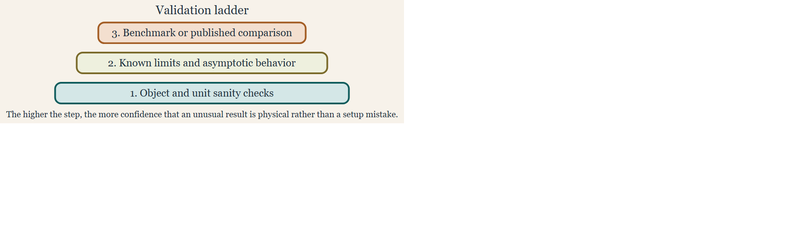

# Validation and benchmark reproduction

## Introduction

The validation workflow on this page is grounded in inter-model
benchmark comparisons and open-software reproductions
([**jech_etal_2015?**](#ref-jech_etal_2015);
[**demer_validation_2003?**](#ref-demer_validation_2003);
[**gastauer_zooscatrspan_2019?**](#ref-gastauer_zooscatrspan_2019);
[**sven_gastauer_svengastauerkrmr_2025?**](#ref-sven_gastauer_svengastauerkrmr_2025);
[**betcke_bempp-cl_2021?**](#ref-betcke_bempp-cl_2021)).

Modeling packages become much more useful when users can distinguish a
physically surprising result from a setup error. Validation pages help
provide that context. In acousticTS, validation is not a single check
with a single threshold. It is a layered workflow that begins with
object and unit sanity, then moves to canonical benchmark reproduction,
and finally asks whether the numerical behavior is stable enough that
any remaining discrepancy deserves physical interpretation.



Validation ladder

That layered view matters because benchmark comparisons are only
informative when the target definition, acoustic assumptions, numerical
settings, and reporting scale are already aligned. A mismatch against a
stored benchmark curve does not automatically diagnose a broken model.
It may instead reflect a different boundary condition, a different
frequency grid, a different medium, a different orientation convention,
or a comparison being carried out in a quantity that is not the one the
benchmark was intended to validate.

## What the benchmark resources are for

The package includes `benchmark_ts`, which provides stored benchmark
curves for several canonical model-and-geometry combinations. Together
with the bundled example scatterers and the theory vignettes, it
provides a documented basis for regression-style checks. That makes the
dataset more than a teaching convenience. It is also part of the
package’s broader numerical validation strategy.

``` r
library(acousticTS)

data(benchmark_ts)

names(benchmark_ts$frequency_spectra)
```

    ## [1] "index"            "sphere"           "prolate_spheroid" "cylinder"

``` r
head(benchmark_ts$frequency_spectra$index$frequency)
```

    ## [1] 12000 14000 16000 18000 20000 22000

The benchmark cases emphasize canonical exact or near-exact comparison
problems: `SPHMS` sphere cases with several boundary conditions, `FCMS`
finite-cylinder cases, and `PSMS` prolate-spheroid cases. That
combination is useful because it spans several canonical geometries and
several different numerical mechanisms. In practice, these resources let
a user ask two related but different questions. The first is whether a
known reference problem can be reproduced. The second is whether a new
workflow still behaves consistently when anchored to a trusted canonical
case.

## Validation registry snapshot

The package also keeps a small internal validation registry so the
family-page badges, model-library summaries, and validation evidence can
be drawn from one source rather than maintained separately.

### Family statuses

| Family | Section                              | Status                                         |
|:-------|:-------------------------------------|:-----------------------------------------------|
| SPHMS  | Modal-series families                | Benchmarked, Validated                         |
| FCMS   | Modal-series families                | Benchmarked, Validated                         |
| PSMS   | Modal-series families                | Benchmarked, Validated                         |
| SOEMS  | Modal-series families                | Benchmarked, Validated                         |
| ESSMS  | Modal-series families                | Unvalidated                                    |
| BCMS   | Modal-series families                | Unvalidated, Experimental                      |
| ECMS   | Modal-series families                | Unvalidated, Experimental                      |
| DWBA   | Approximation and ray-based families | Benchmarked, Validated                         |
| SDWBA  | Approximation and ray-based families | Benchmarked, Validated                         |
| KRM    | Approximation and ray-based families | Benchmarked, Validated                         |
| HPA    | Approximation and ray-based families | Benchmarked, Validated                         |
| TRCM   | Approximation and ray-based families | Benchmarked, Unvalidated                       |
| PCDWBA | Approximation and ray-based families | Validated, Experimental                        |
| BBFM   | Composite and emerging families      | Unvalidated, Experimental                      |
| VESM   | Composite and emerging families      | Validated, Experimental                        |
| TMM    | Composite and emerging families      | Benchmarked, Partially validated, Experimental |

### Benchmark evidence

| Family | Evidence type | Source                                  | Scope                                                                        | Summary                                                                                                                                  |
|:-------|:--------------|:----------------------------------------|:-----------------------------------------------------------------------------|:-----------------------------------------------------------------------------------------------------------------------------------------|
| SPHMS  | Benchmarked   | benchmark_ts / Jech et al. (2015)       | Sphere spectra across rigid, soft, liquid-filled, and gas-filled cases.      | Benchmarked against the canonical spherical spectra stored in `benchmark_ts`.                                                            |
| FCMS   | Benchmarked   | benchmark_ts / Jech et al. (2015)       | Finite-cylinder spectra across the canonical cylindrical benchmark grid.     | Benchmarked against the canonical finite-cylinder spectra stored in `benchmark_ts`.                                                      |
| PSMS   | Benchmarked   | benchmark_ts / Jech et al. (2015)       | Prolate-spheroid spectra across the canonical benchmark grid.                | Benchmarked against the canonical prolate-spheroid spectra stored in `benchmark_ts`.                                                     |
| SOEMS  | Benchmarked   | Published calibration spheres           | Tungsten-carbide and copper calibration spheres.                             | Benchmarked against published calibration-sphere targets used throughout the package documentation.                                      |
| DWBA   | Benchmarked   | Jech weakly scattering benchmark ladder | Weakly scattering sphere, prolate spheroid, and cylinder targets.            | Benchmarked against the canonical weakly scattering targets summarized by Jech et al. (2015).                                            |
| SDWBA  | Benchmarked   | Published SDWBA weak-scattering ladder  | Weakly scattering sphere, prolate spheroid, and cylinder stochastic targets. | Benchmarked against published SDWBA weak-scattering comparison cases.                                                                    |
| KRM    | Benchmarked   | Canonical modal families                | Canonical isolated targets used for the package KRM benchmark ladder.        | Benchmarked against canonical modal-family targets used for isolated gas-filled and weakly scattering cases.                             |
| HPA    | Benchmarked   | Jech canonical asymptotic targets       | Sphere, prolate spheroid, and cylinder asymptotic benchmark targets.         | Benchmarked against canonical asymptotic target families rather than as an exact modal solver.                                           |
| TRCM   | Benchmarked   | Package validation workflow             | Straight and bent cylindrical validation cases documented in the package.    | Benchmarked within the package validation workflow against the straight-cylinder and FCMS-derived bent-cylinder reference constructions. |
| TMM    | Benchmarked   | SPHMS / PSMS / FCMS benchmark ladder    | Sphere, oblate, prolate, and guarded cylinder monostatic branches.           | Benchmarked against `SPHMS`, `PSMS`, and `FCMS` on the currently supported canonical shape branches.                                     |

### Validated-comparison evidence

| Family | Evidence type | Source                                         | Scope                                                                       | Summary                                                                                                    |
|:-------|:--------------|:-----------------------------------------------|:----------------------------------------------------------------------------|:-----------------------------------------------------------------------------------------------------------|
| SPHMS  | Validated     | KRMr and echoSMs                               | Penetrable sphere spectra on shared software definitions.                   | Validated against `KRMr` and `echoSMs` on shared penetrable-sphere cases.                                  |
| FCMS   | Validated     | echoSMs                                        | Rigid, soft, liquid-filled, and gas-filled finite-cylinder spectra.         | Validated against the `echoSMs` finite-cylinder implementation.                                            |
| PSMS   | Validated     | Prol_Spheroid                                  | Liquid-filled and gas-filled prolate-spheroid software comparisons.         | Validated against the external `Prol_Spheroid` implementation on shared prolate cases.                     |
| SOEMS  | Validated     | echoSMs, sphereTS, NOAA applet                 | Shared calibration-sphere material sets and frequency sweeps.               | Validated against `echoSMs`, `sphereTS`, and the NOAA calibration applet.                                  |
| DWBA   | Validated     | Published and independent DWBA implementations | Bundled krill geometry and published DWBA reference workflows.              | Validated against the published McGehee MATLAB workflow and an independent DWBA implementation.            |
| SDWBA  | Validated     | CCAMLR MATLAB and NOAA HTML implementations    | Bundled krill stochastic workflow comparisons.                              | Validated against the CCAMLR MATLAB and NOAA HTML SDWBA implementations.                                   |
| KRM    | Validated     | KRMr, echoSMs, NOAA applet                     | Bundled sardine and cod software-to-software comparisons.                   | Validated against `KRMr`, `echoSMs`, and the NOAA KRM applet on bundled fish objects and shared workflows. |
| HPA    | Validated     | echoSMs HPModel and published algebra          | Spherical HPModel branch and published asymptotic formulas.                 | Validated against the spherical `echoSMs::HPModel` branch and the published Johnson/Stanton algebra.       |
| PCDWBA | Validated     | ZooScatR and echopop source workflows          | Curved weak-scattering reference workflows on shared bent-body cases.       | Validated against source-level `ZooScatR` and `echopop` PCDWBA workflows.                                  |
| VESM   | Validated     | Reference Python VESM workflow                 | Documented spherical layered case used by the original VESM implementation. | Validated against the reference Python VESM implementation on the documented layered-sphere case.          |
| TMM    | Validated     | BEMPP far-field checks                         | Pressure-release angular slices for sphere, oblate, and prolate cases.      | Validated against external BEMPP far-field checks for sphere, oblate, and prolate pressure-release cases.  |
| TMM    | Validated     | Exact general-angle spheroidal solution        | General-angle prolate retained-state validation.                            | Retained prolate angular products are also checked against the exact general-angle spheroidal solution.    |

### Partially-validated scope evidence

| Family | Evidence type       | Source                        | Scope                                                    | Summary                                                                                                                                                                                   |
|:-------|:--------------------|:------------------------------|:---------------------------------------------------------|:------------------------------------------------------------------------------------------------------------------------------------------------------------------------------------------|
| TMM    | Partially validated | Cylinder retained-angle scope | Cylinder retained-angle scope limitation and guardrails. | TMM is partially validated because the sphere, oblate, and prolate branches have external checks, but retained general-angle cylinder products remain outside the validated public scope. |

### Experimental-scope evidence

| Family | Evidence type | Source                                       | Scope                                                                 | Summary                                                                                                                                                                          |
|:-------|:--------------|:---------------------------------------------|:----------------------------------------------------------------------|:---------------------------------------------------------------------------------------------------------------------------------------------------------------------------------|
| BCMS   | Experimental  | Internal FCMS-based reference reconstruction | Uniform-curvature cylinder coherence extension of FCMS.               | BCMS is currently marked experimental because the documented checks are internal coherence reconstructions rather than an external benchmark or software-comparison ladder.      |
| ECMS   | Experimental  | Independent algebra transcription            | Elastic-cylinder component family and near-broadside canonical cases. | ECMS is currently marked experimental because the documented checks are independent algebra reconstructions rather than an external benchmark or software-comparison ladder.     |
| PCDWBA | Experimental  | Current package workflow surface             | Current package-facing PCDWBA workflow and argument surface.          | PCDWBA is currently marked experimental because the public package workflow is still being tightened even though the current source- level comparison cases are documented.      |
| BBFM   | Experimental  | Internal DWBA + ECMS reconstruction          | Internal composite-component consistency checks only.                 | BBFM is currently marked experimental because it has documented internal reconstruction checks but no external benchmark ladder or independent public implementation comparison. |
| VESM   | Experimental  | Current layered-sphere workflow surface      | Current documented layered-sphere workflow surface.                   | VESM is currently marked experimental because the documented public workflow is still limited to the current layered-sphere scope.                                               |
| TMM    | Experimental  | Current retained-state branch matrix         | Current retained-state branch matrix across supported shapes.         | TMM is currently marked experimental because the retained-state workflow and branch matrix are still guarded while shape-specific support continues to be tightened.             |

## What validation means in this package

Validation in acousticTS is best understood as at least four related
layers of evidence.

First, the object and setup have to be internally consistent. The
geometry must be the one the user thinks was created, the material
properties must be in the correct units, the model must be appropriate
for the target class and boundary interpretation, and the frequency grid
and orientation convention must match the intended analysis. If any of
that is wrong, benchmark disagreement says very little.

Second, the workflow should reproduce known theoretical or canonical
limits whenever those are available. For some models that means checking
against an exact modal-series benchmark. For others it means checking
whether the limiting behavior is consistent with the approximation
regime documented in the theory page.

Third, the numerical solution has to be stable enough that the reported
agreement is meaningful. Some comparisons are only trustworthy after
truncation settings, precision choices, quadrature controls, or object
resolution have been perturbed and found not to change the result
materially.

Fourth, the reporting quantity has to match the comparison question. A
benchmark assessed in `TS` is not necessarily saying the same thing as a
benchmark assessed in `sigma_bs`, and neither is equivalent to direct
comparison of the complex scattering amplitude.

## Layer 1: geometry and setup checks

The first layer of validation is simple but essential. Confirm the shape
is what you think it is, confirm that the material properties and units
are sensible, confirm that the selected model is compatible with the
target class and boundary interpretation, and confirm that the frequency
grid and orientation convention match the intended benchmark. This layer
is often enough to explain large discrepancies. Many apparent model
failures are actually mismatches in units, contrasts, orientation, or
boundary-condition naming.

This is also the stage where readers should decide whether a benchmark
is even comparable to the problem they are running. A rigid-sphere
benchmark is not a useful reference for a fluid-filled sphere setup, and
a benchmark built in seawater is not a direct check on a target rebuilt
with different ambient properties unless the comparison has been
intentionally nondimensionalized.

## Layer 2: benchmark reproduction

The second layer is to reproduce a known benchmark curve or stored
regression case. The bundled resources and the package tests provide the
clearest examples of this workflow. For spheres, one can build the
canonical sphere case, run `SPHMS`, and compare the resulting `TS`
vector against the stored benchmark curve.

``` r
data(benchmark_ts)

frequency <- benchmark_ts$frequency_spectra$index$frequency
density_sw <- 1026.8
sound_speed_sw <- 1477.3

scatterer_ess <- fixture_sphere("fixed_rigid")

scatterer_ess <- target_strength(
  scatterer_ess,
  frequency = frequency,
  model = "sphms",
  boundary = "fixed_rigid",
  density_sw = density_sw,
  sound_speed_sw = sound_speed_sw
)

all.equal(
  extract(scatterer_ess, "model")$SPHMS$TS,
  benchmark_ts$frequency_spectra$sphere$fixed_rigid,
  tolerance = 1e-2
)
```

The cylinder and prolate-spheroid benchmark workflows follow the same
broad pattern with `FCMS` and `PSMS`, respectively. For the
prolate-spheroid case, the benchmark setup also shows something
important: faithful reproduction can require model-specific numerical
settings such as `precision = "quad"` or `simplify_Amn = FALSE`. In
other words, a model may be mathematically correct and still miss a
benchmark if the numerical configuration is not the one the comparison
requires.

## Layer 3: choosing the comparison quantity

Benchmark agreement should be interpreted in the quantity that answers
the validation question. When the goal is to reproduce the exact
reported target-strength curve from a publication or stored package
resource, comparison in `TS` is often appropriate because the benchmark
itself is already expressed in decibels. In that setting, absolute dB
differences are directly interpretable and are often the most convenient
regression metric.

When the goal is to assess scattering strength as a physical quantity,
or when the benchmark is really about backscattering magnitude rather
than reported target strength, comparison in the linear domain is
usually more informative. That means working with `sigma_bs` or, when
phase matters, with `f_bs`. Two solutions that differ modestly in `TS`
can represent a much larger relative disagreement in `sigma_bs` at
low-scattering portions of the curve. The converse can also happen: a
visually noticeable dB mismatch near a strong peak may correspond to a
smaller relative linear-domain error than a reader expects.

For that reason, validation metrics such as MAD, RMSE, or maximum
absolute error should be interpreted together with the domain in which
they were computed. A dB-domain RMSE rewards agreement in the reported
target-strength scale. A linear-domain RMSE rewards agreement in
physical scattering magnitude. Neither dominates the other universally.
The right choice depends on whether the benchmark is being used as a
reporting check, a physical-strength check, or a numerical-regression
check.

## Layer 4: numerical stability checks

Benchmark reproduction is necessary, but it is not the whole story. Some
workflows also need local numerical checks such as increasing object
resolution, changing truncation or integration controls, checking
sensitivity to precision settings, and confirming that oscillatory
structure is physically consistent rather than an artifact. This is
especially relevant for models with heavier numerical machinery, such as
`PSMS` or boundary-value problems involving multiple coupled
coefficients.

A benchmark should therefore be thought of as an anchor, not as a
substitute for local numerical inspection. If a curve agrees with a
benchmark only at one specific precision or one specific truncation
setting but changes materially under modest perturbation, the agreement
should be treated cautiously. Conversely, a small residual mismatch may
be acceptable when the solution is numerically stable and the comparison
is known to involve different interpolation, reporting, or precision
conventions.

## How to use the bundled benchmarks well

The bundled benchmark dataset is most useful when it is treated as a
regression reference rather than just a plotting convenience. Good uses
include checking a local modification to a model implementation,
confirming that a custom object-construction workflow reproduces a known
canonical case, verifying that changes in numerical options do not
materially alter a trusted solution, and teaching the difference between
a setup error and a model limitation.

Less useful uses include comparing a benchmark curve to a target built
with different physical assumptions and then interpreting the mismatch
as a numerical problem. A benchmark is only informative when the target
definition and the acoustic assumptions are genuinely aligned. Before
treating disagreement as evidence of model failure, it is worth
confirming that the benchmark and the reproduced case actually describe
the same geometry, medium, boundary condition, orientation convention,
and reported quantity.

## A practical validation ladder

For routine work, a conservative sequence is usually best.

1.  Plot the geometry and confirm that the object matches the intended
    canonical case.
2.  Inspect the material properties, units, boundary interpretation, and
    medium parameters.
3.  Run one deterministic model call and inspect the extracted outputs
    in the quantity the benchmark actually reports.
4.  Compare against a canonical or benchmark case when one is available.
5.  Vary one numerical control at a time if the result still looks
    suspicious.
6.  Only after those checks, decide whether any remaining disagreement
    is physical, numerical, or simply a difference in reporting scale.

That ladder avoids blaming the mathematics before checking the setup,
and it avoids over-interpreting benchmark mismatches that are really
mismatches of assumptions.

## Related reading

- [Working with real example
  data](https://brandynlucca.github.io/acousticTS/articles/example-data/example-data.md)
- [Numerical foundations and special
  functions](https://brandynlucca.github.io/acousticTS/articles/numerical-foundations/numerical-foundations.md)
- [FAQ and
  troubleshooting](https://brandynlucca.github.io/acousticTS/articles/faq-troubleshooting/faq-troubleshooting.md)
