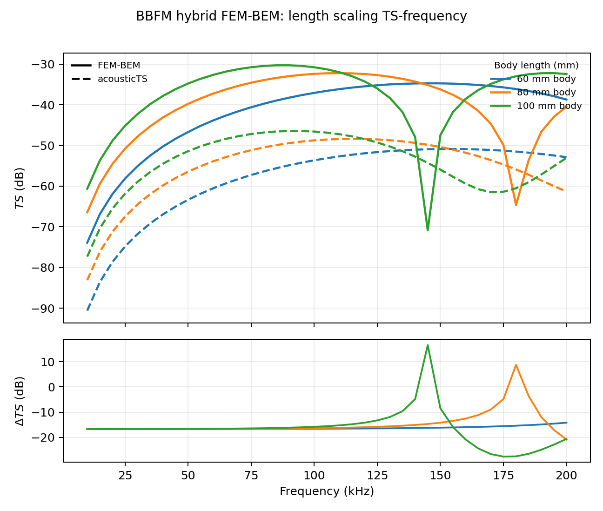
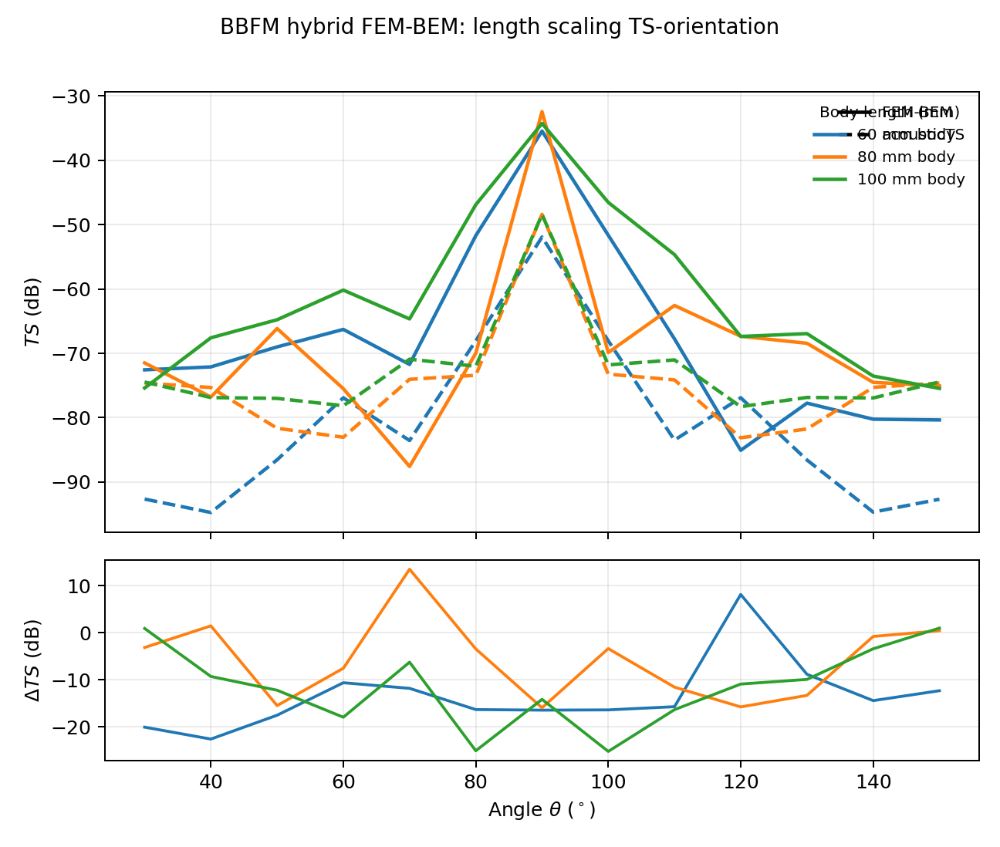
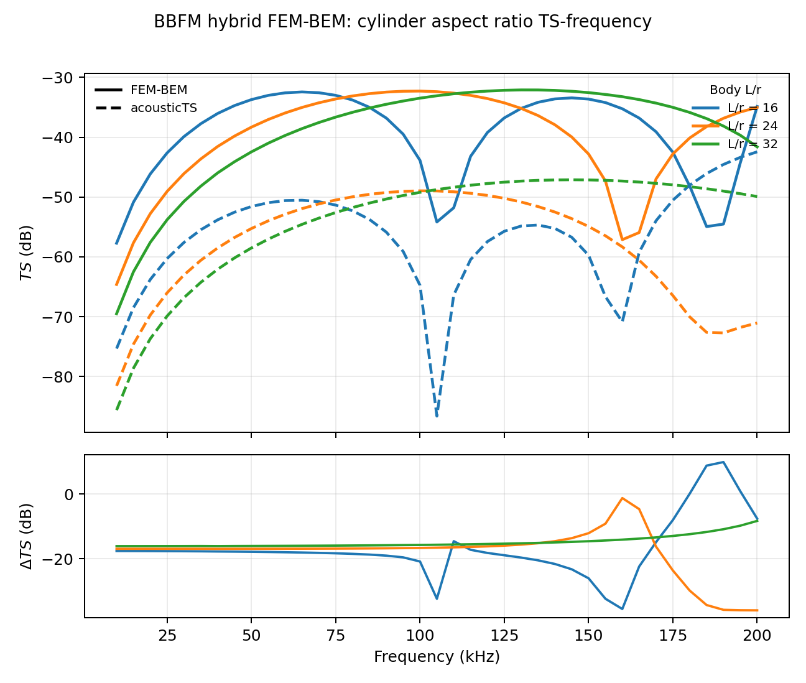
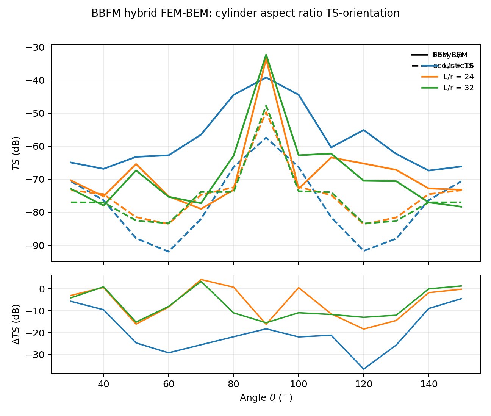
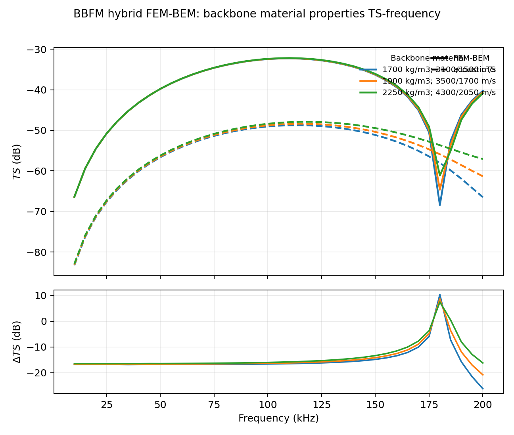
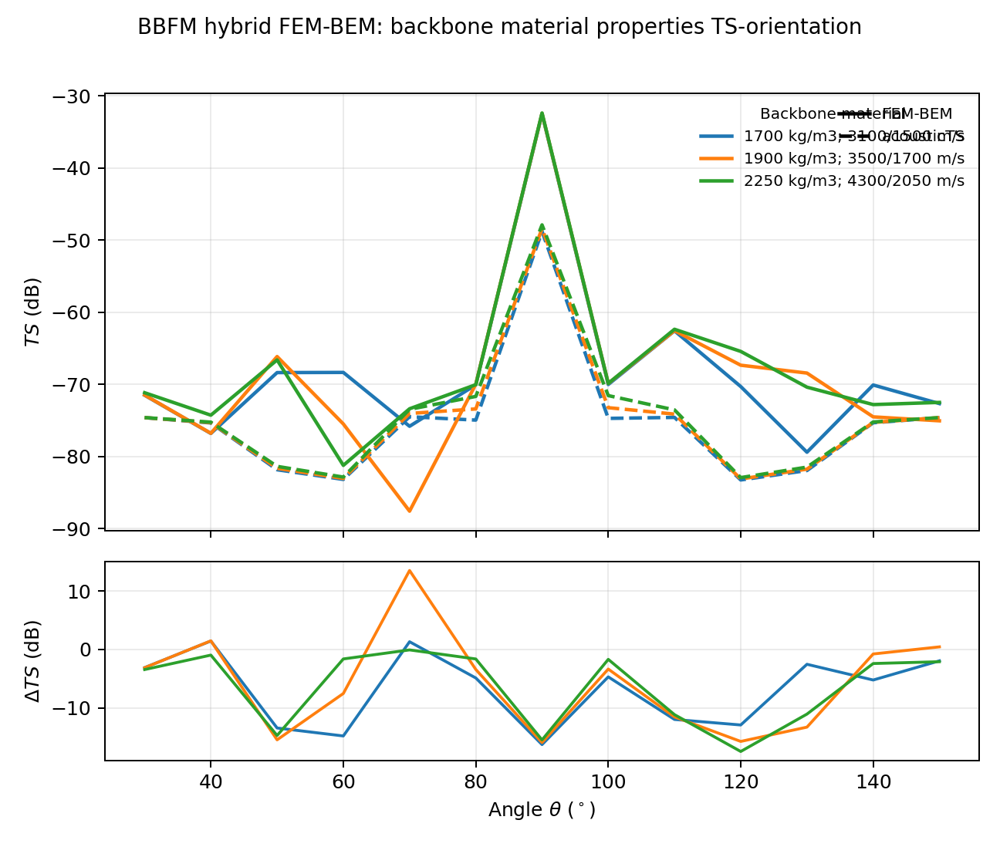
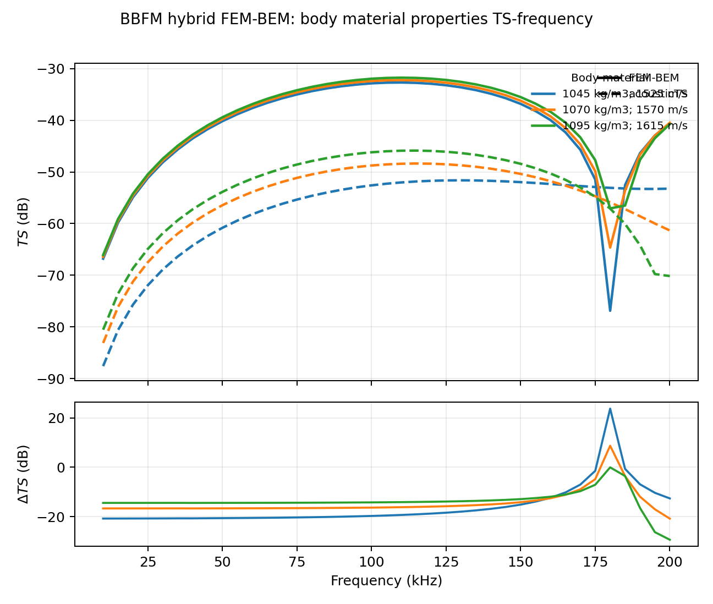
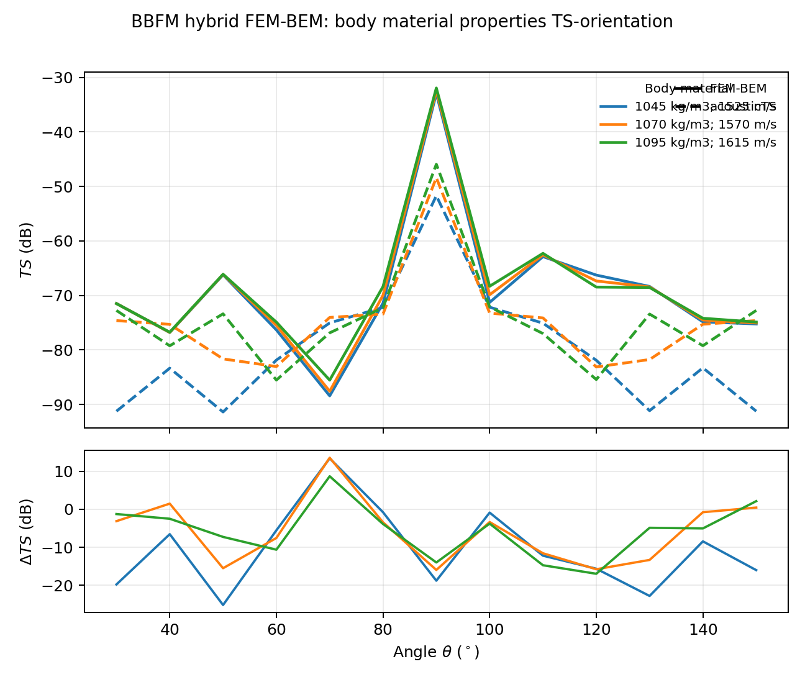
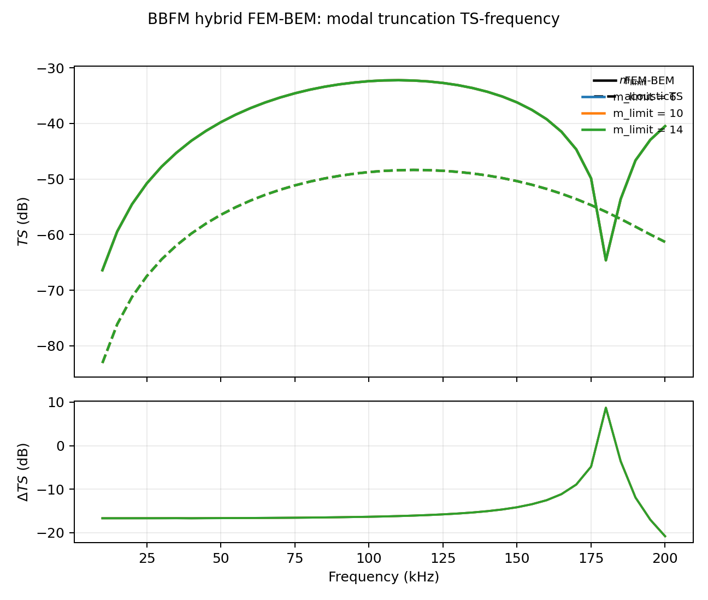
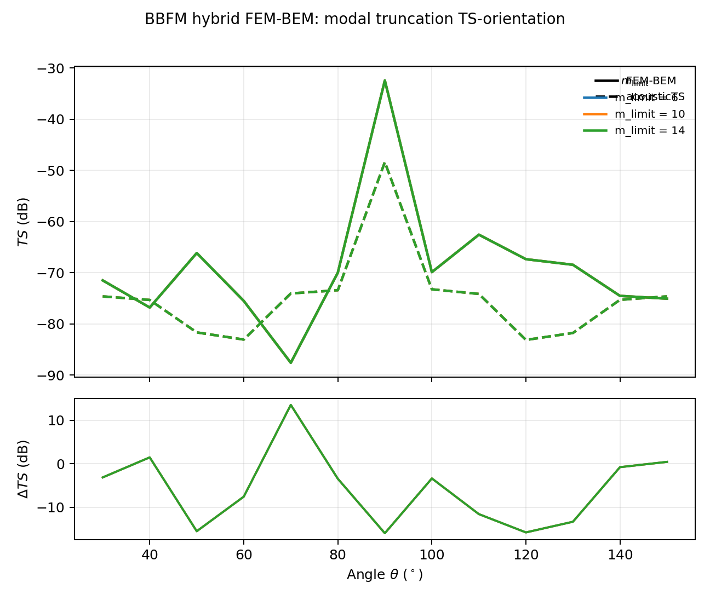

```{r setup, include=FALSE}
knitr::opts_chunk$set(collapse = TRUE, comment = "#>")
library(acousticTS)
```

```{r model_family_header, echo=FALSE, results='asis'}
acousticTS:::.model_family_header(
  family = "bbfm",
  pages = c(
    Overview = "index.html",
    Theory = "bbfm-theory.html",
    Implementation = "bbfm-implementation.html",
    Validation = "bbfm-validation.html"
  )
)
```

BBFM is compared with a hybrid FEM-BEM reference for the complete body-plus-backbone target. The flesh body is solved as an acoustic FEM region, the embedded backbone as an elastic FEM region, and the exterior field by BEM.

The signed residual is $\Delta \textit{TS}=\textit{TS}_\mathrm{acousticTS}-\textit{TS}_\mathrm{FEM-BEM}$.

::: {.warning data-title="Current BBFM behavior"}
The hybrid reference is consistently stronger than the BBFM prediction over most of this grid. The tables below report the residuals directly rather than reducing the evidence to a pass/fail flag.
:::

# Summary

| Scenario | Spectrum | Rows | Frequency (kHz) | Angle ($^\circ$) | Mean abs. $\Delta \textit{TS}$ (dB) | Max abs. $\Delta \textit{TS}$ (dB) |
| :-- | :-- | :-- | :-- | :-- | :-- | :-- |
| Length scaling | TS-frequency | 117 | 10-200 | 90-90 | 16.170 | 27.610 |
| Length scaling | TS-orientation | 39 | 120-120 | 30-150 | 11.535 | 25.242 |
| Cylinder aspect ratio | TS-frequency | 117 | 10-200 | 90-90 | 16.919 | 36.037 |
| Cylinder aspect ratio | TS-orientation | 39 | 120-120 | 30-150 | 11.700 | 36.599 |
| Backbone material properties | TS-frequency | 117 | 10-200 | 90-90 | 14.958 | 26.233 |
| Backbone material properties | TS-orientation | 39 | 120-120 | 30-150 | 7.294 | 17.489 |
| Body material properties | TS-frequency | 117 | 10-200 | 90-90 | 15.293 | 29.385 |
| Body material properties | TS-orientation | 39 | 120-120 | 30-150 | 9.418 | 25.164 |
| Modal truncation | TS-frequency | 117 | 10-200 | 90-90 | 14.962 | 20.827 |
| Modal truncation | TS-orientation | 39 | 120-120 | 30-150 | 8.137 | 15.952 |

# Length scaling

<details>
<summary>Hybrid FEM-BEM: length scaling - TS-frequency spectrum</summary>

```{r echo=FALSE, out.width='88%', fig.align='center', fig.alt='BBFM hybrid FEM-BEM length scaling TS-frequency spectrum.'}

```

| Frequency (kHz) | Angle ($^\circ$) | Body length (mm) | Body radius (mm) | Backbone length (mm) | Backbone radius (mm) | $\textit{TS}_\mathrm{FEM-BEM}$ | $\textit{TS}_\mathrm{acousticTS}$ | $\Delta \textit{TS}$ |
| :-- | :-- | :-- | :-- | :-- | :-- | :-- | :-- | :-- |
| 10 | 90 | 100 | 3.75 | 62.5 | 0.75 | -60.629 | -77.317 | -16.687 |
| 15 | 90 | 100 | 3.75 | 62.5 | 0.75 | -53.693 | -70.377 | -16.684 |
| 20 | 90 | 100 | 3.75 | 62.5 | 0.75 | -48.846 | -65.526 | -16.680 |
| 25 | 90 | 100 | 3.75 | 62.5 | 0.75 | -45.164 | -61.838 | -16.674 |
| 30 | 90 | 100 | 3.75 | 62.5 | 0.75 | -42.271 | -58.903 | -16.632 |
| 35 | 90 | 100 | 3.75 | 62.5 | 0.75 | -39.831 | -56.501 | -16.670 |
| 40 | 90 | 100 | 3.75 | 62.5 | 0.75 | -37.845 | -54.501 | -16.656 |
| 45 | 90 | 100 | 3.75 | 62.5 | 0.75 | -36.181 | -52.821 | -16.641 |
| 50 | 90 | 100 | 3.75 | 62.5 | 0.75 | -34.783 | -51.405 | -16.621 |
| 55 | 90 | 100 | 3.75 | 62.5 | 0.75 | -33.614 | -50.211 | -16.597 |
| 60 | 90 | 100 | 3.75 | 62.5 | 0.75 | -32.646 | -49.212 | -16.566 |
| 65 | 90 | 100 | 3.75 | 62.5 | 0.75 | -31.860 | -48.387 | -16.527 |
| 70 | 90 | 100 | 3.75 | 62.5 | 0.75 | -31.241 | -47.719 | -16.478 |
| 75 | 90 | 100 | 3.75 | 62.5 | 0.75 | -30.783 | -47.199 | -16.416 |
| 80 | 90 | 100 | 3.75 | 62.5 | 0.75 | -30.468 | -46.816 | -16.349 |
| 85 | 90 | 100 | 3.75 | 62.5 | 0.75 | -30.313 | -46.566 | -16.253 |
| 90 | 90 | 100 | 3.75 | 62.5 | 0.75 | -30.310 | -46.445 | -16.135 |
| 95 | 90 | 100 | 3.75 | 62.5 | 0.75 | -30.465 | -46.451 | -15.986 |
| 100 | 90 | 100 | 3.75 | 62.5 | 0.75 | -30.788 | -46.583 | -15.795 |
| 105 | 90 | 100 | 3.75 | 62.5 | 0.75 | -31.298 | -46.845 | -15.547 |
| 110 | 90 | 100 | 3.75 | 62.5 | 0.75 | -32.019 | -47.239 | -15.220 |
| 115 | 90 | 100 | 3.75 | 62.5 | 0.75 | -32.993 | -47.770 | -14.778 |
| 120 | 90 | 100 | 3.75 | 62.5 | 0.75 | -34.284 | -48.446 | -14.161 |
| 125 | 90 | 100 | 3.75 | 62.5 | 0.75 | -36.017 | -49.273 | -13.255 |
| 130 | 90 | 100 | 3.75 | 62.5 | 0.75 | -38.347 | -50.261 | -11.914 |
| 135 | 90 | 100 | 3.75 | 62.5 | 0.75 | -41.815 | -51.421 | -9.606 |
| 140 | 90 | 100 | 3.75 | 62.5 | 0.75 | -47.935 | -52.758 | -4.823 |
| 145 | 90 | 100 | 3.75 | 62.5 | 0.75 | -70.849 | -54.272 | 16.577 |
| 150 | 90 | 100 | 3.75 | 62.5 | 0.75 | -47.490 | -55.940 | -8.449 |
| 155 | 90 | 100 | 3.75 | 62.5 | 0.75 | -41.791 | -57.695 | -15.904 |
| 160 | 90 | 100 | 3.75 | 62.5 | 0.75 | -38.558 | -59.385 | -20.827 |
| 165 | 90 | 100 | 3.75 | 62.5 | 0.75 | -36.398 | -60.749 | -24.351 |
| 170 | 90 | 100 | 3.75 | 62.5 | 0.75 | -34.865 | -61.475 | -26.610 |
| 175 | 90 | 100 | 3.75 | 62.5 | 0.75 | -33.772 | -61.382 | -27.610 |
| 180 | 90 | 100 | 3.75 | 62.5 | 0.75 | -33.008 | -60.506 | -27.499 |
| 185 | 90 | 100 | 3.75 | 62.5 | 0.75 | -32.513 | -59.022 | -26.509 |
| 190 | 90 | 100 | 3.75 | 62.5 | 0.75 | -32.263 | -57.151 | -24.887 |
| 195 | 90 | 100 | 3.75 | 62.5 | 0.75 | -32.240 | -55.105 | -22.865 |
| 200 | 90 | 100 | 3.75 | 62.5 | 0.75 | -32.441 | -53.048 | -20.607 |
| 10 | 90 | 60 | 2.25 | 37.5 | 0.45 | -73.885 | -90.574 | -16.690 |
| 15 | 90 | 60 | 2.25 | 37.5 | 0.45 | -66.880 | -83.568 | -16.688 |
| 20 | 90 | 60 | 2.25 | 37.5 | 0.45 | -61.937 | -78.623 | -16.686 |
| 25 | 90 | 60 | 2.25 | 37.5 | 0.45 | -58.130 | -74.814 | -16.684 |
| 30 | 90 | 60 | 2.25 | 37.5 | 0.45 | -55.048 | -71.730 | -16.682 |
| 35 | 90 | 60 | 2.25 | 37.5 | 0.45 | -52.470 | -69.150 | -16.679 |
| 40 | 90 | 60 | 2.25 | 37.5 | 0.45 | -50.268 | -66.943 | -16.676 |
| 45 | 90 | 60 | 2.25 | 37.5 | 0.45 | -48.357 | -65.026 | -16.669 |
| 50 | 90 | 60 | 2.25 | 37.5 | 0.45 | -46.708 | -63.340 | -16.632 |
| 55 | 90 | 60 | 2.25 | 37.5 | 0.45 | -45.166 | -61.844 | -16.679 |
| 60 | 90 | 60 | 2.25 | 37.5 | 0.45 | -43.842 | -60.509 | -16.667 |
| 65 | 90 | 60 | 2.25 | 37.5 | 0.45 | -42.652 | -59.310 | -16.659 |
| 70 | 90 | 60 | 2.25 | 37.5 | 0.45 | -41.581 | -58.232 | -16.650 |
| 75 | 90 | 60 | 2.25 | 37.5 | 0.45 | -40.618 | -57.258 | -16.641 |
| 80 | 90 | 60 | 2.25 | 37.5 | 0.45 | -39.750 | -56.380 | -16.629 |
| 85 | 90 | 60 | 2.25 | 37.5 | 0.45 | -38.969 | -55.586 | -16.617 |
| 90 | 90 | 60 | 2.25 | 37.5 | 0.45 | -38.268 | -54.870 | -16.602 |
| 95 | 90 | 60 | 2.25 | 37.5 | 0.45 | -37.641 | -54.226 | -16.585 |
| 100 | 90 | 60 | 2.25 | 37.5 | 0.45 | -37.083 | -53.649 | -16.566 |
| 105 | 90 | 60 | 2.25 | 37.5 | 0.45 | -36.591 | -53.134 | -16.543 |
| 110 | 90 | 60 | 2.25 | 37.5 | 0.45 | -36.160 | -52.678 | -16.518 |
| 115 | 90 | 60 | 2.25 | 37.5 | 0.45 | -35.789 | -52.278 | -16.489 |
| 120 | 90 | 60 | 2.25 | 37.5 | 0.45 | -35.476 | -51.931 | -16.456 |
| 125 | 90 | 60 | 2.25 | 37.5 | 0.45 | -35.220 | -51.636 | -16.416 |
| 130 | 90 | 60 | 2.25 | 37.5 | 0.45 | -34.995 | -51.390 | -16.395 |
| 135 | 90 | 60 | 2.25 | 37.5 | 0.45 | -34.862 | -51.193 | -16.331 |
| 140 | 90 | 60 | 2.25 | 37.5 | 0.45 | -34.769 | -51.043 | -16.273 |
| 145 | 90 | 60 | 2.25 | 37.5 | 0.45 | -34.730 | -50.939 | -16.209 |
| 150 | 90 | 60 | 2.25 | 37.5 | 0.45 | -34.747 | -50.882 | -16.135 |
| 155 | 90 | 60 | 2.25 | 37.5 | 0.45 | -34.820 | -50.870 | -16.050 |
| 160 | 90 | 60 | 2.25 | 37.5 | 0.45 | -34.952 | -50.904 | -15.952 |
| 165 | 90 | 60 | 2.25 | 37.5 | 0.45 | -35.146 | -50.984 | -15.837 |
| 170 | 90 | 60 | 2.25 | 37.5 | 0.45 | -35.406 | -51.110 | -15.704 |
| 175 | 90 | 60 | 2.25 | 37.5 | 0.45 | -35.735 | -51.282 | -15.547 |
| 180 | 90 | 60 | 2.25 | 37.5 | 0.45 | -36.140 | -51.502 | -15.362 |
| 185 | 90 | 60 | 2.25 | 37.5 | 0.45 | -36.629 | -51.771 | -15.142 |
| 190 | 90 | 60 | 2.25 | 37.5 | 0.45 | -37.212 | -52.090 | -14.878 |
| 195 | 90 | 60 | 2.25 | 37.5 | 0.45 | -37.903 | -52.460 | -14.556 |
| 200 | 90 | 60 | 2.25 | 37.5 | 0.45 | -38.721 | -52.883 | -14.161 |
| 10 | 90 | 80 | 3 | 50 | 0.6 | -66.413 | -83.101 | -16.689 |
| 15 | 90 | 80 | 3 | 50 | 0.6 | -59.438 | -76.124 | -16.686 |
| 20 | 90 | 80 | 3 | 50 | 0.6 | -54.537 | -71.220 | -16.684 |
| 25 | 90 | 80 | 3 | 50 | 0.6 | -50.784 | -67.464 | -16.680 |
| 30 | 90 | 80 | 3 | 50 | 0.6 | -47.769 | -64.444 | -16.676 |
| 35 | 90 | 80 | 3 | 50 | 0.6 | -45.276 | -61.942 | -16.665 |
| 40 | 90 | 80 | 3 | 50 | 0.6 | -43.137 | -59.825 | -16.688 |
| 45 | 90 | 80 | 3 | 50 | 0.6 | -41.343 | -58.010 | -16.667 |
| 50 | 90 | 80 | 3 | 50 | 0.6 | -39.783 | -56.439 | -16.656 |
| 55 | 90 | 80 | 3 | 50 | 0.6 | -38.429 | -55.073 | -16.644 |
| 60 | 90 | 80 | 3 | 50 | 0.6 | -37.251 | -53.881 | -16.629 |
| 65 | 90 | 80 | 3 | 50 | 0.6 | -36.228 | -52.840 | -16.612 |
| 70 | 90 | 80 | 3 | 50 | 0.6 | -35.344 | -51.935 | -16.591 |
| 75 | 90 | 80 | 3 | 50 | 0.6 | -34.585 | -51.150 | -16.566 |
| 80 | 90 | 80 | 3 | 50 | 0.6 | -33.942 | -50.477 | -16.535 |
| 85 | 90 | 80 | 3 | 50 | 0.6 | -33.407 | -49.906 | -16.499 |
| 90 | 90 | 80 | 3 | 50 | 0.6 | -32.977 | -49.432 | -16.456 |
| 95 | 90 | 80 | 3 | 50 | 0.6 | -32.649 | -49.050 | -16.400 |
| 100 | 90 | 80 | 3 | 50 | 0.6 | -32.406 | -48.754 | -16.349 |
| 105 | 90 | 80 | 3 | 50 | 0.6 | -32.271 | -48.544 | -16.273 |
| 110 | 90 | 80 | 3 | 50 | 0.6 | -32.231 | -48.416 | -16.185 |
| 115 | 90 | 80 | 3 | 50 | 0.6 | -32.291 | -48.370 | -16.080 |
| 120 | 90 | 80 | 3 | 50 | 0.6 | -32.454 | -48.405 | -15.952 |
| 125 | 90 | 80 | 3 | 50 | 0.6 | -32.727 | -48.522 | -15.795 |
| 130 | 90 | 80 | 3 | 50 | 0.6 | -33.118 | -48.721 | -15.602 |
| 135 | 90 | 80 | 3 | 50 | 0.6 | -33.641 | -49.004 | -15.362 |
| 140 | 90 | 80 | 3 | 50 | 0.6 | -34.314 | -49.373 | -15.059 |
| 145 | 90 | 80 | 3 | 50 | 0.6 | -35.161 | -49.832 | -14.671 |
| 150 | 90 | 80 | 3 | 50 | 0.6 | -36.223 | -50.384 | -14.161 |
| 155 | 90 | 80 | 3 | 50 | 0.6 | -37.567 | -51.033 | -13.465 |
| 160 | 90 | 80 | 3 | 50 | 0.6 | -39.244 | -51.784 | -12.540 |
| 165 | 90 | 80 | 3 | 50 | 0.6 | -41.495 | -52.642 | -11.147 |
| 170 | 90 | 80 | 3 | 50 | 0.6 | -44.671 | -53.612 | -8.941 |
| 175 | 90 | 80 | 3 | 50 | 0.6 | -49.873 | -54.696 | -4.823 |
| 180 | 90 | 80 | 3 | 50 | 0.6 | -64.624 | -55.893 | 8.731 |
| 185 | 90 | 80 | 3 | 50 | 0.6 | -53.610 | -57.195 | -3.585 |
| 190 | 90 | 80 | 3 | 50 | 0.6 | -46.653 | -58.575 | -11.923 |
| 195 | 90 | 80 | 3 | 50 | 0.6 | -42.957 | -59.983 | -17.026 |
| 200 | 90 | 80 | 3 | 50 | 0.6 | -40.496 | -61.323 | -20.827 |

</details>

<details>
<summary>Hybrid FEM-BEM: length scaling - TS-orientation spectrum</summary>

```{r echo=FALSE, out.width='88%', fig.align='center', fig.alt='BBFM hybrid FEM-BEM length scaling TS-orientation spectrum.'}

```

| Frequency (kHz) | Angle ($^\circ$) | Body length (mm) | Body radius (mm) | Backbone length (mm) | Backbone radius (mm) | $\textit{TS}_\mathrm{FEM-BEM}$ | $\textit{TS}_\mathrm{acousticTS}$ | $\Delta \textit{TS}$ |
| :-- | :-- | :-- | :-- | :-- | :-- | :-- | :-- | :-- |
| 120 | 30 | 100 | 3.75 | 62.5 | 0.75 | -75.386 | -74.459 | 0.928 |
| 120 | 40 | 100 | 3.75 | 62.5 | 0.75 | -67.583 | -76.870 | -9.286 |
| 120 | 50 | 100 | 3.75 | 62.5 | 0.75 | -64.782 | -77.000 | -12.218 |
| 120 | 60 | 100 | 3.75 | 62.5 | 0.75 | -60.179 | -78.142 | -17.963 |
| 120 | 70 | 100 | 3.75 | 62.5 | 0.75 | -64.655 | -70.905 | -6.250 |
| 120 | 80 | 100 | 3.75 | 62.5 | 0.75 | -46.907 | -72.009 | -25.102 |
| 120 | 90 | 100 | 3.75 | 62.5 | 0.75 | -34.284 | -48.446 | -14.161 |
| 120 | 100 | 100 | 3.75 | 62.5 | 0.75 | -46.550 | -71.792 | -25.242 |
| 120 | 110 | 100 | 3.75 | 62.5 | 0.75 | -54.665 | -71.022 | -16.358 |
| 120 | 120 | 100 | 3.75 | 62.5 | 0.75 | -67.377 | -78.283 | -10.907 |
| 120 | 130 | 100 | 3.75 | 62.5 | 0.75 | -66.936 | -76.852 | -9.916 |
| 120 | 140 | 100 | 3.75 | 62.5 | 0.75 | -73.530 | -76.932 | -3.402 |
| 120 | 150 | 100 | 3.75 | 62.5 | 0.75 | -75.452 | -74.450 | 1.001 |
| 120 | 30 | 60 | 2.25 | 37.5 | 0.45 | -72.564 | -92.642 | -20.079 |
| 120 | 40 | 60 | 2.25 | 37.5 | 0.45 | -72.108 | -94.723 | -22.616 |
| 120 | 50 | 60 | 2.25 | 37.5 | 0.45 | -69.000 | -86.541 | -17.541 |
| 120 | 60 | 60 | 2.25 | 37.5 | 0.45 | -66.282 | -76.906 | -10.624 |
| 120 | 70 | 60 | 2.25 | 37.5 | 0.45 | -71.722 | -83.540 | -11.818 |
| 120 | 80 | 60 | 2.25 | 37.5 | 0.45 | -51.713 | -68.049 | -16.336 |
| 120 | 90 | 60 | 2.25 | 37.5 | 0.45 | -35.476 | -51.931 | -16.456 |
| 120 | 100 | 60 | 2.25 | 37.5 | 0.45 | -51.652 | -68.056 | -16.403 |
| 120 | 110 | 60 | 2.25 | 37.5 | 0.45 | -67.756 | -83.476 | -15.721 |
| 120 | 120 | 60 | 2.25 | 37.5 | 0.45 | -85.062 | -76.897 | 8.165 |
| 120 | 130 | 60 | 2.25 | 37.5 | 0.45 | -77.737 | -86.566 | -8.829 |
| 120 | 140 | 60 | 2.25 | 37.5 | 0.45 | -80.232 | -94.665 | -14.433 |
| 120 | 150 | 60 | 2.25 | 37.5 | 0.45 | -80.346 | -92.665 | -12.319 |
| 120 | 30 | 80 | 3 | 50 | 0.6 | -71.486 | -74.613 | -3.127 |
| 120 | 40 | 80 | 3 | 50 | 0.6 | -76.784 | -75.304 | 1.480 |
| 120 | 50 | 80 | 3 | 50 | 0.6 | -66.148 | -81.641 | -15.492 |
| 120 | 60 | 80 | 3 | 50 | 0.6 | -75.492 | -83.039 | -7.547 |
| 120 | 70 | 80 | 3 | 50 | 0.6 | -87.575 | -74.036 | 13.539 |
| 120 | 80 | 80 | 3 | 50 | 0.6 | -69.979 | -73.409 | -3.430 |
| 120 | 90 | 80 | 3 | 50 | 0.6 | -32.454 | -48.405 | -15.952 |
| 120 | 100 | 80 | 3 | 50 | 0.6 | -69.875 | -73.234 | -3.360 |
| 120 | 110 | 80 | 3 | 50 | 0.6 | -62.562 | -74.126 | -11.564 |
| 120 | 120 | 80 | 3 | 50 | 0.6 | -67.348 | -83.114 | -15.765 |
| 120 | 130 | 80 | 3 | 50 | 0.6 | -68.438 | -81.752 | -13.314 |
| 120 | 140 | 80 | 3 | 50 | 0.6 | -74.508 | -75.280 | -0.772 |
| 120 | 150 | 80 | 3 | 50 | 0.6 | -75.056 | -74.612 | 0.445 |

</details>

# Cylinder aspect ratio

<details>
<summary>Hybrid FEM-BEM: cylinder aspect ratio - TS-frequency spectrum</summary>

```{r echo=FALSE, out.width='88%', fig.align='center', fig.alt='BBFM hybrid FEM-BEM cylinder aspect ratio TS-frequency spectrum.'}

```

| Frequency (kHz) | Angle ($^\circ$) | Body length (mm) | Body radius (mm) | Body L/r | Backbone length (mm) | Backbone radius (mm) | $\textit{TS}_\mathrm{FEM-BEM}$ | $\textit{TS}_\mathrm{acousticTS}$ | $\Delta \textit{TS}$ |
| :-- | :-- | :-- | :-- | :-- | :-- | :-- | :-- | :-- | :-- |
| 10 | 90 | 80 | 5 | 16 | 50 | 0.6 | -57.720 | -75.338 | -17.617 |
| 15 | 90 | 80 | 5 | 16 | 50 | 0.6 | -50.871 | -68.499 | -17.628 |
| 20 | 90 | 80 | 5 | 16 | 50 | 0.6 | -46.145 | -63.790 | -17.645 |
| 25 | 90 | 80 | 5 | 16 | 50 | 0.6 | -42.622 | -60.290 | -17.668 |
| 30 | 90 | 80 | 5 | 16 | 50 | 0.6 | -39.893 | -57.589 | -17.696 |
| 35 | 90 | 80 | 5 | 16 | 50 | 0.6 | -37.745 | -55.472 | -17.727 |
| 40 | 90 | 80 | 5 | 16 | 50 | 0.6 | -36.033 | -53.813 | -17.780 |
| 45 | 90 | 80 | 5 | 16 | 50 | 0.6 | -34.715 | -52.536 | -17.821 |
| 50 | 90 | 80 | 5 | 16 | 50 | 0.6 | -33.717 | -51.592 | -17.875 |
| 55 | 90 | 80 | 5 | 16 | 50 | 0.6 | -33.014 | -50.953 | -17.939 |
| 60 | 90 | 80 | 5 | 16 | 50 | 0.6 | -32.589 | -50.603 | -18.014 |
| 65 | 90 | 80 | 5 | 16 | 50 | 0.6 | -32.439 | -50.541 | -18.103 |
| 70 | 90 | 80 | 5 | 16 | 50 | 0.6 | -32.571 | -50.781 | -18.210 |
| 75 | 90 | 80 | 5 | 16 | 50 | 0.6 | -33.008 | -51.351 | -18.343 |
| 80 | 90 | 80 | 5 | 16 | 50 | 0.6 | -33.795 | -52.307 | -18.513 |
| 85 | 90 | 80 | 5 | 16 | 50 | 0.6 | -35.010 | -53.749 | -18.739 |
| 90 | 90 | 80 | 5 | 16 | 50 | 0.6 | -36.804 | -55.869 | -19.065 |
| 95 | 90 | 80 | 5 | 16 | 50 | 0.6 | -39.498 | -59.099 | -19.601 |
| 100 | 90 | 80 | 5 | 16 | 50 | 0.6 | -43.883 | -64.766 | -20.883 |
| 105 | 90 | 80 | 5 | 16 | 50 | 0.6 | -54.177 | -86.626 | -32.449 |
| 110 | 90 | 80 | 5 | 16 | 50 | 0.6 | -51.803 | -66.387 | -14.585 |
| 115 | 90 | 80 | 5 | 16 | 50 | 0.6 | -43.206 | -60.463 | -17.257 |
| 120 | 90 | 80 | 5 | 16 | 50 | 0.6 | -39.215 | -57.446 | -18.231 |
| 125 | 90 | 80 | 5 | 16 | 50 | 0.6 | -36.776 | -55.725 | -18.949 |
| 130 | 90 | 80 | 5 | 16 | 50 | 0.6 | -35.185 | -54.854 | -19.669 |
| 135 | 90 | 80 | 5 | 16 | 50 | 0.6 | -34.169 | -54.690 | -20.521 |
| 140 | 90 | 80 | 5 | 16 | 50 | 0.6 | -33.604 | -55.252 | -21.648 |
| 145 | 90 | 80 | 5 | 16 | 50 | 0.6 | -33.432 | -56.735 | -23.303 |
| 150 | 90 | 80 | 5 | 16 | 50 | 0.6 | -33.633 | -59.733 | -26.100 |
| 155 | 90 | 80 | 5 | 16 | 50 | 0.6 | -34.215 | -66.662 | -32.447 |
| 160 | 90 | 80 | 5 | 16 | 50 | 0.6 | -35.253 | -70.872 | -35.620 |
| 165 | 90 | 80 | 5 | 16 | 50 | 0.6 | -36.809 | -59.242 | -22.432 |
| 170 | 90 | 80 | 5 | 16 | 50 | 0.6 | -39.094 | -53.971 | -14.877 |
| 175 | 90 | 80 | 5 | 16 | 50 | 0.6 | -42.515 | -50.532 | -8.017 |
| 180 | 90 | 80 | 5 | 16 | 50 | 0.6 | -48.185 | -48.015 | 0.170 |
| 185 | 90 | 80 | 5 | 16 | 50 | 0.6 | -54.944 | -46.080 | 8.865 |
| 190 | 90 | 80 | 5 | 16 | 50 | 0.6 | -54.527 | -44.562 | 9.965 |
| 195 | 90 | 80 | 5 | 16 | 50 | 0.6 | -44.275 | -43.370 | 0.905 |
| 200 | 90 | 80 | 5 | 16 | 50 | 0.6 | -34.869 | -42.449 | -7.580 |
| 10 | 90 | 80 | 3.333 | 24 | 50 | 0.6 | -64.619 | -81.570 | -16.951 |
| 15 | 90 | 80 | 3.333 | 24 | 50 | 0.6 | -57.661 | -74.611 | -16.950 |
| 20 | 90 | 80 | 3.333 | 24 | 50 | 0.6 | -52.783 | -69.732 | -16.949 |
| 25 | 90 | 80 | 3.333 | 24 | 50 | 0.6 | -49.060 | -66.008 | -16.949 |
| 30 | 90 | 80 | 3.333 | 24 | 50 | 0.6 | -46.081 | -63.029 | -16.947 |
| 35 | 90 | 80 | 3.333 | 24 | 50 | 0.6 | -43.632 | -60.574 | -16.942 |
| 40 | 90 | 80 | 3.333 | 24 | 50 | 0.6 | -41.549 | -58.513 | -16.964 |
| 45 | 90 | 80 | 3.333 | 24 | 50 | 0.6 | -39.813 | -56.763 | -16.950 |
| 50 | 90 | 80 | 3.333 | 24 | 50 | 0.6 | -38.321 | -55.266 | -16.944 |
| 55 | 90 | 80 | 3.333 | 24 | 50 | 0.6 | -37.044 | -53.982 | -16.938 |
| 60 | 90 | 80 | 3.333 | 24 | 50 | 0.6 | -35.954 | -52.882 | -16.929 |
| 65 | 90 | 80 | 3.333 | 24 | 50 | 0.6 | -35.028 | -51.946 | -16.917 |
| 70 | 90 | 80 | 3.333 | 24 | 50 | 0.6 | -34.252 | -51.155 | -16.902 |
| 75 | 90 | 80 | 3.333 | 24 | 50 | 0.6 | -33.615 | -50.498 | -16.883 |
| 80 | 90 | 80 | 3.333 | 24 | 50 | 0.6 | -33.107 | -49.965 | -16.858 |
| 85 | 90 | 80 | 3.333 | 24 | 50 | 0.6 | -32.724 | -49.551 | -16.826 |
| 90 | 90 | 80 | 3.333 | 24 | 50 | 0.6 | -32.463 | -49.249 | -16.786 |
| 95 | 90 | 80 | 3.333 | 24 | 50 | 0.6 | -32.324 | -49.056 | -16.732 |
| 100 | 90 | 80 | 3.333 | 24 | 50 | 0.6 | -32.294 | -48.972 | -16.678 |
| 105 | 90 | 80 | 3.333 | 24 | 50 | 0.6 | -32.400 | -48.995 | -16.595 |
| 110 | 90 | 80 | 3.333 | 24 | 50 | 0.6 | -32.636 | -49.128 | -16.492 |
| 115 | 90 | 80 | 3.333 | 24 | 50 | 0.6 | -33.014 | -49.373 | -16.359 |
| 120 | 90 | 80 | 3.333 | 24 | 50 | 0.6 | -33.548 | -49.734 | -16.186 |
| 125 | 90 | 80 | 3.333 | 24 | 50 | 0.6 | -34.263 | -50.218 | -15.956 |
| 130 | 90 | 80 | 3.333 | 24 | 50 | 0.6 | -35.190 | -50.835 | -15.645 |
| 135 | 90 | 80 | 3.333 | 24 | 50 | 0.6 | -36.383 | -51.596 | -15.213 |
| 140 | 90 | 80 | 3.333 | 24 | 50 | 0.6 | -37.925 | -52.516 | -14.591 |
| 145 | 90 | 80 | 3.333 | 24 | 50 | 0.6 | -39.968 | -53.617 | -13.649 |
| 150 | 90 | 80 | 3.333 | 24 | 50 | 0.6 | -42.823 | -54.927 | -12.104 |
| 155 | 90 | 80 | 3.333 | 24 | 50 | 0.6 | -47.330 | -56.484 | -9.153 |
| 160 | 90 | 80 | 3.333 | 24 | 50 | 0.6 | -57.133 | -58.339 | -1.206 |
| 165 | 90 | 80 | 3.333 | 24 | 50 | 0.6 | -55.942 | -60.565 | -4.623 |
| 170 | 90 | 80 | 3.333 | 24 | 50 | 0.6 | -46.984 | -63.252 | -16.268 |
| 175 | 90 | 80 | 3.333 | 24 | 50 | 0.6 | -42.796 | -66.476 | -23.680 |
| 180 | 90 | 80 | 3.333 | 24 | 50 | 0.6 | -40.126 | -70.042 | -29.916 |
| 185 | 90 | 80 | 3.333 | 24 | 50 | 0.6 | -38.237 | -72.628 | -34.392 |
| 190 | 90 | 80 | 3.333 | 24 | 50 | 0.6 | -36.841 | -72.719 | -35.878 |
| 195 | 90 | 80 | 3.333 | 24 | 50 | 0.6 | -35.796 | -71.796 | -36.000 |
| 200 | 90 | 80 | 3.333 | 24 | 50 | 0.6 | -35.026 | -71.063 | -36.037 |
| 10 | 90 | 80 | 2.5 | 32 | 50 | 0.6 | -69.508 | -85.624 | -16.116 |
| 15 | 90 | 80 | 2.5 | 32 | 50 | 0.6 | -62.512 | -78.624 | -16.112 |
| 20 | 90 | 80 | 2.5 | 32 | 50 | 0.6 | -57.581 | -73.689 | -16.108 |
| 25 | 90 | 80 | 2.5 | 32 | 50 | 0.6 | -53.790 | -69.892 | -16.102 |
| 30 | 90 | 80 | 2.5 | 32 | 50 | 0.6 | -50.728 | -66.821 | -16.093 |
| 35 | 90 | 80 | 2.5 | 32 | 50 | 0.6 | -48.181 | -64.258 | -16.078 |
| 40 | 90 | 80 | 2.5 | 32 | 50 | 0.6 | -45.964 | -62.072 | -16.107 |
| 45 | 90 | 80 | 2.5 | 32 | 50 | 0.6 | -44.099 | -60.176 | -16.077 |
| 50 | 90 | 80 | 2.5 | 32 | 50 | 0.6 | -42.454 | -58.515 | -16.061 |
| 55 | 90 | 80 | 2.5 | 32 | 50 | 0.6 | -41.002 | -57.047 | -16.045 |
| 60 | 90 | 80 | 2.5 | 32 | 50 | 0.6 | -39.715 | -55.741 | -16.026 |
| 65 | 90 | 80 | 2.5 | 32 | 50 | 0.6 | -38.571 | -54.576 | -16.005 |
| 70 | 90 | 80 | 2.5 | 32 | 50 | 0.6 | -37.552 | -53.533 | -15.980 |
| 75 | 90 | 80 | 2.5 | 32 | 50 | 0.6 | -36.645 | -52.598 | -15.952 |
| 80 | 90 | 80 | 2.5 | 32 | 50 | 0.6 | -35.840 | -51.760 | -15.920 |
| 85 | 90 | 80 | 2.5 | 32 | 50 | 0.6 | -35.127 | -51.011 | -15.884 |
| 90 | 90 | 80 | 2.5 | 32 | 50 | 0.6 | -34.500 | -50.342 | -15.842 |
| 95 | 90 | 80 | 2.5 | 32 | 50 | 0.6 | -33.957 | -49.747 | -15.790 |
| 100 | 90 | 80 | 2.5 | 32 | 50 | 0.6 | -33.475 | -49.223 | -15.748 |
| 105 | 90 | 80 | 2.5 | 32 | 50 | 0.6 | -33.078 | -48.764 | -15.686 |
| 110 | 90 | 80 | 2.5 | 32 | 50 | 0.6 | -32.749 | -48.366 | -15.617 |
| 115 | 90 | 80 | 2.5 | 32 | 50 | 0.6 | -32.488 | -48.028 | -15.540 |
| 120 | 90 | 80 | 2.5 | 32 | 50 | 0.6 | -32.293 | -47.746 | -15.453 |
| 125 | 90 | 80 | 2.5 | 32 | 50 | 0.6 | -32.164 | -47.518 | -15.354 |
| 130 | 90 | 80 | 2.5 | 32 | 50 | 0.6 | -32.102 | -47.343 | -15.240 |
| 135 | 90 | 80 | 2.5 | 32 | 50 | 0.6 | -32.108 | -47.219 | -15.111 |
| 140 | 90 | 80 | 2.5 | 32 | 50 | 0.6 | -32.182 | -47.145 | -14.963 |
| 145 | 90 | 80 | 2.5 | 32 | 50 | 0.6 | -32.329 | -47.121 | -14.792 |
| 150 | 90 | 80 | 2.5 | 32 | 50 | 0.6 | -32.550 | -47.145 | -14.594 |
| 155 | 90 | 80 | 2.5 | 32 | 50 | 0.6 | -32.859 | -47.216 | -14.358 |
| 160 | 90 | 80 | 2.5 | 32 | 50 | 0.6 | -33.233 | -47.335 | -14.102 |
| 165 | 90 | 80 | 2.5 | 32 | 50 | 0.6 | -33.717 | -47.501 | -13.784 |
| 170 | 90 | 80 | 2.5 | 32 | 50 | 0.6 | -34.306 | -47.713 | -13.407 |
| 175 | 90 | 80 | 2.5 | 32 | 50 | 0.6 | -35.016 | -47.971 | -12.955 |
| 180 | 90 | 80 | 2.5 | 32 | 50 | 0.6 | -35.869 | -48.275 | -12.405 |
| 185 | 90 | 80 | 2.5 | 32 | 50 | 0.6 | -36.896 | -48.623 | -11.727 |
| 190 | 90 | 80 | 2.5 | 32 | 50 | 0.6 | -38.142 | -49.014 | -10.872 |
| 195 | 90 | 80 | 2.5 | 32 | 50 | 0.6 | -39.678 | -49.447 | -9.769 |
| 200 | 90 | 80 | 2.5 | 32 | 50 | 0.6 | -41.626 | -49.918 | -8.293 |

</details>

<details>
<summary>Hybrid FEM-BEM: cylinder aspect ratio - TS-orientation spectrum</summary>

```{r echo=FALSE, out.width='88%', fig.align='center', fig.alt='BBFM hybrid FEM-BEM cylinder aspect ratio TS-orientation spectrum.'}

```

| Frequency (kHz) | Angle ($^\circ$) | Body length (mm) | Body radius (mm) | Body L/r | Backbone length (mm) | Backbone radius (mm) | $\textit{TS}_\mathrm{FEM-BEM}$ | $\textit{TS}_\mathrm{acousticTS}$ | $\Delta \textit{TS}$ |
| :-- | :-- | :-- | :-- | :-- | :-- | :-- | :-- | :-- | :-- |
| 120 | 30 | 80 | 5 | 16 | 50 | 0.6 | -64.969 | -70.665 | -5.696 |
| 120 | 40 | 80 | 5 | 16 | 50 | 0.6 | -66.878 | -76.387 | -9.509 |
| 120 | 50 | 80 | 5 | 16 | 50 | 0.6 | -63.243 | -87.917 | -24.674 |
| 120 | 60 | 80 | 5 | 16 | 50 | 0.6 | -62.777 | -91.964 | -29.187 |
| 120 | 70 | 80 | 5 | 16 | 50 | 0.6 | -56.506 | -82.018 | -25.511 |
| 120 | 80 | 80 | 5 | 16 | 50 | 0.6 | -44.473 | -66.330 | -21.857 |
| 120 | 90 | 80 | 5 | 16 | 50 | 0.6 | -39.215 | -57.446 | -18.231 |
| 120 | 100 | 80 | 5 | 16 | 50 | 0.6 | -44.443 | -66.372 | -21.929 |
| 120 | 110 | 80 | 5 | 16 | 50 | 0.6 | -60.382 | -81.545 | -21.163 |
| 120 | 120 | 80 | 5 | 16 | 50 | 0.6 | -55.131 | -91.730 | -36.599 |
| 120 | 130 | 80 | 5 | 16 | 50 | 0.6 | -62.357 | -88.006 | -25.649 |
| 120 | 140 | 80 | 5 | 16 | 50 | 0.6 | -67.407 | -76.360 | -8.953 |
| 120 | 150 | 80 | 5 | 16 | 50 | 0.6 | -66.179 | -70.664 | -4.486 |
| 120 | 30 | 80 | 3.333 | 24 | 50 | 0.6 | -70.404 | -73.378 | -2.974 |
| 120 | 40 | 80 | 3.333 | 24 | 50 | 0.6 | -75.216 | -74.569 | 0.647 |
| 120 | 50 | 80 | 3.333 | 24 | 50 | 0.6 | -65.430 | -81.518 | -16.089 |
| 120 | 60 | 80 | 3.333 | 24 | 50 | 0.6 | -75.215 | -83.542 | -8.326 |
| 120 | 70 | 80 | 3.333 | 24 | 50 | 0.6 | -79.021 | -74.748 | 4.273 |
| 120 | 80 | 80 | 3.333 | 24 | 50 | 0.6 | -73.251 | -72.488 | 0.763 |
| 120 | 90 | 80 | 3.333 | 24 | 50 | 0.6 | -33.548 | -49.734 | -16.186 |
| 120 | 100 | 80 | 3.333 | 24 | 50 | 0.6 | -72.924 | -72.377 | 0.548 |
| 120 | 110 | 80 | 3.333 | 24 | 50 | 0.6 | -63.434 | -74.838 | -11.404 |
| 120 | 120 | 80 | 3.333 | 24 | 50 | 0.6 | -65.268 | -83.620 | -18.352 |
| 120 | 130 | 80 | 3.333 | 24 | 50 | 0.6 | -67.196 | -81.629 | -14.433 |
| 120 | 140 | 80 | 3.333 | 24 | 50 | 0.6 | -72.822 | -74.547 | -1.725 |
| 120 | 150 | 80 | 3.333 | 24 | 50 | 0.6 | -73.211 | -73.376 | -0.165 |
| 120 | 30 | 80 | 2.5 | 32 | 50 | 0.6 | -72.961 | -77.019 | -4.058 |
| 120 | 40 | 80 | 2.5 | 32 | 50 | 0.6 | -77.997 | -77.057 | 0.939 |
| 120 | 50 | 80 | 2.5 | 32 | 50 | 0.6 | -67.356 | -82.530 | -15.174 |
| 120 | 60 | 80 | 2.5 | 32 | 50 | 0.6 | -75.358 | -83.385 | -8.028 |
| 120 | 70 | 80 | 2.5 | 32 | 50 | 0.6 | -77.285 | -73.862 | 3.423 |
| 120 | 80 | 80 | 2.5 | 32 | 50 | 0.6 | -62.908 | -73.883 | -10.976 |
| 120 | 90 | 80 | 2.5 | 32 | 50 | 0.6 | -32.293 | -47.746 | -15.453 |
| 120 | 100 | 80 | 2.5 | 32 | 50 | 0.6 | -62.769 | -73.669 | -10.899 |
| 120 | 110 | 80 | 2.5 | 32 | 50 | 0.6 | -62.268 | -73.952 | -11.684 |
| 120 | 120 | 80 | 2.5 | 32 | 50 | 0.6 | -70.489 | -83.462 | -12.974 |
| 120 | 130 | 80 | 2.5 | 32 | 50 | 0.6 | -70.628 | -82.650 | -12.022 |
| 120 | 140 | 80 | 2.5 | 32 | 50 | 0.6 | -77.035 | -77.029 | 0.007 |
| 120 | 150 | 80 | 2.5 | 32 | 50 | 0.6 | -78.357 | -77.018 | 1.339 |

</details>

# Backbone material properties

<details>
<summary>Hybrid FEM-BEM: backbone material properties - TS-frequency spectrum</summary>

```{r echo=FALSE, out.width='88%', fig.align='center', fig.alt='BBFM hybrid FEM-BEM backbone material properties TS-frequency spectrum.'}

```

| Frequency (kHz) | Angle ($^\circ$) | Backbone density (kg m$^{-3}$) | $c_L$ (m s$^{-1}$) | $c_T$ (m s$^{-1}$) | $\textit{TS}_\mathrm{FEM-BEM}$ | $\textit{TS}_\mathrm{acousticTS}$ | $\Delta \textit{TS}$ |
| :-- | :-- | :-- | :-- | :-- | :-- | :-- | :-- |
| 10 | 90 | 1700 | 3100 | 1500 | -66.429 | -83.260 | -16.832 |
| 15 | 90 | 1700 | 3100 | 1500 | -59.454 | -76.284 | -16.830 |
| 20 | 90 | 1700 | 3100 | 1500 | -54.553 | -71.382 | -16.829 |
| 25 | 90 | 1700 | 3100 | 1500 | -50.802 | -67.628 | -16.826 |
| 30 | 90 | 1700 | 3100 | 1500 | -47.791 | -64.611 | -16.819 |
| 35 | 90 | 1700 | 3100 | 1500 | -45.252 | -62.111 | -16.860 |
| 40 | 90 | 1700 | 3100 | 1500 | -43.166 | -59.998 | -16.832 |
| 45 | 90 | 1700 | 3100 | 1500 | -41.362 | -58.187 | -16.826 |
| 50 | 90 | 1700 | 3100 | 1500 | -39.802 | -56.622 | -16.820 |
| 55 | 90 | 1700 | 3100 | 1500 | -38.448 | -55.261 | -16.813 |
| 60 | 90 | 1700 | 3100 | 1500 | -37.271 | -54.076 | -16.804 |
| 65 | 90 | 1700 | 3100 | 1500 | -36.249 | -53.043 | -16.794 |
| 70 | 90 | 1700 | 3100 | 1500 | -35.365 | -52.145 | -16.780 |
| 75 | 90 | 1700 | 3100 | 1500 | -34.608 | -51.371 | -16.763 |
| 80 | 90 | 1700 | 3100 | 1500 | -33.967 | -50.708 | -16.742 |
| 85 | 90 | 1700 | 3100 | 1500 | -33.453 | -50.150 | -16.698 |
| 90 | 90 | 1700 | 3100 | 1500 | -32.999 | -49.690 | -16.691 |
| 95 | 90 | 1700 | 3100 | 1500 | -32.671 | -49.324 | -16.653 |
| 100 | 90 | 1700 | 3100 | 1500 | -32.440 | -49.047 | -16.607 |
| 105 | 90 | 1700 | 3100 | 1500 | -32.305 | -48.858 | -16.553 |
| 110 | 90 | 1700 | 3100 | 1500 | -32.268 | -48.754 | -16.487 |
| 115 | 90 | 1700 | 3100 | 1500 | -32.331 | -48.736 | -16.406 |
| 120 | 90 | 1700 | 3100 | 1500 | -32.498 | -48.804 | -16.306 |
| 125 | 90 | 1700 | 3100 | 1500 | -32.776 | -48.959 | -16.183 |
| 130 | 90 | 1700 | 3100 | 1500 | -33.174 | -49.203 | -16.029 |
| 135 | 90 | 1700 | 3100 | 1500 | -33.708 | -49.539 | -15.832 |
| 140 | 90 | 1700 | 3100 | 1500 | -34.378 | -49.973 | -15.595 |
| 145 | 90 | 1700 | 3100 | 1500 | -35.242 | -50.508 | -15.266 |
| 150 | 90 | 1700 | 3100 | 1500 | -36.319 | -51.154 | -14.834 |
| 155 | 90 | 1700 | 3100 | 1500 | -37.675 | -51.918 | -14.243 |
| 160 | 90 | 1700 | 3100 | 1500 | -39.411 | -52.813 | -13.402 |
| 165 | 90 | 1700 | 3100 | 1500 | -41.717 | -53.853 | -12.136 |
| 170 | 90 | 1700 | 3100 | 1500 | -45.008 | -55.055 | -10.047 |
| 175 | 90 | 1700 | 3100 | 1500 | -50.522 | -56.442 | -5.919 |
| 180 | 90 | 1700 | 3100 | 1500 | -68.429 | -58.037 | 10.392 |
| 185 | 90 | 1700 | 3100 | 1500 | -52.605 | -59.864 | -7.259 |
| 190 | 90 | 1700 | 3100 | 1500 | -46.159 | -61.935 | -15.776 |
| 195 | 90 | 1700 | 3100 | 1500 | -42.647 | -64.206 | -21.559 |
| 200 | 90 | 1700 | 3100 | 1500 | -40.245 | -66.478 | -26.233 |
| 10 | 90 | 1900 | 3500 | 1700 | -66.413 | -83.101 | -16.689 |
| 15 | 90 | 1900 | 3500 | 1700 | -59.438 | -76.124 | -16.686 |
| 20 | 90 | 1900 | 3500 | 1700 | -54.537 | -71.220 | -16.684 |
| 25 | 90 | 1900 | 3500 | 1700 | -50.784 | -67.464 | -16.680 |
| 30 | 90 | 1900 | 3500 | 1700 | -47.769 | -64.444 | -16.676 |
| 35 | 90 | 1900 | 3500 | 1700 | -45.276 | -61.942 | -16.665 |
| 40 | 90 | 1900 | 3500 | 1700 | -43.137 | -59.825 | -16.688 |
| 45 | 90 | 1900 | 3500 | 1700 | -41.343 | -58.010 | -16.667 |
| 50 | 90 | 1900 | 3500 | 1700 | -39.783 | -56.439 | -16.656 |
| 55 | 90 | 1900 | 3500 | 1700 | -38.429 | -55.073 | -16.644 |
| 60 | 90 | 1900 | 3500 | 1700 | -37.251 | -53.881 | -16.629 |
| 65 | 90 | 1900 | 3500 | 1700 | -36.228 | -52.840 | -16.612 |
| 70 | 90 | 1900 | 3500 | 1700 | -35.344 | -51.935 | -16.591 |
| 75 | 90 | 1900 | 3500 | 1700 | -34.585 | -51.150 | -16.566 |
| 80 | 90 | 1900 | 3500 | 1700 | -33.942 | -50.477 | -16.535 |
| 85 | 90 | 1900 | 3500 | 1700 | -33.407 | -49.906 | -16.499 |
| 90 | 90 | 1900 | 3500 | 1700 | -32.977 | -49.432 | -16.456 |
| 95 | 90 | 1900 | 3500 | 1700 | -32.649 | -49.050 | -16.400 |
| 100 | 90 | 1900 | 3500 | 1700 | -32.406 | -48.754 | -16.349 |
| 105 | 90 | 1900 | 3500 | 1700 | -32.271 | -48.544 | -16.273 |
| 110 | 90 | 1900 | 3500 | 1700 | -32.231 | -48.416 | -16.185 |
| 115 | 90 | 1900 | 3500 | 1700 | -32.291 | -48.370 | -16.080 |
| 120 | 90 | 1900 | 3500 | 1700 | -32.454 | -48.405 | -15.952 |
| 125 | 90 | 1900 | 3500 | 1700 | -32.727 | -48.522 | -15.795 |
| 130 | 90 | 1900 | 3500 | 1700 | -33.118 | -48.721 | -15.602 |
| 135 | 90 | 1900 | 3500 | 1700 | -33.641 | -49.004 | -15.362 |
| 140 | 90 | 1900 | 3500 | 1700 | -34.314 | -49.373 | -15.059 |
| 145 | 90 | 1900 | 3500 | 1700 | -35.161 | -49.832 | -14.671 |
| 150 | 90 | 1900 | 3500 | 1700 | -36.223 | -50.384 | -14.161 |
| 155 | 90 | 1900 | 3500 | 1700 | -37.567 | -51.033 | -13.465 |
| 160 | 90 | 1900 | 3500 | 1700 | -39.244 | -51.784 | -12.540 |
| 165 | 90 | 1900 | 3500 | 1700 | -41.495 | -52.642 | -11.147 |
| 170 | 90 | 1900 | 3500 | 1700 | -44.671 | -53.612 | -8.941 |
| 175 | 90 | 1900 | 3500 | 1700 | -49.873 | -54.696 | -4.823 |
| 180 | 90 | 1900 | 3500 | 1700 | -64.624 | -55.893 | 8.731 |
| 185 | 90 | 1900 | 3500 | 1700 | -53.610 | -57.195 | -3.585 |
| 190 | 90 | 1900 | 3500 | 1700 | -46.653 | -58.575 | -11.923 |
| 195 | 90 | 1900 | 3500 | 1700 | -42.957 | -59.983 | -17.026 |
| 200 | 90 | 1900 | 3500 | 1700 | -40.496 | -61.323 | -20.827 |
| 10 | 90 | 2250 | 4300 | 2050 | -66.392 | -82.895 | -16.504 |
| 15 | 90 | 2250 | 4300 | 2050 | -59.417 | -75.917 | -16.500 |
| 20 | 90 | 2250 | 4300 | 2050 | -54.515 | -71.011 | -16.496 |
| 25 | 90 | 2250 | 4300 | 2050 | -50.762 | -67.252 | -16.491 |
| 30 | 90 | 2250 | 4300 | 2050 | -47.745 | -64.229 | -16.484 |
| 35 | 90 | 2250 | 4300 | 2050 | -45.247 | -61.722 | -16.475 |
| 40 | 90 | 2250 | 4300 | 2050 | -43.136 | -59.601 | -16.464 |
| 45 | 90 | 2250 | 4300 | 2050 | -41.341 | -57.780 | -16.439 |
| 50 | 90 | 2250 | 4300 | 2050 | -39.757 | -56.203 | -16.447 |
| 55 | 90 | 2250 | 4300 | 2050 | -38.404 | -54.829 | -16.425 |
| 60 | 90 | 2250 | 4300 | 2050 | -37.226 | -53.629 | -16.403 |
| 65 | 90 | 2250 | 4300 | 2050 | -36.201 | -52.579 | -16.377 |
| 70 | 90 | 2250 | 4300 | 2050 | -35.316 | -51.662 | -16.346 |
| 75 | 90 | 2250 | 4300 | 2050 | -34.555 | -50.865 | -16.310 |
| 80 | 90 | 2250 | 4300 | 2050 | -33.910 | -50.178 | -16.268 |
| 85 | 90 | 2250 | 4300 | 2050 | -33.374 | -49.592 | -16.218 |
| 90 | 90 | 2250 | 4300 | 2050 | -32.941 | -49.100 | -16.159 |
| 95 | 90 | 2250 | 4300 | 2050 | -32.607 | -48.697 | -16.090 |
| 100 | 90 | 2250 | 4300 | 2050 | -32.370 | -48.379 | -16.008 |
| 105 | 90 | 2250 | 4300 | 2050 | -32.230 | -48.142 | -15.912 |
| 110 | 90 | 2250 | 4300 | 2050 | -32.186 | -47.984 | -15.798 |
| 115 | 90 | 2250 | 4300 | 2050 | -32.244 | -47.903 | -15.659 |
| 120 | 90 | 2250 | 4300 | 2050 | -32.394 | -47.899 | -15.505 |
| 125 | 90 | 2250 | 4300 | 2050 | -32.663 | -47.969 | -15.306 |
| 130 | 90 | 2250 | 4300 | 2050 | -33.047 | -48.114 | -15.067 |
| 135 | 90 | 2250 | 4300 | 2050 | -33.561 | -48.335 | -14.774 |
| 140 | 90 | 2250 | 4300 | 2050 | -34.221 | -48.630 | -14.409 |
| 145 | 90 | 2250 | 4300 | 2050 | -35.052 | -49.001 | -13.949 |
| 150 | 90 | 2250 | 4300 | 2050 | -36.091 | -49.449 | -13.357 |
| 155 | 90 | 2250 | 4300 | 2050 | -37.393 | -49.973 | -12.579 |
| 160 | 90 | 2250 | 4300 | 2050 | -39.050 | -50.572 | -11.522 |
| 165 | 90 | 2250 | 4300 | 2050 | -41.226 | -51.246 | -10.021 |
| 170 | 90 | 2250 | 4300 | 2050 | -44.265 | -51.991 | -7.726 |
| 175 | 90 | 2250 | 4300 | 2050 | -49.115 | -52.800 | -3.684 |
| 180 | 90 | 2250 | 4300 | 2050 | -61.143 | -53.660 | 7.483 |
| 185 | 90 | 2250 | 4300 | 2050 | -55.050 | -54.553 | 0.497 |
| 190 | 90 | 2250 | 4300 | 2050 | -47.400 | -55.448 | -8.048 |
| 195 | 90 | 2250 | 4300 | 2050 | -43.407 | -56.304 | -12.897 |
| 200 | 90 | 2250 | 4300 | 2050 | -40.844 | -57.061 | -16.217 |

</details>

<details>
<summary>Hybrid FEM-BEM: backbone material properties - TS-orientation spectrum</summary>

```{r echo=FALSE, out.width='88%', fig.align='center', fig.alt='BBFM hybrid FEM-BEM backbone material properties TS-orientation spectrum.'}

```

| Frequency (kHz) | Angle ($^\circ$) | Backbone density (kg m$^{-3}$) | $c_L$ (m s$^{-1}$) | $c_T$ (m s$^{-1}$) | $\textit{TS}_\mathrm{FEM-BEM}$ | $\textit{TS}_\mathrm{acousticTS}$ | $\Delta \textit{TS}$ |
| :-- | :-- | :-- | :-- | :-- | :-- | :-- | :-- |
| 120 | 30 | 1700 | 3100 | 1500 | -71.510 | -74.618 | -3.108 |
| 120 | 40 | 1700 | 3100 | 1500 | -76.805 | -75.351 | 1.454 |
| 120 | 50 | 1700 | 3100 | 1500 | -68.372 | -81.835 | -13.464 |
| 120 | 60 | 1700 | 3100 | 1500 | -68.348 | -83.177 | -14.828 |
| 120 | 70 | 1700 | 3100 | 1500 | -75.814 | -74.488 | 1.326 |
| 120 | 80 | 1700 | 3100 | 1500 | -70.068 | -74.956 | -4.888 |
| 120 | 90 | 1700 | 3100 | 1500 | -32.498 | -48.804 | -16.306 |
| 120 | 100 | 1700 | 3100 | 1500 | -70.021 | -74.719 | -4.698 |
| 120 | 110 | 1700 | 3100 | 1500 | -62.585 | -74.583 | -11.999 |
| 120 | 120 | 1700 | 3100 | 1500 | -70.305 | -83.250 | -12.946 |
| 120 | 130 | 1700 | 3100 | 1500 | -79.407 | -81.946 | -2.540 |
| 120 | 140 | 1700 | 3100 | 1500 | -70.091 | -75.328 | -5.237 |
| 120 | 150 | 1700 | 3100 | 1500 | -72.668 | -74.617 | -1.949 |
| 120 | 30 | 1900 | 3500 | 1700 | -71.486 | -74.613 | -3.127 |
| 120 | 40 | 1900 | 3500 | 1700 | -76.784 | -75.304 | 1.480 |
| 120 | 50 | 1900 | 3500 | 1700 | -66.148 | -81.641 | -15.492 |
| 120 | 60 | 1900 | 3500 | 1700 | -75.492 | -83.039 | -7.547 |
| 120 | 70 | 1900 | 3500 | 1700 | -87.575 | -74.036 | 13.539 |
| 120 | 80 | 1900 | 3500 | 1700 | -69.979 | -73.409 | -3.430 |
| 120 | 90 | 1900 | 3500 | 1700 | -32.454 | -48.405 | -15.952 |
| 120 | 100 | 1900 | 3500 | 1700 | -69.875 | -73.234 | -3.360 |
| 120 | 110 | 1900 | 3500 | 1700 | -62.562 | -74.126 | -11.564 |
| 120 | 120 | 1900 | 3500 | 1700 | -67.348 | -83.114 | -15.765 |
| 120 | 130 | 1900 | 3500 | 1700 | -68.438 | -81.752 | -13.314 |
| 120 | 140 | 1900 | 3500 | 1700 | -74.508 | -75.280 | -0.772 |
| 120 | 150 | 1900 | 3500 | 1700 | -75.056 | -74.612 | 0.445 |
| 120 | 30 | 2250 | 4300 | 2050 | -71.162 | -74.606 | -3.445 |
| 120 | 40 | 2250 | 4300 | 2050 | -74.274 | -75.239 | -0.965 |
| 120 | 50 | 2250 | 4300 | 2050 | -66.617 | -81.368 | -14.751 |
| 120 | 60 | 2250 | 4300 | 2050 | -81.230 | -82.855 | -1.625 |
| 120 | 70 | 2250 | 4300 | 2050 | -73.386 | -73.463 | -0.077 |
| 120 | 80 | 2250 | 4300 | 2050 | -70.046 | -71.675 | -1.629 |
| 120 | 90 | 2250 | 4300 | 2050 | -32.394 | -47.899 | -15.505 |
| 120 | 100 | 2250 | 4300 | 2050 | -69.863 | -71.560 | -1.696 |
| 120 | 110 | 2250 | 4300 | 2050 | -62.367 | -73.540 | -11.173 |
| 120 | 120 | 2250 | 4300 | 2050 | -65.436 | -82.925 | -17.489 |
| 120 | 130 | 2250 | 4300 | 2050 | -70.392 | -81.471 | -11.080 |
| 120 | 140 | 2250 | 4300 | 2050 | -72.806 | -75.216 | -2.410 |
| 120 | 150 | 2250 | 4300 | 2050 | -72.505 | -74.605 | -2.100 |

</details>

# Body material properties

<details>
<summary>Hybrid FEM-BEM: body material properties - TS-frequency spectrum</summary>

```{r echo=FALSE, out.width='88%', fig.align='center', fig.alt='BBFM hybrid FEM-BEM body material properties TS-frequency spectrum.'}

```

| Frequency (kHz) | Angle ($^\circ$) | Body density (kg m$^{-3}$) | Body $c$ (m s$^{-1}$) | $\textit{TS}_\mathrm{FEM-BEM}$ | $\textit{TS}_\mathrm{acousticTS}$ | $\Delta \textit{TS}$ |
| :-- | :-- | :-- | :-- | :-- | :-- | :-- |
| 10 | 90 | 1045 | 1525 | -66.786 | -87.576 | -20.790 |
| 15 | 90 | 1045 | 1525 | -59.812 | -80.594 | -20.782 |
| 20 | 90 | 1045 | 1525 | -54.912 | -75.684 | -20.771 |
| 25 | 90 | 1045 | 1525 | -51.162 | -71.919 | -20.757 |
| 30 | 90 | 1045 | 1525 | -48.149 | -68.888 | -20.739 |
| 35 | 90 | 1045 | 1525 | -45.660 | -66.372 | -20.712 |
| 40 | 90 | 1045 | 1525 | -43.524 | -64.239 | -20.715 |
| 45 | 90 | 1045 | 1525 | -41.734 | -62.404 | -20.671 |
| 50 | 90 | 1045 | 1525 | -40.179 | -60.812 | -20.633 |
| 55 | 90 | 1045 | 1525 | -38.829 | -59.419 | -20.590 |
| 60 | 90 | 1045 | 1525 | -37.656 | -58.197 | -20.540 |
| 65 | 90 | 1045 | 1525 | -36.638 | -57.121 | -20.483 |
| 70 | 90 | 1045 | 1525 | -35.759 | -56.176 | -20.417 |
| 75 | 90 | 1045 | 1525 | -35.005 | -55.345 | -20.340 |
| 80 | 90 | 1045 | 1525 | -34.367 | -54.619 | -20.252 |
| 85 | 90 | 1045 | 1525 | -33.839 | -53.988 | -20.149 |
| 90 | 90 | 1045 | 1525 | -33.415 | -53.445 | -20.030 |
| 95 | 90 | 1045 | 1525 | -33.094 | -52.983 | -19.889 |
| 100 | 90 | 1045 | 1525 | -32.858 | -52.596 | -19.738 |
| 105 | 90 | 1045 | 1525 | -32.730 | -52.280 | -19.550 |
| 110 | 90 | 1045 | 1525 | -32.699 | -52.031 | -19.332 |
| 115 | 90 | 1045 | 1525 | -32.767 | -51.844 | -19.077 |
| 120 | 90 | 1045 | 1525 | -32.941 | -51.717 | -18.776 |
| 125 | 90 | 1045 | 1525 | -33.226 | -51.645 | -18.419 |
| 130 | 90 | 1045 | 1525 | -33.632 | -51.625 | -17.993 |
| 135 | 90 | 1045 | 1525 | -34.172 | -51.652 | -17.480 |
| 140 | 90 | 1045 | 1525 | -34.865 | -51.724 | -16.859 |
| 145 | 90 | 1045 | 1525 | -35.738 | -51.833 | -16.095 |
| 150 | 90 | 1045 | 1525 | -36.833 | -51.976 | -15.143 |
| 155 | 90 | 1045 | 1525 | -38.223 | -52.146 | -13.923 |
| 160 | 90 | 1045 | 1525 | -39.967 | -52.334 | -12.367 |
| 165 | 90 | 1045 | 1525 | -42.325 | -52.533 | -10.207 |
| 170 | 90 | 1045 | 1525 | -45.707 | -52.731 | -7.024 |
| 175 | 90 | 1045 | 1525 | -51.476 | -52.918 | -1.441 |
| 180 | 90 | 1045 | 1525 | -76.864 | -53.081 | 23.783 |
| 185 | 90 | 1045 | 1525 | -52.544 | -53.206 | -0.663 |
| 190 | 90 | 1045 | 1525 | -46.384 | -53.281 | -6.898 |
| 195 | 90 | 1045 | 1525 | -42.939 | -53.295 | -10.356 |
| 200 | 90 | 1045 | 1525 | -40.606 | -53.235 | -12.629 |
| 10 | 90 | 1070 | 1570 | -66.413 | -83.101 | -16.689 |
| 15 | 90 | 1070 | 1570 | -59.438 | -76.124 | -16.686 |
| 20 | 90 | 1070 | 1570 | -54.537 | -71.220 | -16.684 |
| 25 | 90 | 1070 | 1570 | -50.784 | -67.464 | -16.680 |
| 30 | 90 | 1070 | 1570 | -47.769 | -64.444 | -16.676 |
| 35 | 90 | 1070 | 1570 | -45.276 | -61.942 | -16.665 |
| 40 | 90 | 1070 | 1570 | -43.137 | -59.825 | -16.688 |
| 45 | 90 | 1070 | 1570 | -41.343 | -58.010 | -16.667 |
| 50 | 90 | 1070 | 1570 | -39.783 | -56.439 | -16.656 |
| 55 | 90 | 1070 | 1570 | -38.429 | -55.073 | -16.644 |
| 60 | 90 | 1070 | 1570 | -37.251 | -53.881 | -16.629 |
| 65 | 90 | 1070 | 1570 | -36.228 | -52.840 | -16.612 |
| 70 | 90 | 1070 | 1570 | -35.344 | -51.935 | -16.591 |
| 75 | 90 | 1070 | 1570 | -34.585 | -51.150 | -16.566 |
| 80 | 90 | 1070 | 1570 | -33.942 | -50.477 | -16.535 |
| 85 | 90 | 1070 | 1570 | -33.407 | -49.906 | -16.499 |
| 90 | 90 | 1070 | 1570 | -32.977 | -49.432 | -16.456 |
| 95 | 90 | 1070 | 1570 | -32.649 | -49.050 | -16.400 |
| 100 | 90 | 1070 | 1570 | -32.406 | -48.754 | -16.349 |
| 105 | 90 | 1070 | 1570 | -32.271 | -48.544 | -16.273 |
| 110 | 90 | 1070 | 1570 | -32.231 | -48.416 | -16.185 |
| 115 | 90 | 1070 | 1570 | -32.291 | -48.370 | -16.080 |
| 120 | 90 | 1070 | 1570 | -32.454 | -48.405 | -15.952 |
| 125 | 90 | 1070 | 1570 | -32.727 | -48.522 | -15.795 |
| 130 | 90 | 1070 | 1570 | -33.118 | -48.721 | -15.602 |
| 135 | 90 | 1070 | 1570 | -33.641 | -49.004 | -15.362 |
| 140 | 90 | 1070 | 1570 | -34.314 | -49.373 | -15.059 |
| 145 | 90 | 1070 | 1570 | -35.161 | -49.832 | -14.671 |
| 150 | 90 | 1070 | 1570 | -36.223 | -50.384 | -14.161 |
| 155 | 90 | 1070 | 1570 | -37.567 | -51.033 | -13.465 |
| 160 | 90 | 1070 | 1570 | -39.244 | -51.784 | -12.540 |
| 165 | 90 | 1070 | 1570 | -41.495 | -52.642 | -11.147 |
| 170 | 90 | 1070 | 1570 | -44.671 | -53.612 | -8.941 |
| 175 | 90 | 1070 | 1570 | -49.873 | -54.696 | -4.823 |
| 180 | 90 | 1070 | 1570 | -64.624 | -55.893 | 8.731 |
| 185 | 90 | 1070 | 1570 | -53.610 | -57.195 | -3.585 |
| 190 | 90 | 1070 | 1570 | -46.653 | -58.575 | -11.923 |
| 195 | 90 | 1070 | 1570 | -42.957 | -59.983 | -17.026 |
| 200 | 90 | 1070 | 1570 | -40.496 | -61.323 | -20.827 |
| 10 | 90 | 1095 | 1615 | -66.084 | -80.529 | -14.445 |
| 15 | 90 | 1095 | 1615 | -59.108 | -73.551 | -14.443 |
| 20 | 90 | 1095 | 1615 | -54.205 | -68.646 | -14.441 |
| 25 | 90 | 1095 | 1615 | -50.449 | -64.889 | -14.439 |
| 30 | 90 | 1095 | 1615 | -47.431 | -61.868 | -14.437 |
| 35 | 90 | 1095 | 1615 | -44.934 | -59.363 | -14.429 |
| 40 | 90 | 1095 | 1615 | -42.790 | -57.245 | -14.455 |
| 45 | 90 | 1095 | 1615 | -40.990 | -55.428 | -14.438 |
| 50 | 90 | 1095 | 1615 | -39.425 | -53.856 | -14.431 |
| 55 | 90 | 1095 | 1615 | -38.064 | -52.488 | -14.424 |
| 60 | 90 | 1095 | 1615 | -36.880 | -51.295 | -14.416 |
| 65 | 90 | 1095 | 1615 | -35.849 | -50.254 | -14.405 |
| 70 | 90 | 1095 | 1615 | -34.957 | -49.348 | -14.391 |
| 75 | 90 | 1095 | 1615 | -34.190 | -48.565 | -14.375 |
| 80 | 90 | 1095 | 1615 | -33.538 | -47.893 | -14.355 |
| 85 | 90 | 1095 | 1615 | -32.995 | -47.326 | -14.331 |
| 90 | 90 | 1095 | 1615 | -32.555 | -46.857 | -14.302 |
| 95 | 90 | 1095 | 1615 | -32.217 | -46.482 | -14.265 |
| 100 | 90 | 1095 | 1615 | -31.962 | -46.197 | -14.235 |
| 105 | 90 | 1095 | 1615 | -31.814 | -46.000 | -14.186 |
| 110 | 90 | 1095 | 1615 | -31.761 | -45.891 | -14.130 |
| 115 | 90 | 1095 | 1615 | -31.805 | -45.869 | -14.064 |
| 120 | 90 | 1095 | 1615 | -31.951 | -45.936 | -13.984 |
| 125 | 90 | 1095 | 1615 | -32.205 | -46.093 | -13.889 |
| 130 | 90 | 1095 | 1615 | -32.573 | -46.345 | -13.772 |
| 135 | 90 | 1095 | 1615 | -33.069 | -46.697 | -13.628 |
| 140 | 90 | 1095 | 1615 | -33.708 | -47.155 | -13.447 |
| 145 | 90 | 1095 | 1615 | -34.514 | -47.730 | -13.215 |
| 150 | 90 | 1095 | 1615 | -35.522 | -48.433 | -12.911 |
| 155 | 90 | 1095 | 1615 | -36.793 | -49.283 | -12.490 |
| 160 | 90 | 1095 | 1615 | -38.363 | -50.303 | -11.940 |
| 165 | 90 | 1095 | 1615 | -40.445 | -51.528 | -11.083 |
| 170 | 90 | 1095 | 1615 | -43.308 | -53.007 | -9.698 |
| 175 | 90 | 1095 | 1615 | -47.727 | -54.818 | -7.091 |
| 180 | 90 | 1095 | 1615 | -57.056 | -57.090 | -0.034 |
| 185 | 90 | 1095 | 1615 | -56.508 | -60.057 | -3.549 |
| 190 | 90 | 1095 | 1615 | -47.677 | -64.167 | -16.490 |
| 195 | 90 | 1095 | 1615 | -43.465 | -69.769 | -26.304 |
| 200 | 90 | 1095 | 1615 | -40.761 | -70.146 | -29.385 |

</details>

<details>
<summary>Hybrid FEM-BEM: body material properties - TS-orientation spectrum</summary>

```{r echo=FALSE, out.width='88%', fig.align='center', fig.alt='BBFM hybrid FEM-BEM body material properties TS-orientation spectrum.'}

```

| Frequency (kHz) | Angle ($^\circ$) | Body density (kg m$^{-3}$) | Body $c$ (m s$^{-1}$) | $\textit{TS}_\mathrm{FEM-BEM}$ | $\textit{TS}_\mathrm{acousticTS}$ | $\Delta \textit{TS}$ |
| :-- | :-- | :-- | :-- | :-- | :-- | :-- |
| 120 | 30 | 1045 | 1525 | -71.473 | -91.238 | -19.765 |
| 120 | 40 | 1045 | 1525 | -76.799 | -83.343 | -6.545 |
| 120 | 50 | 1045 | 1525 | -66.211 | -91.375 | -25.164 |
| 120 | 60 | 1045 | 1525 | -76.324 | -81.854 | -5.530 |
| 120 | 70 | 1045 | 1525 | -88.414 | -75.035 | 13.379 |
| 120 | 80 | 1045 | 1525 | -71.421 | -72.202 | -0.780 |
| 120 | 90 | 1045 | 1525 | -32.941 | -51.717 | -18.776 |
| 120 | 100 | 1045 | 1525 | -71.270 | -72.154 | -0.884 |
| 120 | 110 | 1045 | 1525 | -62.881 | -75.080 | -12.199 |
| 120 | 120 | 1045 | 1525 | -66.268 | -81.893 | -15.624 |
| 120 | 130 | 1045 | 1525 | -68.351 | -91.137 | -22.786 |
| 120 | 140 | 1045 | 1525 | -74.847 | -83.281 | -8.435 |
| 120 | 150 | 1045 | 1525 | -75.228 | -91.229 | -16.001 |
| 120 | 30 | 1070 | 1570 | -71.486 | -74.613 | -3.127 |
| 120 | 40 | 1070 | 1570 | -76.784 | -75.304 | 1.480 |
| 120 | 50 | 1070 | 1570 | -66.148 | -81.641 | -15.492 |
| 120 | 60 | 1070 | 1570 | -75.492 | -83.039 | -7.547 |
| 120 | 70 | 1070 | 1570 | -87.575 | -74.036 | 13.539 |
| 120 | 80 | 1070 | 1570 | -69.979 | -73.409 | -3.430 |
| 120 | 90 | 1070 | 1570 | -32.454 | -48.405 | -15.952 |
| 120 | 100 | 1070 | 1570 | -69.875 | -73.234 | -3.360 |
| 120 | 110 | 1070 | 1570 | -62.562 | -74.126 | -11.564 |
| 120 | 120 | 1070 | 1570 | -67.348 | -83.114 | -15.765 |
| 120 | 130 | 1070 | 1570 | -68.438 | -81.752 | -13.314 |
| 120 | 140 | 1070 | 1570 | -74.508 | -75.280 | -0.772 |
| 120 | 150 | 1070 | 1570 | -75.056 | -74.612 | 0.445 |
| 120 | 30 | 1095 | 1615 | -71.495 | -72.752 | -1.256 |
| 120 | 40 | 1095 | 1615 | -76.740 | -79.236 | -2.496 |
| 120 | 50 | 1095 | 1615 | -66.110 | -73.376 | -7.265 |
| 120 | 60 | 1095 | 1615 | -74.900 | -85.526 | -10.626 |
| 120 | 70 | 1095 | 1615 | -85.535 | -76.861 | 8.674 |
| 120 | 80 | 1095 | 1615 | -68.379 | -72.252 | -3.874 |
| 120 | 90 | 1095 | 1615 | -31.951 | -45.936 | -13.984 |
| 120 | 100 | 1095 | 1615 | -68.316 | -72.093 | -3.778 |
| 120 | 110 | 1095 | 1615 | -62.278 | -76.992 | -14.714 |
| 120 | 120 | 1095 | 1615 | -68.465 | -85.422 | -16.956 |
| 120 | 130 | 1095 | 1615 | -68.547 | -73.418 | -4.871 |
| 120 | 140 | 1095 | 1615 | -74.186 | -79.220 | -5.034 |
| 120 | 150 | 1095 | 1615 | -74.885 | -72.752 | 2.133 |

</details>

# Modal truncation

<details>
<summary>Hybrid FEM-BEM: modal truncation - TS-frequency spectrum</summary>

```{r echo=FALSE, out.width='88%', fig.align='center', fig.alt='BBFM hybrid FEM-BEM modal truncation TS-frequency spectrum.'}

```

| Frequency (kHz) | Angle ($^\circ$) | $m_\mathrm{limit}$ | $\textit{TS}_\mathrm{FEM-BEM}$ | $\textit{TS}_\mathrm{acousticTS}$ | $\Delta \textit{TS}$ |
| :-- | :-- | :-- | :-- | :-- | :-- |
| 10 | 90 | 10 | -66.413 | -83.101 | -16.689 |
| 15 | 90 | 10 | -59.438 | -76.124 | -16.686 |
| 20 | 90 | 10 | -54.537 | -71.220 | -16.684 |
| 25 | 90 | 10 | -50.784 | -67.464 | -16.680 |
| 30 | 90 | 10 | -47.769 | -64.444 | -16.676 |
| 35 | 90 | 10 | -45.276 | -61.942 | -16.665 |
| 40 | 90 | 10 | -43.137 | -59.825 | -16.688 |
| 45 | 90 | 10 | -41.343 | -58.010 | -16.667 |
| 50 | 90 | 10 | -39.783 | -56.439 | -16.656 |
| 55 | 90 | 10 | -38.429 | -55.073 | -16.644 |
| 60 | 90 | 10 | -37.251 | -53.881 | -16.629 |
| 65 | 90 | 10 | -36.228 | -52.840 | -16.612 |
| 70 | 90 | 10 | -35.344 | -51.935 | -16.591 |
| 75 | 90 | 10 | -34.585 | -51.150 | -16.566 |
| 80 | 90 | 10 | -33.942 | -50.477 | -16.535 |
| 85 | 90 | 10 | -33.407 | -49.906 | -16.499 |
| 90 | 90 | 10 | -32.977 | -49.432 | -16.456 |
| 95 | 90 | 10 | -32.649 | -49.050 | -16.400 |
| 100 | 90 | 10 | -32.406 | -48.754 | -16.349 |
| 105 | 90 | 10 | -32.271 | -48.544 | -16.273 |
| 110 | 90 | 10 | -32.231 | -48.416 | -16.185 |
| 115 | 90 | 10 | -32.291 | -48.370 | -16.080 |
| 120 | 90 | 10 | -32.454 | -48.405 | -15.952 |
| 125 | 90 | 10 | -32.727 | -48.522 | -15.795 |
| 130 | 90 | 10 | -33.118 | -48.721 | -15.602 |
| 135 | 90 | 10 | -33.641 | -49.004 | -15.362 |
| 140 | 90 | 10 | -34.314 | -49.373 | -15.059 |
| 145 | 90 | 10 | -35.161 | -49.832 | -14.671 |
| 150 | 90 | 10 | -36.223 | -50.384 | -14.161 |
| 155 | 90 | 10 | -37.567 | -51.033 | -13.465 |
| 160 | 90 | 10 | -39.244 | -51.784 | -12.540 |
| 165 | 90 | 10 | -41.495 | -52.642 | -11.147 |
| 170 | 90 | 10 | -44.671 | -53.612 | -8.941 |
| 175 | 90 | 10 | -49.873 | -54.696 | -4.823 |
| 180 | 90 | 10 | -64.624 | -55.893 | 8.731 |
| 185 | 90 | 10 | -53.610 | -57.195 | -3.585 |
| 190 | 90 | 10 | -46.653 | -58.575 | -11.923 |
| 195 | 90 | 10 | -42.957 | -59.983 | -17.026 |
| 200 | 90 | 10 | -40.496 | -61.323 | -20.827 |
| 10 | 90 | 14 | -66.413 | -83.101 | -16.689 |
| 15 | 90 | 14 | -59.438 | -76.124 | -16.686 |
| 20 | 90 | 14 | -54.537 | -71.220 | -16.684 |
| 25 | 90 | 14 | -50.784 | -67.464 | -16.680 |
| 30 | 90 | 14 | -47.769 | -64.444 | -16.676 |
| 35 | 90 | 14 | -45.276 | -61.942 | -16.665 |
| 40 | 90 | 14 | -43.137 | -59.825 | -16.688 |
| 45 | 90 | 14 | -41.343 | -58.010 | -16.667 |
| 50 | 90 | 14 | -39.783 | -56.439 | -16.656 |
| 55 | 90 | 14 | -38.429 | -55.073 | -16.644 |
| 60 | 90 | 14 | -37.251 | -53.881 | -16.629 |
| 65 | 90 | 14 | -36.228 | -52.840 | -16.612 |
| 70 | 90 | 14 | -35.344 | -51.935 | -16.591 |
| 75 | 90 | 14 | -34.585 | -51.150 | -16.566 |
| 80 | 90 | 14 | -33.942 | -50.477 | -16.535 |
| 85 | 90 | 14 | -33.407 | -49.906 | -16.499 |
| 90 | 90 | 14 | -32.977 | -49.432 | -16.456 |
| 95 | 90 | 14 | -32.649 | -49.050 | -16.400 |
| 100 | 90 | 14 | -32.406 | -48.754 | -16.349 |
| 105 | 90 | 14 | -32.271 | -48.544 | -16.273 |
| 110 | 90 | 14 | -32.231 | -48.416 | -16.185 |
| 115 | 90 | 14 | -32.291 | -48.370 | -16.080 |
| 120 | 90 | 14 | -32.454 | -48.405 | -15.952 |
| 125 | 90 | 14 | -32.727 | -48.522 | -15.795 |
| 130 | 90 | 14 | -33.118 | -48.721 | -15.602 |
| 135 | 90 | 14 | -33.641 | -49.004 | -15.362 |
| 140 | 90 | 14 | -34.314 | -49.373 | -15.059 |
| 145 | 90 | 14 | -35.161 | -49.832 | -14.671 |
| 150 | 90 | 14 | -36.223 | -50.384 | -14.161 |
| 155 | 90 | 14 | -37.567 | -51.033 | -13.465 |
| 160 | 90 | 14 | -39.244 | -51.784 | -12.540 |
| 165 | 90 | 14 | -41.495 | -52.642 | -11.147 |
| 170 | 90 | 14 | -44.671 | -53.612 | -8.941 |
| 175 | 90 | 14 | -49.873 | -54.696 | -4.823 |
| 180 | 90 | 14 | -64.624 | -55.893 | 8.731 |
| 185 | 90 | 14 | -53.610 | -57.195 | -3.585 |
| 190 | 90 | 14 | -46.653 | -58.575 | -11.923 |
| 195 | 90 | 14 | -42.957 | -59.983 | -17.026 |
| 200 | 90 | 14 | -40.496 | -61.323 | -20.827 |
| 10 | 90 | 6 | -66.413 | -83.101 | -16.689 |
| 15 | 90 | 6 | -59.438 | -76.124 | -16.686 |
| 20 | 90 | 6 | -54.537 | -71.220 | -16.684 |
| 25 | 90 | 6 | -50.784 | -67.464 | -16.680 |
| 30 | 90 | 6 | -47.769 | -64.444 | -16.676 |
| 35 | 90 | 6 | -45.276 | -61.942 | -16.665 |
| 40 | 90 | 6 | -43.137 | -59.825 | -16.688 |
| 45 | 90 | 6 | -41.343 | -58.010 | -16.667 |
| 50 | 90 | 6 | -39.783 | -56.439 | -16.656 |
| 55 | 90 | 6 | -38.429 | -55.073 | -16.644 |
| 60 | 90 | 6 | -37.251 | -53.881 | -16.629 |
| 65 | 90 | 6 | -36.228 | -52.840 | -16.612 |
| 70 | 90 | 6 | -35.344 | -51.935 | -16.591 |
| 75 | 90 | 6 | -34.585 | -51.150 | -16.566 |
| 80 | 90 | 6 | -33.942 | -50.477 | -16.535 |
| 85 | 90 | 6 | -33.407 | -49.906 | -16.499 |
| 90 | 90 | 6 | -32.977 | -49.432 | -16.456 |
| 95 | 90 | 6 | -32.649 | -49.050 | -16.400 |
| 100 | 90 | 6 | -32.406 | -48.754 | -16.349 |
| 105 | 90 | 6 | -32.271 | -48.544 | -16.273 |
| 110 | 90 | 6 | -32.231 | -48.416 | -16.185 |
| 115 | 90 | 6 | -32.291 | -48.370 | -16.080 |
| 120 | 90 | 6 | -32.454 | -48.405 | -15.952 |
| 125 | 90 | 6 | -32.727 | -48.522 | -15.795 |
| 130 | 90 | 6 | -33.118 | -48.721 | -15.602 |
| 135 | 90 | 6 | -33.641 | -49.004 | -15.362 |
| 140 | 90 | 6 | -34.314 | -49.373 | -15.059 |
| 145 | 90 | 6 | -35.161 | -49.832 | -14.671 |
| 150 | 90 | 6 | -36.223 | -50.384 | -14.161 |
| 155 | 90 | 6 | -37.567 | -51.033 | -13.465 |
| 160 | 90 | 6 | -39.244 | -51.784 | -12.540 |
| 165 | 90 | 6 | -41.495 | -52.642 | -11.147 |
| 170 | 90 | 6 | -44.671 | -53.612 | -8.940 |
| 175 | 90 | 6 | -49.873 | -54.696 | -4.823 |
| 180 | 90 | 6 | -64.625 | -55.893 | 8.731 |
| 185 | 90 | 6 | -53.610 | -57.195 | -3.585 |
| 190 | 90 | 6 | -46.653 | -58.575 | -11.923 |
| 195 | 90 | 6 | -42.957 | -59.983 | -17.026 |
| 200 | 90 | 6 | -40.496 | -61.323 | -20.827 |

</details>

<details>
<summary>Hybrid FEM-BEM: modal truncation - TS-orientation spectrum</summary>

```{r echo=FALSE, out.width='88%', fig.align='center', fig.alt='BBFM hybrid FEM-BEM modal truncation TS-orientation spectrum.'}

```

| Frequency (kHz) | Angle ($^\circ$) | $m_\mathrm{limit}$ | $\textit{TS}_\mathrm{FEM-BEM}$ | $\textit{TS}_\mathrm{acousticTS}$ | $\Delta \textit{TS}$ |
| :-- | :-- | :-- | :-- | :-- | :-- |
| 120 | 30 | 10 | -71.486 | -74.613 | -3.127 |
| 120 | 40 | 10 | -76.784 | -75.304 | 1.480 |
| 120 | 50 | 10 | -66.148 | -81.641 | -15.492 |
| 120 | 60 | 10 | -75.492 | -83.039 | -7.547 |
| 120 | 70 | 10 | -87.575 | -74.036 | 13.539 |
| 120 | 80 | 10 | -69.979 | -73.409 | -3.430 |
| 120 | 90 | 10 | -32.454 | -48.405 | -15.952 |
| 120 | 100 | 10 | -69.875 | -73.234 | -3.360 |
| 120 | 110 | 10 | -62.562 | -74.126 | -11.564 |
| 120 | 120 | 10 | -67.348 | -83.114 | -15.765 |
| 120 | 130 | 10 | -68.438 | -81.752 | -13.314 |
| 120 | 140 | 10 | -74.508 | -75.280 | -0.772 |
| 120 | 150 | 10 | -75.056 | -74.612 | 0.445 |
| 120 | 30 | 14 | -71.486 | -74.613 | -3.127 |
| 120 | 40 | 14 | -76.784 | -75.304 | 1.480 |
| 120 | 50 | 14 | -66.148 | -81.641 | -15.492 |
| 120 | 60 | 14 | -75.492 | -83.039 | -7.547 |
| 120 | 70 | 14 | -87.575 | -74.036 | 13.539 |
| 120 | 80 | 14 | -69.979 | -73.409 | -3.430 |
| 120 | 90 | 14 | -32.454 | -48.405 | -15.952 |
| 120 | 100 | 14 | -69.875 | -73.234 | -3.360 |
| 120 | 110 | 14 | -62.562 | -74.126 | -11.564 |
| 120 | 120 | 14 | -67.348 | -83.114 | -15.765 |
| 120 | 130 | 14 | -68.438 | -81.752 | -13.314 |
| 120 | 140 | 14 | -74.508 | -75.280 | -0.772 |
| 120 | 150 | 14 | -75.056 | -74.612 | 0.445 |
| 120 | 30 | 6 | -71.486 | -74.613 | -3.127 |
| 120 | 40 | 6 | -76.784 | -75.304 | 1.480 |
| 120 | 50 | 6 | -66.148 | -81.641 | -15.492 |
| 120 | 60 | 6 | -75.492 | -83.039 | -7.547 |
| 120 | 70 | 6 | -87.575 | -74.036 | 13.539 |
| 120 | 80 | 6 | -69.979 | -73.409 | -3.430 |
| 120 | 90 | 6 | -32.454 | -48.405 | -15.952 |
| 120 | 100 | 6 | -69.875 | -73.234 | -3.360 |
| 120 | 110 | 6 | -62.562 | -74.126 | -11.564 |
| 120 | 120 | 6 | -67.348 | -83.114 | -15.765 |
| 120 | 130 | 6 | -68.438 | -81.752 | -13.314 |
| 120 | 140 | 6 | -74.508 | -75.280 | -0.772 |
| 120 | 150 | 6 | -75.056 | -74.612 | 0.445 |

</details>
