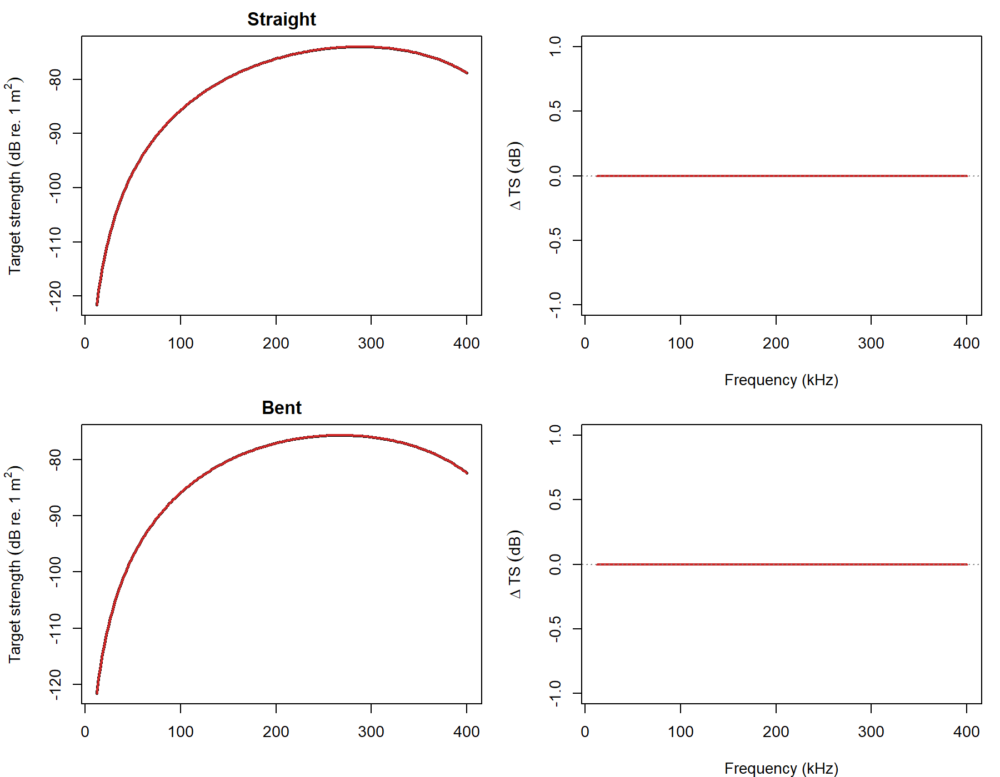

# acousticTS implementation

```{r model_family_header, echo=FALSE, results='asis'}
acousticTS:::.model_family_header(
  family = "bcms",
  pages = c(
    Overview = "index.html",
    Implementation = "bcms-implementation.html",
    Theory = "bcms-theory.html"
  )
)
```

The bent-cylinder modal-series solution is available through `target_strength(..., model = "bcms")`. It is intended for slender, weakly scattering cylinders whose cross-section is still well represented by the finite-cylinder modal-series family, but whose centerline curvature reduces backscattering coherence relative to the straight-cylinder case.

That is the practical reason to use `BCMS` instead of `FCMS`. `FCMS` is the appropriate model when the target can be treated as a straight finite cylinder. `BCMS` is the natural extension when the same cylinder idealization is still acceptable locally, but the body curvature is strong enough that the straight-cylinder coherence assumption is no longer appropriate.

::: {.experiment data-title="Current validation scope"}
`BCMS` is still marked unvalidated because there is not yet an external public software benchmark ladder wired into the package. The implementation checks documented here are the two defining identities of the model: the straight branch must reduce to `FCMS`, and the bent branch must match the Stanton (1989) coherence-corrected construction built from that same straight-cylinder solution.
:::

## Building straight and bent reference objects

The reference case used throughout this page is a weakly scattering liquid-filled cylinder with:

- length `10.5 mm`
- radius `1 mm`
- density contrast `g = 1.0357`
- sound-speed contrast `h = 1.0279`
- broadside incidence
- `12-400 kHz` in `2 kHz` steps

Two geometries are compared:

- a straight finite cylinder
- a bent cylinder with `rho_c / L = 1.5`

In `acousticTS`, the objects are built as:

```{r}
library(acousticTS)

density_sw <- 1026.8
sound_speed_sw <- 1477.3

straight_shape <- cylinder(
  length_body = 10.5e-3,
  radius_body = 1e-3,
  n_segments = 401
)

straight_object <- fls_generate(
  shape = straight_shape,
  density_body = density_sw * 1.0357,
  sound_speed_body = sound_speed_sw * 1.0279,
  theta_body = pi / 2
)

bent_object <- brake(
  straight_object,
  radius_curvature = 1.5
)

straight_object
bent_object
```

The straight object carries the same geometric information that would be passed into `FCMS`. The bent object keeps the same local cylindrical radius and material contrasts, but adds the curvature ratio needed by the bent-cylinder coherence correction. That separation is important because it makes clear what `BCMS` is changing: the local cross-sectional scattering physics remain cylindrical, while the along-body coherence is modified by curvature.

## Calculating TS-frequency spectra

The same `BCMS` call can be applied to either geometry:

```{r}
frequency <- seq(12e3, 400e3, by = 2e3)

straight_object <- target_strength(
  object = straight_object,
  frequency = frequency,
  model = "bcms",
  density_sw = density_sw,
  sound_speed_sw = sound_speed_sw
)

bent_object <- target_strength(
  object = bent_object,
  frequency = frequency,
  model = "bcms",
  density_sw = density_sw,
  sound_speed_sw = sound_speed_sw
)
```

For a straight cylinder, the `BCMS` result should collapse onto the straight finite-cylinder modal-series result. For a bent cylinder, the result should show the same basic modal structure, but with the coherence reductions expected from curvature.

## Extracting model results

Model results can be inspected visually or pulled directly from the stored object.

### Plotting results

```{r echo=FALSE, out.width=c('49%','49%'), fig.align='center', fig.alt='Pre-rendered BCMS example plots showing the straight and bent cylinder geometry comparison together with representative BCMS spectra over frequency.'}
knitr::include_graphics(c("bcms-shape-plot.png", "bcms-model-plot.png"))
```

The geometry panel is useful because `BCMS` is only meaningful when the object is still locally cylinder-like. The spectrum panel then shows the corresponding acoustic effect of that curvature: the bent-cylinder response remains related to the straight-cylinder result, but the backscattered level is reduced by the coherence loss built into the model.

### Accessing results

```{r}
bcms_results <- extract(bent_object, "model")$BCMS
head(bcms_results)
```

The stored `data.frame` contains the modeled frequency, the complex backscattering amplitude `f_bs`, the linear backscattering cross-section `sigma_bs`, and `TS`. For `BCMS`, it is often helpful to inspect these results alongside the corresponding straight-cylinder case, because the defining behavior of the model is the way curvature changes coherence relative to the straight-cylinder baseline.

## Implementation checks
### Straight-cylinder reduction

```{r echo = FALSE}
bcms_summary <- utils::read.csv(
  file.path(
    "..",
    "..",
    "tools",
    "implementation-figures",
    "data",
    "bcms_reference_compare_summary.csv"
  )
)

straight_check <- subset(bcms_summary, case == "straight")[,
  c(
    "max_abs_delta_TS_dB",
    "mean_abs_delta_TS_dB",
    "frequency_at_max_delta_kHz",
    "elapsed_s_acousticts",
    "elapsed_s_reference"
  )
]

straight_check <- data.frame(
  `Reference relation` = "BCMS straight branch vs FCMS",
  `Max abs. delta TS (dB)` = straight_check$max_abs_delta_TS_dB,
  `Mean abs. delta TS (dB)` = straight_check$mean_abs_delta_TS_dB,
  `f at max delta (kHz)` = straight_check$frequency_at_max_delta_kHz,
  `acousticTS elapsed (s)` = straight_check$elapsed_s_acousticts,
  `Reference elapsed (s)` = straight_check$elapsed_s_reference,
  check.names = FALSE
)

knitr::kable(straight_check, digits = 6)
```

This is the first defining identity of the model. When curvature is absent, `BCMS` should not behave like a different cylinder model. It should reduce exactly to the straight finite-cylinder modal-series solution. The zero residual therefore matters because it shows that the curvature correction truly drops out when it should.

### Bent-cylinder coherence relation

```{r echo = FALSE}
bent_check <- subset(bcms_summary, case == "bent")[,
  c(
    "max_abs_delta_TS_dB",
    "mean_abs_delta_TS_dB",
    "frequency_at_max_delta_kHz",
    "elapsed_s_acousticts",
    "elapsed_s_reference"
  )
]

bent_check <- data.frame(
  `Reference relation` = "BCMS bent branch vs Stanton (1989) coherence construction",
  `Max abs. delta TS (dB)` = bent_check$max_abs_delta_TS_dB,
  `Mean abs. delta TS (dB)` = bent_check$mean_abs_delta_TS_dB,
  `f at max delta (kHz)` = bent_check$frequency_at_max_delta_kHz,
  `acousticTS elapsed (s)` = bent_check$elapsed_s_acousticts,
  `Reference elapsed (s)` = bent_check$elapsed_s_reference,
  check.names = FALSE
)

knitr::kable(bent_check, digits = 6)
```

This is the second defining identity. The bent-cylinder branch is expected to match the straight-cylinder modal-series result multiplied by the Fresnel-style coherence factor implied by Stanton (1989, Eq. 25-26). The check is therefore not asking whether `BCMS` matches itself. It is asking whether the implemented bent-cylinder branch reproduces the explicit coherence-corrected construction that defines the model.

### Spectrum overlay

```{r echo=FALSE, out.width='90%', fig.align='center', fig.alt='Pre-rendered BCMS comparison showing straight and bent reference spectra together with acousticTS overlays and residual panels.'}

```

The overlay makes the two implementation identities easier to interpret. The straight branch sits exactly on the `FCMS` baseline, while the bent branch sits exactly on the coherence-corrected reference. The practical takeaway is that the package is honoring the intended model decomposition: straight-cylinder modal scattering plus a curvature-driven coherence correction.

## Closing note

`BCMS` is best viewed as a controlled extension of `FCMS`, not as a completely separate scattering family. The page is therefore organized around the two checks that matter most for that relationship: reduction to `FCMS` in the straight limit, and exact agreement with the bent-cylinder coherence construction in the curved case. Those checks do not replace an external benchmark ladder, but they do establish that the current implementation is respecting the defining algebra of the model.
