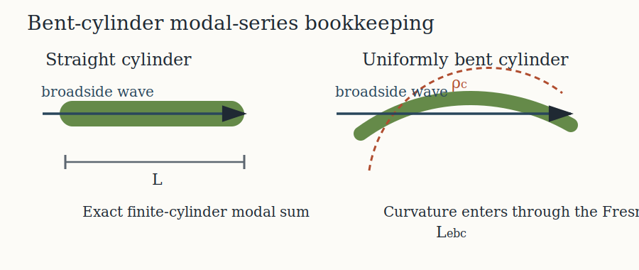

# Introduction

```{r model_family_header, echo=FALSE, results='asis'}
acousticTS:::.model_family_header(
  status = c("experimental", "unvalidated"),
  pages = c(
    Overview = "index.html",
    Implementation = "bcms-implementation.html",
    Theory = "bcms-theory.html"
  )
)
```

The bent-cylinder modal-series solution is a hybrid construction. For a straight finite cylinder, the backscatter comes from the exact finite-cylinder modal coefficient sum described by Stanton (1988)[^1]. For a uniformly bent cylinder near broadside, Stanton (1989) showed that the curvature enters through a coherence integral along the bent axis rather than by rebuilding the full cross-sectional modal kernel from scratch[^2]. The `BCMS` implementation follows that split directly.

[^1]: Stanton, T.K. (**1988**). *Sound scattering by cylinders of finite length. I. Fluid cylinders*. J. Acoust. Soc. Am., 83: 55-63.

[^2]: Stanton, T.K. (**1989**). *Sound scattering by cylinders of finite length. III. Deformed cylinders*. J. Acoust. Soc. Am., 86: 691-705.

# Straight and bent branches

The model is easiest to understand as two connected branches:

1. a straight-cylinder modal series,
2. a bent-cylinder coherence correction applied to that straight result.

```{r echo = FALSE, out.width = "92%", fig.align = "center", fig.cap = "BCMS keeps the straight finite-cylinder modal sum and applies a Fresnel coherence correction for the bent case."}

```

For the straight cylinder, the far-field backscattering amplitude is the ordinary finite-cylinder sum

$$
f_{bs}^{(\mathrm{straight})}
\propto
\frac{L}{\pi}
\frac{\sin(kL\cos\theta)}{kL\cos\theta}
\sum_m B_m,
$$

where the modal coefficients $B_m$ depend on the boundary condition and the interior material properties.

# Bent-cylinder coherence length

For a uniformly bent cylinder near broadside, Stanton (1989, Eq. 25-26) retains the straight-cylinder modal content and introduces curvature through a coherent integration along the arc. In the present implementation that correction is written as

$$
f_{bs}^{(\mathrm{bent})}
=
\frac{L_{ebc}}{L}
f_{bs}^{(\mathrm{straight})},
$$

where $L_{ebc}$ is the complex equivalent coherent length of the bent cylinder.

The key point is that `BCMS` uses the Fresnel-integral form of that coherence correction. The stationary-phase limit is an asymptotic shortcut for sufficiently high frequency and sufficiently gentle bending, but it is not the core bent-cylinder modal-series form. That is why the stationary-phase approximation belongs naturally with the asymptotic cylindrical models rather than inside `BCMS` itself.

# Relation to `FCMS`

Because the bent-cylinder correction multiplies the straight finite-cylinder response, `BCMS` collapses to `FCMS` immediately when the curvature is removed. That identity is a useful implementation check:

- straight cylinder: `BCMS = FCMS`
- bent cylinder: `BCMS = (L_{ebc}/L) * FCMS`

This relationship is what the implementation page uses as its primary reference check.

# Closing note

`BCMS` is therefore best viewed as a curvature-aware extension of the finite-cylinder modal-series family rather than a separate modal kernel. The cross-sectional physics stays in the straight-cylinder modal coefficients. Curvature modifies the along-axis coherence.
