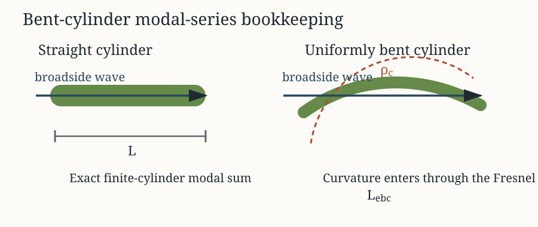

# Introduction

```{r model_family_header, echo=FALSE, results='asis'}
acousticTS:::.model_family_header(
  family = "bcms",
  pages = c(
    Overview = "index.html",
    Implementation = "bcms-implementation.html",
    Theory = "bcms-theory.html"
  )
)
```

The bent-cylinder modal series solution (`BCMS`) extends Stanton's
finite-cylinder treatment to a uniformly curved axis near broadside
[@Stanton_1988; @Stanton_1989_2]. It retains the straight-cylinder
cross-sectional modes and changes the phase coherence along the axis.

That separation leads to a two-level theory:

1. a straight finite-cylinder modal backscatter kernel, and
2. a curvature-dependent coherent-length correction applied to that kernel.

::: {.note data-title="Shared conventions"}
Medium indices and scattering quantities follow [Notation and
symbols](../notation-and-symbols/notation-and-symbols.html). The local
fluid-cylinder coefficients are derived in [FCMS
theory](../fcms/fcms-theory.html).
:::

# Straight-cylinder starting point

## Local cross-sectional modal content

`BCMS` inherits its local cross-sectional response from the straight
finite-cylinder modal series. For a circular cylinder of radius $a$ and length
$L$, the near-broadside backscattering amplitude can be written schematically
as:

$$
  f_{\mathrm{bs}}^{(\mathrm{straight})} =
    \frac{L}{\pi}
  \frac{\sin(k_1 L \cos\theta)}
  {k_1 L \cos\theta}
  \sum_{m=0}^{\infty}
  (-1)^m \epsilon_m B_m.
$$

Here $k_1 = \omega/c_1$ is the seawater wavenumber, $\theta$ is the incidence
angle measured relative to the cylinder axis, $\epsilon_m$ is the Neumann
factor, and $B_m$ is the straight-cylinder modal coefficient of order $m$.

The boundary condition determines $B_m$. For a fluid-like cylinder, these are
the FCMS coefficients. BCMS changes only the along-axis factor.

## Why curvature can be isolated

For a gently and uniformly bent cylinder near broadside, the local radius and
cross-sectional boundary condition still look straight at the scale of the
cross-sectional modal solve. What changes is the two-way phase accumulated by
different points along the curved axis.

BCMS therefore treats curvature as an axial-coherence problem. This requires
the local radius of curvature to be large enough that each cross-section is
well represented by the straight-cylinder solution.

# Uniformly bent geometry

## Centerline and curvature

Let $s \in [-L/2, L/2]$ denote arc length along the cylinder centerline, and
let $\kappa = 1/\rho_c$ denote the constant curvature, where $\rho_c$ is the
radius of curvature. A convenient planar representation of the bent centerline
is:

$$
  \mathbf{r}_c(s) =
    \begin{bmatrix}
  \rho_c \sin(s/\rho_c) \\
    0 \\
    \rho_c \left[1 - \cos(s/\rho_c)\right]
  \end{bmatrix}.
$$

A rigid translation changes only the common phase and not the scattered
intensity.

The local tangent direction is then:

$$
  \hat{\mathbf{t}}(s) =
    \frac{d\mathbf{r}_c}{ds} =
    \begin{bmatrix}
  \cos(s/\rho_c) \\
    0 \\
    \sin(s/\rho_c)
  \end{bmatrix}.
$$




## Broadside phase bookkeeping

For monostatic backscatter, each point on the centerline contributes a two-way
phase proportional to its projection onto the backscatter direction. If
$\hat{\mathbf{q}}$ denotes the relevant unit look direction, the coherent
length is:

$$
  L_{\mathrm{ebc}} =
    \int_{-L/2}^{L/2}
  \exp\left[
  2 i k_1 \hat{\mathbf{q}}\cdot \mathbf{r}_c(s)
  \right] ds.
$$

When the centerline is straight, $\mathbf{r}_c(s)$ becomes linear in $s$ and
this integral reduces to the ordinary sinc-style axial factor. For a bent
centerline, the phase becomes nonlinear in $s$, which is why the coherence is
reduced even when the local cylinder physics is unchanged.

# Equivalent coherent length and Fresnel form

For a uniformly bent cylinder near broadside, Stanton's reduction gives
[@Stanton_1989_2]:

$$
  f_{\mathrm{bs}}^{(\mathrm{bent})} =
    \frac{L_{\mathrm{ebc}}}{L}
  f_{\mathrm{bs}}^{(\mathrm{straight})}.
$$

The ratio $L_{\mathrm{ebc}}/L$ is the fraction of the nominal length that
contributes coherently, including its phase.

Near broadside, constant curvature gives a quadratic phase and reduces the
integral to Fresnel functions. Weak curvature or low frequency gives
$L_{\mathrm{ebc}}\approx L$. Increasing either curvature or frequency makes
more distant axial sections dephase.

# Backscatter and target strength

Once the straight modal kernel and bent coherent-length factor are known, the
backscattering cross-section and target strength follow the standard monostatic
definitions [@MacLennan_2002]:

$$
  \sigma_{\mathrm{bs}} =
    \left|f_{\mathrm{bs}}^{(\mathrm{bent})}\right|^2,
  \qquad
  \mathrm{TS} =
    10\log_{10}\left(\frac{\sigma_{\mathrm{bs}}}{1\ \mathrm{m}^2}\right).
$$

The complex coherence multiplier changes both magnitude and phase before the
cross-section is formed.

# Mathematical assumptions

The family rests on a narrow but physically useful set of assumptions:

1. the cross-section remains circular,
2. the curvature is uniform,
3. the target is treated near broadside,
4. the straight-cylinder modal coefficients remain the correct local kernel,
5. curvature modifies only the axial phase coherence.

BCMS is therefore an approximate curvature extension of FCMS, not an exact
solution of the wave equation in toroidal coordinates.

