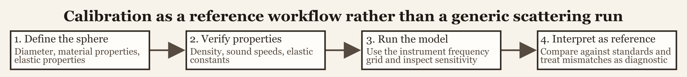

# Introduction

This workflow is designed around the standard-target calibration literature for elastic reference spheres [@Dragonette_1981; @Foote_1990; @Maclennan_1981].


The package already contains substantial theory for calibration spheres. This page is the practical counterpart. Its purpose is to show how calibration-related objects and model outputs fit into an actual user workflow, and why calibration targets should not be treated as though they were just another convenient canonical scatterer.

That distinction matters because a calibration sphere is meant to serve as a reference standard. The goal is not merely to produce a plausible target-strength curve. The goal is to produce a defensible reference response whose geometry, material properties, medium properties, and frequency grid are all tied closely to the real measurement context. That changes how material properties are sourced, how model outputs are judged, and how discrepancies should be interpreted.



# Why calibration workflows are different

Calibration targets are not used in the same way as biological scatterers. With a biological target, one often accepts a certain amount of geometric simplification and natural variability because the object itself is variable. With a calibration sphere, the opposite is true. The sphere is chosen precisely because it is simple, well characterized, and reproducible. That simplicity raises the standard for the workflow rather than lowering it.

In practice, calibration work is usually less about exploratory variation and more about reference behavior. A user wants to know what response should be expected from a sphere of a specified material and diameter in a specified medium over the relevant instrument band. The central question is therefore not "does this curve look reasonable?" but "does this curve match the reference target under the stated assumptions?"

# Workflow structure

The practical calibration workflow usually has four linked stages: constructing the calibration sphere object, verifying the material and medium properties, running the model on the same frequency grid used by the instrument or reference study, and interpreting the resulting curve as a reference standard rather than as a merely plausible simulation. Those stages are simple in outline, but each one has a distinct failure mode.

A sphere can be geometrically correct but materially mis-specified. A property table can be internally consistent but paired with the wrong medium values. A model run can be numerically clean but evaluated on the wrong frequency grid for the intended instrument. A curve can look smooth and plausible and still be unusable as a calibration reference if the inputs do not match the actual standard sphere.

# Step 1: construct the calibration target

The first step is to build a calibration object that correctly represents both the sphere geometry and the sphere material. Calibration spheres are nominally simple objects, which makes it easy to underestimate how much the workflow depends on getting the specification right at the start.

At this stage, the most important checks are the diameter or radius, the material assigned to the sphere, the units used in the original specification, and the intended surrounding medium. Calibration targets are often documented in manufacturer specifications, laboratory notes, or standard operating procedures. Because of that, transcription errors matter more here than they do in many exploratory model runs. A unit mistake in diameter or a mislabeled material can shift the entire response curve, including its resonance structure, by enough to make the resulting prediction unsuitable as a calibration reference.

The package workflow is intentionally direct at this stage. Once the object is created, the geometry and material properties are stored together, which makes later checks much easier than if they were scattered across separate scripts or ad hoc lookup tables.

# Step 2: verify material and medium properties

Calibration workflows rely heavily on the material-property utilities described in the companion article. Depending on the sphere type, the relevant inputs may include density, longitudinal sound speed, transverse sound speed, and medium properties such as water density and sound speed at the time of measurement.

This stage is not housekeeping. It is part of the model definition. A calibration curve is only as defensible as the property table from which it was generated. Useful checks include confirming that the listed material properties match the intended sphere standard, verifying that the surrounding medium values correspond to the measurement conditions, and deriving missing elastic constants if the available documentation reports properties in a different form.

```{r eval = FALSE}
E <- 7e10
nu <- 0.32

shear(E = E, nu = nu)
bulk(E = E, nu = nu)
lame(E = E, nu = nu)
```

That kind of derivation is often central to reproducing a standard calibration response. If the property conversion is wrong, the resulting curve may still appear smooth and well behaved while being physically tied to the wrong target.

# Step 3: run the calibration model on the relevant frequency grid

Once the object is constructed and the material properties are checked, the calibration model should be run on the same frequency grid used by the instrument, experiment, or reference study. This is one of the places where calibration work differs sharply from generic exploratory simulation. The relevant grid is usually not arbitrary. It is set by the instrument or by the accepted comparison curve.

```{r eval = FALSE}
frequency <- seq(18e3, 200e3, by = 2e3)

cal_obj <- target_strength(
  object = cal_obj,
  frequency = frequency,
  model = "calibration"
)
```

The model name should match the intended solid elastic sphere workflow. The point is not simply to use a spherical model. The point is to use the solid calibration-sphere formulation whose material bookkeeping matches the reference target. Once the model is run, the resulting object contains the target-strength curve together with the geometric and material information that produced it.

# Step 4: interpret the output as a reference curve

Calibration output should be interpreted differently from exploratory biological scattering output. Small discrepancies matter more, sensitivity to medium and material properties deserves explicit attention, and comparison with known standards or published reference curves is part of the workflow rather than an optional final check.

This is the stage where it becomes especially important to distinguish between a visually plausible result and a reference-quality result. A curve may look smooth and have the right overall magnitude while still being wrong in the details that matter for calibration. The correct question is whether the modeled response is consistent with the stated sphere specification, medium properties, and operating band.

That is also why calibration pages sit close to the validation pages in the documentation structure. Calibration workflows are inherently comparative. Their outputs are usually judged against an accepted target rather than accepted on appearance alone.

# A practical calibration checklist

For routine work, it is useful to adopt a fixed calibration checklist. Verify geometry and units first. Verify material properties or derive missing constants second. Set medium properties explicitly rather than leaving them implicit. Run the model on the actual instrument frequency grid. Compare the result with the expected reference curve. Inspect sensitivity to medium or material changes before blaming the implementation.

That last point is especially important. Calibration discrepancies often originate in property tables, medium assumptions, or specification errors rather than in the scattering code itself. Because the target is meant to be well defined, even small bookkeeping differences can matter.

# Relationship to the theory and implementation pages

The calibration theory page explains the elastic-sphere physics and the normalization of the reported backscattering quantities. The implementation page explains the model interface and the structure of the stored results. This workflow page sits between them. Its purpose is to answer the practical question of how a user moves from nominal sphere specifications to a defensible modeled reference curve.

# Related pages

- [Solid elastic sphere theory](../calibration/calibration-theory.html)
- [Calibration implementation](../calibration/calibration-implementation.html)
- [Material properties and acoustic utilities](../material-properties/material-properties.html)
