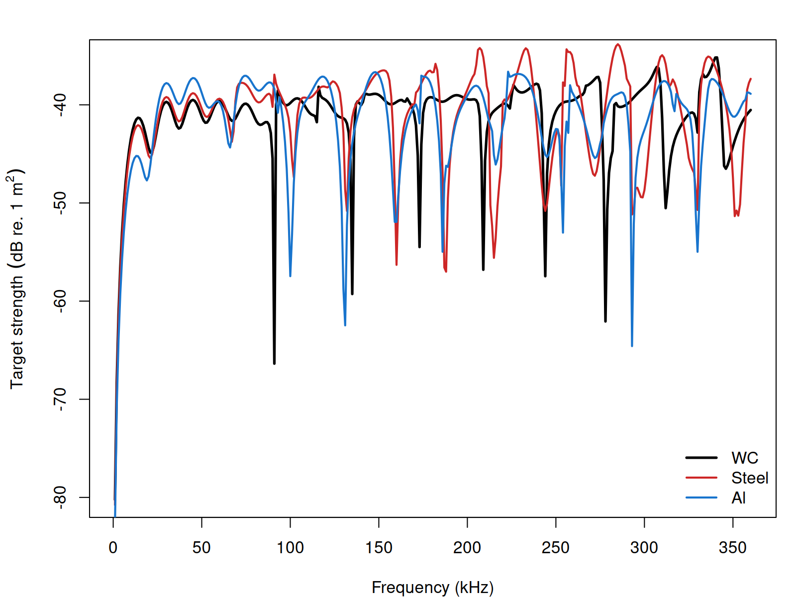

# Benchmarks

```{r model_family_header, echo=FALSE, results='asis'}
acousticTS:::.model_family_header(
  family = "calibration",
  pages = c(
    Overview = "index.html",
    Theory = "calibration-theory.html",
    Implementation = "calibration-implementation.html",
    Benchmarks = "calibration-benchmarks.html",
    Validation = "calibration-validation.html"
  )
)
```

The calibration model is benchmarked on published elastic calibration-sphere targets, including the standard tungsten-carbide and copper sphere cases used throughout the package documentation.

```{r echo=FALSE, out.width='85%', fig.align='center', fig.alt='Pre-rendered calibration-sphere material comparison for the standard benchmark targets.'}

```

The benchmark question is not whether an unknown target looks sphere-like; it is whether a declared calibration sphere with known radius, material properties, and water properties reproduces accepted reference spectra.

