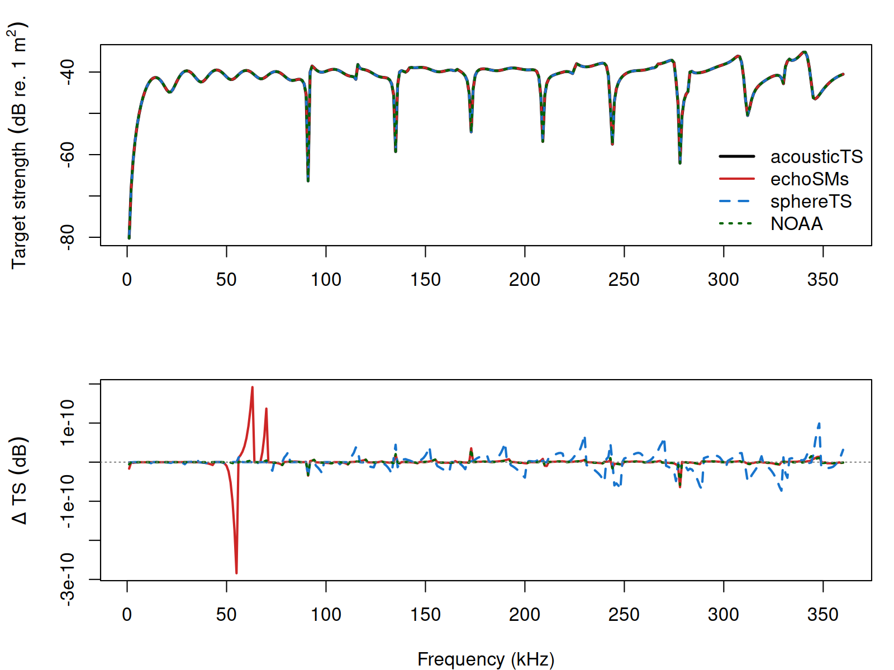

# Benchmarks

```{r model_family_header, echo=FALSE, results='asis'}
acousticTS:::.model_family_header(
  family = "calibration",
  pages = c(
    Overview = "index.html",
    Theory = "calibration-theory.html",
    Implementation = "calibration-implementation.html",
    Benchmarks = "calibration-benchmarks.html",
    Validation = "calibration-validation.html"
  )
)
```

SOEMS is benchmarked on standard solid elastic calibration spheres against `echoSMs`, `sphereTS`, and the NOAA calibration-sphere applet. The compared targets use the same sphere diameter, material constants, water properties, and frequency grids.

## Target Summary

| Target | Material | Diameter (mm) | Frequency rows | Frequency max (kHz) | Max abs. delta vs `echoSMs` (dB) | Max abs. delta vs `sphereTS` (dB) | Max abs. delta vs NOAA applet (dB) |
|:--|:--|--:|--:|--:|--:|--:|--:|
| WC20 calibration sphere | WC | 20.0 | 360 | 360 | 2.99e-10 | 5.56e-11 | 1.89e-11 |
| WC38.1 calibration sphere | WC | 38.1 | 360 | 360 | 2.84e-10 | 9.89e-11 | 5.82e-11 |
| Cu32.1 calibration sphere | Cu | 32.1 | 360 | 360 | 1.67e-10 | 6.54e-11 | 3.28e-11 |

## Pairwise WC38.1 Residuals

| Comparison | Frequency rows | Mean abs. delta `TS` (dB) | Max abs. delta `TS` (dB) |
|:--|--:|--:|--:|
| acousticTS vs `echoSMs` | 360 | 6.12e-12 | 2.84e-10 |
| acousticTS vs `sphereTS` | 360 | 1.29e-11 | 9.89e-11 |
| acousticTS vs NOAA applet | 360 | 2.04e-12 | 5.82e-11 |
| `echoSMs` vs `sphereTS` | 360 | 1.64e-11 | 2.84e-10 |
| `echoSMs` vs NOAA applet | 360 | 4.52e-12 | 2.77e-10 |
| `sphereTS` vs NOAA applet | 360 | 1.26e-11 | 8.83e-11 |

<details>
<summary>WC38.1 frequency rows</summary>

| Frequency (kHz) | `ka` | acousticTS `TS` (dB) | `echoSMs` `TS` (dB) | `sphereTS` `TS` (dB) | NOAA applet `TS` (dB) |
|--:|--:|--:|--:|--:|--:|
| 1 | 0.081 | -80.233 | -80.233 | -80.233 | -80.233 |
| 2 | 0.162 | -68.283 | -68.283 | -68.283 | -68.283 |
| 3 | 0.243 | -61.393 | -61.393 | -61.393 | -61.393 |
| 4 | 0.324 | -56.611 | -56.611 | -56.611 | -56.611 |
| 5 | 0.405 | -53.013 | -53.013 | -53.013 | -53.013 |
| 6 | 0.486 | -50.190 | -50.190 | -50.190 | -50.190 |
| 7 | 0.567 | -47.925 | -47.925 | -47.925 | -47.925 |
| 8 | 0.648 | -46.093 | -46.093 | -46.093 | -46.093 |
| 9 | 0.729 | -44.616 | -44.616 | -44.616 | -44.616 |
| 10 | 0.810 | -43.444 | -43.444 | -43.444 | -43.444 |
| 11 | 0.891 | -42.545 | -42.545 | -42.545 | -42.545 |
| 12 | 0.972 | -41.899 | -41.899 | -41.899 | -41.899 |
| 13 | 1.053 | -41.492 | -41.492 | -41.492 | -41.492 |
| 14 | 1.134 | -41.318 | -41.318 | -41.318 | -41.318 |
| 15 | 1.215 | -41.372 | -41.372 | -41.372 | -41.372 |
| 16 | 1.296 | -41.649 | -41.649 | -41.649 | -41.649 |
| 17 | 1.377 | -42.139 | -42.139 | -42.139 | -42.139 |
| 18 | 1.458 | -42.817 | -42.817 | -42.817 | -42.817 |
| 19 | 1.539 | -43.614 | -43.614 | -43.614 | -43.614 |

</details>

## Figure

<details>
<summary>Software-distribution comparison</summary>

```{r echo=FALSE, out.width='85%', fig.align='center', fig.alt='External software comparison for calibration-sphere benchmark targets.'}

```

</details>
