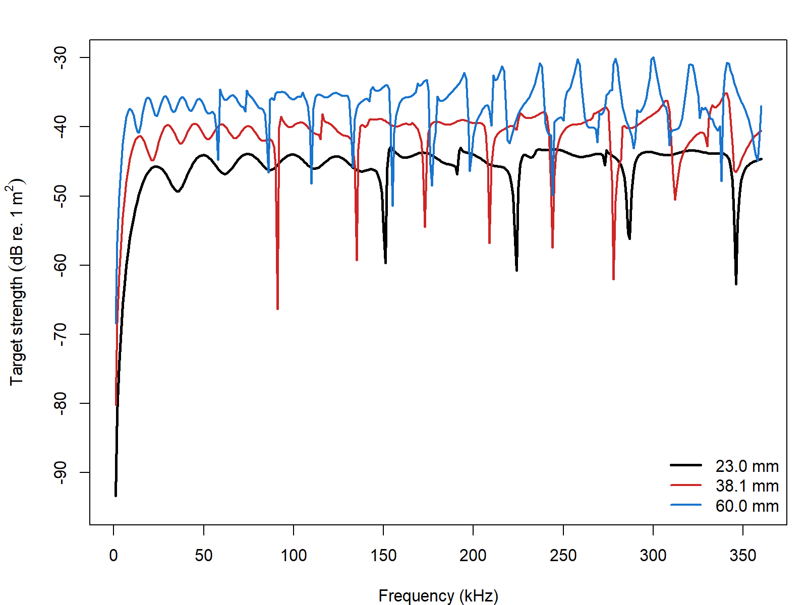
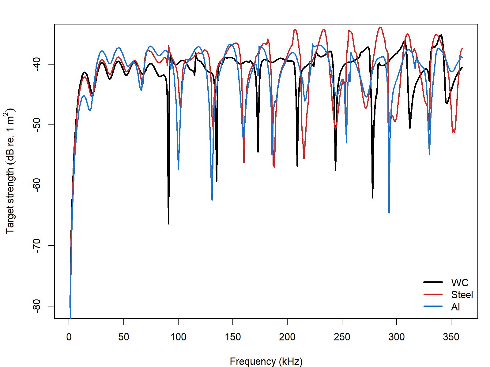
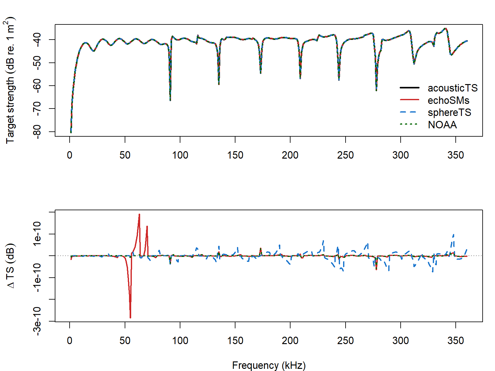

# acousticTS implementation

```{r model_family_header, echo=FALSE, results='asis'}
acousticTS:::.model_family_header(
  family = "calibration",
  pages = c(
    Overview = "index.html",
    Implementation = "calibration-implementation.html",
    Theory = "calibration-theory.html"
  )
)
```


These pages are grounded in the standard-target calibration literature for elastic reference spheres [@dragonette_calibration_1981; @foote_spheres_1990; @maclennan_theory_1981].

The calibration workflow in acousticTS is designed to be short and explicit. A user first creates a calibration sphere object, then evaluates the calibration model over a chosen frequency grid, and finally inspects or plots the stored results. The object-based design is useful here because the sphere dimensions, elastic material properties, medium properties, and model outputs remain attached to the same object throughout the workflow.

## Calibration sphere object generation

The calibration target is represented by the `CAL` object class. This object stores metadata, model parameters, model results, body properties, and shape-specific information in one place. In practical terms, that means the sphere can be built once and then reused for plotting, comparison, and repeated model runs without reconstructing the target from scratch each time.

A calibration sphere object is created with `cal_generate()`. The two most important user-facing arguments are `material` and `diameter`. The default diameter is 38.1 mm, written in the package as `38.1e-3` m, and the diameter input is always interpreted in meters. The `material` argument provides several common defaults whose longitudinal sound speed, transverse sound speed, and density are supplied automatically.

| Material | Argument value | $c_\ell$ | $c_\tau$ | $\rho$ |
| ----------- | ----------- | ----------- | ----------- | ----------- |
| Tungsten carbide | `"WC"` | 6853 | 4171 | 14900 |
| Aluminum | `"Al"` | 6260 | 3080 | 2700 |
| Stainless steel | `"steel"` | 5610 | 3120 | 7800 |
| Brass | `"brass"` | 4372 | 2100 | 8360 |
| Copper | `"Cu"` | 4760 | 2288.5 | 8947 |

If a sphere material is not one of those defaults, the object can still be created by supplying the material properties directly. The important point is that the calibration sphere is treated as a solid elastic target, so both longitudinal and transverse wave speeds are part of the definition.

When using the defaults:

```{r}
library(acousticTS)

cal_sphere <- cal_generate()
# equivalent to: cal_generate(material = "WC", diameter = 38.1e-3)
```

## Calculating a target-strength spectrum

Once the calibration sphere object has been created, target strength is computed with `target_strength()`. In this workflow, the core inputs are `object`, `frequency`, and `model`. The `object` argument is the `CAL` object, `frequency` is usually a vector of values in Hz, and `model` should be `"calibration"` or `"SOEMS"`.

The most important practical point is that `target_strength()` returns the updated object. Reassigning to the same object is convenient when the goal is to keep working with a single sphere definition. Assigning to a new object is useful when several model runs or parameter sets need to be kept side by side.

```{r}
frequency <- seq(1e3, 600e3, 1e3)

cal_sphere <- target_strength(
  object = cal_sphere,
  frequency = frequency,
  model = "calibration"
)

cal_sphere_copy <- target_strength(
  object = cal_sphere,
  frequency = frequency,
  model = "calibration"
)
```

## Inspecting model results

Model results can be inspected visually or accessed directly with `extract()`. Both approaches are useful. Plotting is the fastest way to check whether the spectrum behaves plausibly, while direct extraction is the best way to compare outputs, build custom graphics, or verify the numerical quantities being stored.

## Plotting results

The `plot()` method can be used to display either the sphere geometry or the modeled output. For calibration work, the most common use is `type = "model"`, which plots the stored target-strength spectrum. The optional `x_units` argument can also be used to display the horizontal axis in terms of frequency or in terms of radius-scaled wavenumber.

```{r echo=FALSE, out.width='49%', fig.align='center', fig.alt='Pre-rendered calibration-sphere spectra shown against frequency and three radius-scaled wavenumber axes for the default tungsten-carbide sphere.'}
knitr::include_graphics(c(
  "calibration-spectrum-frequency.png",
  "calibration-spectrum-k-sw.png",
  "calibration-spectrum-k-l.png",
  "calibration-spectrum-k-t.png"
))
```

Those alternatives are useful for different reasons. Frequency is the natural axis for practical calibration work, while the radius-scaled wavenumber views are useful when comparing spheres of different diameters or different materials on a common nondimensional scale.

## Accessing results

The model results can also be accessed directly with `extract()`. For the calibration workflow, `feature = "model"` returns a data frame containing the stored spectral outputs.

```{r}
model_results <- extract(cal_sphere, "model")$calibration
head(model_results)
```

The extracted data frame includes the working frequency grid, the ambient acoustic-size variable `ka`, the reported backscattering length `f_bs`, the backscattering cross-section `sigma_bs`, and target strength `TS`. In the current calibration workflow, these quantities are related by:

$$
  \sigma_{\mathrm{bs}} = |f_{\mathrm{bs}}|^2,
  \qquad
  \mathit{TS} = 10 \log_{10}\left(\sigma_{\mathrm{bs}}\right).
$$

That relationship is worth stating clearly because calibration literature is not always written with the same normalization. The implementation page should therefore be read together with the theory page when the dimensional meaning of the reported quantities matters.

## Comparison workflows

One advantage of the calibration workflow is that it becomes easy to compare spheres that differ only in diameter or material. Those comparisons are useful because they show how the resonance pattern shifts when the sphere size changes and how the elastic response changes when the material parameters change.

### Diameter comparisons

```{r echo=FALSE, out.width='85%', fig.align='center', fig.alt='Pre-rendered calibration comparison showing how the stored calibration-sphere spectrum shifts with sphere diameter.'}

```

Diameter changes alter the acoustic-size scaling directly, so the resonance structure shifts across the frequency axis even when the sphere material is unchanged. That is one reason calibration practice is usually tied to standard diameters rather than to an abstract material class alone.

### Material comparisons

```{r echo=FALSE, out.width='85%', fig.align='center', fig.alt='Pre-rendered calibration comparison showing how the stored calibration-sphere spectrum varies with sphere material at fixed diameter.'}

```

Material comparisons are especially informative because they isolate the role of elastic wave speeds and density from the purely geometric role of sphere size. A tungsten carbide sphere and an aluminum sphere of the same diameter do not simply differ by a vertical offset. Their resonance structure can also shift because the interior compressional and shear wave speeds have changed.

### External implementation comparison

Because the calibration-sphere model is itself a modal-series solution, the most useful implementation check is agreement with other MacLennan (1981) elastic-sphere implementations rather than with a separate benchmark family. The acousticTS solver now exposes an `adaptive` argument. When `adaptive = TRUE` (the default), the solver starts from the usual $\mathrm{round}(ka)+10$ partial waves and then extends the sum until the tail term is below $10^{-10}$. When `adaptive = FALSE`, it falls back to the original fixed cutoff only. The adaptive mode removes the small truncation bias that otherwise remains at the upper end of the comparison band. For the default 38.1 mm tungsten-carbide sphere, the comparison below uses the shared material properties $c_\ell = 6853$ m s$^{-1}$, $c_\tau = 4171$ m s$^{-1}$, and $\rho = 14900$ kg m$^{-3}$ together with the standard surrounding-water values $c = 1477.3$ m s$^{-1}$ and $\rho = 1026.8$ kg m$^{-3}$. The frequency grid is limited to 1--360 kHz so that the NWFSC calibration-sphere applet remains inside its stated $ka \lesssim 30$ reliability range.

```{r echo = FALSE}
compare_summary <- utils::read.csv(
  file.path(
    "..",
    "..",
    "tools",
    "implementation-figures",
    "data",
    "calibration_wc381_package_compare_summary.csv"
  )
)

knitr::kable(
  compare_summary,
  digits = 6,
  col.names = c(
    "Comparison", "N frequency", "Max abs. delta TS (dB)",
    "Mean abs. delta TS (dB)"
  )
)
```

```{r echo=FALSE, out.width='85%', fig.align='center', fig.alt='Pre-rendered calibration comparison against echoSMs, sphereTS, and the NOAA calibration applet for the 38.1 mm tungsten-carbide sphere.'}

```

These comparisons show that the current acousticTS elastic-sphere implementation is numerically aligned with the other MacLennan (1981) software implementations over the full comparison band. For the 38.1 mm tungsten-carbide case, the largest absolute differences are on the order of $10^{-10}$ dB when `adaptive = TRUE`, which means the remaining disagreement is just numerical noise from the special-function libraries and stopping criteria rather than a substantive model discrepancy. With the original fixed cutoff (`adaptive = FALSE`), the same case stays very close but relaxes to a maximum package-to-package difference of about $7.2 \times 10^{-5}$ dB. On this machine, the adaptive cutoff increases the elapsed time for the 360-point 38.1 mm tungsten-carbide spectrum from about 0.31 s to about 0.37 s.

To show that this is not unique to the 38.1 mm tungsten-carbide sphere, the same comparison was repeated for one smaller tungsten-carbide sphere and one copper sphere from the calibration-target definitions shipped with `echoSMs`.

```{r echo = FALSE}
selected_compare <- utils::read.csv(
  file.path(
    "..",
    "..",
    "tools",
    "implementation-figures",
    "data",
    "calibration_selected_compare_summary.csv"
  )
)

knitr::kable(
  selected_compare[
    ,
    c(
      "target",
      "diameter_mm",
      "n_frequency",
      "max_frequency_khz",
      "max_abs_delta_adaptive_true_vs_echoSMs_db",
      "max_abs_delta_adaptive_false_vs_echoSMs_db",
      "max_abs_delta_adaptive_true_vs_sphereTS_db",
      "max_abs_delta_adaptive_false_vs_sphereTS_db",
      "max_abs_delta_adaptive_true_vs_noaa_applet_db",
      "max_abs_delta_adaptive_false_vs_noaa_applet_db",
      "elapsed_acousticTS_adaptive_true_s",
      "elapsed_acousticTS_adaptive_false_s",
      "elapsed_echoSMs_s",
      "elapsed_sphereTS_s",
      "elapsed_noaa_applet_s"
    )
  ],
  digits = 6,
  col.names = c(
    "Target",
    "Diameter (mm)",
    "N frequency",
    "Max frequency (kHz)",
    "Max abs. delta adapt = TRUE vs echoSMs (dB)",
    "Max abs. delta adapt = FALSE vs echoSMs (dB)",
    "Max abs. delta adapt = TRUE vs sphereTS (dB)",
    "Max abs. delta adapt = FALSE vs sphereTS (dB)",
    "Max abs. delta adapt = TRUE vs NOAA applet (dB)",
    "Max abs. delta adapt = FALSE vs NOAA applet (dB)",
    "Elapsed acousticTS adapt = TRUE (s)",
    "Elapsed acousticTS adapt = FALSE (s)",
    "Elapsed echoSMs (s)",
    "Elapsed sphereTS (s)",
    "Elapsed NOAA applet (s)"
  )
)
```

Across those additional targets, the adaptive solver keeps the maximum absolute differences near $10^{-10}$ dB, while the original fixed cutoff remains within about $10^{-5}$ to $10^{-4}$ dB of the other implementations over the same grids. The timing columns are machine-specific, but they are still useful for showing the qualitative cost of the adaptive cutoff relative to the old fixed modal limit and the other available implementations.
## Closing note

Calibration spheres are one of the cleanest places in the package to see the full object-to-model workflow in action. A well-defined object is created, a canonical model is applied, and the outputs can then be compared across diameter, material, or frequency range with very little ambiguity about what the target actually is.

