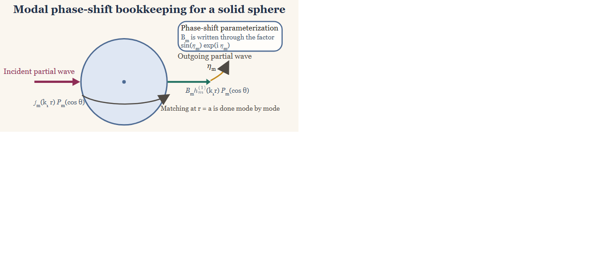
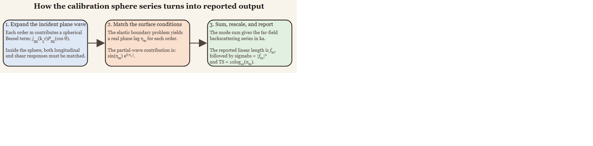

# Introduction

```{r model_family_header, echo=FALSE, results='asis'}
acousticTS:::.model_family_header(
  family = "calibration",
  pages = c(
    Overview = "index.html",
    Implementation = "calibration-implementation.html",
    Theory = "calibration-theory.html"
  )
)
```

Standard-target calibration uses a target whose backscatter can be predicted
independently of the echosounder [@Foote_1990; @Demer_2015]. Tungsten carbide
spheres are common in fisheries acoustics, while copper, aluminum, steel, and
other elastic solids are used for particular frequency ranges and calibration
requirements [@Foote_1982; @Maclennan_1981].

The surrounding fluid supports acoustic pressure, while the solid supports
longitudinal and shear motion. Matching those fields at a spherical interface
produces the elastic resonances used in the `SOEMS` calculation
[@Hickling_1962].

::: {.note data-title="Shared conventions"}
Symbols and medium indexing follow [Notation and
Symbols](../notation-and-symbols/notation-and-symbols.html). Material inputs for
calibration standards are covered in [Material
Properties](../material-properties/material-properties.html).
:::

# Governing fields

In the surrounding fluid, the acoustic pressure field, $p(\mathbf{x}, \omega)$, satisfies the scalar Helmholtz equation:

$$
  \nabla^2p + k^2_{1}p = 0,
$$

where $\omega$ is angular frequency, $\mathbf{x}=(r,\theta,\varphi)$ is
position in spherical coordinates, $c_1$ is the exterior sound speed, and
$k_1=\omega/c_1$. In Cartesian components, the gradient is:

$$
  \nabla =
    \left(
  \frac{\partial}{\partial x} , \frac{\partial}{\partial y} , \frac{\partial}{\partial z}
  \right).
$$

Within the solid elastic sphere, the displacement field $\mathbf{u}(\mathbf{x}, \omega)$ satisfies the Navier equation:

$$
  (\lambda + 2 \mu)\nabla(\nabla \cdot \mathbf{u}) - \mu \nabla \times (\nabla \times \mathbf{u}) + \rho_2 \omega^2 \mathbf{u} = 0,
$$

where $\lambda$ and $\mu$ are the Lamé elastic constants and $\rho_2$ is the sphere density. The elastic field is then decomposed into compressional and shear potentials:

$$
  \mathbf{u} = \nabla \phi + \nabla \times \mathbf{\Psi}.
$$

After that decomposition, the interior problem separates into two Helmholtz equations:

$$
  \nabla^2 \phi + k_\ell^2 \phi = 0,
  \qquad
  \nabla^2 \mathbf{\Psi} + k_\tau^2 \mathbf{\Psi} = 0,
$$

where $k_\ell=\omega/c_\ell$ and $k_\tau=\omega/c_\tau$ are the longitudinal
and transverse wavenumbers. Both potentials contribute to the fluid-solid
interface conditions [@Achenbach_1973].

## Separability of the Helmholtz equation in spherical coordinates

Because the geometry is spherical, the exterior and interior Helmholtz
equations are separable in spherical coordinates. For a sphere centered at the
origin, their solutions can be written as products of single-variable
functions:

$$
  \psi(r, \theta, \varphi) = R(r) \Theta(\theta) \Phi(\varphi).
$$

This separation leads to angular eigenfunctions that are spherical harmonics, $\mathcal{Y}^n_m(\theta, \varphi)$, and radial functions that are spherical Bessel or Hankel functions. Thus the separable solutions take the form:

$$
  \psi(r, \theta, \varphi) = \sum_{m=0}^\infty \sum_{n = -m}^m R_m(r) \mathcal{Y}_{m}^n(\theta, \varphi),
$$

where the radial solutions ($R_m(r)$) correspond to $j_m(kr)$ and $h_m^{(1)}(kr)$ for the regular solutions and outgoing waves, respectively. In this notation, $m$ represents the angular mode number and $n$ is the azimuthal order.

For axisymmetric plane-wave incidence, the angular dependence reduces to Legendre polynomials, so each field can be written as a modal sum over angular order $m$:

$$
  \psi(r,\theta) = \sum_{m=0}^{\infty} R_m(r) P_m(\cos \theta),
$$

where $P_m$ is the Legendre polynomial of degree $m$. Consequently, the spatial dependence of each field can be decomposed into independent radial and angular parts.

## Modal field expansion

Because the angular functions $P_m(\cos \theta)$ are orthogonal, the boundary conditions at surface $r = a$ decouple by angular order:

$$
  \int\limits_{-1}^1 P_n(\mu) P_m(\mu) d\mu = 0 ~ \text{for } n \neq m, \quad \mu = \cos \theta
$$

where $a$ is the sphere radius. The boundary conditions then enforce:

$$
  \begin{aligned}
  \mathbf{u}_2(r) &= \mathbf{u}_1(r) ~ \text{(continuity of normal displacement)} , \\
    \sigma_{rr}^{(2)} &= -p_1 ~ \text{(continuity of normal stress)} , \\
    \sigma_{r\theta}^{(2)} &= 0 ~ \text{(zero tangential stress)} ,
  \end{aligned}
$$

where $\sigma_{rr}^{(2)}$ is the normal solid traction and
$\sigma_{r\theta}^{(2)}$ is its tangential component.

For axisymmetric incidence, write the exterior pressure as the known incident
field plus an outgoing modal expansion:

$$
  p_1(r,\theta) = p_{\mathrm{inc}}(r,\theta) +
  P_0\sum_{m=0}^{\infty}(2m+1)i^m B_m
  h_m^{(1)}(k_1r)P_m(\cos\theta).
$$

Projecting each interface condition onto the Legendre basis gives:

$$
  \int\limits_{-1}^1 P_m(\cos \theta)\underbrace{(\text{boundary condition})}_{\text{function of }\theta}  d(\cos \theta),
$$

where orthogonality removes contributions from every degree other than the
projected degree. Here $h_m^{(1)}$ is the outgoing spherical Hankel function
and $B_m$ is its scattering coefficient.

The interior elastic potentials are expanded with regular spherical Bessel functions:

$$
  \phi(r,\theta) =
    \sum_{m=0}^{\infty} C_m j_m(k_\ell r) P_m(\cos \theta),
  \qquad
  \mathbf{\Psi}(r,\theta) =
    \sum_{m=0}^{\infty} D_m j_m(k_\tau r) P_m(\cos \theta).
$$

The unknown coefficients $B_m$, $C_m$, and $D_m$ are determined by the boundary conditions at the sphere surface.

## Boundary conditions

At the fluid-solid interface $r = a$, the calibration sphere problem imposes continuity of normal displacement, continuity of normal stress, and vanishing tangential traction on the fluid side:

$$
  u_r^{(2)} = u_r^{(1)},
  \qquad
  \sigma_{rr}^{(2)} = -p_1,
  \qquad
  \sigma_{r\theta}^{(2)} = 0.
$$

These conditions couple the exterior acoustic field to the compressional and shear motions inside the sphere. After projection onto a single Legendre mode, the boundary conditions reduce to a small linear algebra problem for each angular order:

$$
  \mathbf{M}_m
  \left[
  \begin{matrix}
  B_m \\ C_m \\ D_m
  \end{matrix}
  \right] = \mathbf{F}_m,
$$

where $\mathbf{M}_m$ is a mode-dependent coefficient matrix and $\mathbf{F}_m$ is a forcing vector determined by the incident field. This linear system is used to solve for $B_m$, which is ultimately the scattering coefficient for that mode, as a function of the incident field and material properties.

## Far-field scattering

Place a point source at $r_0$ on the negative polar axis. Its field admits the
addition-theorem expansion [@Hickling_1962]:

$$
  \begin{aligned}
  p_\text{inc}(r, \theta) &= P_0 \frac{e^{-i k_1 \mathcal{D}}}{\mathcal{D}} \\ &= ik_1 P_0 \sum\limits_{m=0}^\infty (2m + 1) (-1)^m j_m(k_1r) h_m^{(1)}(k_1 r_0) P_m(\cos \theta), \quad (0 < r < r_0),
  \end{aligned}
$$

where $k_1 = \omega / c_1$ is the acoustic wavenumber in the surrounding fluid, $P_0$ is the incident pressure amplitude, and the function $\mathcal{D}$ is defined explicitly as: 

$$
  \mathcal{D} = \left(r_0^2 + 2 r r_0 \cos \theta + r^2 \right)^{1/2}.
$$

Here, $r$ is the radial distance from the origin to the field point, $r_0$ is the distance from the origin to the source point, and $\theta$ is the polar angle measured from the positive $z$-axis to the position vector of the field point. The source is taken to lie along the negative $z$-axis. The quantity $\mathcal{D}$ therefore represents the distance between the source and the field point.

::: {.note data-title="Point-source limit"}
This spherical source is an intermediate construction. Moving it to the far
field while holding its incident amplitude fixed produces the plane wave used
by `SOEMS`.
:::

Using the spherical-wave addition theorem, the incident field can be expanded as: 
$$
  p_\text{inc}(r, \theta) =
    i k_1 P_0 \sum\limits_{m=0}^\infty (2m + 1)(-1)^m j_m(k_1 r)\, h_m^{(1)}(k_1 r_0)\, P_m(\cos \theta), \quad (0 < r < r_0).
$$

In the limit that the source is far from the scattering region ($r_0 \to \infty$), the incident field approaches a plane wave. This allows $h^{(1)}_m(k_1r_0)$ and $\frac{e^{-i k_1 \mathcal{D}}}{\mathcal{D}}$ to be expressed using asymptotic forms: 
$$
  h_m^{(1)}(k_1 r_0) \sim (-i)^{m+1} \frac{e^{i k_1 r_0}}{k_1 r_0},
  \qquad
  \frac{e^{-i k_1 \mathcal{D}}}{\mathcal{D}} \sim e^{i k_1 r_0} \frac{e^{i k_1 r \cos \theta}}{r_0}.
$$

Consequently, the incident field reduces to: 
$$
  p_\text{inc}(r, \theta) = P_0 e^{i k_1 r \cos \theta},
$$

which has the standard plane-wave expansion: 

$$
  p_\text{inc}(r, \theta) =
    P_0 \sum\limits_{m=0}^\infty (2m + 1) i^m j_m(k_1 r) P_m(\cos \theta).
$$

The same limit can be shown by collecting the two asymptotic relations. Here
$\mathcal D$ remains the source-to-field distance, $i=\sqrt{-1}$, and $P_0$ is
the incident pressure amplitude:

$$
  \begin{aligned}
  \frac{e^{-i k_1 \mathcal{D}}}{\mathcal{D}} &\sim
  e^{ik_1 r_0} \frac{e^{i k_1 r \cos \theta}}{r_0}, \\
    h_m^{(1)}(k_1r_0) &\sim (-i)^{m+1} \frac{e^{i k_1 r_0}}{k_1r_0}.
  \end{aligned}
$$

They reproduce the plane-wave limit and its partial-wave expansion:

$$
  \begin{aligned}
  p_\text{inc}(r, \theta) &= P_0 e^{ik_1 r \cos \theta} \\ &= P_0 \sum\limits_{m=0}^\infty (2m + 1) i^m j_m(k_1 r) P_m(\cos \theta).
  \end{aligned}
$$

## Phase-shift form of the solution

It is often more informative to parameterize each partial wave by a real phase shift $\eta_m$ than by the raw complex coefficient $B_m$ [@Faran_1951; @Rudgers_1969]. In that representation, the elastic boundary conditions determine how far the outgoing partial wave is shifted relative to the free spherical solution.



The scattered acoustic field can be expressed as a sum of partial waves: 
$$ 
  p_\text{scat}(r, \theta) =
    P_0 \sum\limits_{m=0}^\infty B_m h_m^{(1)}(k_1 r) P_m(\cos \theta).
$$

In the backscattering direction where $\theta = \pi$, the Legendre polynomials simplify to: 

$$ 
  P_m(\cos \pi) = P_m(-1) = (-1)^m.
$$ 

It is convenient to define a phase-shift angle, $\eta_m$, of the $m$th scattered wave to compute $B_m$ [@Rudgers_1969]. For each angular order, the exterior field can be recast as a regular spherical solution plus an outgoing partial wave. Matching that combination to the elastic boundary conditions determines the relative phase of the outgoing term, so the scattering problem may be parameterized by a real phase shift rather than by an unconstrained complex coefficient. This phase-shift angle is expressed using: 
$$ 
  \tan \eta_m =
    \tan \delta_m(k_1a) \left[ \frac{ \tan \Phi_m + \tan \alpha_m(k_1 a) }{ \tan \Phi_m + \tan \beta_m(k_1 a) } \right],
$$

where $\alpha_m$, $\beta_m$, and $\delta_m$ are the scattering phase-angles, and $\Phi_m$ is the boundary impedance phase-angle. These angles are defined as: 
$$ 
  \begin{aligned}
  \delta_m(k_1a) &=
    \tan^{-1} \left[ \frac{-j_m(k_1a)}{y_m(k_1a)} \right] ,\\
    \alpha_m(k_1a) &=
    \tan^{-1} \left[ \frac{-k_1 a ~j^\prime_m(k_1a)}{j_m(k_1a)} \right] ,\\
    \beta_m(k_1a) &=
    \tan^{-1} \left[ \frac{-k_1 a ~y^\prime_m(k_1a)}{y_m(k_1a)} \right] , \\
    \tan \Phi_m &= -\frac{\rho_1}{\rho_2} \tan \zeta_m(k_\ell a, \sigma),
  \end{aligned}
$$ 

where $\zeta_m(k_\ell a,\sigma)$ is the boundary-impedance phase angle
induced by the elastic interior [@Faran_1951]. Once $\eta_m$ is known, the
source-normalized modal coefficient is:

$$
  B_m = k_1 (-1)^m (2m + 1) h_m^{(1)}(k_1 r_0)
  \sin \eta_m e^{-i \eta_m}.
$$

With the finite-range phase convention used in this derivation, the
corresponding intermediate form function is:

$$ 
  \mathcal{f}_\infty(k_1 a) = -2 \frac{k_1 r}{k_1 a} e^{i k_1 r} \sum\limits_{m=0}^\infty (-i)^{m+1} h_m^{(2)}(k_1 r) (-1)^m (2m + 1) \sin \eta_m e^{i \eta_m}.
$$

Applying the radial far-field asymptotic and selecting the backscattering
direction gives the dimensionless backscattering form function:

$$ 
  \mathcal{f}_\text{bs}(k_1 a) = -\frac{2}{k_1a} \sum\limits_{m=0}^\infty (-1)^m (2m + 1) \sin \eta_m e^{i \eta_m}.
$$

The details vary by notation across the literature, but the interpretation is the same: the sphere material and elastic wave speeds determine a modal phase lag, and the total backscatter is a coherent sum over those lagged partial waves.

# Backscattering length, cross-section, and target strength

Calibration literature often first defines the scattering cross-section from
the dimensionless form function $\mathcal f_{\mathrm{bs}}$:

$$
  \sigma_s = \pi a^2 |\mathcal f_{\mathrm{bs}}|^2.
$$

The package stores the dimensional backscattering length and its associated
backscattering cross-section:

$$
  f_{\mathrm{bs}} = \frac{a}{2}\mathcal f_{\mathrm{bs}},
  \qquad
  \sigma_{\mathrm{bs}} = |f_{\mathrm{bs}}|^2
  = \frac{a^2}{4}|\mathcal f_{\mathrm{bs}}|^2
  = \frac{\sigma_s}{4\pi}.
$$

Target strength is therefore [@Maclennan_1981]:

$$
  \mathit{TS} =
    10 \log_{10}
    \left(\frac{\sigma_{\mathrm{bs}}}{1\ \mathrm{m}^2}\right).
$$

Thus the calibration convention $\sigma_s/(4\pi)$ and the package convention
$|f_{\mathrm{bs}}|^2$ are identical after the form-function scaling is made
explicit.



The modal bookkeeping proceeds in a fixed order. The incident plane wave is decomposed into modal terms, each mode acquires an elastic phase shift at the sphere surface, the far-field series is summed, and the final result is reported as a linear backscattering length, a backscattering cross-section, and target strength.

# Mathematical assumptions

The SOEMS derivation assumes a homogeneous, isotropic, linearly elastic sphere
in a homogeneous inviscid fluid. The interface is perfectly spherical, the
material properties are frequency independent unless supplied otherwise, and
the reported amplitude is a far-field quantity. Numerical evaluation also
requires enough partial waves to resolve the largest retained acoustic size.


