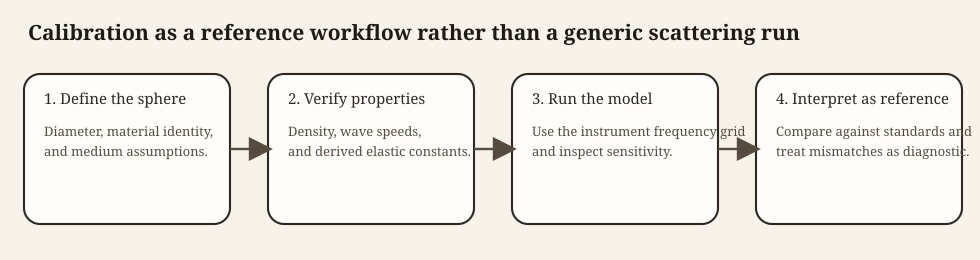

# Overview

```{r model_family_header, echo=FALSE, results='asis'}
acousticTS:::.model_family_header(
  family = "calibration",
  pages = c(
    Overview = "index.html",
    Implementation = "calibration-implementation.html",
    Theory = "calibration-theory.html"
  )
)
```


These pages are grounded in the standard-target calibration literature for elastic reference spheres [@Dragonette_1981; @Foote_1990; @Maclennan_1981].

```{r calibration_overview, echo=FALSE, results='asis'}
acousticTS:::.model_family_overview(
  family = "calibration",
  summary = paste(
    "`SOEMS` is the package's elastic solid-sphere family for standard-target",
    "calibration work. It follows the classic solid elastic sphere literature",
    "and is intended for metal calibration spheres whose compressional and",
    "shear wave physics matter directly."
  ),
  core_idea = paste(
    "Expand the exterior acoustic field and the interior elastic displacement",
    "field in spherical modes, enforce pressure, normal-velocity, and traction",
    "conditions at the sphere surface, and reconstruct the far-field",
    "backscatter from the resulting phase-shifted partial waves."
  ),
  best_for = c(
    "Calibration spheres made of tungsten carbide, copper, aluminum, steel, or similar elastic solids",
    "Frequency-response calculations for standard-target calibration workflows",
    "Benchmarking elastic spherical scattering against literature values"
  ),
  supports = c(
    "`CAL` objects representing homogeneous elastic spheres",
    "Solid elastic interiors with both longitudinal and shear wave support",
    "Medium `1` as seawater and medium `2` as the elastic solid sphere"
  ),
  assumptions = c(
    "Perfectly spherical homogeneous solid target",
    "Linear elasticity in the solid interior",
    "Inviscid exterior fluid",
    "No shell or internal cavity"
  ),
  reading = c(
    "[Implementation](calibration-implementation.html): calibration workflows and benchmark comparisons",
    "[Theory](calibration-theory.html): elastic-sphere modal theory and phase-shift representation"
  )
)
```

# Calibration as a reference workflow

SOEMS is not simply another spherical model. A calibration sphere is used as a
reference target, so its diameter, material properties, surrounding medium, and
frequency grid must describe the actual calibration conditions. A smooth or
plausible spectrum is not sufficient evidence that the reference response is
correct.

```{r calibration_workflow_map, echo=FALSE, out.width='100%', fig.align='center', fig.alt='Calibration workflow from defining and checking an elastic sphere through running SOEMS and interpreting the result as a reference.'}

```

The practical sequence is:

1. construct the sphere with the specified material and diameter,
2. confirm the elastic and surrounding-water properties against the source for
   the physical standard,
3. evaluate SOEMS on the instrument or comparison frequency grid, and
4. compare the result with the applicable reference curve before using it for
   calibration.

The [implementation page](calibration-implementation.html) shows object
construction, spectra, and external comparisons. The [material-properties
guide](../material-properties/material-properties.html) covers preparation of
non-default material inputs.

