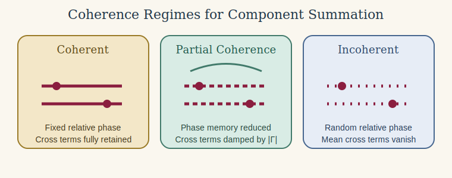

# Introduction

Component combination becomes most important in fish-like targets where anatomically distinct regions scatter in different regimes [@clay_horne_1994; @gorska_etal_2005; @stanton_acoustic_1996].

It is often tempting to build a composite target by running two canonical models separately and then combining the results. In a few restricted cases, that can be a useful first approximation. In many others, it fails for exactly the reasons that make scattering a wave problem rather than a bookkeeping exercise. The issue is not simply that there are several subcomponents. The issue is that the total response depends on how those components share phase, how they are positioned relative to one another, and whether they are weakly interacting enough that isolated calculations remain meaningful.

This article is therefore deliberately cautionary. Its purpose is not to forbid all component-wise combinations. Its purpose is to explain what must be true before such a combination is even approximately defensible, what kinds of sums are algebraically wrong from the start, and why a composite target is often a new scattering problem rather than a simple sum of old ones.

# The first distinction: amplitude versus intensity

Suppose two subscatterers produce complex backscattering amplitudes $f_1$ and $f_2$. If they can be treated as independent first-order contributors in a common surrounding field, then the combined amplitude is:

$$
  f_{\mathrm{tot}} \approx f_1 + f_2.
$$

The corresponding backscattering cross-section is:

$$
  \sigma_{\mathrm{bs,tot}} = |f_{\mathrm{tot}}|^2 = |f_1|^2 + |f_2|^2 + 2 \operatorname{Re}(f_1 f_2^*).
$$

The last term is the interference term. It is not optional, and it is exactly the term that disappears when a user jumps too quickly from a wave problem to a scalar bookkeeping shortcut. This is why one should not add target strengths in dB, should not add cross-sections when phase coherence matters, and should not imagine that a final scalar output contains enough information for a coherent sum unless the complex amplitude and a common phase reference are available.

That distinction between amplitude and intensity is the first gate in any component-combination workflow. If the available outputs do not preserve the phase information needed to build $f_{\mathrm{tot}}$, then a deterministic coherent composite prediction is already out of reach.

# Coherent versus incoherent summation

The next practical question is whether the subcomponents should be treated as phase coherent or phase incoherent. That choice is not a matter of convenience. It is a statement about the physics of the target and about the type of averaging, if any, that the user intends the result to represent.

## Coherent summation

Coherent summation is the appropriate first-order description when the relative phase between components is physically meaningful and stable for the quantity being predicted. In that case, one sums complex amplitudes:

$$
  f_{\mathrm{tot}} = \sum_{j=1}^{N} f_j e^{i \phi_j},
$$

where $\phi_j$ includes the translation phase, orientation-dependent phase, and any other shared reference-phase adjustments needed to place all components in one coordinate system.

The resulting cross-section is then:

$$
  \sigma_{\mathrm{bs,tot}} =
    \left|
  \sum_{j=1}^{N} f_j e^{i \phi_j}
  \right|^2.
$$

Expanding this shows that coherent summation retains all interference terms:

$$
  \sigma_{\mathrm{bs,tot}} =
    \sum_{j=1}^{N} |f_j|^2 +
    \sum_{j \neq \ell} f_j f_\ell^* e^{i(\phi_j - \phi_\ell)}.
$$

Coherent summation is therefore most appropriate when the geometry is fixed or nearly fixed, the relative positions of the components are known, the phase relationship survives the averaging procedure of interest, and the user wants a single-target prediction rather than an ensemble average over random realizations.

## Incoherent summation

Incoherent summation is appropriate only when the relative phases between components are effectively random over the ensemble of interest, so that the cross terms average away. In that case:

$$
  \left\langle
  f_j f_\ell^* e^{i(\phi_j - \phi_\ell)}
  \right\rangle
  \approx 0
  \qquad (j \neq \ell),
$$

and the ensemble-averaged cross-section reduces to:

$$
  \left\langle
  \sigma_{\mathrm{bs,tot}}
  \right\rangle
  \approx
  \sum_{j=1}^{N}
  \left\langle
  |f_j|^2
  \right\rangle.
$$

This is the mathematical statement behind incoherent addition. One is not claiming that the waves fail to interfere instantaneously. One is claiming that the interference does not survive the ensemble average being taken. That is a much narrower and more defensible statement.

Incoherent summation becomes plausible when component positions vary from realization to realization, posture randomization destroys stable phase alignment, spacing is uncertain enough that relative phase is not reproducible, or the quantity of interest is already an ensemble average rather than a deterministic single realization.

## Partial coherence

Many realistic cases lie between these two limits. Then the ensemble-averaged cross-section has the form:

$$
  \left\langle
  \sigma_{\mathrm{bs,tot}}
  \right\rangle =
    \sum_{j=1}^{N}
  \left\langle
  |f_j|^2
  \right\rangle +
    \sum_{j \neq \ell}
  \left\langle
  f_j f_\ell^* \Gamma_{j\ell}
  \right\rangle,
$$

where $\Gamma_{j\ell}$ is an effective coherence factor with magnitude between 0 and 1. The limiting cases are:

$$
  |\Gamma_{j\ell}| = 1
  \quad \text{for full coherence},
  \qquad
  \Gamma_{j\ell} = 0
  \quad \text{for full incoherence}.
$$

This is often the most honest description for biological targets, because posture variability, roughness, and unresolved internal structure may suppress interference without eliminating it completely.

Full coherence retains fixed relative phase and therefore full interference, incoherent averaging randomizes the phase enough that cross terms vanish in the mean, and partial coherence damps but does not eliminate them.

# What must be true before coherent summation is plausible

Coherent addition is only meaningful if all amplitudes are expressed in one common reference frame. That means more than using the same units. Each component must be referenced to the same incident field, the same origin convention, the same orientation convention, and the same phase reference. If two isolated calculations are performed with different implicit phase origins, then simply adding their amplitudes is meaningless even before any physics questions arise.

If component centers are located at positions $\mathbf{r}_1$ and $\mathbf{r}_2$, then even the simplest first-order combination requires translation phases of the form:

$$
  f_{\mathrm{tot}}
  \approx
  f_1 e^{2 i k \hat{\mathbf{k}} \cdot \mathbf{r}_1} +
    f_2 e^{2 i k \hat{\mathbf{k}} \cdot \mathbf{r}_2}.
$$

Without these factors, the interference term is wrong even when the components are otherwise weakly coupled. This is also why coherent and incoherent combinations cannot be chosen casually. If a user does not know the relative phase convention well enough to write these translation factors, that is already a warning sign that coherent summation may not be under control.

Weak mutual interaction is the second requirement. The simple coherent sum assumes that the field incident on component 1 is still essentially the external incident field, not the external field plus the rescattered field from component 2. Likewise for component 2. In other words, multiple scattering between components is neglected. That assumption is most plausible when the components are well separated relative to their characteristic size and when neither one strongly shadows or reradiates into the other.

# Why simple sums often break down

The most common reason simple component sums fail is multiple scattering. If one component scatters strongly enough to modify the field incident on the other, then the total field is no longer described by two isolated first-order returns. Instead, rescattering terms appear:

$$
  p_{\mathrm{tot}} =
    p_{\mathrm{inc}} +
    p_{\mathrm{scat},1} +
    p_{\mathrm{scat},2} +
    p_{12} + p_{21} + \cdots,
$$

where $p_{12}$ and $p_{21}$ denote intercomponent rescattering. Those terms are absent from isolated-model amplitudes, so a simple sum misses part of the physics immediately.

Geometric shadowing and exclusion cause a second kind of failure. If one component is close to, attached to, or embedded in another, then the illuminated region of one component depends on the presence of the other. In that case the actual boundary-value problem is not the superposition of two isolated canonical shapes. It is a new object with a new boundary, and the isolated solutions are no longer exact subsolutions of the composite target.

There is also a subtler failure mode in which the component models do not share the same approximation regime. A weak-scattering volume model and a high-frequency specular model may each be useful in their own intended limits, but simply adding their outputs can mix approximations that are not consistent within one common expansion. The arithmetic can look tidy while the physics becomes incoherent.

# Example: a fluid-like cylinder plus a gas-filled sphere

Suppose one considers combining `FCMS` for a fluid-like finite cylinder with `SPHMS` for a gas-filled sphere. This may be a reasonable exploratory approximation only if the sphere and cylinder are truly distinct components rather than one embedded boundary-value problem, if they are separated enough that multiple scattering between them is weak, if both are referenced to a common coordinate system and orientation convention, if amplitudes rather than target strengths are combined, and if the necessary translation phases are included before the total cross-section is formed.

Even then, the result is still only a first-order composite approximation rather than a single exact model. If instead the gas-filled sphere is attached to, partly inside, or very close to the cylinder, then the combination becomes much less defensible because the sphere changes the field seen by the cylinder and the cylinder changes the field seen by the sphere. At that point the coupled geometry should be treated as a new scattering problem rather than as an algebraic combination of two old ones.

# When a component sum is most defensible

Component-wise coherent summation is most plausible when the subscatterers are physically distinct, the interaction between them is weak, the surrounding field is approximately the same for each component, all amplitudes are expressed in a common phase convention, and the result is explicitly presented as a first-order approximation rather than as a complete composite solution.

This is the logic behind models such as `KRM`, where several components are combined inside one shared approximation framework rather than by naively adding unrelated final outputs from unrelated standalone models. If those conditions are not met, but the science question concerns an ensemble average over many random realizations, then incoherent or partially coherent addition may be more defensible than a deterministic coherent sum. Even then, that choice should be justified as an averaging argument, not as a generic algebraic shortcut.

# When one should not trust it

Supreme caution is warranted when components touch, overlap, or are embedded, when one component strongly shadows another, when the component models come from incompatible physical approximations, when the relative phase is unknown, or when the scientific question depends on absolute target strength rather than on rough trend comparison. In such cases, a component sum can still be informative as a sensitivity exercise, but it should not be mistaken for a defensible composite scattering model.

# Better alternatives

If a simple component sum is not good enough, the usual alternatives are to derive a composite approximation within one shared framework, build a dedicated segmented-body model for the coupled geometry, or move to a numerical boundary-element, finite-element, or other full-wave solver. Each of those alternatives is harder than a quick sum, but they are harder for a reason: they attempt to solve the actual coupled target rather than a simplified bookkeeping surrogate.

# A practical workflow checklist

Before combining any components, it is worth walking through a short checklist. Are the components physically distinct rather than overlapping or embedded? Are the underlying models formulated in compatible media and coordinate conventions? Do you have access to linear quantities or complex amplitudes rather than only `TS` in dB? Is the intended output a deterministic single-realization quantity or an ensemble average? Can you justify neglecting or averaging away multiple scattering and cross terms? If any answer is no, the component sum should be treated as a rough exploratory device at most.

# What not to do

Three shortcuts are especially common and especially risky. The first is adding target strengths in dB. That is simply wrong algebraically because dB values are logarithmic reports of linear quantities, not quantities that can themselves be superposed. The second is adding cross-sections from phase-coherent components without a justification for dropping interference. The third is combining outputs from different models without checking whether their amplitude conventions and coordinate references are compatible. The first shortcut is always wrong. The second and third can be wrong even when the arithmetic looks cleaner.

# When only `TS` is available

In some workflows, the user only has access to `TS` or to a reported `sigma_{\mathrm{bs}}` curve and not to the complex amplitude. In that case, a coherent combination is not available because the relative phase is missing. The only defensible fallback is an explicitly incoherent combination, and even that requires an averaging argument.

In practice, this means the reported `TS` should first be converted back to a linear quantity, the linear quantities should only be added when phase randomization is justified for the ensemble of interest, and the result should only then be converted back to `TS`. Even under those conditions, the outcome should be described as an incoherent ensemble approximation, not as the exact response of a composite target.

# Connection to package workflows

This cautionary logic is exactly why acousticTS distinguishes between comparing models and combining components. Comparing models asks how different formulations behave on the same target. Combining components asks whether separate subtargets can be turned into one composite prediction. Those are not interchangeable tasks. A model-comparison workflow can often be rigorous with matched inputs, while a component-combination workflow usually requires much stronger physical assumptions.

# Final rule

If one feels the urge to ask whether two model outputs can simply be added, the safe default answer is no. The useful follow-up question is narrower: can the two components be represented as weakly interacting subscatterers whose complex amplitudes may be added with a common phase reference as a first-order approximation? Only if the answer to that narrower question is yes does coherent component summation become plausible.
