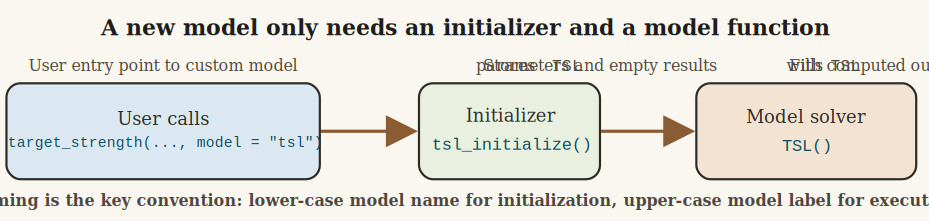

# Introduction

One of the most useful features of `acousticTS` is that a new target-strength model does not need a large registration framework. The package's `target_strength()` wrapper already handles the dispatch pattern. To add a new model, the minimum requirement is that two functions exist and follow the expected naming convention:

1. A lower-case initialization function named `*_initialize()`
2. A model function whose name is literally the model name in the form that `target_strength()` will call

For a toy target strength-length model called `TSL`, that means defining:

```{r eval = FALSE}
tsl_initialize <- function(...) { ... }
TSL <- function(object) { ... }
```

This vignette walks through that pattern and builds a simple example model from scratch. The example is intentionally simple. It is not meant to be a physically complete scattering model. Its purpose is to show how model dispatch, parameter storage, and result storage work inside the package.



# How `target_strength()` finds your model

The important part of `target_strength()` is that it does two passes. First, it initializes the object for the requested model. Second, it runs the model itself. Conceptually, the workflow is:

1. The user calls `target_strength(object, frequency, model = "tsl", ...)`
2. `target_strength()` looks for a function called `tsl_initialize`
3. That initializer stores the model parameters and creates an empty results slot under `$TSL`
4. `target_strength()` then looks for a function called `TSL`
5. `TSL()` computes the model output and fills in the stored results table

This is exactly the same pattern used by the existing model files. The details differ from model to model, but the basic workflow is the same in `R/acoustics.R` and in model files such as `R/model-dwba.R`.

For a simple model name like `"tsl"`, `target_strength()` converts the requested model into the upper-case model label `TSL`, then:

```{r eval = FALSE}
model_name <- paste0(model[idx], "_initialize")
object_copy <- do.call(model_name, true_args)
target_object <- do.call(ts_model[idx], list(object = target_object))
```

The practical consequence is straightforward. If you create `tsl_initialize()` and `TSL()`, and if they store their parameters and results under `$TSL`, the wrapper can find and run them.

# What the initializer is responsible for

The initializer does not calculate target strength itself. Its job is to:

1. Validate the incoming object and any model-specific arguments
2. Extract the geometric or material properties the model needs
3. Store those quantities in `slot(object, "model_parameters")`
4. Create an empty results table in `slot(object, "model")`

This separation is useful because it keeps argument parsing and object preparation out of the model solver itself. Existing models use the same pattern. In `dwba_initialize()`, for example, the function parses the scatterer, derives contrasts, computes wavenumbers, and creates empty result storage before `DWBA()` is ever called.

# A minimal `TSL` example

Suppose we want a simple empirical target strength-length model. We will define it in the logarithmic domain as:

$$
  TS = a + b \log_{10}(L_{mm})
$$

where `a` is an intercept, `b` is a slope, and `L_{mm}` is body length in millimeters. This is a deliberately simple example because it shows the package mechanics cleanly. The model uses length only, so frequency is accepted for interface consistency but does not alter the prediction.

## Step 1: create `tsl_initialize()`

The initializer below assumes that the target has a shape parameter called `length`. It stores frequency, the extracted length, and the empirical coefficients in the `$TSL` model-parameter slot, then creates an empty result table in the `$TSL` model slot.

```{r eval = FALSE}
tsl_initialize <- function(object,
                           frequency,
                           intercept = -70,
                           slope = 20) {
  shape <- acousticTS::extract(object, "shape_parameters")

  if (is.null(shape$length) || is.na(shape$length)) {
    stop(
      "TSL requires the target shape to have a defined length."
    )
  }

  model_params <- list(
    parameters = data.frame(
      frequency = frequency
    ),
    body = data.frame(
      length_m = shape$length
    ),
    coefficients = data.frame(
      intercept = intercept,
      slope = slope
    )
  )

  methods::slot(object, "model_parameters")$TSL <- model_params

  methods::slot(object, "model")$TSL <- data.frame(
    frequency = frequency,
    sigma_bs = rep(NA_real_, length(frequency))
  )

  object
}
```

There are three details here that matter a great deal.

First, the name has to be `tsl_initialize`, not `TSL_initialize` and not `initialize_tsl`. The wrapper looks for the lower-case model name with `"_initialize"` appended to it.

Second, the stored slot name has to match the model label that the wrapper will later use, which in this case is `$TSL`.

Third, the initializer should create the model result table even though it is still empty. That makes the object structure consistent before the model solver runs.

## Step 2: create `TSL()`

The model function itself should be simple. It pulls the prepared parameters out of `$TSL`, computes `TS`, converts to `sigma_bs`, and stores the finished results back into the model slot.

```{r eval = FALSE}
TSL <- function(object) {
  model <- acousticTS::extract(object, "model_parameters")$TSL

  length_mm <- model$body$length_m * 1e3
  intercept <- model$coefficients$intercept
  slope <- model$coefficients$slope

  TS <- intercept + slope * log10(length_mm)
  sigma_bs <- acousticTS::linear(TS)

  methods::slot(object, "model")$TSL <- data.frame(
    frequency = model$parameters$frequency,
    f_bs = rep(sqrt(sigma_bs), nrow(model$parameters)),
    sigma_bs = rep(sigma_bs, nrow(model$parameters)),
    TS = rep(TS, nrow(model$parameters))
  )

  object
}
```

This is enough for `target_strength()` to run the new model. The function name is literally `TSL`, which is what the wrapper will call after initialization.

The example above repeats the same `TS` value across all requested frequencies because this toy model does not use frequency. That is acceptable for a pedagogical example. A frequency-dependent model would instead calculate a vector whose length matches the input `frequency` vector.

# Putting the pieces into a source file

In practice, the cleanest place to put a new model is a new file such as `R/model-tsl.R`. A minimal version would look like this:

```{r eval = FALSE}
#' Target strength-length model (TSL)
#'
#' @description
#' A simple empirical target strength-length relationship.
#'
#' @section Usage:
#' This model is accessed via:
#' \preformatted{
#' target_strength(
#'   ...,
#'   model = "tsl",
#'   intercept,
#'   slope
#' )
#' }
#'
#' @name TSL
#' @aliases tsl TSL
NULL

tsl_initialize <- function(object,
                           frequency,
                           intercept = -70,
                           slope = 20) {
  ...
}

TSL <- function(object) {
  ...
}
```

That is the same broad organization used by the existing `model-*.R` files: roxygen block first, initializer next, solver function after that.

# Calling the new model

Once the functions are available in the package source, the new model can be called through the standard wrapper:

```{r eval = FALSE}
target <- target_strength(
  object = target,
  frequency = seq(38000, 120000, by = 1000),
  model = "tsl",
  intercept = -68,
  slope = 19.5
)
```

From the user's perspective, `TSL` then behaves like any other model. The results live in the model slot and can be inspected with:

```{r eval = FALSE}
extract(target, "model")$TSL
```

# Practical rules to keep in mind

When creating a new model, the following rules are the ones most likely to prevent headaches later.

1. The initializer name must be lower-case model name plus `_initialize()`.
2. The model function name must match the model label that `target_strength()` will call.
3. Both functions must store and retrieve values under the same slot name, such as `$TSL`.
4. The initializer should prepare parameters and an empty result table, not perform the actual model calculation.
5. The model function should return the updated object after filling in the result table.
6. Any extra arguments the user supplies either through `target_strength(..., model = "tsl", ...)` or through `target_strength(..., model_args = list(tsl = list(...)))` need to appear as formal arguments in `tsl_initialize()`.

# Where to go next

Once the minimal pattern is working, the next steps are usually:

1. Add roxygen documentation for the new model topic.
2. Add a theory or implementation vignette if the model is more than a toy example.
3. Add tests that check initialization, result-slot structure, and at least one reproducible output case.
4. Decide whether the model should report only `TS`, or whether it should also provide `f_bs`, `sigma_bs`, or any model-specific diagnostics.

The key point is that the package architecture is already set up for this pattern. If you provide a correctly named initializer and a correctly named model function, `target_strength()` can do the rest.
