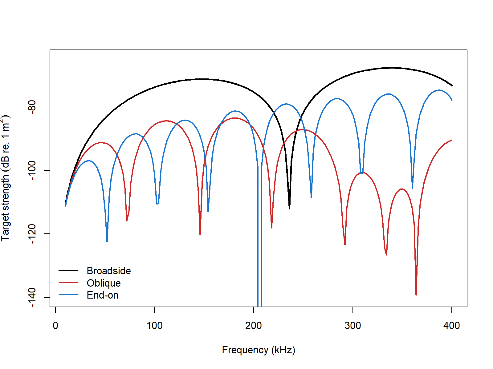

# acousticTS implementation

```{r model_family_header, echo=FALSE, results='asis'}
acousticTS:::.model_family_header(
  family = "dwba",
  pages = c(
    Overview = "index.html",
    Implementation = "dwba-implementation.html",
    Theory = "dwba-theory.html"
  )
)
```


These pages follow the weak-scattering elongated-body formulation and later applied fisheries-acoustics usage of the distorted-wave Born approximation [@morse_theoretical_1986; @stanton_sound_1998-1; @gastauer_zooscatrspan_2019].

The acousticTS implementation of deterministic DWBA follows the same object-based pattern used throughout the package. A fluid-like scatterer is constructed first, the model is then run through `target_strength()`, and the resulting backscattering quantities are stored back onto the same object. That workflow is especially useful for the DWBA because the model depends not only on material contrasts, but also on the discretized body geometry and the orientation assigned to the object.

## Fluid-like scatterer object generation

For deterministic DWBA, the relevant object class is `FLS`. The object may be supplied using direct contrasts such as `g_body` and `h_body`, or by supplying absolute material properties from which the contrasts can be derived relative to the surrounding medium. The important point is that the target should remain within the weak-scattering regime for which the DWBA is intended.

The example below uses a simple cylinder. That geometry is not meant to imply that DWBA is only for cylinders. It is simply a clean way to show how object construction and model execution fit together before moving on to more realistic weakly scattering bodies.

```{r}
library(acousticTS)

cylinder_shape <- cylinder(
  length_body = 15e-3,
  radius_body = 2e-3,
  n_segments = 50
)

cylinder_scatterer <- fls_generate(
  shape = cylinder_shape,
  g_body = 1.03,
  h_body = 1.03,
  theta_body = pi / 2
)

cylinder_scatterer
```

This object contains the geometry, the fluid-like material interpretation, and the orientation needed by the model. That makes it a good starting point for checking whether later differences in output come from frequency, orientation, or material contrast rather than from accidental changes in object setup.

## Calculating a target-strength spectrum

Once the `FLS` object is available, the DWBA model is called through `target_strength()` using `model = "dwba"`. In practice, the first useful run is usually a short frequency sweep that allows the user to inspect the overall response before moving on to larger parameter studies.

```{r}
frequency <- seq(50e3, 200e3, by = 10e3)

cylinder_scatterer <- target_strength(
  object = cylinder_scatterer,
  frequency = frequency,
  model = "dwba"
)
```

This step updates the object so that the model outputs are stored together with the original scatterer definition. That shared object structure is convenient because DWBA results are usually interpreted together with geometry and orientation rather than in isolation.

## Inspecting model results

Model results can be inspected visually or accessed directly with `extract()`. Both are useful, and they answer slightly different questions. Plotting is the quickest way to see whether the geometry and target-strength response are behaving sensibly. Extraction is the better choice when the results need to be compared across several runs or moved into a custom analysis workflow.

## Plotting results

```{r echo=FALSE, out.width=c('49%','49%'), fig.align='center', fig.alt='Pre-rendered DWBA example plots showing the segmented cylinder geometry and its stored target-strength spectrum.'}
knitr::include_graphics(c("dwba-shape-plot.png", "dwba-model-plot.png"))
```

The shape plot is worth checking even in simple examples because the DWBA is explicitly geometry dependent. A visually reasonable target-strength curve is not a substitute for confirming that the body segmentation, orientation, and overall dimensions are what the user intended.

## Accessing results

```{r}
dwba_results <- extract(cylinder_scatterer, "model")$DWBA
head(dwba_results)
```

The DWBA output includes the working frequency grid, the acoustic-size variable `ka`, the backscattering length `f_bs`, the backscattering cross-section `sigma_bs`, and target strength `TS`. Those quantities are related in the standard way:

$$
  \sigma_{\mathrm{bs}} = |f_{\mathrm{bs}}|^2,
  \qquad
  \mathit{TS} = 10 \log_{10}\left(\sigma_{\mathrm{bs}}\right).
$$

That relationship is useful to keep in mind when comparing deterministic DWBA results with stochastic or orientation-averaged outputs, because averages should generally be taken in linear space before being reported in dB.

## Comparison workflows

### Orientations

For elongated weak scatterers, orientation is often as important as the material contrasts. A quick orientation sweep is therefore one of the most informative first diagnostics. It reveals whether the body behaves in the broadside-dominated way expected for an elongated target and whether the frequency response changes through interference and projection effects as the viewing angle changes.

```{r echo=FALSE, out.width='85%', fig.align='center', fig.alt='Pre-rendered DWBA orientation comparison for the same weakly scattering cylinder at broadside, oblique, and end-on incidence.'}

```

This kind of comparison is useful because it shows how strongly the DWBA response is controlled by coherent summation along the body. Broadside, oblique, and end-on views do not simply rescale the same curve. They can also shift the pattern of constructive and destructive interference.

### Bundled biological target

Once the simple cylinder workflow is comfortable, the next useful step is usually to apply the same pattern to a more realistic weakly scattering body. In that setting, the practical questions are the same as in the simple example: is the object still within the weak-scattering regime, is the centerline geometry sensible, and is the chosen orientation convention the one intended for the scientific question?

The bundled `krill` object is a useful next step because it provides a more biologically motivated geometry while still fitting naturally into the same DWBA workflow.

### Published reference comparisons

For DWBA, the primary reference is the exact modal-series `Benchmark` column in the Jech weakly scattering sphere, prolate-spheroid, and cylinder files. The comparison below uses those canonical targets directly. Elapsed times are representative values from the current machine.

| Geometry | Max abs. $\Delta$ vs benchmark (dB) | Mean abs. $\Delta$ vs benchmark (dB) | Elapsed (s) |
|:--|--:|--:|--:|
| Weakly scattering sphere | 16.17744 | 0.29031 | 0.74 |
| Weakly scattering prolate spheroid | 0.04993 | 0.01735 | 5.11 |
| Weakly scattering cylinder | 2.28194 | 0.06664 | 2.53 |

Those values still need to be read carefully. The largest absolute $\Delta TS$ values are concentrated near deep nulls, so the sphere and cylinder maxima are driven by a small number of frequencies rather than by a uniform offset across the full sweep.

There is no comparable benchmarked configuration sweep for DWBA beyond the target definition itself. The implementation does not expose a PSMS-style family of numerical switches such as precision levels, adaptive modal truncation, or simplified coefficient branches. For this model, geometry, orientation, and material contrast are the meaningful benchmark parameterizations, so the table above already captures the relevant implementation comparison space.

### Bundled krill compatibility check

The bundled `krill` object serves a different role from the canonical modal-series targets above. Rather than testing an exact canonical-shape solution, it is used to verify that the stored segmented-body geometry reproduces the published deterministic DWBA implementation and to show how that same geometry compares with an independent software implementation.

| Comparison | Mean abs. $\Delta$ TS (dB) | Max abs. $\Delta$ TS (dB) |
|:--|--:|--:|
| acousticTS vs published McGehee MATLAB implementation | 1.23e-05 | 4.33e-05 |
| acousticTS vs independent DWBA implementation | 0.42284 | 1.01167 |
| Independent DWBA implementation vs published McGehee MATLAB implementation | 0.42284 | 1.01167 |

On this bundled krill geometry, acousticTS reproduces the published McGehee MATLAB implementation essentially exactly, while the independent implementation remains within about 1 dB of the same spectrum but does not collapse onto the published curve. That makes the canonical modal-series table above and the bundled krill comparison complementary: one checks exact isolated-shape behavior, and the other checks a published segmented-body DWBA target.
