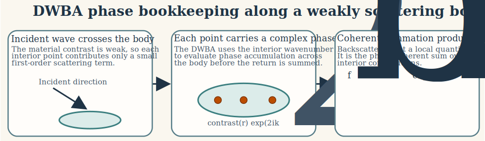
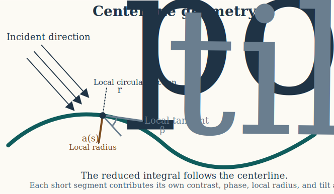
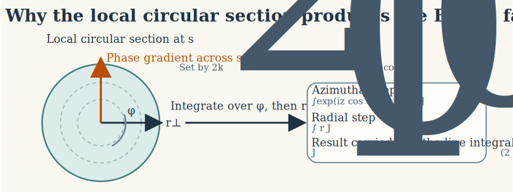
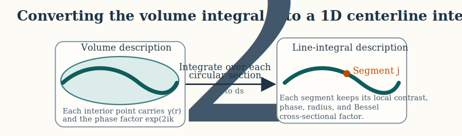

# Introduction

The distorted wave Born approximation (DWBA) is a first-order scattering model for weakly scattering fluid-like bodies. It is most useful when the material contrasts are small enough that the total acoustic field inside the body remains close to the incident field, but the geometry is sufficiently extended that phase accumulation along the body cannot be ignored[^1,^2]. In that regime, a purely local approximation is too crude, while a full boundary-value solution is often unnecessary or unavailable.

For elongated zooplankton and similar organisms, the most important consequence of the DWBA is that a three-dimensional volume scattering problem can be reduced to a one-dimensional integral along the body axis. That simplification is not an ad hoc shortcut. It follows from the weak-scattering approximation together with an elongated axisymmetric body representation.

# Weak-scattering formulation

## Governing equation in a heterogeneous fluid

Consider a lossless fluid with harmonic time dependence proportional to $e^{-i \omega t}$. Let the time dependence be harmonic, proprtional to $e^{-i \omega t}$. The linearized equations of motion are defined as: surrounding water be medium 1 with density $\rho_1$, sound speed $c_1$, compressibility $\kappa_1 = (\rho_1 c_1^2)^{-1}$, and wavenumber:

$$
  \begin{align*}
    \rho(\mathbf{x})\frac{\partial \mathbf{v}}{\partial t} &= -\nabla p, \\
    \frac{\partial \rho'}{\partial t} + \rho(\mathbf{x}) \, \nabla \cdot \mathbf{v} &= 0 \\
    p &= c^2(\mathbf{x}) \, \rho'.
  \end{align*}
$$

Eliminating particle velocity $\mathbf{v}$ and density perturbation $\rho'$ gives an acoustic equation in a heterogeneous medium. When the medium is decomposed into a homogeneous background plus a localized perturbation, the pressure field satisfies an inhomogeneous Helmholtz equation whose source term is produced by departures of density and compressibility from the background fluid.

$$
  k_1 = \frac{\omega}{c_1}.
$$

Let the body interior be medium 2 with corresponding parameters $\rho_2$, $c_2$, $\kappa_2 = (\rho_2 c_2^2)^{-1}$, and:

$$
  k_2 = \frac{\omega}{c_2}.
$$

When the heterogeneous body is embedded in an otherwise homogeneous surrounding fluid, the acoustic pressure in the background medium can be written in the form:

$$
  (\nabla^2 + k_1^2)p = -Q(\mathbf{r}),
$$

where $Q(\mathbf{r})$ is a source term supported only inside the body volume. The exact source term depends on the local departures of density and compressibility from the background fluid and on the total field inside the target. 

## Density and compressibility contrasts

The body differs from the surrounding fluid through density and compressibility contrasts. In the notation used for the DWBA, those are written as:

$$
\gamma_\kappa = \frac{\kappa_2 - \kappa_1}{\kappa_1},
\qquad
\gamma_\rho = \frac{\rho_2 - \rho_1}{\rho_2}.
$$

It is also common to use the contrast ratios:

$$
g = \frac{\rho_2}{\rho_1},
\qquad
h = \frac{c_2}{c_1}.
$$

These parameterizations are related by:

$$
\gamma_\kappa = \frac{1}{g h^2} - 1,
\qquad
\gamma_\rho = 1 - \frac{1}{g}.
$$

The weak-scattering assumption is precisely the assumption that these contrasts are small in magnitude:

$$
  |\gamma_\kappa| \ll 1,
  \qquad
  |\gamma_\rho| \ll 1.
$$

This is the step that justifies a first-order treatment of the scattering source.

## Born linearization and the distorted reference field

The formal solution of the inhomogeneous Helmholtz equation can be written with the background Green's function $G_1(\mathbf{r}, \mathbf{r}^\prime) using the Lippmann-Schwinger form:

$$
  p(\mathbf{r}) =
    p_{\mathrm{inc}}(\mathbf{r}) +
    \iiint_V
    G_1(\mathbf{r},\mathbf{r}')
    Q(\mathbf{r}') \, dV'.
$$

For a homogeneous background fluid, the scalar Green's function is:

$$
  G_1(\mathbf{r},\mathbf{r}') =
    \frac{
    e^{i k_1 |\mathbf{r} - \mathbf{r}'|}
    }{
    4 \pi |\mathbf{r} - \mathbf{r}'|
    },
$$

which satisfies:

$$
  (\nabla^2 + k_1^2)G_1(\mathbf{r},\mathbf{r}') = -\delta(\mathbf{r}-\mathbf{r}').
$$

The exact source term depends on the unknown total field inside the target. The Born step is precisely the replacement of that unknown interior field by an analytically tractable approximation. In the ordinary Born approximation, one writes:

$$
  p(\mathbf{r}') \approx p_{inc}(\mathbf{r}') = e^{i\mathbf{k}_1\cdot\mathbf{r}'}.
$$

The ordinary Born approximation linearizes the problem by replacing the unknown total field inside the target with the incident field in the surrounding medium. The DWBA keeps the same first-order amplitude logic, but improves the phase description by evaluating the interior reference field with the interior wavenumber $k_2$ rather than with $k_1$. 

The distorted wave Born approximation refines this linearization by separating amplitude and phase accuracy. While the scattering amplitude remains first order in the material contrasts, the phase of the internal field is evaluated using the interior wavenumber. This accounts for the fact that even weak contrasts can accumulate significant phase differences over distances comparable to the body length. The internal reference field is therefore taken as a transmitted or “distorted” plane wave:

$$
  p(\mathbf{r}') \approx e^{i\mathbf{k}_2\cdot\mathbf{r}'},
$$

with:

$$
  \mathbf{k}_2 = k_2\hat{\mathbf{k}},
  \qquad
  k_2 = \frac{\omega}{c_2}.
$$

In far-field backscatter, the outgoing Green's function contributes the return phase from each interior point to the receiver: 

$$
  |\mathbf{r}-\mathbf{r}'| 
    = r - \hat{\mathbf{r}}\cdot\mathbf{r}' + O(r^{-1})
  \qquad (r \to \infty).
$$

The asymptotic form can then be obtained:

$$
  G_1(\mathbf{r},\mathbf{r}') \sim \frac{e^{ik_1 r}}{4\pi r}e^{-ik_1\hat{\mathbf{r}}\cdot\mathbf{r}'}.
$$

:: {.note data-title="Note on notation"}
In the integral formulations above, a prime (e.g., $\mathbf{r}'$) is often used in the literature to distinguish the integration variable (source point within the scattering volume) from the observation point $\mathbf{r}$. 
For clarity and compactness, this distinction is not carried forward here. The position vector $\mathbf{r}$ is therefore understood to represent the integration variable within the body volume wherever it appears inside volume integrals.
:::

To first order, the backscattering amplitude becomes:

$$
  f_{bs} = 
    \frac{k_1^2}{4\pi} \iiint_V \left(\gamma_\kappa - \gamma_\rho \cos^2\beta\right) e^{2 i \mathbf{k}_2 \cdot \mathbf{r}} \, dV,
$$

where $\mathbf{k}_2$ is the interior propagation vector and $\beta$ is the local angle between the propagation direction and the body tangent. In the standard elongated-body form, this angular dependence is absorbed into the effective cross-sectional response, allowing the integrand to be written in the simplified isotropic contrast form:

$$
  f_{bs} = 
    \frac{k_1}{4\pi}
    \iiint_V
    \left(\gamma_\kappa - \gamma_\rho\right)
    e^{2 i \mathbf{k}_2 \cdot \mathbf{r}} \, dV.
$$

The essential physical idea is that each differential volume element contributes a small complex amplitude and the measured backscatter is the coherent sum of those contributions. The ordinary Born approximation would use the same coherent volume sum but with background-medium phase. The DWBA differs precisely in the choice of internal reference phase.

# Geometric reduction for an elongated axisymmetric body

## Centerline parameterization

Suppose the body is elongated and approximately axisymmetric. Let its centerline be parameterized by arclength $s$ through a position vector:

$$
\mathbf{r}_{\mathrm{pos}}(s),
$$

and let the local cross-sectional radius be $a(s)$. A small volume element is then expressed as a circular cross-section carried along the centerline. The tangent unit vector is:

$$
  \hat{\mathbf{t}}(s) =
    \frac{d \mathbf{r}_{\mathrm{pos}} / ds}
    {|d \mathbf{r}_{\mathrm{pos}} / ds|}.
$$

The local tilt angle relative to the incident direction is then defined by:

$$
  \cos \beta_{\mathrm{tilt}}(s) =
    \hat{\mathbf{k}} \cdot \hat{\mathbf{t}}(s).
$$

This angle matters because each local circular section is not always viewed front-on by the incident wave. The projected phase variation across the section depends on how the body is tilted relative to the propagation direction.

In the reduced formulation, the labeled point $\mathbf{r}_{\mathrm{pos}}(s)$ supplies the local phase reference, the tangent determines the local tilt angle $\beta_{\mathrm{tilt}}(s)$, and the local radius $a(s)$ controls the size of the cross-sectional diffraction factor.

## Local cylindrical coordinates

At each arclength location, introduce local cylindrical coordinates $(r_\perp,\varphi,s)$ so that:

$$
dV = r_\perp \, dr_\perp \, d\varphi \, ds.
$$

Within a short segment the centerline phase is approximated by the phase at the segment center, while the residual phase variation across the cross-section is retained explicitly. If the body contrasts are locally uniform across each section and the section is circular, then the volume integral separates into an axial phase factor and a cross-sectional diffraction integral:

$$
f_{\mathrm{bs}} =
\frac{k_1}{4 \pi}
\int
e^{2 i \mathbf{k}_2 \cdot \mathbf{r}_{\mathrm{pos}}(s)}
\left[
\int_0^{2 \pi}
\int_0^{a(s)}
\left(
\gamma_\kappa - \gamma_\rho
\right)
e^{2 i k_2 r_\perp \cos \beta_{\mathrm{tilt}}(s) \cos \varphi}
r_\perp \, dr_\perp \, d\varphi
\right]
ds.
$$

The body is therefore reduced to a coherent sum of local cross-sectional responses distributed along the centerline. Moreover, if the material properties contrast does nto vary across the local section, it can be taken outside the inner integral.

## Azimuthal and radial integration

The azimuthal integral is evaluated with the standard Bessel identity:

$$
\int_0^{2 \pi} e^{i z \cos \varphi} \, d\varphi = 2 \pi J_0(z).
$$

With:

$$
z = 2 k_2 r_\perp \cos \beta_{\mathrm{tilt}}(s),
$$

the cross-sectional integral becomes:

$$
  2 \pi
  \int_0^{a(s)}
  J_0\!\left(
  2 k_2 r_\perp \cos \beta_{\mathrm{tilt}}(s)
  \right)
  r_\perp \, dr_\perp.
$$

The remaining radial integral uses:

$$
  \int_0^a r J_0(br) \, dr =
  \frac{a J_1(ba)}{b}.
$$

Taking:

$$
b = 2 k_2 \cos \beta_{\mathrm{tilt}}(s),
$$

gives the familiar Bessel factor:

$$
  2 \pi
  \int_0^{a(s)}
  J_0\!\left(
  2 k_2 r_\perp \cos \beta_{\mathrm{tilt}}(s)
  \right)
  r_\perp \, dr_\perp =
    \pi a(s)
    \frac{
    J_1\!\left(
    2 k_2 a(s) \cos \beta_{\mathrm{tilt}}(s)
    \right)
    }{
    k_2 \cos \beta_{\mathrm{tilt}}(s)
    }.
$$

This is the exact origin of the cylindrical Bessel factor in the reduced DWBA expression. It is not inserted empirically. It appears because the cross-section is assumed circular and the phase varies linearly across that disk.

# Reduced line-integral form

Substituting the evaluated cross-sectional factor into the volume expression yields the elongated-body DWBA formula:

$$
  f_{\mathrm{bs}} =
    \frac{k_1}{4}
    \int
    \left(
    \gamma_\kappa - \gamma_\rho
    \right)
    e^{2 i \mathbf{k}_2 \cdot \mathbf{r}_{\mathrm{pos}}(s)}
    \frac{
    J_1\!\left(
    2 k_2 a(s) \cos \beta_{\mathrm{tilt}}(s)
    \right)
    }{
    \cos \beta_{\mathrm{tilt}}(s)
    }
    \left|
    d \mathbf{r}_{\mathrm{pos}}(s)
    \right|.
$$

If $s$ is true arclength, then $|d \mathbf{r}_{\mathrm{pos}}(s)| = ds$ and the expression becomes:

$$
  f_{\mathrm{bs}} =
    \frac{k_1}{4}
    \int
    \left(
    \gamma_\kappa - \gamma_\rho
    \right)
    e^{2 i \mathbf{k}_2 \cdot \mathbf{r}_{\mathrm{pos}}(s)}
    \frac{
    J_1\!\left(
    2 k_2 a(s) \cos \beta_{\mathrm{tilt}}(s)
    \right)
    }{
    \cos \beta_{\mathrm{tilt}}(s)
    }
    \, ds.
$$

Each factor now has a direct interpretation:

$$
  \begin{align*}
    \gamma_\kappa - \gamma_\rho &\Rightarrow \text{material property contrast} \\
    e^{2 i \mathbf{k}_2 \cdot \mathbf{r}_{pos}(s)} &\Rightarrow \text{two-way propagation phase} \\
    \frac{J_1\!\left(2 k_2 a(s) \cos\beta_{tilt}(s)\right)}{\cos\beta_{tilt}(s)} &\Rightarrow \text{exact cross-sectional diffraction}.
  \end{align*}
$$

# Orientation dependence and limiting behavior

At broadside incidence, the projected cross-sections remain large over much of the body and the coherent sum retains strong contributions from many segments. Toward end-on incidence, the projected section shrinks and the axial phase oscillates more rapidly, which tends to increase cancellation among adjacent segments.

The apparent singularity as $\cos \beta_{\mathrm{tilt}} \to 0$ is removable because:

$$
J_1(z) \sim \frac{z}{2}
\qquad \text{as } z \to 0.
$$

Therefore:

$$
\frac{
J_1\!\left(
2 k_2 a \cos \beta
\right)
}{
\cos \beta
}
\to
k_2 a
\qquad
\text{as } \cos \beta \to 0.
$$

So the DWBA remains finite in the end-on limit. The line-integral form is therefore well behaved even when the projected section becomes very small.

If the body is discretized into short segments, the integral is approximated by:

$$
  \mathcal{f}_{\text{bs}} \approx
    \frac{k_1}{4}
    \sum_{j=1}^{N}
    \left(
    \gamma_\kappa - \gamma_\rho
    \right)_j
    e^{2 i \mathbf{k}_2 \cdot \mathbf{r}_j}
    \frac{
    J_1\!\left(
    2 k_2 a_j \cos \beta_j
    \right)
    }{
    \cos \beta_j
    }
    \Delta s_j.
$$

This discrete form makes the physical interpretation especially clear. The DWBA is a coherent sum over body segments. Its frequency structure arises from interference among segment contributions, not from any single local term acting alone.

# Backscattering cross-section and target strength

Once the complex amplitude is known, the backscattering cross-section is:

$$
  \sigma_{\text{bs}} = 
    |\mathcal{f}_{\text{bs}}|^2,
$$

and target strength is:

$$
  \mathit{TS} = 
    10 \log_{10}\left(
    \sigma_{\text{bs}}
    \right).
$$

If an orientation distribution is prescribed, the quantity that should be averaged is the linear backscattering cross-section rather than the logarithmic target strength.

# Mathematical assumptions

The derivation above rests on a specific chain of assumptions:

1. The body is fluid-like, so no elastic shear waves are introduced.
2. Density and compressibility contrasts are small, so the source term can be linearized.
3. The interior field can be approximated by the distorted incident field with interior wavenumber $k_2$.
4. The body is elongated and approximately axisymmetric.
5. Each local cross-section is treated as circular and normal to the centerline tangent.
6. Multiple scattering within the body is neglected beyond first order.

These assumptions explain both the strength and the limitations of the DWBA. It is physically grounded for weakly contrasting fluid-like bodies, but it is not intended for rigid shells, elastic skeletons, or strongly resonant structures.

[^1]: Morse, P. M., and Ingard, K. U. (1968). *Theoretical Acoustics*. Princeton University Press.

[^2]: Stanton, T. K., Chu, D., and Wiebe, P. H. (1998). Sound scattering by several zooplankton groups. II. Scattering models. *The Journal of the Acoustical Society of America*, 103, 236-253.
