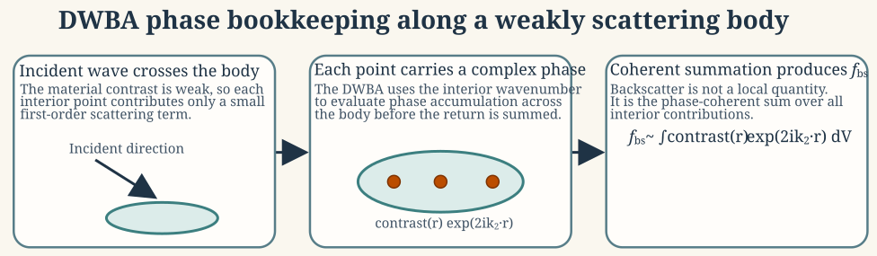
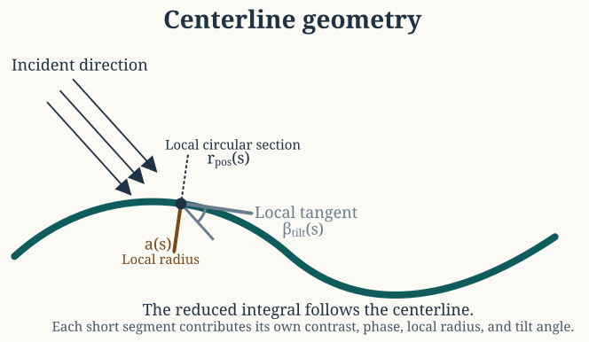
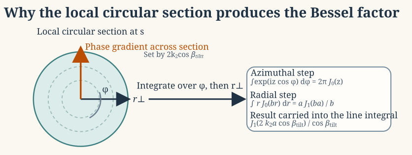
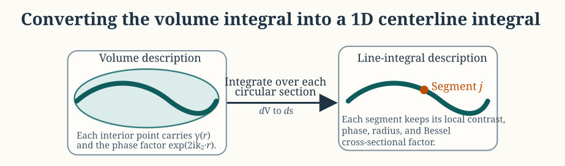

---
title: "Distorted wave Born approximation (DWBA) theory"
output:
  rmarkdown::html_vignette:
    toc: true
    number_sections: true
    fig_caption: yes
    fig_width: 3.5
    fig_height: 3.5
    dpi: 200
    dev.args: list(pointsize=11)
bibliography: ../REFERENCES.bib
link-citations: true
reference-section-title: References
vignette: >
  %\VignetteIndexEntry{Distorted wave Born approximation (DWBA) theory}
  %\VignetteEncoding{UTF-8}
  %\VignetteEngine{knitr::rmarkdown}
---

# Introduction

```{r model_family_header, echo=FALSE, results='asis'}
acousticTS:::.model_family_header(
  family = "dwba",
  pages = c(
    Overview = "index.html",
    Implementation = "dwba-implementation.html",
    Theory = "dwba-theory.html"
  )
)
```

The distorted wave Born approximation (DWBA) is a first-order model for weakly
scattering fluid-like bodies. It approximates the interior amplitude by a
reference field but evaluates its phase with the interior wavenumber. The
accumulated phase can therefore remain important even when density and
compressibility contrasts are small [@Stanton_1998_2].

For an elongated axisymmetric body, analytic integration over each circular
cross-section reduces the three-dimensional scattering integral to a
one-dimensional centerline integral.

::: {.note data-title="Shared conventions"}
Medium indices and scattering quantities follow [Notation and
symbols](../notation-and-symbols/notation-and-symbols.html). The governing wave
equation is introduced in the [Acoustic scattering
primer](../acoustic-scattering-primer/acoustic-scattering-primer.html).
:::

# Weak-scattering formulation

## Governing equation in a heterogeneous fluid

For a lossless heterogeneous fluid, the linearized momentum, continuity, and
state equations are [@Morse_1968]:

$$
  \begin{aligned}
  \rho(\mathbf{x})\frac{\partial \mathbf{v}}{\partial t} &= -\nabla p, \\
    \frac{\partial \rho'}{\partial t} + \rho(\mathbf{x}) \, \nabla \cdot \mathbf{v} &= 0, \\
    p &= c^2(\mathbf{x}) \, \rho'.
  \end{aligned}
$$

For exterior density $\rho_1$, sound speed $c_1$, and compressibility
$\kappa_1=(\rho_1c_1^2)^{-1}$, the background wavenumber is:

$$
  k_1 = \frac{\omega}{c_1}.
$$

Let the body interior be medium 2 with corresponding parameters $\rho_2$, $c_2$, $\kappa_2 = (\rho_2 c_2^2)^{-1}$, and:

$$
  k_2 = \frac{\omega}{c_2}.
$$

Eliminating $\mathbf v$ and $\rho'$ and separating the homogeneous background
from the localized material perturbation gives an inhomogeneous Helmholtz
equation:

$$
  (\nabla^2 + k_1^2)p = -Q(\mathbf{r}),
$$

where $Q(\mathbf{r})$ is a source term supported only inside the body volume. The exact source term depends on the local departures of density and compressibility from the background fluid and on the total field inside the target. 

## Density and compressibility contrasts

The body differs from the surrounding fluid through density and compressibility contrasts. In the notation used for the DWBA, those are written as:

$$
  \gamma_\kappa = \frac{\kappa_2 - \kappa_1}{\kappa_1},
  \qquad
  \gamma_\rho = \frac{\rho_2 - \rho_1}{\rho_2}.
$$

It is also common to use the contrast ratios:

$$
  g_{21} = \frac{\rho_2}{\rho_1},
  \qquad
  h_{21} = \frac{c_2}{c_1}.
$$

These parameterizations are related by:

$$
  \gamma_\kappa = \frac{1}{g_{21} h_{21}^2} - 1,
  \qquad
  \gamma_\rho = 1 - \frac{1}{g_{21}}.
$$

The weak-scattering assumption is precisely the assumption that these contrasts are small in magnitude:

$$
  |\gamma_\kappa| \ll 1,
  \qquad
  |\gamma_\rho| \ll 1.
$$

This is the step that justifies a first-order treatment of the scattering source.

## Born linearization and the distorted reference field

The formal solution uses the background Green's function
$G_1(\mathbf r,\mathbf r')$ in Lippmann--Schwinger form:

$$
  p(\mathbf{r}) =
    p_{\mathrm{inc}}(\mathbf{r}) +
    \iiint_V
  G_1(\mathbf{r},\mathbf{r}')
  Q(\mathbf{r}') \, dV'.
$$

For a homogeneous background fluid, the outgoing scalar Green's function is
[@Morse_1968]:

$$
  G_1(\mathbf{r},\mathbf{r}') =
    \frac{
  e^{i k_1 |\mathbf{r} - \mathbf{r}'|}
  }{
  4 \pi |\mathbf{r} - \mathbf{r}'|
  },
$$

which satisfies:

$$
  (\nabla^2 + k_1^2)G_1(\mathbf{r},\mathbf{r}') = -\delta(\mathbf{r}-\mathbf{r}').
$$

The source depends on the unknown interior field. The ordinary Born
linearization replaces it by the incident field:

$$
  p(\mathbf{r}') \approx p_{\mathrm{inc}}(\mathbf{r}')
  = e^{i\mathbf{k}_1\cdot\mathbf{r}'}.
$$

DWBA retains the first-order contrast amplitude but uses a transmitted, or
"distorted," reference phase inside the body:

$$
  p(\mathbf{r}') \approx e^{i\mathbf{k}_2\cdot\mathbf{r}'},
$$

The corresponding interior wavevector is:

$$
  \mathbf{k}_2 = k_2\hat{\mathbf{k}},
  \qquad
  k_2 = \frac{\omega}{c_2}.
$$

In far-field backscatter, the outgoing Green's function contributes the return phase from each interior point to the receiver: 

$$
  |\mathbf{r}-\mathbf{r}'| =
    r - \hat{\mathbf{r}}\cdot\mathbf{r}' + O(r^{-1})
  \qquad (r \to \infty).
$$

The Green's function then has the asymptotic form:

$$
  G_1(\mathbf{r},\mathbf{r}') \sim \frac{e^{ik_1 r}}{4\pi r}e^{-ik_1\hat{\mathbf{r}}\cdot\mathbf{r}'}.
$$

::: {.note data-title="Integration variable"}
The prime distinguishes the source point $\mathbf r'$ from the observation
point $\mathbf r$. Below, $\mathbf r$ denotes the source position whenever it
appears inside a volume integral.
:::

To first order, the backscattering amplitude becomes:

$$
  \mathcal{f}_\text{bs} =
    \frac{k_1k_2}{4\pi} \iiint_V \left(\gamma_\kappa - \gamma_\rho \cos^2\beta\right) e^{2 i \mathbf{k}_2 \cdot \mathbf{r}} \, dV,
$$

where $\mathbf{k}_2$ is the interior propagation vector and $\beta$ is the local angle between the propagation direction and the body tangent. In the standard elongated-body form, this angular dependence is absorbed into the effective cross-sectional response, allowing the integrand to be written in the simplified isotropic contrast form:

$$
  \mathcal{f}_\text{bs} =
    \frac{k_1k_2}{4\pi}
  \iiint_V
  \left(\gamma_\kappa - \gamma_\rho\right)
  e^{2 i \mathbf{k}_2 \cdot \mathbf{r}} \, dV.
$$

Each volume element contributes a contrast-weighted complex amplitude. DWBA
differs from the ordinary Born approximation through the interior reference
phase.




# Geometric reduction for an elongated axisymmetric body

## Centerline parameterization

Suppose the body is elongated and approximately axisymmetric. Let its centerline be parameterized by arclength $s$ through a position vector:

$$
  \mathbf{r}_{\mathrm{pos}}(s),
$$

and let the local cross-sectional radius be $a(s)$. A small volume element is then expressed as a circular cross-section carried along the centerline. The tangent unit vector is:

$$
  \hat{\mathbf{t}}(s) =
    \frac{d \mathbf{r}_{\mathrm{pos}} / ds}
  {|d \mathbf{r}_{\mathrm{pos}} / ds|}.
$$

The local tilt angle relative to the incident direction is then defined by:

$$
  \cos \beta_{\mathrm{tilt}}(s) =
    \hat{\mathbf{k}} \cdot \hat{\mathbf{t}}(s).
$$

This angle matters because each local circular section is not always viewed front-on by the incident wave. The projected phase variation across the section depends on how the body is tilted relative to the propagation direction.



In the reduced formulation, the labeled point $\mathbf{r}_{\mathrm{pos}}(s)$ supplies the local phase reference, the tangent determines the local tilt angle $\beta_{\mathrm{tilt}}(s)$, and the local radius $a(s)$ controls the size of the cross-sectional diffraction factor.

## Local cylindrical coordinates

At each arclength location, introduce local cylindrical coordinates $(r_\perp,\varphi,s)$ so that:

$$
  dV = r_\perp \, dr_\perp \, d\varphi \, ds.
$$

Within a short segment the centerline phase is approximated by the phase at the segment center, while the residual phase variation across the cross-section is retained explicitly. If the body contrasts are locally uniform across each section and the section is circular, then the volume integral separates into an axial phase factor and a cross-sectional diffraction integral:

$$
  f_{\mathrm{bs}} =
    \frac{k_1}{4 \pi}
  \int
  e^{2 i \mathbf{k}_2 \cdot \mathbf{r}_{\mathrm{pos}}(s)}
  \left[
  \int_0^{2 \pi}
  \int_0^{a(s)}
  \left(
  \gamma_\kappa - \gamma_\rho
  \right)
  e^{2 i k_2 r_\perp \cos \beta_{\mathrm{tilt}}(s) \cos \varphi}
  r_\perp \, dr_\perp \, d\varphi
  \right]
  ds.
$$

If contrast is uniform across a local section, it can be taken outside the
cross-sectional integral.

## Azimuthal and radial integration

The azimuthal integral is evaluated with the Bessel identity [@DLMF:ch10]:

$$
  \int_0^{2 \pi} e^{i z \cos \varphi} \, d\varphi = 2 \pi J_0(z).
$$

Using the substitution:

$$
  z = 2 k_2 r_\perp \cos \beta_{\mathrm{tilt}}(s),
$$

the cross-sectional integral becomes:

$$
  2 \pi
  \int_0^{a(s)}
  J_0\!\left(
  2 k_2 r_\perp \cos \beta_{\mathrm{tilt}}(s)
  \right)
  r_\perp \, dr_\perp.
$$

The remaining radial integral uses:

$$
  \int_0^a r J_0(br) \, dr =
    \frac{a J_1(ba)}{b}.
$$

Applying that identity with:

$$
  b = 2 k_2 \cos \beta_{\mathrm{tilt}}(s),
$$

gives the familiar Bessel factor:

$$
  2 \pi
  \int_0^{a(s)}
  J_0\!\left(
  2 k_2 r_\perp \cos \beta_{\mathrm{tilt}}(s)
  \right)
  r_\perp \, dr_\perp =
    \pi a(s)
  \frac{
  J_1\!\left(
  2 k_2 a(s) \cos \beta_{\mathrm{tilt}}(s)
  \right)
  }{
  k_2 \cos \beta_{\mathrm{tilt}}(s)
  }.
$$

The Bessel factor follows from a circular cross-section with linear phase across
the disk.



# Reduced line-integral form

Substituting the cross-sectional factor into the volume expression gives the
elongated-body DWBA formula [@Stanton_1998_2]:

$$
  f_{\mathrm{bs}} =
    \frac{k_1}{4}
  \int
  \left(
  \gamma_\kappa - \gamma_\rho
  \right)
  e^{2 i \mathbf{k}_2 \cdot \mathbf{r}_{\mathrm{pos}}(s)}
  \frac{
  J_1\!\left(
  2 k_2 a(s) \cos \beta_{\mathrm{tilt}}(s)
  \right)
  }{
  \cos \beta_{\mathrm{tilt}}(s)
  }
  \left|
  d \mathbf{r}_{\mathrm{pos}}(s)
  \right|.
$$

If $s$ is true arclength, then $|d \mathbf{r}_{\mathrm{pos}}(s)| = ds$ and the expression becomes:

$$
  f_{\mathrm{bs}} =
    \frac{k_1}{4}
  \int
  \left(
  \gamma_\kappa - \gamma_\rho
  \right)
  e^{2 i \mathbf{k}_2 \cdot \mathbf{r}_{\mathrm{pos}}(s)}
  \frac{
  J_1\!\left(
  2 k_2 a(s) \cos \beta_{\mathrm{tilt}}(s)
  \right)
  }{
  \cos \beta_{\mathrm{tilt}}(s)
  }
  \, ds.
$$

Each factor has a direct interpretation:

$$
  \begin{aligned}
  \gamma_\kappa - \gamma_\rho &\Rightarrow \text{material property contrast} \\
    e^{2 i \mathbf{k}_2 \cdot \mathbf{r}_{pos}(s)} &\Rightarrow \text{two-way propagation phase} \\
    \frac{J_1\!\left(2 k_2 a(s) \cos\beta_{tilt}(s)\right)}{\cos\beta_{tilt}(s)} &\Rightarrow \text{exact cross-sectional diffraction}.
  \end{aligned}
$$




# Orientation dependence and limiting behavior

At broadside incidence, the projected cross-sections remain large over much of the body and the coherent sum retains strong contributions from many segments. Toward end-on incidence, the projected section shrinks and the axial phase oscillates more rapidly, which tends to increase cancellation among adjacent segments.

The apparent singularity as $\cos \beta_{\mathrm{tilt}} \to 0$ is removable because:

$$
  J_1(z) \sim \frac{z}{2}
  \qquad \text{as } z \to 0.
$$

This asymptotic relation implies the removable-limit result:

$$
  \frac{
  J_1\!\left(
  2 k_2 a \cos \beta
  \right)
  }{
  \cos \beta
  }
  \to
  k_2 a
  \qquad
  \text{as } \cos \beta \to 0.
$$

So the DWBA remains finite in the end-on limit. The line-integral form is therefore well behaved even when the projected section becomes very small.

If the body is discretized into short segments, the integral is approximated by:

$$
  \mathcal{f}_{\text{bs}} \approx
  \frac{k_1}{4}
  \sum_{j=1}^{N}
  \left(
  \gamma_\kappa - \gamma_\rho
  \right)_j
  e^{2 i \mathbf{k}_2 \cdot \mathbf{r}_j}
  \frac{
  J_1\!\left(
  2 k_2 a_j \cos \beta_j
  \right)
  }{
  \cos \beta_j
  }
  \Delta s_j.
$$

The discrete DWBA is a coherent segment sum. Its spectral structure arises from
interference among segments.

# Backscattering cross-section and target strength

Once the complex amplitude is known, the backscattering cross-section is:

$$
  \sigma_{\text{bs}} =
    |\mathcal{f}_{\text{bs}}|^2,
$$

and target strength is [@MacLennan_2002]:

$$
  \mathit{TS} =
    10 \log_{10}\left(
  \frac{\sigma_{\text{bs}}}{1\ \mathrm{m}^2}
  \right).
$$

If an orientation distribution is prescribed, the quantity that should be averaged is the linear backscattering cross-section rather than the logarithmic target strength.

# Mathematical assumptions

The derivation above rests on a specific chain of assumptions:

1. The body is fluid-like, so no elastic shear waves are introduced.
2. Density and compressibility contrasts are small, so the source term can be linearized.
3. The interior field can be approximated by the distorted incident field with interior wavenumber $k_2$.
4. The body is elongated and approximately axisymmetric.
5. Each local cross-section is treated as circular and normal to the centerline tangent.
6. Multiple scattering within the body is neglected beyond first order.

DWBA is consequently intended for weakly contrasting fluid-like bodies, not
rigid shells, elastic skeletons, or strongly resonant structures.


