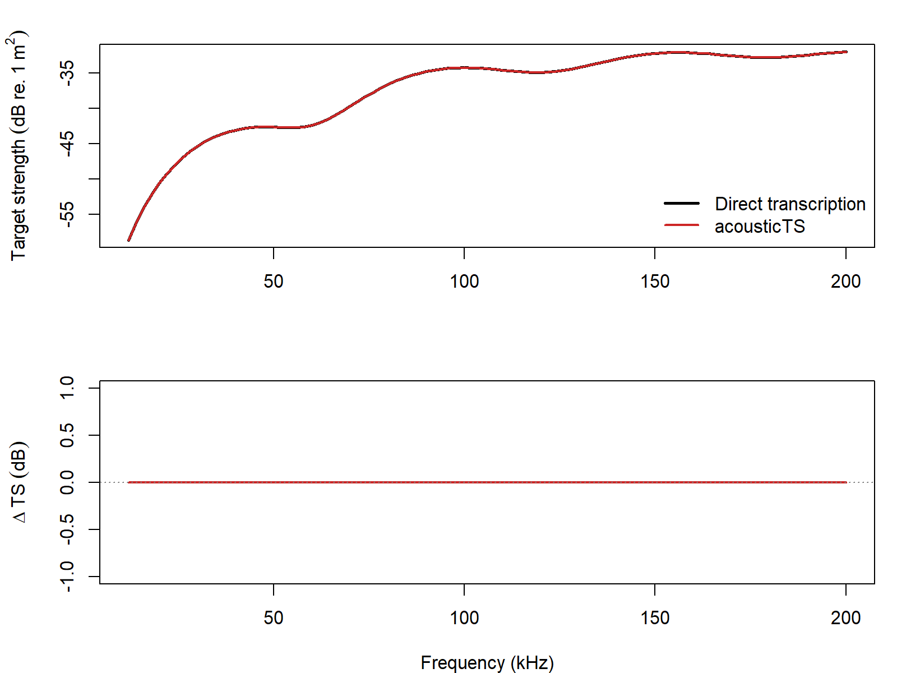

# acousticTS implementation

```{r model_family_header, echo=FALSE, results='asis'}
acousticTS:::.model_family_header(
  family = "ecms",
  pages = c(
    Overview = "index.html",
    Implementation = "ecms-implementation.html",
    Theory = "ecms-theory.html"
  )
)
```


These pages sit between the classical elastic-cylinder literature and later finite-length cylinder approximations used in fisheries acoustics [@faran_sound_1951; @stanton_sound_1988].

The elastic-cylinder modal-series solution is available through `target_strength(..., model = "ecms")`. The preferred geometry carrier is an elastic-cylinder `ESS` object, while the elastic material parameters are supplied through:

- `density_body`
- `sound_speed_longitudinal_body`
- `sound_speed_transversal_body`

The current implementation check uses an independent direct transcription of the Faran-Stanton algebra rather than a package-to-package comparison. That is useful for confirming that the package code path reproduces the intended elastic-cylinder algebra on a shared grid, but it is not a substitute for an external benchmark ladder or a separate public software implementation.

::: {.experiment data-title="Current validation"}
`ECMS` is still marked unvalidated because the current check is an independent algebra transcription rather than an external benchmark ladder or separate public software implementation.
:::

## Reference case

The reference cylinder uses:

- length `40 mm`
- radius `5 mm`
- body density `2800 kg m^-3`
- longitudinal speed `6398 m s^-1`
- transverse speed `3122 m s^-1`
- surrounding water density `1026.8 kg m^-3`
- surrounding water sound speed `1477.3 m s^-1`
- broadside incidence
- `12-200 kHz` in `2 kHz` steps

In acousticTS, the call is:

```{r}
library(acousticTS)

elastic_cylinder <- fls_generate(
  shape = cylinder(
    length_body = 0.04,
    radius_body = 0.005,
    n_segments = 201
  ),
  density_body = 2800,
  sound_speed_body = 1500,
  theta_body = pi / 2
)

elastic_cylinder <- target_strength(
  elastic_cylinder,
  frequency = seq(12e3, 200e3, by = 2e3),
  model = "ecms",
  density_sw = 1026.8,
  sound_speed_sw = 1477.3,
  sound_speed_longitudinal_body = 6398,
  sound_speed_transversal_body = 3122
)

head(extract(elastic_cylinder, "model")$ECMS)
```

## Implementation check

```{r echo = FALSE}
ecms_summary <- utils::read.csv(
  file.path(
    "..",
    "..",
    "tools",
    "implementation-figures",
    "data",
    "ecms_reference_compare_summary.csv"
  )
)

knitr::kable(
  data.frame(
    Metric = c(
      "Max abs. delta TS (dB)",
      "Mean abs. delta TS (dB)",
      "Frequency at max delta (kHz)",
      "acousticTS elapsed (s)",
      "Direct transcription elapsed (s)"
    ),
    Value = c(
      ecms_summary$max_abs_delta_TS_dB,
      ecms_summary$mean_abs_delta_TS_dB,
      ecms_summary$frequency_at_max_delta_kHz,
      ecms_summary$elapsed_acousticts_s,
      ecms_summary$elapsed_reference_s
    )
  ),
  digits = 6,
  col.names = c("Diagnostic", "Value")
)
```

This is not presented as a benchmark. It is an implementation identity check: the package output and the independent algebra transcription coincide on the shared grid, so the current `ECMS` code path is reproducing the stated elastic-cylinder series rather than drifting numerically from it.

### Spectrum overlay

```{r echo=FALSE, out.width='85%', fig.align='center', fig.alt='Pre-rendered ECMS comparison showing the direct reference spectrum, the acousticTS spectrum, and the residual across frequency.'}

```

## Closing note

The point of this page is therefore narrower than the benchmarked modal-series families. `ECMS` is not being claimed here as externally validated. What is being documented is that the package reproduces the elastic-cylinder algebra it claims to implement, across a full frequency band rather than only at a few checkpoint frequencies.
