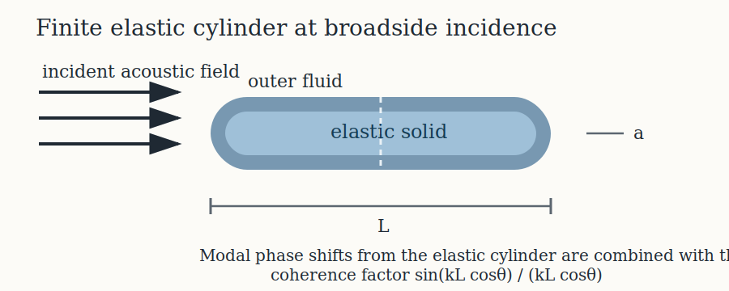

# Introduction

```{r model_family_header, echo=FALSE, results='asis'}
acousticTS:::.model_family_header(
  status = c("experimental", "unvalidated"),
  pages = c(
    Overview = "index.html",
    Implementation = "ecms-implementation.html",
    Theory = "ecms-theory.html"
  )
)
```

The elastic-cylinder modal-series solution combines two ingredients:

1. the phase-shift solution for an infinite elastic cylinder embedded in a fluid,
2. the ordinary finite-length coherence factor used near broadside.

Faran (1951) supplied the elastic-cylinder phase-shift machinery for solid cylinders and spheres, while Stanton (1988) adapted that structure to the finite-cylinder backscatter problem near normal incidence[^1][^2].

[^1]: Faran, J.J. (**1951**). *Sound scattering by solid cylinders and spheres*. J. Acoust. Soc. Am., 23: 405-418.

[^2]: Stanton, T.K. (**1988**). *Sound scattering by cylinders of finite length. II. Elastic cylinders*. J. Acoust. Soc. Am., 83: 64-67.

# Geometry and wave families

The geometry is a finite circular cylinder of radius $a$ and length $L$ immersed in an exterior fluid. The elastic interior supports both longitudinal and transverse waves, so the scattering problem is no longer determined by a single fluid wavenumber.

```{r echo = FALSE, out.width = "92%", fig.align = "center", fig.cap = "Elastic-cylinder bookkeeping used by ECMS near broadside incidence."}

```

The relevant wave numbers are

$$
k = \frac{\omega}{c_{sw}},
\qquad
k_L = \frac{\omega}{c_L},
\qquad
k_T = \frac{\omega}{c_T},
$$

where $c_{sw}$ is the exterior sound speed, $c_L$ is the longitudinal wave speed inside the elastic cylinder, and $c_T$ is the transverse wave speed.

# Phase shifts and modal sum

At broadside or near-broadside incidence, the infinite-cylinder elastic response can be written through cylindrical partial waves indexed by order $m$. The elastic boundary conditions generate an order-dependent phase shift $\eta_m$, and the backscatter contribution of each order takes the form

$$
(-1)^m \nu_m \sin\eta_m \left(\cos\eta_m - i \sin\eta_m\right),
$$

where $\nu_m$ is the Neumann factor.

The finite-length cylinder then introduces the usual coherence factor

$$
\frac{\sin(kL\cos\theta)}{kL\cos\theta},
$$

so the backscattering amplitude is

$$
f_{bs}

\propto
\frac{L}{\pi}
\frac{\sin(kL\cos\theta)}{kL\cos\theta}
\sum_{m=0}^{M}
(-1)^m \nu_m \sin\eta_m \left(\cos\eta_m - i \sin\eta_m\right).
$$

That is the combination implemented by `ECMS`.

# Intended regime

The model is intended for broadside or near-broadside incidence. It is not an end-on elastic-cylinder solver. That is why the implementation page uses $\theta = \pi/2$ for its reference check and why the function warns once the incidence angle moves too far away from that regime.

# Closing note

`ECMS` sits between the simpler fluid-cylinder modal series and the more elaborate general elastic-body scattering literature. The model keeps the full elastic phase-shift structure that matters at the cylinder boundary, but still uses the finite-cylinder coherence factor that makes the broadside finite-length problem tractable.
