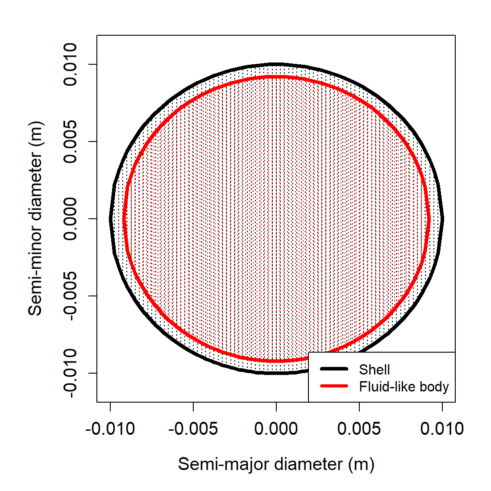
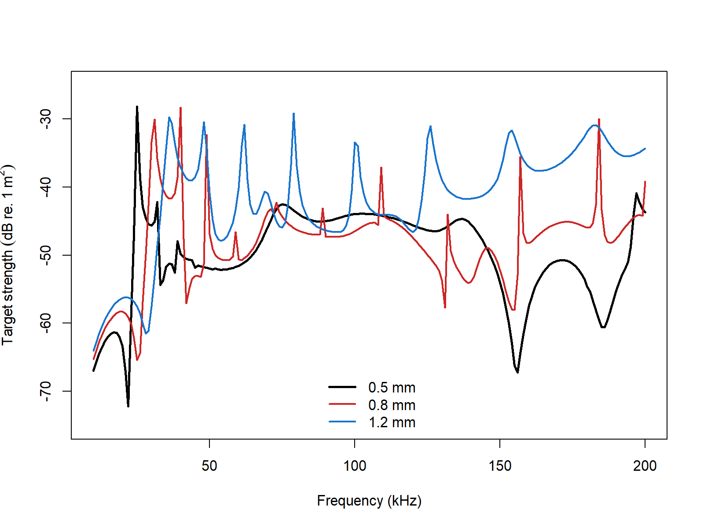

# acousticTS implementation

```{r model_family_header, echo=FALSE, results='asis'}
acousticTS:::.model_family_header(
  family = "essms",
  pages = c(
    Overview = "index.html",
    Implementation = "essms-implementation.html",
    Theory = "essms-theory.html"
  )
)
```


These pages are grounded in the classical elastic-shell scattering literature for fluid-filled spherical shells [@goodman_reflection_1962; @faran_sound_1951; @stanton_sound_1990].

The acousticTS package uses object-based scatterers so the same implementation pattern carries across models: create a scatterer, run `target_strength()`, inspect the stored model output, and then compare a small set of physically important inputs. For `ESSMS`, the required object class is `ESS`, which combines a spherical shell, an optional internal fluid, and the elastic constants required for the shell solution.

::: {.caution data-title="Current ESSMS status"}
`ESSMS` is unvalidated in the package. The benchmark family exists, but the implementation does not return finite full-grid `TS` values across those shell-sphere comparison sweeps, so this page documents behavior and limitations rather than benchmark-grade agreement.
:::

## Elastic-shelled sphere object generation

An `ESS` object can be created with `ess_generate()`. For the implementation below, the shell is described by its outer radius and thickness, while the shell material is described by density, sound speed, and elastic constants. The inner fluid can be provided using either contrasts or absolute material properties.

```{r}
library(acousticTS)

sphere_shape <- sphere(radius_body = 10e-3, n_segments = 80)

shelled_sphere <- ess_generate(
  shape = sphere_shape,
  radius_shell = 10e-3,
  shell_thickness = 0.8e-3,
  density_shell = 2565,
  sound_speed_shell = 3750,
  density_fluid = 1077.3,
  sound_speed_fluid = 1575,
  E = 7.0e10,
  nu = 0.32
)

shelled_sphere
```

## Calculating a TS-frequency spectrum

The `target_strength()` wrapper initializes the ESSMS model, performs the modal calculation, and stores the results back inside the same object. As with the rest of the package, frequency is supplied in Hz.

```{r}
frequency <- seq(38e3, 120e3, by = 4e3)

shelled_sphere <- target_strength(
  object = shelled_sphere,
  frequency = frequency,
  model = "essms"
)
```

## Extracting model results

Model results can be extracted either visually or directly through `extract()`.

### Plotting results

```{r echo=FALSE, out.width='49%', fig.align='center', fig.alt='Pre-rendered ESSMS example plot showing the shelled-sphere geometry used in the implementation example.'}

```

### Accessing results

```{r}
essms_results <- extract(shelled_sphere, "model")$ESSMS
head(essms_results)
```

The extracted `data.frame` contains the modeled frequency, complex backscattering amplitude `f_bs`, backscattering cross-section `sigma_bs`, and target strength `TS`.

## Comparison workflows

### Shell-thickness sensitivity

Shell thickness strongly affects the resonance structure of the ESSMS solution, so it is a natural first comparison when testing a new parameterization.

```{r echo=FALSE, out.width='85%', fig.align='center', fig.alt='Pre-rendered ESSMS shell-thickness comparison for thin, baseline, and thick shell cases over the same frequency sweep.'}

```

When you move from a tutorial object to a real calibration or biological shell, the next quantities to revisit are the shell elastic constants and the shell-to-fluid property contrast, because those control where the strongest modal features occur.