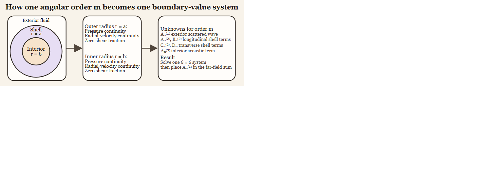

# Introduction

```{r model_family_header, echo=FALSE, results='asis'}
acousticTS:::.model_family_header(
  family = "essms",
  pages = c(
    Overview = "index.html",
    Implementation = "essms-implementation.html",
    Theory = "essms-theory.html"
  )
)
```


These pages are grounded in the classical elastic-shell scattering literature for fluid-filled spherical shells [@goodman_reflection_1962; @faran_sound_1951; @stanton_sound_1990].

An elastic shell is a solid scattering structure that supports both longitudinal ($\ell$) and transverse ($\tau$) wave within the shell material and encloses a fluid interior. The presence of multiple wave types and two fluid-solid interfaces leads to several distinct scattering mechanisms. 

The shell derivation specializes the usual interface statements to a fluid-solid-fluid system. Pressure and normal velocity are continuous across both shell interfaces, shear traction vanishes on the fluid sides because the exterior and interior media do not support shear stress, and the shell itself carries both longitudinal and transverse elastic waves.

# Elastic-shelled sphere theory 

The modal series solution for an elastic-shelled sphere is formulated by solving coupled wave equations in a fluid medium surrounding a fluid-filled elastic sphere. The key property that enables this modal series solution is that, after appropriate variable transformations, all governing equations reduce to Helmholtz equations that are separable in spherical coordinates. 

## Notation and geometry

The shell is centered at the origin with inner radius $b$ and outer radius $a$. The shell thickness is therefore:

$$
  \Delta = a - b.
$$

Points along the shell's surface, $\mathbf{x}$, are represented using spherical coordinates where $\mathbf{x} = (r, \theta, \varphi)$. In this model, there are three sets of material properties to consider: the exterior, surrounding medium ($c_1$, $\rho_1$); the elastic shell ($\lambda_2$, $\mu_2$, $\rho_2$, $c_\ell$, $c_\tau$); and the interior fluid ($c_3$, $\rho_3$). The material property contrasts are represented by:

$$
  g_{(ij)} = \frac{\rho_{(i)}}{\rho_{(j)}}, \quad  h_{(ij)} = \frac{c_{(i)}}{c_{(j)}},
$$

where $i$ and $j$ represent two separate media. Consequently, there are two primary interfaces: exterior-shell ($g_{21}$, $h_{21}$) and shell-interior ($g_{32}$, $h_{32}$).



The six scalar conditions arise because pressure and radial velocity are continuous at both radii, while shear traction vanishes at both fluid-solid interfaces.

## Required boundary conditions and reduction to Helmholtz equations

Inviscid, compressible fluids satisfy the linearized Euler and continuity equations, which combine with the equation of state to yield a scalar wave equation for pressure. The same steps apply in both the exterior and interior, with their respective material properties:

$$
  \rho \frac{\partial \mathbf{v}}{\partial t} = -\nabla p, \quad \frac{\partial \rho^\prime}{\partial t} + \rho \nabla \cdot \mathbf{v} = 0,
$$

where $p$ is the incident acoustic pressure and $\mathbf{v}(\mathbf{x}, t)$ is the particle velocity defined as:

$$
  \mathbf{v} = -\frac{1}{i \omega \rho} \nabla p.
$$

No boundary condition is imposed *a priori* on the fluid at the shell surface. Instead, continuity of normal velocity and normal traction at the fluid-solid interfaces constrains the admissible solutions of the Helmholtz equation:
$$
  \nabla^2 p + k^2p = 0.
$$

Consequently, the exterior pressure $p_1$ and interior pressure $p_3$ satisfy:

$$
  \nabla^2 p_1 + k_1^2p_1 = 0, \quad \nabla^2 p_3 + k_3^2p_3 = 0.
$$

The shell displacement, $\mathbf{u}$, satisfies the Navier equation, which describes elastic motion in an isotropic, homogeneous medium. This is the starting point for introducing longitudinal and transverse wave potentials:

$$
  (\lambda + 2\mu)\,\nabla(\nabla\cdot\mathbf{u}) - \mu\,\nabla\times(\nabla\times\mathbf{u}) + \rho_s \omega^2 \mathbf{u} = 0,
$$

where $\lambda$ and $\mu$ are the Lam\'e elastic constants and $\rho_2$ is the mass density of the shell. Applying the Helmholtz decomposition, $\mathbf{u}$ is written as:

$$
  \mathbf{u} = \nabla\phi + \nabla\times\mathbf{\Psi},
$$

which separates the elastic displacement into a compressional/longitudinal ($\phi$) and shear/transverse ($\mathbf{\Psi}$) potential. Substituting these quantities yields two independent Helmholtz equations:

$$
  \nabla^2 \phi + k_\ell^2 \phi = 0, \quad
  \nabla^2 \mathbf{\Psi} + k_\tau^2 \mathbf{\Psi} = 0,
$$

where $k_\ell$ and $k_\tau$ are the longitudinal and transverse wavenumbers, respectively. The associated wave speeds are given by:

$$
  c_\ell = \sqrt{\frac{\lambda + 2\mu}{\rho_2}}, \quad c_\tau = \sqrt{\frac{\mu}{\rho_2}}.
$$


## Separability of the Helmholtz equation in spherical coordinates

For axisymmetric excitation, all acoustic and elastic fields are independent of the azimuthal coordinate $\varphi$. Each scalar potential in the problem satisfies a Helmholtz equation of the form:

$$
  \nabla^2 \psi + k^2 \psi = 0,
$$

with the appropriate wavenumber for the surrounding fluid or for the longitudinal or transverse waves within the shell. Owing to the spherical geometry, these equations are separable in spherical coordinates, and solutions may be written as products of radial and angular functions.

As in the solid sphere case, the angular dependence is described by Legendre polynomials $P_m(\cos\theta)$, while the radial dependence is captured by spherical Bessel or Hankel functions. Consequently, each field admits an expansion of the form:

$$
  \psi(r,\theta) =
    \sum_{m=0}^\infty R_m(r)\,P_m(\cos\theta).
$$

The angular dependence is expressed with Legendre polynomials $P_m(\cos\theta)$, which ensures that different angular orders are mathematically independent. The orthogonality of $P_m(\cos\theta)$ is expressed as:

$$
  \int\limits_{-1}^{1} P_m(\mu) P_n(\mu)\,d\mu = \frac{2}{2m+1}\,\delta_{mn}.
$$

This modal decoupling holds regardless of shell thickness because it follows from spherical symmetry and the orthogonality of the angular eigenfunctions. Moreover, this remains valid even though multiple wave types are present within the shell. Consequently, each order $m$ yields an independent algebraic system. The complexity of the elastic response is therefore confined to the mode-dependent coefficient matrices, while the angular structure of the solution remains identical to that of a solid sphere.

## Modal expansions of the acoustic and elastic fields

Because the angular functions $P_m(\cos\theta)$ are orthogonal, the boundary conditions at the shell interfaces $r=a$ and $r=b$ decouple by angular order. Each angular mode $m$ therefore yields an independent system of equations. This allows all acoustic and elastic fields to be expanded in spherical eigenfunctions with mode-dependent coefficients.

### Incident and scattered fields

In both the exterior and interior fluid regions, the medium is assumed to be inviscid, homogeneous, and initially at rest. Under these assumptions the acoustic particle motion is irrotational, and a scalar velocity potential $\phi(\mathbf{x},t)$ exists such that:

$$
  \mathbf{v} = \nabla \phi .
$$

The acoustic pressure is related to the velocity potential by the linearized
momentum equation:

$$
  p = -\rho\,\frac{\partial \phi}{\partial t}.
$$

For time-harmonic fields with $e^{-i\omega t}$ dependence, the pressure can be further expressed as:

$$
  p = i\omega\rho\,\phi.
$$

Working with velocity potentials is advantageous because it reduces the governing equations in the fluid to a scalar Helmholtz equation and leads to boundary conditions that couple directly to the elastic shell displacement through normal velocity and normal traction continuity.

In each fluid region, the velocity potential satisfies the Helmholtz equation:

$$
  \nabla^2 \phi + k^2 \phi = 0.
$$

Separate velocity potentials are introduced for the incident plane wave and fluid regions:

$$
  \begin{aligned}
  \phi_\text{inc}(r, \theta) &=
    e^{ik_1 r\cos\theta} \\ &= \sum\limits_{m=0}^\infty i^m(2m+1)\,j_m(k_1 r)\,P_m(\cos\theta), \\
    \phi_1(\theta,r) &= \sum\limits_{m=0}^\infty i^m(2m+1) A_m^{(1)}\,h_m^{(1)}(k_1 r)\,P_m(\cos\theta), \\
    \phi_3(\theta,r) &= \sum\limits_{m=0}^\infty i^m(2m+1) A_m^{(3)}\,j_m(k_3 r)\,P_m(\cos\theta),
  \end{aligned}
$$

where the coefficients $A_m^{(1)}$ and $A_m^{(3)}$ are unknown modal amplitudes determined by the boundary conditions at the shell interfaces. The incident field $\phi_\text{inc}$ acts as a known forcing term in these conditions.

### Shell potentials

Within the elastic shell ($b<r<a$),the mechanical response of the material is governed by the equations of linear elastodynamics. Unlike the surrounding and interior fluids, the shell supports both compressional (longitudinal) and shear (transverse) elastic waves. As a result, the displacement field $\mathbf{u}$ in the shell cannot be described by a single scalar potential. Instead, it is decomposed using the Helmholtz decomposition into irrotational and solenoidal components.

Because the shell occupies an annular region and does not include the origin, both independent radial solutions of the Helmholtz equation are admissible. The longitudinal and transverse potentials are therefore expanded as:

$$
  \phi_2(r,\theta) = \sum_{m=0}^{\infty}
  \left[ A_m j_m(k_\ell r) + B_m y_m(k_\ell r) \right] P_m(\cos\theta),
  \qquad
  \Psi(r,\theta) = \sum_{m=0}^{\infty}
  \left[ C_m j_m(k_\tau r) + D_m y_m(k_\tau r) \right] P_m(\cos\theta).
$$

where $A_m$ and $B_m$ are the unknown longitudinal elastic coefficients and
$C_m$ and $D_m$ are the unknown transverse elastic coefficients for each
angular order $m$. Each set of coefficients represents the contribution of
angular order $m$ to the total displacement field.

Physically, the inclusion of both $j_m$ and $y_m$ terms reflects the fact that elastic waves in the shell can propagate both inward and outward between the inner and outer interfaces. These waves undergo multiple reflections within the shell and interact through the boundary conditions, giving rise to resonant behavior that depends on shell thickness, elastic properties, and frequency.

The elastic potentials do not directly represent observable quantities such as pressure or velocity. Instead, they serve as intermediate fields from which the displacement components and stresses are derived. Through the stress-displacement relations and interface boundary conditions, the elastic modal coefficients $(A_m, B_m, C_m, D_m)$ become coupled to the acoustic fields in the surrounding fluids. Solving this coupled system determines the elastic response of the shell and, ultimately, the acoustic scattering coefficients.


### Displacement components

The elastic displacement field in the shell is obtained from the longitudinal and transverse potentials according to:

$$
  \mathbf{u} = \nabla \phi_2 + \nabla \times \left( \mathbf{r}\, \Psi \right)
$$

which is the axisymmetric specialization of the Helmholtz decomposition. Substituting the modal expansions for $\phi_2$ and $\Psi$ yields expressions for the displacement components that separate by angular order.

For each angular mode $m$, the radial and tangential displacement components in the shell are:

$$
  \begin{aligned}
  u_r &=
    \sum_{m=0}^{\infty}
  \left[
  \frac{d\phi_m}{dr} +
    \frac{m(m+1)}{r} \psi_m
  \right]
  P_m(\cos\theta), \\
    u_\theta &=
    \sum_{m=0}^{\infty}
  \left[
  \frac{\phi_m}{r} +
    \frac{d}{dr}(r\psi_m)
  \right]
  \frac{dP_m(\cos\theta)}{d\theta},
  \end{aligned}
$$

where $\phi_m(r)$ and $\psi_m(r)$ denote the radial parts of $\phi_2$ and $\Psi$ for mode $m$, respectively. These expressions allow the stress and velocity boundary conditions at $r=a$ and $r=b$ to be written as linear combinations of the modal coefficients.

## Elastic constitutive relations and tractions

The elastic shell is modeled as a homogeneous, isotropic, linearly elastic solid. Its mechanical response is described by the Cauchy stress tensor $\boldsymbol{\sigma}$, which relates stress to displacement through Hooke's law for isotropic media.

In spherical geometry with axisymmetric motion, only the radial and polar displacement components $(u_r, u_\theta)$ are nonzero. As a result, only two traction components act on spherical interfaces: the normal (radial) stress $\sigma_{rr}$ and the shear stress $\sigma_{r\theta}$. These components enter directly into the boundary conditions at the shell-fluid interfaces.

## Stress displacement relations

For an isotropic, homogeneous elastic solid, the Cauchy stress tensor is related to the displacement field $\mathbf{u}$ by:

$$
  \sigma_{ij} =
    \lambda\,\delta_{ij}\,\nabla\cdot\mathbf{u} +
    2\mu\,\varepsilon_{ij},
  \quad
  \varepsilon_{ij} =
    \frac{1}{2}
  \left(
  \frac{\partial u_i}{\partial x_j} +
    \frac{\partial u_j}{\partial x_i}
  \right)
$$

where $\mathbf{u}$ is the displacement vector, $\varepsilon_{ij}$ is the infinitesimal strain tensor, and $\delta_{ij}$ is the Kronecker delta. These relations encode both volumetric deformation through $\nabla\cdot\mathbf{u}$ and shear deformation through the symmetric strain components.

For a spherically layered geometry with axisymmetric motion, only the radial and polar displacement components $(u_r, u_\theta)$ are nonzero. Consequently, only two traction components enter the boundary conditions: the normal stress $\sigma_{rr}$ and the shear stress $\sigma_{r\theta}$ acting on spherical surfaces. In spherical coordinates, these stress components are:

$$
  \begin{aligned}
  \sigma_{rr} &=
    (\lambda + 2\mu)\frac{\partial u_r}{\partial r} +
    \lambda
  \left(
  \frac{2u_r}{r} +
    \frac{1}{r}\frac{\partial u_\theta}{\partial\theta} +
    \frac{u_\theta\cot\theta}{r}
  \right), \\
    \sigma_{r\theta} &=
    \mu
  \left(
  \frac{1}{r}\frac{\partial u_r}{\partial\theta} +
    \frac{\partial u_\theta}{\partial r} -
    \frac{u_\theta}{r}
  \right).
  \end{aligned}
$$

The normal stress $\sigma_{rr}$ represents the radial traction exerted by the shell on the surrounding fluid or interior medium, while $\sigma_{r\theta}$ represents tangential (shear) traction along the spherical interface. Because fluids cannot sustain shear stress, $\sigma_{r\theta}$ must vanish at any fluid-solid boundary.

Substituting the modal displacement expressions derived above into these relations causes all angular dependence to factor into $P_m(\cos\theta)$ or its derivative. By orthogonality of the Legendre polynomials, each angular order remains uncoupled, and the stresses may be written in modal form as:

$$
  \begin{aligned}
  \sigma_{rr}^{(m)}(r,\theta) &=
    \Sigma_{rr}^{(m)}(r)\,P_m(\cos\theta), \\
    \sigma_{r\theta}^{(m)}(r,\theta) &=
    \Sigma_{r\theta}^{(m)}(r)\,
  \frac{dP_m(\cos\theta)}{d\theta},
  \end{aligned}
$$

where $\Sigma_{rr}^{(m)}(r)$ and $\Sigma_{r\theta}^{(m)}(r)$ are radial functions that depend linearly on the modal coefficients $(A_m, B_m, C_m, D_m)$ and their radial derivatives. Evaluating these expressions at $r=a$ and $r=b$ provides the traction terms required for the shell boundary conditions. Because inviscid fluids cannot sustain shear stress, $\sigma_{r\theta}$ vanishes at both shell interfaces. Together with continuity of normal stress and normal velocity, these relations close the elastic field equations and link the shell potentials to the acoustic fields.

## Boundary conditions

The shell occupies $b < r < a$. At each fluid-solid interface, continuity of normal stress and normal velocity is enforced, along with vanishing tangential traction in the surrounding fluids. Because the surrounding and interior media are inviscid fluids, the tangential (shear) traction must vanish at both interfaces. Projecting each condition onto $P_m(\cos\theta)$ and using orthogonality yields a mode-decoupled set of algebraic equations, so each angular order $m$ can be solved independently. Each equation is a linear combination of spherical Bessel functions and their derivatives evaluated at $r=a$ or $r=b$.

  <style>
/* The main container for the callout */
.note-callout {
border: 1px solid #1a1f33; /* Darker border around the entire block */
border-radius: 4px;
overflow: hidden; /* Ensures the border radius applies to children */
margin: 1em 0;
}

/* The blue title bar section */
.note-callout .note-title {
background-color: #1f3056; /* Dark blue background for the title */
color: #ffffff;             /* White text for the title */
padding: 10px 15px;
font-weight: bold;
display: flex;
align-items: center;
font-size: 1.2em;
}

/* A specific span for the light blue vertical line */
.note-callout .note-title .vertical-line {
border-left: 3px solid #5d93e1; /* Light blue line */
margin-right: 10px;
height: 1.2em; /* Aligns with the text height */
}

/* The body section where the main note text goes */
.note-callout .note-body {
background-color: inherit;
color: inherit; /* Inherit text color for accessibility */
padding: 15px;
border-left: 3px solid #5d93e1; /* The continuous light blue line down the left */
}
  </style>


  ::: {.note-callout}

  ::: {.note-title}
Sign conventions and normal direction
  :::

  ::: {.note-body}
A time-dependence of $e^{-i \omega t}$ is assumed. The outward radial direction defines the positive normal. Normal stresses are taken positive in compression, so the fluid pressure equals the normal compressive stress acting on the shell.
  :::

  :::

### Exterior interface $r=a$

At the shell-exterior fluid interface, using $\mathbf{v}_1 = -\frac{1}{i\omega\rho_1}\nabla p_1$ and $v_{n,1} = \mathbf{v}_1\cdot\mathbf{n}$ with $\mathbf{n}$ radial gives:

$$
  p_1 = \sigma_{rr},
  \quad -\frac{1}{i\omega\rho_1}\frac{\partial p_1}{\partial r} = -i\omega u_r,
  \quad
  \sigma_{r\theta} = 0
$$

with all evaluated at $r=a$.

### Interior interface $r=b$

At the shell-interior interface, continuity of pressure and radial velocity is enforced, together with vanishing shear traction. Using $\mathbf{v}_3 = -\frac{1}{i\omega\rho_3}\nabla p_3$ gives:

$$
  p_3 = \sigma_{rr},
  \quad -\frac{1}{i\omega\rho_3}\frac{\partial p_3}{\partial r} = -i\omega u_r,
  \quad
  \sigma_{r\theta} = 0
$$

with all evaluated at $r=b$.

### Boundary matrix construction

For each $m$, the six boundary conditions become six linear equations in the unknown modal coefficients. It is convenient to collect the unknowns into a vector:

$$
  \mathbf{x}_m = [\ A_m^{(1)}, \ A_m^{(2)},\ B_m^{(2)},\ C_m^{(2)},\ D_m,\ A_m^{(3)}]^T
$$

This system may also be written in matrix-form:

$$
  \mathbf{M}_m\,\mathbf{x}_m = \mathbf{F}_m
$$

Each row of $\mathbf{M}_m$ corresponds to a boundary condition:

$$
  \normalsize
  \begin{array}{r}
  \text{Exterior pressure continuity at } r = a \Longrightarrow \\
    \text{Exterior radial-velocity continuity at } r = a \Longrightarrow \\
    \text{Exterior shear traction condition } \sigma_{r\theta}(a) = 0 \Longrightarrow \\
    \text{Interior pressure continuity at } r = b \Longrightarrow \\
    \text{Interior radial-velocity continuity at } r = b \Longrightarrow \\
    \text{Interior shear traction condition } \sigma_{r\theta}(b) = 0 \Longrightarrow \\
    \end{array}
  \begin{bmatrix}
  \alpha_{11} & \alpha_{12} & \alpha_{13} & \alpha_{14} & \alpha_{15} & 0 \\
    \alpha_{21} & \alpha_{22} & \alpha_{23} & \alpha_{24} & \alpha_{25} & 0 \\
    0 & \alpha_{32} & \alpha_{33} & \alpha_{34} & \alpha_{35} & 0 \\
    0 & \alpha_{42} & \alpha_{43} & \alpha_{44} & \alpha_{45} & \alpha_{46} \\
    0 & \alpha_{52} & \alpha_{53} & \alpha_{54} & \alpha_{55} & \alpha_{56} \\
    0 & \alpha_{62} & \alpha_{63} & \alpha_{64} & \alpha_{65} & \alpha_{66}
  \end{bmatrix}
  \mathbf{x}_m =
    \begin{bmatrix}
  a_1 \\ a_2 \\ 0 \\ 0 \\ 0 \\ 0
  \end{bmatrix}
$$

The forcing terms $a_1$ and $a_2$ arise from the incident pressure and its radial derivative evaluated at the outer interface $r=a$, while the $\alpha_{ij}$ entries arise from the shell potentials and the interior fluid field. Each $\alpha_{ij}$ is a known scalar function of $m$, radius ($a$ or $b$), the different acoustic wavenumbers, and the relevant density ratios.

To make the construction explicit, the exterior pressure and radial-velocity
conditions produce the first two forcing terms and the first-column entries of
the matrix:

$$
  a_1 = \frac{\rho_1}{\rho_2} j_m(k_1 a),
  \quad
  \alpha_{11} = \frac{\rho_1}{\rho_2} h_m^{(1)}(k_1 a),
  \qquad
  a_2 = k_1 a\, j_m'(k_1 a),
  \quad
  \alpha_{21} = k_1 a\, h_m^{(1)'}(k_1 a),
$$

where primes denote derivatives with respect to the argument. Similarly, the interior pressure and radial-velocity conditions contribute entries such as:

$$
  \alpha_{46} = \frac{\rho_3}{\rho_2} j_m(k_3 b),
  \quad
  \alpha_{56} = k_3 b\, j_m'(k_3 b).
$$

The remaining $\alpha_{ij}$ terms are obtained by substituting the modal expressions for $u_r$ and $u_\theta$ into $\sigma_{rr}$ and $\sigma_{r\theta}$, then evaluating at $r=a$ and $r=b$. Explicit expressions for all $\alpha_{ij}$ are given in Goodman and Stern (1962) with some modifications described in Stanton (1990).

### Solving for $A_m^{(1)}$

For each angular order $m$, the interface conditions yield the linear system $\mathbf{M}_m \mathbf{x}_m = \mathbf{F}_m$, where the first unknown corresponds to the exterior scattering coefficient, $A_m^{(1)}$. For each $m>0$, $A_m^{(1)}$ is obtained by Cramer's rule:

$$
  A_m^{(1)} = -i^m (2m + 1)
  \frac{
  \det(\mathbf{M}_m^{(1)})
  }{
  \det(\mathbf{M}_m)
  }, ~ \text{for } m > 0
$$

The determinant ratio is built from:

$$
  \frac{\mathbf{M}_m^{(1)}}{\mathbf{M}_m} =
    \frac{
  \begin{bmatrix}
  \alpha_{1} & \alpha_{12} & \alpha_{13} & \alpha_{14} & \alpha_{15} & 0 \\
    \alpha_{2} & \alpha_{22} & \alpha_{23} & \alpha_{24} & \alpha_{25} & 0 \\
    0 & \alpha_{32} & \alpha_{33} & \alpha_{34} & \alpha_{35} & 0 \\
    0 & \alpha_{42} & \alpha_{43} & \alpha_{44} & \alpha_{45} & \alpha_{46} \\
    0 & \alpha_{52} & \alpha_{53} & \alpha_{54} & \alpha_{55} & \alpha_{56} \\
    0 & \alpha_{62} & \alpha_{63} & \alpha_{64} & \alpha_{65} & 0
  \end{bmatrix}
  }{
  \begin{bmatrix}
  \alpha_{11} & \alpha_{12} & \alpha_{13} & \alpha_{14} & \alpha_{15} & 0 \\
    \alpha_{21} & \alpha_{22} & \alpha_{23} & \alpha_{24} & \alpha_{25} & 0 \\
    0 & \alpha_{32} & \alpha_{33} & \alpha_{34} & \alpha_{35} & 0 \\
    0 & \alpha_{42} & \alpha_{43} & \alpha_{44} & \alpha_{45} & \alpha_{46} \\
    0 & \alpha_{52} & \alpha_{53} & \alpha_{54} & \alpha_{55} & \alpha_{56} \\
    0 & \alpha_{62} & \alpha_{63} & \alpha_{64} & \alpha_{65} & 0
  \end{bmatrix}
  }.
$$

::: {.note-callout}

::: {.note-title}
Matrix notation
:::

::: {.note-body}
The notation $\mathbf{M}_m$ and $\mathbf{M}_m^{(1)}$ is purely linear-algebra notation used to describe the mode-wise boundary system. It does not introduce any new physical coefficients. In particular, $\mathbf{M}_m^{(1)}$ denotes the matrix obtained by replacing the first column of the linear system with the forcing terms, as required by Cramer's rule.
:::

:::

At $m=0$, tangential terms vanish so the transverse contribution drops out and the system reduces to a smaller determinant ratio. This therefore defines $A_{m=0}^{(1)}$ as:

$$
  A_{m=0}^{(1)} = -
    \frac{
  \det(\widehat{\mathbf{M}}_m^{(1)})
  }{
  \det(\widehat{\mathbf{M}}_m)
  }, ~ \text{for } m \equiv 0
$$

The reduced determinant ratio is built from:

$$
  \frac{\widehat{\mathbf{M}}_m^{(1)}}{\widehat{\mathbf{M}}_m} =
    \frac{
  \begin{bmatrix}
  \alpha_{1} & \alpha_{12} & \alpha_{14} & 0 \\
    \alpha_{2} & \alpha_{22} & \alpha_{24} & 0 \\
    0 & \alpha_{42} & \alpha_{44} & \alpha_{46} \\
    0 & \alpha_{52} & \alpha_{54} & \alpha_{56}
  \end{bmatrix}
  }{
  \begin{bmatrix}
  \alpha_{11} & \alpha_{12} & \alpha_{14} & 0 \\
    \alpha_{21} & \alpha_{22} & \alpha_{24} & 0 \\
    0 & \alpha_{42} & \alpha_{44} & \alpha_{46} \\
    0 & \alpha_{52} & \alpha_{54} & \alpha_{56}
  \end{bmatrix}
  }.
$$

# Far-field backscatter

The incident plane wave is expanded in spherical Bessel functions and Legendre polynomials:

$$
  p_{\mathrm{inc}}(r,\theta) = P_0 e^{i k_1 r \cos\theta} =
    P_0\sum_{m=0}^{\infty} (2m+1) i^m j_m(k_1 r) P_m(\cos\theta).
$$

The spherical Bessel function of the first kind, $j_m$, is incorporated because the incident wave must be finite at the origin.

The scattered field is written as the sum of partial waves using outgoing spherical Hankel functions to enforce the Sommerfeld radiation condition:

$$
  p_{\mathrm{scat}}(r,\theta) =
    P_0 \sum_{m=0}^{\infty} (2m+1) A_m^{(1)}
  h_m^{(1)}(k_1 r) P_m(\cos\theta).
$$

When summed together, the total exterior pressure field becomes:

$$
  p_1 =
    p_{\mathrm{inc}} + p_{\mathrm{scat}} =
    P_0 \sum_{m=0}^\infty (2m + 1) i^m P_m(\cos\theta)
  \left[
  j_m(k_1r) + A_m^{(1)}h_m^{(1)}(k_1r)
  \right].
$$

In the far-field limit, $k_1 r \gg 1$, the spherical Hankel function satisfies:

$$
  h_m^{(1)}(k_1 r)
  \sim
  \frac{(-i)^{m+1} e^{i k_1 r}}{k_1 r}.
$$

Substituting this asymptotic form into the scattered-field expansion modifies $p_\text{scat}$ to:

$$
  p_\text{scat}(r, \theta) \sim
  \frac{P_0 e^{i k_1 r}}{k_1 r}
  \sum\limits_{m=0}^\infty (2m + 1)(-i)^{(m+1)} A_m^{(1)} P_m(\cos\theta).
$$

The far-field form function, $\mathcal{f}(\theta)$, is defined as the factor that relates the incident pressure amplitude to the scattered pressure at $k_1 r \gg 1$, normalized to remove the spherical spreading ($\frac{1}{r}$) and phase change ($e^{i k_1 r}$):

$$
  p_\text{scat}(r, \theta) \sim P_0 \frac{e^{i k_1 r}}{r} \mathcal{f}(\theta).
$$

Consequently, the form function, $\mathcal{f}(\theta)$, is written as:

$$
  \mathcal{f}(\theta) =
    \frac{1}{k_1}
  \sum\limits_{m=0}^\infty (2m + 1)(-i)^{(m+1)} A_m^{(1)} P_m(\cos\theta).
$$

Using the phase identity for the outgoing-wave prefactor gives:

$$
  \begin{aligned}
  \mathcal{f}(\theta) &=
    \frac{-i}{k_1}
  \sum\limits_{m=0}^\infty (2m + 1)(-i)^{(m)} A_m^{(1)} P_m(\cos\theta), \\ &=
    \frac{-i}{k}
  \sum\limits_{m=0}^\infty (2m + 1)A_m^{(1)} P_m(\cos\theta),
  \end{aligned}
$$

where the $(-i)^m$ term disappears since $A_m^{(1)}$ is defined to explicitly include it. 

In the backscattering direction where $\theta = \pi$, the Legendre polynomials simplify to:

$$
  P_m(\cos \theta) = P_m(-1) = (-1)^m.
$$

This gives the final linear scattering coefficient:

$$
  \mathcal{f}_\text{bs}(\theta = \pi) = -\frac{i}{k_1} \sum_{m=0}^{\infty} (2m+1) A_m^{(1)} (-1)^m.
$$

This coefficient therefore defines the backscattering cross-section and target strength through:

$$
  \sigma_\text{bs} = |\mathcal{f}_\text{bs}(\theta = \pi)|^2,
  \quad
  TS = 10\log_{10}\left(\sigma_\text{bs}\right).
$$

# Limiting cases and validation

The ESSMS solution reduces to several classical limits. If the shell stiffness becomes very large, radial motion is suppressed and the response approaches the fixed-rigid boundary limit. If the shear modulus tends toward zero while the shell and interior properties are adjusted consistently, the model approaches an acoustic layered-sphere description rather than a fully elastic shell. When the shell becomes thin relative to the radius, Stanton (1990) gives simplified interpretations in which guided circumferential motion becomes more prominent. These limits are useful numerical checks because they test whether the matrix assembly, density ratios, and wavenumber bookkeeping have all been applied consistently.

# Circumferential (Lamb-type) waves and shell thickness

The ESSMS formulation does **not** introduce Lamb waves as separate entities. Instead, circumferential or guided-wave behavior is implicit in the elastic shell solution through the coupled longitudinal and transverse potentials and the shell boundary conditions. These guided waves arise when the shell supports standing or traveling circumferential motion that is phase matched to the incident field. In practice, they appear as modal resonances in $A_m^{(1)}$ and as sharp features in $\mathcal{f}_\text{bs}$.

The involvement of circumferential waves increases as the shell becomes thinner relative to its radius because thickness controls the spacing and strength of guided-wave branches. A convenient scaling parameter is the nondimensional thickness $\tilde{\Delta} = (a-b)/a$ or equivalently the ratio of thickness to wavelength in the shell, $k_\ell(a-b)$ and $k_\tau(a-b)$. As $\tilde{\Delta} \to 0$, the shell behaves more like a thin plate wrapped into a cylinder/sphere, and low-order circumferential wave families (often referred to as Lamb-type symmetric/antisymmetric modes in the plate limit) become more weakly damped and more strongly coupled to the acoustic field. As $\tilde{\Delta}$ increases, the shell supports a larger number of through-thickness elastic modes, which shifts the resonances and typically reduces the dominance of any single circumferential branch.

In the ESSMS matrices, this thickness dependence is encoded entirely in the arguments $k_\ell a$, $k_\ell b$, $k_\tau a$, and $k_\tau b$, as well as in the stress continuity terms that couple radial and tangential motion. Therefore, any circumferential-wave effects are captured automatically by the modal system without introducing additional phenomenological terms.
