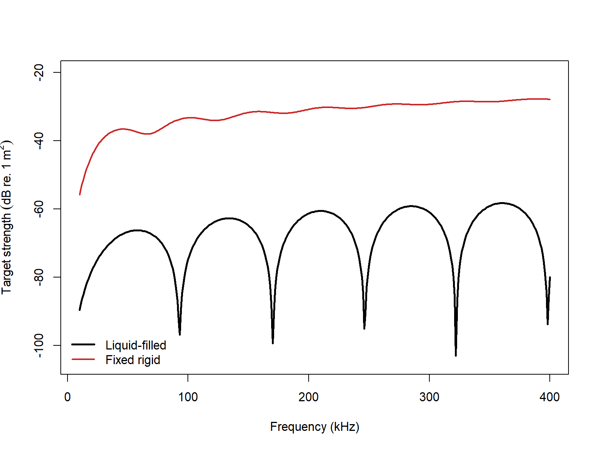

# acousticTS implementation

```{r model_family_header, echo=FALSE, results='asis'}
acousticTS:::.model_family_header(
  family = "fcms",
  pages = c(
    Overview = "index.html",
    Implementation = "fcms-implementation.html",
    Theory = "fcms-theory.html"
  )
)
```

The `acousticTS` package uses object-based scatterers, so the FCMS workflow follows the same broad pattern used elsewhere in the package: construct a geometry, attach the material properties needed for a cylindrical scatterer, evaluate target strength over the frequencies of interest, and then inspect how the result changes when the physically important assumptions are changed. For FCMS, the most important assumptions are usually the cylinder radius, cylinder length, orientation, and the boundary condition used to represent the cylinder interior.

The point of this implementation page is therefore not just to show which commands run. It is to show how the model is set up in a way that remains interpretable. A reader should be able to look at the input object and understand what geometric and material assumptions were actually passed into the FCMS calculation.

## Cylinder object generation

```{r}
library(acousticTS)

cylinder_shape <- cylinder(
  length_body = 50e-3,
  radius_body = 5e-3,
  n_segments = 80
)

cylinder_object <- fls_generate(
  shape = cylinder_shape,
  density_body = 1045,
  sound_speed_body = 1520,
  theta_body = pi / 2
)

cylinder_object
```

The cylinder geometry is built first because the FCMS expects a straight, constant-radius finite cylinder. That means the shape object is not a generic placeholder. It is the part of the workflow that states the physical idealization being used: a body of length `length_body`, radius `radius_body`, and a discretization fine enough to represent that idealized cylinder cleanly in later inspection and plotting steps.

The scatterer object then adds the material description. For a fluid-filled cylinder, `density_body` and `sound_speed_body` define the interior fluid properties, while `theta_body` defines the cylinder orientation relative to the incident field. In practice, this orientation parameter is often just as important as the material contrasts because the FCMS separates cross-sectional scattering from axial coherence. Changing the orientation changes the argument of both the transverse size parameter and the longitudinal coherence factor.

## Calculating a TS-frequency spectrum

```{r}
frequency <- seq(38e3, 150e3, by = 8e3)

cylinder_object <- target_strength(
  object = cylinder_object,
  frequency = frequency,
  model = "fcms",
  boundary = "liquid_filled"
)
```

This call evaluates the FCMS over a discrete frequency grid. The frequency sequence should be chosen with the interpretation in mind. A coarse grid may be adequate for broad trends, but it can miss modal structure or oscillatory interference if the spectrum varies rapidly. For cylinders, that matters most when the acoustic size grows and more cylindrical orders contribute meaningfully to the modal sum.

The `boundary` argument is also part of the model definition, not a cosmetic option. A `liquid_filled` boundary says that pressure and normal velocity are matched across a fluid-fluid interface. A `fixed_rigid` boundary says that normal motion is suppressed. A `pressure_release` boundary says that total pressure vanishes at the surface. Those alternatives often produce qualitatively different spectra, so boundary choice should be tied to the actual physical interpretation of the target.

## Extracting model results

Model results can be extracted either visually or directly through `extract()`.

### Plotting results

```{r echo=FALSE, out.width=c('49%','49%'), fig.align='center', fig.alt='Pre-rendered FCMS example plots showing the finite-cylinder geometry and its stored target-strength spectrum.'}
knitr::include_graphics(c("fcms-shape-plot.png", "fcms-model-plot.png"))
```

### Accessing results

```{r}
fcms_results <- extract(cylinder_object, "model")$FCMS
head(fcms_results)
```

At this stage, it is worth checking more than whether the model ran. Readers should confirm that the returned frequencies match the requested grid, that the target-strength values vary over a plausible range for the assumed cylinder, and that the results are being interpreted in the intended domain. FCMS output is often discussed in `TS`, but the underlying backscattering physics lives in the linear amplitude and cross-section quantities from which `TS` is derived.

## Comparison workflows

### Boundary conditions

```{r echo=FALSE, out.width='85%', fig.align='center', fig.alt='Pre-rendered FCMS comparison between liquid-filled and fixed-rigid finite cylinders over the same frequency sweep.'}

```

This comparison is useful because it isolates one of the most consequential FCMS decisions. Holding the geometry fixed and changing the boundary condition shows how much of the response is being driven by the circular shape itself and how much is being driven by the assumed interface physics. If two boundary choices produce materially different spectra, then the physical interpretation of the target interior is a first-order modeling decision rather than a minor sensitivity check.

For practical FCMS work, the first additional controls to revisit are usually:

1. the boundary choice, because it changes the modal coefficient equations themselves,
2. the orientation angle `theta_body`, because it changes both transverse scattering strength and axial coherence, and
3. the modal truncation limit `m_limit`, because larger acoustic size requires more retained cylindrical orders for stable convergence.

Those checks are especially important when comparing FCMS with other models. A fair comparison should keep the cylinder geometry, orientation convention, medium properties, and reporting domain consistent before any disagreement is interpreted as a model effect.

### Benchmark comparisons

FCMS can also be compared directly against the Jech cylindrical benchmark family stored in `benchmark_ts`. The table below uses the full cylindrical benchmark grid. Elapsed times are representative values from the current machine.

| Boundary | Max abs. delta TS (dB) | Mean abs. delta TS (dB) | Elapsed (s) |
|:--|--:|--:|--:|
| `fixed_rigid` | 0.19454 | 0.00914 | 0.01 |
| `pressure_release` | 0.00780 | 0.00263 | 0.03 |
| `gas_filled` | 0.00499 | 0.00245 | 0.05 |
| `liquid_filled` | 0.11453 | 0.00512 | 0.05 |

The pressure-release and gas-filled cases remain very close to the benchmark family across the full frequency grid. The larger residuals are confined to the fixed-rigid and liquid-filled branches, where the finite-cylinder benchmark curves show somewhat deeper minima than the present implementation at a small number of frequencies.

### Cross-software implementation checks

The same four cylindrical boundary definitions were also compared directly against the locally available `echoSMs` finite-cylinder implementation. This check serves a different purpose from the benchmark table above. It asks whether the software implementations agree with each other on the same finite-cylinder problem, and whether the remaining benchmark residual is shared rather than unique to `acousticTS`.

| Boundary | Mean abs. delta `acousticTS` vs `echoSMs` (dB) | Max abs. delta `acousticTS` vs `echoSMs` (dB) | Mean abs. delta `echoSMs` vs benchmark (dB) | Max abs. delta `echoSMs` vs benchmark (dB) |
|:--|--:|--:|--:|--:|
| `fixed_rigid` | 7.14e-09 | 1.64e-07 | 0.00914 | 0.19454 |
| `pressure_release` | 6.97e-09 | 1.59e-07 | 0.00263 | 0.00780 |
| `gas_filled` | 6.96e-09 | 1.59e-07 | 0.00245 | 0.00499 |
| `liquid_filled` | 4.36e-09 | 2.62e-07 | 0.00512 | 0.11453 |

The key point is that `acousticTS` and `echoSMs` collapse onto the same FCMS spectra to practical machine precision across all four boundary types. That means the larger fixed-rigid and liquid-filled benchmark residuals reported above are shared against the benchmark curve rather than being a disagreement between the two software implementations.

The main additional numerical switch in FCMS is `m_limit`, so the natural follow-up check is the same one used for SPHMS: hold the liquid-filled benchmark definition fixed and inspect how strongly the benchmark fit depends on a reduced modal cap.

| Boundary | `m_limit` | Max abs. delta TS (dB) | Mean abs. delta TS (dB) | Elapsed (s) |
|:--|:--|--:|--:|--:|
| `liquid_filled` | default rule | 0.11453 | 0.00512 | 0.05 |
| `liquid_filled` | `20` | 0.12618 | 0.00547 | 0.09 |
| `liquid_filled` | `10` | 43.09805 | 4.29035 | 0.01 |

That sensitivity check shows why the FCMS page does not need a large PSMS-style configuration matrix. The physically meaningful benchmark branches are the boundary conditions themselves. The extra argument is a modal truncation cap, and the benchmark comparison shows that it can be pushed somewhat, but not recklessly, before the cylindrical modal sum is no longer trustworthy.
