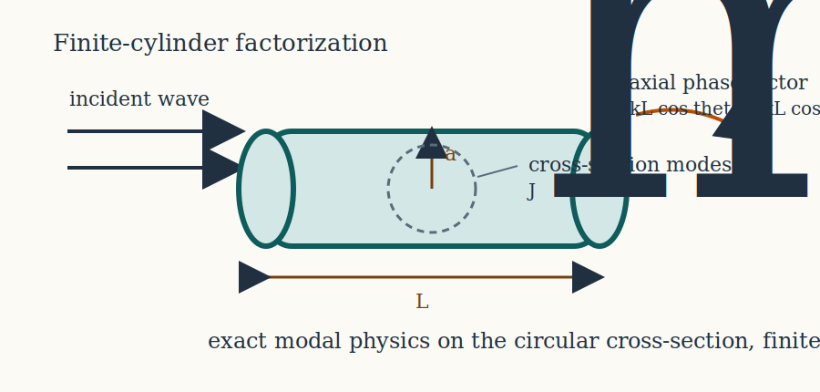
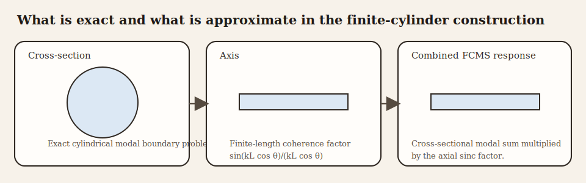
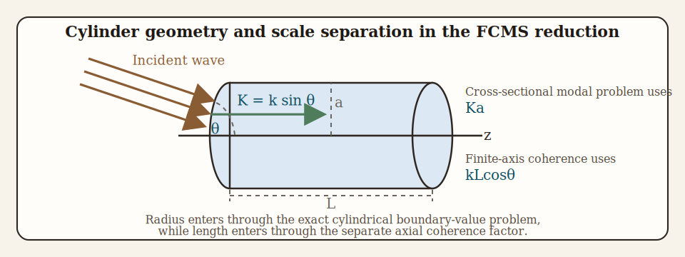

# Introduction

```{r model_family_header, echo=FALSE, results='asis'}
acousticTS:::.model_family_header(
  status = c("benchmarked"),
  pages = c(
    Overview = "index.html",
    Implementation = "fcms-implementation.html",
    Theory = "fcms-theory.html"
  )
)
```

The finite cylinder modal series solution (FCMS) is one of the standard ways to represent acoustic backscatter from straight cylinders of finite length.[^1][^2] Its appeal is that it retains the exact cylindrical-harmonic treatment of the circular cross-section while replacing the fully three-dimensional endcap problem with a finite-axis coherence factor. That combination makes the model substantially more informative than a purely asymptotic ray-style approximation, while still remaining much simpler than a complete three-dimensional elastic boundary-value treatment.

This structure is also the main conceptual point a reader should carry away from the model. The FCMS is not derived by separating variables for the entire finite cylinder, because a finite cylinder with endcaps is not globally separable in cylindrical coordinates. Instead, it is assembled from two pieces:

1. an exact two-dimensional modal solution for the circular cross-section, and
2. a finite-length axial phase integral that accounts for the coherent summation of contributions along a segment of length $L$.

In the cross-sectional problem, a rigid cylinder enforces zero normal velocity at $r = a$, a pressure-release cylinder enforces zero pressure there, and a fluid-filled cylinder enforces continuity of pressure and normal velocity between the exterior and interior media. The role of this vignette is to show how those cylindrical boundary conditions determine the coefficients $B_m$ and how the resulting cross-sectional response is combined with finite-axis coherence.

# Physical basis of the FCMS

## Infinite-cylinder scattering as the local starting point

The FCMS begins from the exact two-dimensional scattering problem for an infinite cylinder. In that reduced problem, the acoustic pressure satisfies the Helmholtz equation on the circular cross-section and the field separates naturally in polar coordinates $(r,\phi)$. Each azimuthal order $m$ then contributes an independent cylindrical harmonic, and the boundary condition at the cylinder surface $r=a$ determines the corresponding modal coefficient.

That part of the construction is exact for the idealized cross-section. If the radius is constant and the material properties do not vary around the circumference, the cross-sectional modal basis is the natural one, and the boundary-value problem is solved mode by mode without approximation.

The finite-cylinder step is different. The model assumes that the local cross-sectional response can be extended uniformly along a straight axis over a finite interval of length $L$. The endcaps are therefore not resolved as independent scattering surfaces in a fully coupled three-dimensional solution. Instead, their main effect is represented through longitudinal phase accumulation and cancellation. The three-dimensional backscatter is then built by multiplying the exact cross-sectional modal response by the coherent axial phase integral for a finite segment.

## Why the factorization works

This factorization is most natural when the cylinder is straight, of constant radius, and sufficiently regular that the dominant finite-length effect is phase cancellation along the axis rather than strong endcap scattering that feeds back into the entire boundary solution. In that regime, the circular cross-section controls the local scattering physics, while the finite axis controls how those local contributions add coherently in the backscattering direction.

The FCMS is therefore exact with respect to the circular cross-section but approximate with respect to the endcaps. That distinction matters physically. If the scientific question depends mainly on how material contrast and radius control the modal structure of the circular cross-section, FCMS is often very useful. If the question depends strongly on detailed end geometry or on full three-dimensional coupling near the cylinder tips, then the separated finite-axis factor becomes the main approximation to keep in mind.







The construction therefore has two distinct layers. The circular cross-section determines the cylindrical modal coefficients $B_m$. The finite axis of length $L$ and the orientation angle $\theta$ contribute the separate coherence factor $\sin(kL\cos\theta)/(kL\cos\theta)$. Radius $a$, transverse wavenumber $K = k\sin\theta$, and the axial phase scale $kL\cos\theta$ are the variables that keep those two layers connected without turning them into the same approximation.

# Finite-cylinder reduction

## Geometry and orientation

Consider a cylinder of radius $a$ and length $L$. Let $\theta$ denote the angle between the cylinder axis and the incident direction, so that $\theta = \pi/2$ corresponds to broadside incidence and $\theta \to 0$ corresponds to a direction increasingly aligned with the cylinder axis. Let $k = \omega/c_1$ denote the exterior acoustic wavenumber in the surrounding fluid of sound speed $c_1$.

The component of the incident wavenumber normal to the axis is:

$$
  K = k\sin\theta,
$$

while the phase variation along the axis is controlled by:

$$
  kL\cos\theta.
$$

Thus the cross-sectional scattering depends on the transverse size parameter $Ka$, while the finite-length directivity depends on the longitudinal phase difference $kL\cos\theta$. This separation of scale variables is one of the simplest ways to understand the model: radius enters through the cylindrical boundary-value problem, whereas length enters through coherent summation along the axis.

## Axial integration

If the cross-sectional scattering amplitude is taken to be uniform along the cylinder, then integrating the two-way phase factor along the axis gives:

$$
  \int_{-L/2}^{L/2} e^{2ikz\cos\theta}\,dz
  = L\frac{\sin(kL\cos\theta)}{kL\cos\theta}.
$$

This is the origin of the finite-length directivity factor. It is exactly the same sinc response that appears whenever a uniformly weighted segment is integrated coherently. The argument $kL\cos\theta$ states how much phase is accumulated from one end of the cylinder to the other in the backscattering geometry.

Therefore the backscattering amplitude is written as:

$$
  \mathcal{f}_\text{bs} = -\frac{L}{\pi}
  \frac{\sin(kL\cos\theta)}{kL\cos\theta}
  \sum_{m=0}^{\infty} i^{m+1}B_m.
$$

The derivation of the model is therefore reduced to deriving the cross-sectional modal coefficients $B_m$.

This is the crucial reduction. The finite-cylinder problem is not solved by direct three-dimensional separation. Instead, it is decomposed into an exact cross-sectional modal problem and a one-dimensional axial coherence problem. Readers should interpret that factorization carefully: the modal sum tells us how the circumference satisfies the boundary condition, while the sinc term tells us how those local responses interfere when distributed over a segment of finite length.

# Cylindrical modal expansion

## Separation of variables on the cross-section

For the infinite-cylinder cross-section, the acoustic pressure satisfies:

$$
  \nabla^2 p + K^2p = 0,
$$

where $K=k\sin\theta$ is the transverse wavenumber. In polar coordinates $(r,\phi)$:

$$
  \frac{\partial^2 p}{\partial r^2} + \frac{1}{r}\frac{\partial p}{\partial r} + \frac{1}{r^2}\frac{\partial^2 p}{\partial\phi^2} + K^2p = 0.
$$

Writing the cross-sectional field as a product of radial and angular factors:

$$
  p(r,\phi) = R(r)\Phi(\phi).
$$

Substituting and dividing by $R\Phi$ gives:

$$
  r^2\frac{R''}{R} + r\frac{R'}{R} + K^2r^2 = -\frac{\Phi''}{\Phi}.
$$

Since the left-hand side depends only on $r$ and the right-hand side only on $\phi$, both must equal the same separation constant, say $m^2$. Hence:

$$
  \Phi'' + m^2\Phi = 0,
$$

with periodic solutions $\cos(m\phi)$ and $\sin(m\phi)$, and the radial equation:

$$
  r^2R'' + rR' + (K^2r^2-m^2)R = 0.
$$

This is Bessel's equation, whose solutions are $J_m(Kr)$, $Y_m(Kr)$, and the outgoing combination $H_m^{(1)}(Kr)$. Regularity at the axis $r=0$ excludes the singular solution $Y_m$ from the incident and interior regular fields, while the outgoing radiation condition selects the Hankel function of the first kind for the scattered field.

## Incident field in cylindrical coordinates

For the cross-sectional problem, the incident plane wave is expanded in cylindrical harmonics:

$$
  e^{iKr\cos\phi} = \sum_{m=0}^{\infty} \epsilon_m i^m J_m(Kr)\cos(m\phi),
$$

where the Neumann factor is:

$$
  \epsilon_0 = 1,
  \qquad
  \epsilon_m = 2 \quad (m\ge1).
$$

This expansion is the cylindrical counterpart of the spherical partial-wave expansion of a plane wave.

It is obtained by expressing the plane-wave phase factor $e^{iKr\cos\phi}$ in the complete angular basis $\cos(m\phi)$ and matching the associated radial dependence to the regular Bessel functions. The Neumann factor $\epsilon_m$ is simply a bookkeeping device that allows the cosine-series expansion to be written in a compact one-sided form over nonnegative mode number.

## Scattered field

The outgoing scattered field is expanded as:

$$
  p_{scat}(r,\phi) = \sum_{m=0}^{\infty} \epsilon_m i^m B_m H_m^{(1)}(Kr)\cos(m\phi).
$$

The coefficients $B_m$ are determined by the boundary condition on the cylinder surface $r=a$.

Because the cosine functions are orthogonal on $0 \le \phi \le 2\pi$, each azimuthal order can be solved independently once the relevant boundary condition is imposed. That mode independence is one of the main practical advantages of the circular geometry. The FCMS does not require a coupled dense matrix across all azimuthal orders. Instead, one solves either a scalar modal equation or, for fluid-filled cylinders, a small mode-local system.

Explicitly, the orthogonality relation is:

$$
  \int_0^{2\pi} \cos(m\phi)\cos(n\phi)\,d\phi =
  \begin{cases}
    2\pi, & m=n=0, \\
    \pi, & m=n\ge 1, \\
    0, & m\ne n.
  \end{cases}
$$

This is the reason the boundary condition decouples mode by mode.

# Boundary-condition derivations

## Fixed rigid cylinder

For a rigid cylinder, the surface does not admit normal motion. In an inviscid acoustic fluid, normal particle velocity is proportional to the normal pressure gradient, so on the circular boundary $r=a$ the condition becomes:

$$
  \left.\frac{\partial}{\partial r}(p_{inc}+p_{scat})\right|_{r=a}=0.
$$

Using the cylindrical modal expansion and orthogonality of the cosine functions gives, for each $m$:

$$
  J_m'(Ka) + B_m H_m^{(1)\prime}(Ka)=0.
$$

The rigid-boundary coefficient is therefore:

$$
  B_m = -\frac{J_m'(Ka)}{H_m^{(1)\prime}(Ka)}.
$$

Including the parity convention of the backscattering geometry yields the usual coefficient form:

$$
  B_m = (-1)^m\epsilon_m\frac{J_m'(Ka)}{H_m^{(1)\prime}(Ka)}.
$$

## Pressure-release cylinder

For a pressure-release boundary, total pressure vanishes at the surface:

$$
  p_{inc}(a,\phi)+p_{scat}(a,\phi)=0.
$$

Mode by mode, this gives:

$$
  J_m(Ka) + B_m H_m^{(1)}(Ka)=0,
$$

The pressure-release coefficient is therefore:

$$
  B_m = -\frac{J_m(Ka)}{H_m^{(1)}(Ka)}.
$$

Again including the backscattering parity convention gives:

$$
  B_m = (-1)^m\epsilon_m\frac{J_m(Ka)}{H_m^{(1)}(Ka)}.
$$

## Fluid-filled cylinder

For a fluid-filled cylinder, the interior field must also be expanded because the incident wave excites pressure fluctuations inside the cylinder as well as outside it. Let $\rho_1$ and $c_1$ denote the exterior density and sound speed, and let $\rho_2$ and $c_2$ denote the corresponding interior properties. Define the density contrast $g=\rho_2/\rho_1$ and sound-speed contrast $h=c_2/c_1$.

The interior transverse wavenumber is then:

$$
  K' = \frac{K}{h},
$$

where $h=c_2/c_1$ is sound-speed contrast. The interior field is then written as:

$$
  p_{int}(r,\phi) = \sum_{m=0}^{\infty}\epsilon_m i^m C_m^{(int)} J_m(K'r)\cos(m\phi).
$$

At the boundary $r=a$, continuity of pressure gives:

$$
  J_m(Ka) + B_m H_m^{(1)}(Ka) = C_m^{(int)}J_m(K'a),
$$

and continuity of normal velocity gives:

$$
  \frac{1}{\rho_1}\left[J_m'(Ka)+B_m H_m^{(1)\prime}(Ka)\right]
  = \frac{1}{\rho_2}\frac{K'}{K}C_m^{(int)}J_m'(K'a).
$$

Solving the pressure-continuity equation for the interior coefficient gives:

$$
  C_m^{(int)} = \frac{J_m(Ka)+B_mH_m^{(1)}(Ka)}{J_m(K'a)}.
$$

Substituting this into the velocity condition gives:

$$
  J_m'(Ka)+B_mH_m^{(1)\prime}(Ka) = 
    gh\,\frac{J_m'(K'a)}{J_m(K'a)}
    \left[J_m(Ka)+B_mH_m^{(1)}(Ka)\right],
$$

where $g=\rho_2/\rho_1$ and $h=c_2/c_1$. Rearranging yields:

$$
  B_m
  \left[H_m^{(1)\prime}(Ka)-gh\frac{J_m'(K'a)}{J_m(K'a)}H_m^{(1)}(Ka)\right] =
  gh\frac{J_m'(K'a)}{J_m(K'a)}J_m(Ka)-J_m'(Ka).
$$

Solving for the exterior scattering coefficient gives:

$$
  B_m =
  \frac{gh\dfrac{J_m'(K'a)}{J_m(K'a)}J_m(Ka)-J_m'(Ka)}
       {H_m^{(1)\prime}(Ka)-gh\dfrac{J_m'(K'a)}{J_m(K'a)}H_m^{(1)}(Ka)}.
$$

After expressing the Hankel function as:

$$
  H_m^{(1)} = J_m + iY_m,
$$

and separating real and imaginary parts, this coefficient is commonly rewritten as:

$$
  B_m = -\frac{\epsilon_m}{1+iC_m},
$$

The auxiliary ratio is:

$$
  C_m =
  \frac{
    \left[J_m'(K'a)Y_m(Ka)\right]/\left[J_m(K'a)J_m'(Ka)\right]
    - gh\left[Y_m'(Ka)/J_m'(Ka)\right]
  }{
    \left[J_m'(K'a)J_m(Ka)\right]/\left[J_m(K'a)J_m'(Ka)\right]
    - gh
  }.
$$

This expression is not introduced independently. It is simply the ratio that appears when the two boundary equations are solved for the exterior coefficient.

The physics is the same as for any fluid-fluid modal scattering problem: one imposes continuity of pressure and normal velocity, solves for the unknown interior coefficient, and substitutes back to obtain the scattered-field coefficient. The difference from the rigid and pressure-release cases is that the boundary condition couples exterior and interior fields rather than imposing a single vanishing quantity at the boundary.

The associated linear algebra remains mode-local. For each azimuthal order $m$, the rigid and pressure-release boundaries give a single scalar coefficient equation, while the fluid-filled boundary gives a $2\times2$ system for the exterior and interior amplitudes. Unlike problems with noncircular cross-sections, no cross-mode coupling appears here because the circular boundary preserves the orthogonality of the cylindrical harmonics exactly.

# Modal truncation

The modal series is infinite, but at finite acoustic size only a finite number of modes contribute materially. The required number of retained modes grows with $Ka$, reflecting the broader angular spectrum of larger cylinders as the cross-sectional acoustic size increases.

A practical truncation rule is of the form:

$$
  m_{max} \approx \lceil ka \rceil + C,
$$

with a modest positive constant $C$ chosen to ensure convergence.

Once $m_{max}$ is fixed, the calculation is therefore a straightforward truncated sum: solve the scalar or $2\times2$ coefficient problem for each $m=0,1,\ldots,m_{max}$, evaluate the cross-sectional modal contribution, and then multiply the resulting series by the finite-length axial coherence factor. In that sense, FCMS truncation limits the number of retained cylindrical harmonics, but it does not create a dense global matrix problem.

It is also helpful to remember what truncation does and does not mean physically. Truncating the series does not change the underlying boundary condition; it only limits how many angular harmonics are retained to represent it numerically. If too few modes are kept, the model loses accuracy by under-resolving the angular structure of the cross-sectional field, especially at larger acoustic size.

# Backscattering cross-section and target strength

Once the modal sum is evaluated:

$$
  \sigma_\text{bs} = |\mathcal{f}_\text{bs}|^2,
$$

The corresponding target strength is:

$$
  TS = 10\log_{10}(\sigma_\text{bs}).
$$

# Mathematical assumptions

The FCMS rests on several assumptions:

1. The cross-sectional scattering is represented by the infinite-cylinder modal solution.
2. The finite length enters through a separate axial phase integral.
3. The cylinder is straight and of uniform radius.
4. Material properties are homogeneous within each region.
5. Linear acoustics applies.

These assumptions explain both the strength and the limitation of the FCMS. It captures boundary-condition physics around the cylinder surface exactly within the cross-sectional modal description, but it treats the finite length through a separated directivity factor rather than through a fully three-dimensional separable solution.

For readers using the model in practice, the most important consequence is that FCMS is best interpreted as a cylinder model with exact circular-boundary physics and approximate finite-length physics. That is a meaningful and often very useful balance, but it also tells us when caution is needed: strongly nonuniform radii, strongly influential endcaps, or material distributions that vary along the axis are outside the ideal assumptions under which the factorized representation is most defensible.

[^1]: Stanton, T. K. (1988). Sound scattering by cylinders of finite length. I. Fluid cylinders. *The Journal of the Acoustical Society of America*, 83, 55-63.

[^2]: Stanton, T. K. (1989). Sound scattering by cylinders of finite length. III. Deformed cylinders. *The Journal of the Acoustical Society of America*, 85, 232-237.

