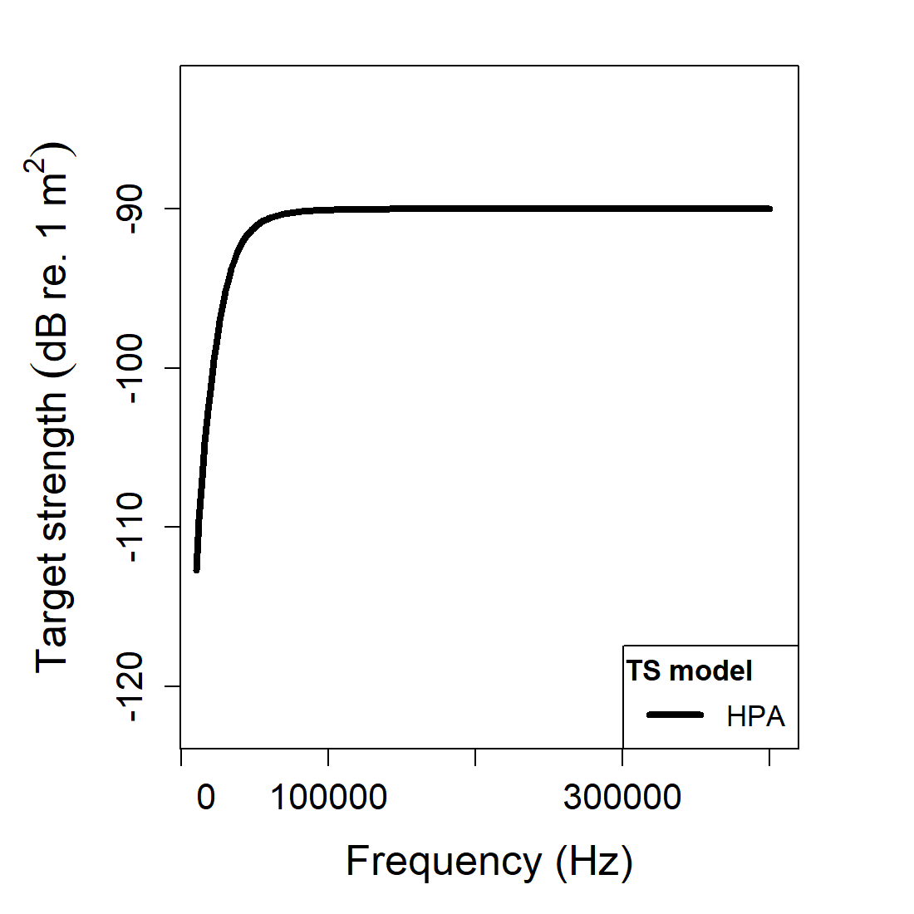
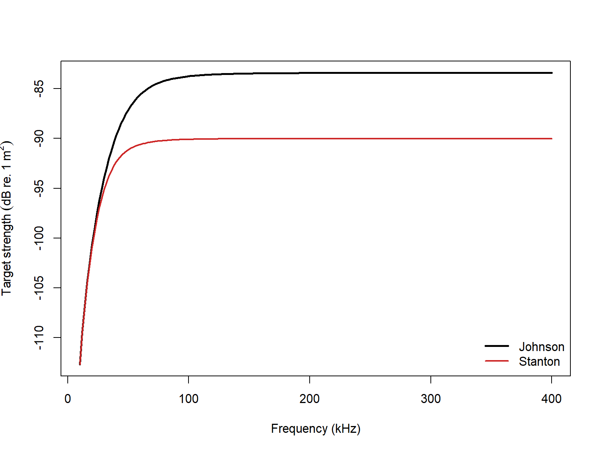

# acousticTS implementation

```{r model_family_header, echo=FALSE, results='asis'}
acousticTS:::.model_family_header(
  family = "hpa",
  pages = c(
    Overview = "index.html",
    Implementation = "hpa-implementation.html",
    Theory = "hpa-theory.html"
  )
)
```


These pages follow Johnson's asymptotic fluid-sphere formulation and Stanton's generalized approximate backscatter formulas [@johnson_sound_1977; @stanton_1989].

The acousticTS package uses object-based scatterers, so the HPA workflow follows the same broad pattern used throughout the package: define the geometry, attach fluid-like material properties, evaluate the model over the frequency range of interest, and then inspect the returned results carefully enough to confirm that the approximation is being used in a sensible way. For HPA, the most important additional choice is the approximation method: `johnson` for the compact sphere expression of Johnson (1977), or `stanton` for the broader sphere, prolate-spheroid, and cylinder approximations of Stanton (1989).

This matters because HPA is an asymptotic model family rather than an exact solution family. The implementation should therefore be read as a workflow for setting up and checking an approximation, not as a black-box replacement for every modal or boundary-value model in the package.

## Object generation

The Johnson (1977) and Stanton (1989) sphere formulations can be compared using the same spherical `FLS` object.

```{r}
library(acousticTS)

sphere_shape <- sphere(
  radius_body = 4e-3,
  n_segments = 80
)

fluid_sphere <- fls_generate(
  shape = sphere_shape,
  density_body = 1045,
  sound_speed_body = 1520,
  theta_body = pi / 2
)

fluid_sphere
```

This object definition is already carrying most of the physical assumptions. The shape is spherical, the interior is treated as fluid-like, and the orientation is broadside. For a sphere, orientation has no effect on the scattering itself, but keeping it explicit is still useful because it reinforces the fact that the same package workflow is shared across anisotropic shapes where orientation does matter.

## Calculating a TS-frequency spectrum

```{r}
frequency <- seq(18e3, 200e3, by = 7e3)

hpa_johnson <- target_strength(
  object = fluid_sphere,
  frequency = frequency,
  model = "hpa",
  method = "johnson"
)


hpa_stanton <- target_strength(
  object = fluid_sphere,
  frequency = frequency,
  model = "hpa",
  method = "stanton"
)
```

These two calls are useful as a first implementation check because they keep the target fixed while changing only the approximation formula. That isolates the effect of the HPA method choice itself. If the two curves disagree materially, the difference should be interpreted as a difference in asymptotic construction, not as a difference in target geometry or material bookkeeping.

The selected frequency range should also be interpreted in light of the approximation. HPA is most informative when readers want the broad frequency response of a weakly contrasting target over a moderate or wide range. It is not designed to reproduce fine resonant structure mode by mode. If the scientific question depends on narrow resonances or exact boundary-condition physics, another model may be more appropriate.

## Extracting model results

Model results can be extracted either visually or directly through `extract()`.

### Plotting results

```{r echo=FALSE, out.width='49%', fig.align='center', fig.alt='Pre-rendered HPA example plot showing the stored target-strength spectrum for the Stanton-formulation sphere example.'}

```

### Accessing results

```{r}
johnson_results <- extract(hpa_johnson, "model")$HPA
stanton_results <- extract(hpa_stanton, "model")$HPA

head(johnson_results)
head(stanton_results)
```

At this stage, it helps to inspect more than just the plotted curve. Readers should check that the result object contains the expected frequencies, that the returned target-strength levels are physically plausible for the assumed target size and contrast, and that comparisons are being made in the intended domain. HPA results are often discussed in `TS`, but for some comparisons it is more informative to examine `sigma_bs` in the linear domain as well.

## Comparison workflows

### Sphere formulations

```{r echo=FALSE, out.width='85%', fig.align='center', fig.alt='Pre-rendered HPA comparison between the Johnson and Stanton sphere formulations over the same frequency sweep.'}

```

This comparison is most useful as a model-behavior check. Because the geometry and material properties are the same, any difference between the curves reflects the difference between the compact sphere interpolation of Johnson (1977) and the more general asymptotic form of Stanton (1989). That makes the comparison a good way to judge whether the added flexibility of the Stanton (1989) formulation materially changes the interpretation over the frequency band of interest.

### Elongated-body Stanton formulation

The `stanton` method is the one to use when the shape is not spherical.

```{r}
cylinder_shape <- cylinder(
  length_body = 25e-3,
  radius_body = 2e-3,
  n_segments = 60
)

elongated_object <- fls_generate(
  shape = cylinder_shape,
  density_body = 1045,
  sound_speed_body = 1520,
  theta_body = pi / 2
)

elongated_object <- target_strength(
  object = elongated_object,
  frequency = seq(18e3, 200e3, by = 7e3),
  model = "hpa",
  method = "stanton",
  deviation_fun = 1,
  null_fun = 1
)

head(extract(elongated_object, "model")$HPA)
```

This second example shows one of the main reasons the Stanton (1989) formulation is useful in practice. It extends the same asymptotic logic to elongated shapes without forcing the user into a sphere-only approximation. That does not make it exact for every elongated target, but it does allow gross geometric effects such as aspect ratio and orientation to enter the approximation in a structured way.

When fitting HPA behavior to measurements, the first quantities to revisit are usually:

1. the shape choice, because the geometric prefactor is part of the approximation itself,
2. the orientation, because elongated targets can change coherence and projected response substantially with angle, and
3. the empirical `deviation_fun` and `null_fun`, because those control how aggressively the approximation departs from the default smooth-response form.

Those checks are especially helpful when HPA is being used alongside more detailed models. A disagreement does not automatically mean the HPA run is wrong. It may simply indicate that the question has moved beyond the regime where an asymptotic interpolation is the most informative representation.

### Benchmark comparisons

HPA is an approximation family, not an exact boundary-value solution, so the most transparent comparison is against the weakly scattering benchmark curves summarized by Jech et al. (2015). The table below uses the corresponding sphere, prolate-spheroid, and cylinder target definitions and shows how the current HPA implementations compare with those benchmark series. Elapsed times are representative values from the current machine.

| Case | Max abs. $\Delta$ TS (dB) | Mean abs. $\Delta$ TS (dB) | Elapsed (s) |
|:--|--:|--:|--:|
| Johnson (1977) sphere | 42.20232 | 6.34274 | 0.00 |
| Stanton (1989) sphere | 35.46445 | 5.48942 | 0.01 |
| Stanton (1989) prolate spheroid | 46.13636 | 5.57418 | 0.01 |
| Stanton (1989) cylinder | 46.97943 | 5.65639 | 0.00 |

Those numbers make the role of HPA very clear. It is extremely fast, but it is not a mode-by-mode benchmark reproducer. Its value is in reproducing broad asymptotic trend and scale, not in matching the exact benchmark null structure or narrow resonant detail of the benchmark curves summarized by Jech et al. (2015).

The other documented HPA arguments, `deviation_fun` and `null_fun`, are empirical fitting controls rather than canonical benchmark switches. Johnson (1977), Stanton (1989), and Jech et al. (2015) do not prescribe a single authoritative benchmark parameterization for those functions, so this implementation page keeps them at their neutral value of `1` when reporting $\Delta TS$ benchmark summaries. That leaves `method` and target geometry as the defensible comparison dimensions for validation.

If those arguments are explored at all, the cleanest workflow is to treat that as a separate sensitivity or calibration exercise after the neutral benchmark comparison has already been reported. In other words, first ask whether the base asymptotic formula behaves sensibly with `deviation_fun = 1` and `null_fun = 1`; only then ask whether a user-specified empirical adjustment improves agreement with a particular measured dataset.

### Cross-software and formula checks

The locally available `echoSMs::HPModel` provides a direct software-to-software check for the spherical Stanton (1989) branch. For the other HPA paths, the cleaner validation target is the published Johnson (1977) and Stanton (1989) algebra itself. The current local `HPModel` prolate-spheroid and cylinder branches error before returning a spectrum, so those cells are reported as `N/A` in the software-comparison columns below.

| Case | Mean abs. $\Delta$ acousticTS vs `echoSMs` (dB) | Max abs. $\Delta$ acousticTS vs `echoSMs` (dB) | Mean abs. $\Delta$ vs published algebra (dB) | Max abs. $\Delta$ vs published algebra (dB) |
|:--|--:|--:|--:|--:|
| Johnson (1977) sphere | `N/A` | `N/A` | 2.33e-13 | 2.98e-13 |
| Stanton (1989) sphere | 3.43e-14 | 4.69e-13 | 3.43e-14 | 4.69e-13 |
| Stanton (1989) prolate spheroid | `N/A` | `N/A` | 2.46e-14 | 1.28e-13 |
| Stanton (1989) cylinder | `N/A` | `N/A` | 2.39e-14 | 8.53e-14 |

The HPA picture is explicit. The spherical Stanton branch agrees with the available external software implementation to practical machine precision, and every canonical branch matches the published Johnson (1977) or Stanton (1989) algebra to the same order. That does not make HPA an exact replacement for the benchmarked modal-series models above, but it does confirm that the package is implementing the intended asymptotic formulas correctly.
