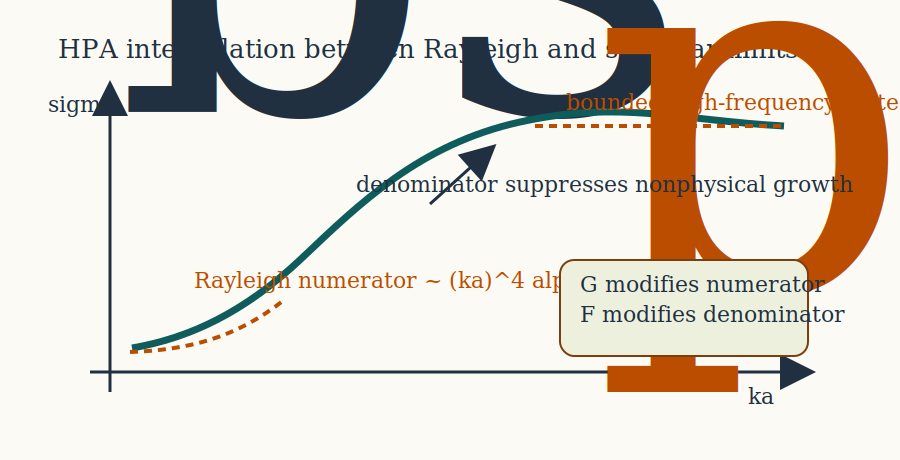
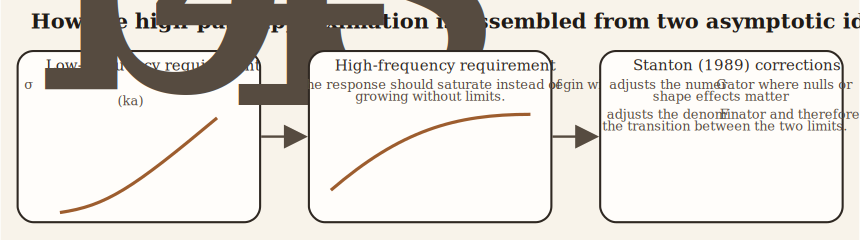
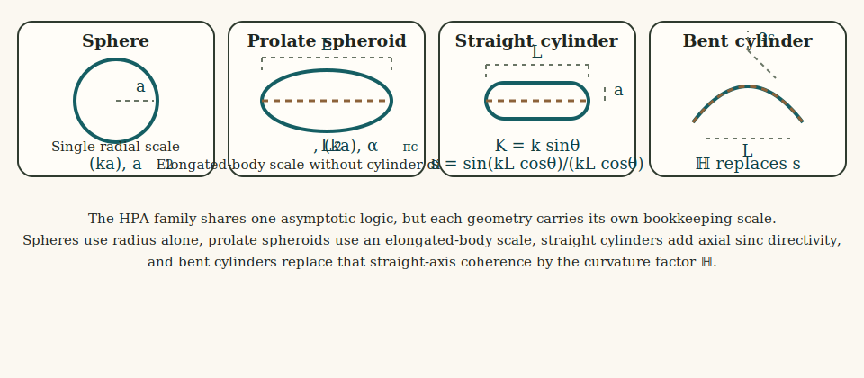

# Introduction

The high-pass approximation (HPA) is not an exact boundary-value solution. It is a compact asymptotic model constructed so that the low-frequency limit matches the Rayleigh expansion of weakly scattering bodies, while the large-$ka$ limit remains bounded and approaches a reflection-controlled scale.[^1][^2][^3] The model is therefore best understood as an interpolation between two physically distinct regimes rather than as a direct solution of the governing boundary-value problem at all frequencies.

Its usefulness comes from that interpolation. Instead of carrying a full modal series or surface integral, the HPA writes the backscattering cross-section as a rational function of frequency whose numerator reproduces the small-target limit and whose denominator suppresses the unbounded growth that a naive low-frequency continuation would otherwise produce.

In a full boundary-value formulation, the same problem would be represented either by a partial-wave expansion for a canonical shape or by a Green's-function surface integral whose large-$ka$ limit is controlled by reflected or specular contributions. The HPA should be read as a compact replacement for those exact descriptions: it keeps the correct Rayleigh numerator at small $ka$ and replaces the full high-frequency asymptotics by a bounded reflection-controlled denominator.

The figure is meant to be read with the equations that follow: the left branch is the Rayleigh numerator proportional to $(ka)^4\alpha_\pi^2$, the plateau is the bounded large-$ka$ scale set by reflection, and the labeled $\mathcal{F}$ and $\mathcal{G}$ terms indicate where corrections from Stanton (1990)[^3] corrections alter the denominator and numerator, respectively.

The second figure makes the bookkeeping more explicit. The HPA is easiest to interpret once the reader sees that it is not trying to solve a full boundary-value problem directly. Instead, it enforces one asymptotic requirement at small $ka$, another at large $ka$, and then uses the denominator together with $\mathcal{F}$ and $\mathcal{G}$ to connect those limits smoothly.

This third schematic isolates the geometry-dependent factors that often get lost when the formulas are read too quickly. The sphere uses a single radius scale. The straight-cylinder form combines the transverse size parameter $Ka$ with the finite-length directivity factor $s$. The bent-cylinder form replaces that straight-axis directivity by the curvature factor $\mathcal{H}$. Seeing those factors side by side helps clarify that the HPA family is not one equation with minor symbol changes, but a set of related asymptotic forms with different geometric bookkeeping.

# Low-frequency scattering ingredients

## Contrast ratios

Let the surrounding medium be labeled 1 and the scatterer 2. Define the density and sound-speed contrasts by:

$$
  g = \frac{\rho_2}{\rho_1},
  \qquad
  h = \frac{c_2}{c_1}.
$$

These are the two material ratios that enter the long-wavelength expansion for a fluid-like body. In the HPA they appear only through low-frequency contrast coefficients and through the reflection coefficient used to control the high-frequency scale. That is one reason the model remains compact: it does not attempt to carry the full spatial structure of the exact boundary-value solution.

## Reflection coefficient

At sufficiently large acoustic size, the dominant contribution is associated with reflection from the body surface. The normal-incidence reflection coefficient is therefore introduced as:

$$
  \mathcal{R} = \frac{gh - 1}{gh + 1}.
$$

This quantity appears in the denominator of the HPA because the high-frequency asymptote is governed by interface reflection rather than by the small-contrast polarizability term that controls the Rayleigh regime. The reflection coefficient is therefore not a small-$ka$ ingredient. It is the scale-setting quantity that keeps the large-$ka$ response physically bounded.

## Rayleigh coefficients for spheres and cylinders

In the low-frequency limit, the scattering amplitude of a weakly contrasting body can be expanded in powers of $ka$. The first nonzero backscattering term is proportional to $(ka)^2$, so the cross-section scales like $(ka)^4$.

For a sphere, the material coefficient multiplying that low-frequency term is:

$$
  \alpha_{\pi s} = \frac{1 - gh^2}{3gh^2} + \frac{1 - g}{1 + 2g}.
$$

For a cylinder, and more generally for elongated bodies in the cylindrical limit, the corresponding coefficient is:

$$
  \alpha_{\pi c} = \frac{1 - gh^2}{2gh^2} + \frac{1 - g}{1 + g}.
$$

These coefficients arise by expanding the boundary conditions for weak contrast and retaining the leading backscattering contribution to the scattered field. Their role is specific to the Rayleigh regime. They say how strongly the body departs from the surrounding medium when the acoustic wavelength is large compared with the target dimensions.

# Johnson (1977) sphere approximation

## Rayleigh numerator

For a fluid sphere of radius $a$, the Rayleigh backscattering cross-section has the form:

$$
  \sigma_{bs} \sim a^2 (ka)^4 \alpha_{\pi s}^2
  \qquad \text{as } ka \to 0.
$$

This fixes the numerator of any interpolation formula that is to reproduce the correct low-frequency limit. If an approximate formula fails to recover this scaling, it has already lost the correct weak-scattering behavior before any high-frequency correction is considered.

## High-pass denominator

Johnson (1977)[^1] introduced the simplest rational completion of that numerator by writing:

$$
  \sigma_{bs} =
  \frac{a^2 (ka)^4 \alpha_{\pi s}^2}{1 + \tfrac{3}{2}(ka)^4}.
$$

The derivation is not an exact resummation of the full modal series. Rather, it is a two-limit construction. The numerator enforces the Rayleigh law, while the denominator suppresses the nonphysical growth that would occur if the $(ka)^4$ term were extrapolated to large argument. That is the central idea behind the model and the reason the term "approximation" has to be taken seriously here: the HPA is deliberately shaped to match limiting behavior, not to reproduce every intermediate-frequency feature of an exact solution.

Two limits follow immediately.

If:

$$
  ka \ll 1,
$$

then the denominator tends to 1 and:

$$
  \sigma_{bs} \sim a^2 (ka)^4 \alpha_{\pi s}^2.
$$

If:

$$
  ka \gg 1,
$$

then:

$$
  \sigma_{bs} \to \frac{2}{3}a^2,
$$

so the response approaches a bounded geometric scale instead of diverging.

# Stanton (1990) generalization

Stanton (1990)[^3] extended the same logic to a broader class of shapes by matching a low-frequency scattering term to a reflected-wave asymptote and then introducing empirical correction factors where needed. In this broader setting, the geometric prefactors and directivity terms become just as important as the material contrasts because they determine how the same asymptotic logic is adapted to spheres, spheroids, straight cylinders, and bent cylinders.

## Deviation and null functions

Two multiplicative functions are introduced: $\mathcal{F}$ and $\mathcal{G}$. $\mathcal{F}$ modifies the denominator and therefore controls the transition between the Rayleigh and large-$ka$ regimes. $\mathcal{G}$ adjusts the numerator to account for destructive-interference minima and shape-dependent departures from the simplest interpolation.

These terms are phenomenological. They do not arise from the first few algebraic steps of the governing differential equation. They enter after the asymptotic structure has already been identified. Readers should therefore interpret them as correction factors layered onto the asymptotic backbone, not as exact modal quantities with independent physical meaning at the same level as $g$, $h$, or $\mathcal{R}$.

## Spherical form

For a sphere, the generalized expression from Stanton (1990)[^3] is:

$$
  \sigma_{bs} =
  \frac{a^2 (ka)^4 \alpha_{\pi s}^2 \mathcal{G}}{
    1 + \dfrac{4(ka)^4 \alpha_{\pi s}^2}{\mathcal{R}^2 \mathcal{F}}
  }.
$$

The low-frequency numerator is still the Rayleigh term. The denominator is now written so that the high-frequency scale is set explicitly by the reflection coefficient $\mathcal{R}$. Compared with Johnson (1977; 1978)[^1][^2] simpler form, the version from Stanton (1990)[^3] makes the reflection-controlled nature of the large-$ka$ limit more explicit and leaves room for the correction factors $\mathcal{F}$ and $\mathcal{G}$.

## Prolate spheroid form

For a prolate spheroid of total length $L$, the corresponding formula is:

$$
  \sigma_{bs} =
  \frac{\tfrac{1}{9}L^2 (ka)^4 \alpha_{\pi c}^2 \mathcal{G}}{
    1 + \dfrac{\tfrac{16}{9}(ka)^4 \alpha_{\pi c}^2}{\mathcal{R}^2 \mathcal{F}}
  }.
$$

The change from $a^2$ to $L^2$ reflects the fact that the illuminated longitudinal extent becomes important for elongated bodies, even though the local contrast coefficient still has cylindrical form. This is one of the places where the HPA is easiest to misread. The local material physics remains fluid-like and weak-contrast, but the geometric scaling is no longer purely radial.

## Straight cylinder form

For a straight cylinder, orientation enters through the transverse wavenumber:

$$
  K = k \sin\theta,
$$

and the finite-length directivity factor:

$$
  s = \frac{\sin(kL\cos\theta)}{kL\cos\theta}.
$$

The resulting cross-section is:

$$
  \sigma_{bs} =
  \frac{\tfrac{1}{4}L^2 (Ka)^4 \alpha_{\pi c}^2 s^2 \mathcal{G}}{
    1 + \dfrac{\pi (Ka)^3 \alpha_{\pi c}^2}{\mathcal{R}^2 \mathcal{F}}
  }.
$$

The factor $s$ comes directly from integrating the phase over a uniformly illuminated finite cylinder. It is the same sinc-type directivity that appears in more detailed elongated-body scattering models. The argument of that factor is important physically: as the incidence moves away from broadside, longitudinal phase cancellation can reduce the coherent contribution even when the transverse contrast remains unchanged.

## Bent-cylinder form

For a bent cylinder of curvature radius $\rho_c$, the straight-cylinder directivity is replaced by an effective curvature factor:

$$
  \mathcal{H} = \frac{1}{2} + \frac{1}{2}\left(\frac{\rho_c}{L}\right)
  \sin\left(\frac{L}{\rho_c}\right).
$$

This yields:

$$
  \sigma_{bs} =
  \frac{\tfrac{1}{4}L^2 (ka)^4 \alpha_{\pi c}^2 \mathcal{H}^2 \mathcal{G}}{
    1 + \dfrac{L^2 (ka)^4 \alpha_{\pi c}^2 \mathcal{H}^2}{\rho_c a \, \mathcal{R}^2 \mathcal{F}}
  }.
$$

The factor $\mathcal{H}$ is obtained by averaging the phase over the curved axis and therefore plays the same role for a bent body that $s$ plays for a straight one. In other words, straight-axis coherence is replaced by curvature-weighted coherence. This gives the bent-cylinder HPA enough geometric flexibility to account for gross curvature effects without leaving the asymptotic closed-form framework.

# Why the approximation is called high-pass

The name follows directly from the frequency dependence. In every HPA form above, the numerator vanishes as $(ka)^4$ when $ka \to 0$, so low frequencies are strongly attenuated. As $ka$ grows, the denominator prevents divergence and the response approaches a bounded level. The shape of the curve therefore resembles that of a high-pass filter with a finite plateau.

That analogy is only qualitative. The HPA is not derived from circuit theory. It is derived by matching low- and high-frequency acoustic asymptotes.

# Mathematical assumptions

The HPA rests on the following assumptions:

1. The target is fluid-like or weakly contrasting.
2. The low-frequency behavior is dominated by the leading Rayleigh term.
3. The large-$ka$ behavior is governed by reflected-wave scaling.
4. Intermediate frequencies can be represented by a rational interpolation between those two limits.
5. Shape effects enter primarily through explicit geometric factors such as $L$, $s$, and $\mathcal{H}$.

The strength of the HPA is that it compresses those asymptotic ideas into simple closed forms. The limitation is that it does not reproduce fine modal resonances, exact boundary-condition structure, or detailed internal wave effects that would appear in a fuller solution. It is therefore most useful when the scientific question is about broad frequency trends, relative shape effects, or fast exploratory calculations rather than resonance-resolving inference.

[^1]: Johnson, R. K. (1977). Sound scattering from a fluid sphere revisited. *The Journal of the Acoustical Society of America*, 61, 375-377.

[^2]: Johnson, R. K. (1978). Erratum: Sound scattering from a fluid sphere revisited. *The Journal of the Acoustical Society of America*, 63, 626.

[^3]: Stanton, T. K. (1989). Simple approximate formulas for backscattering of sound by spherical and elongated objects. *The Journal of the Acoustical Society of America*, 86, 1499-1510.
