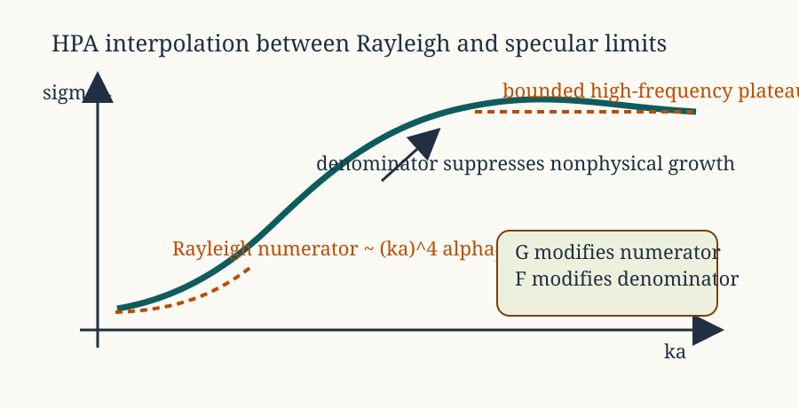
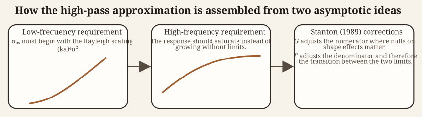

# Introduction

```{r model_family_header, echo=FALSE, results='asis'}
acousticTS:::.model_family_header(
  family = "hpa",
  pages = c(
    Overview = "index.html",
    Implementation = "hpa-implementation.html",
    Theory = "hpa-theory.html"
  )
)
```

The high-pass approximation (HPA) interpolates between a Rayleigh
low-frequency term and a bounded, reflection-controlled high-frequency scale
[@Johnson_1977; @Stanton_1989_1]. It is a rational approximation to
backscattering cross-section, not an exact boundary-value solution. It therefore
captures broad frequency trends but not individual modal resonances.

::: {.note data-title="Shared conventions"}
Material ratios and scattering quantities follow [Notation and
symbols](../notation-and-symbols/notation-and-symbols.html). The assumptions
behind the Rayleigh and reflected-wave limits are summarized in the [Acoustic
scattering primer](../acoustic-scattering-primer/acoustic-scattering-primer.html).
:::





The construction has a Rayleigh numerator proportional to
$(ka)^4\alpha_\pi^2$, a denominator that bounds its growth, and optional Stanton
corrections $\mathcal F$ and $\mathcal G$.

Geometry determines the prefactor and coherence term. Spheres use one radius,
prolate spheroids use their length and radius scales, straight cylinders use
the transverse size $Ka$ and directivity $s$, and bent cylinders use the
curvature factor $\mathcal H$.

# Low-frequency scattering ingredients

## Contrast ratios

Let the surrounding medium be labeled 1 and the scatterer 2. Define the density and sound-speed contrasts by:

$$
  g_{21} = \frac{\rho_2}{\rho_1},
  \qquad
  h_{21} = \frac{c_2}{c_1}.
$$

These ratios enter the Rayleigh coefficients and the impedance reflection
coefficient.

## Reflection coefficient

At sufficiently large acoustic size, the dominant contribution is associated with reflection from the body surface. The normal-incidence reflection coefficient is therefore introduced as:

$$
  \mathcal{R} = \frac{g_{21}h_{21} - 1}{g_{21}h_{21} + 1}.
$$

$\mathcal R$ is the pressure-amplitude reflection coefficient at normal
incidence. In the Stanton forms, it sets the scale of the large-$ka$ limit.

## Rayleigh coefficients for spheres and cylinders

In the low-frequency limit, the scattering amplitude of a weakly contrasting body can be expanded in powers of $ka$. The first nonzero backscattering term is proportional to $(ka)^2$, so the cross-section scales like $(ka)^4$.

For a sphere, the material coefficient multiplying that low-frequency term is:

$$
  \alpha_{\pi s} = \frac{1 - g_{21}h_{21}^2}{3g_{21}h_{21}^2} + \frac{1 - g_{21}}{1 + 2g_{21}}.
$$

For a cylinder, and more generally for elongated bodies in the cylindrical limit, the corresponding coefficient is:

$$
  \alpha_{\pi c} = \frac{1 - g_{21}h_{21}^2}{2g_{21}h_{21}^2} + \frac{1 - g_{21}}{1 + g_{21}}.
$$

These coefficients collect the monopole-like compressibility contrast and the
dipole-like density contrast in the leading Rayleigh backscatter term
[@Johnson_1977].

# Johnson (1977) sphere approximation

## Rayleigh numerator

For a fluid sphere of radius $a$, the Rayleigh backscattering cross-section has the form:

$$
  \sigma_\text{bs} \sim a^2 (ka)^4 \alpha_{\pi s}^2
  \qquad \text{as } ka \to 0.
$$

This expression fixes the numerator of the interpolation.

## High-pass denominator

Johnson (1977) [@Johnson_1977] introduced the simplest rational completion of that numerator by writing:

$$
  \sigma_\text{bs} =
    \frac{a^2 (ka)^4 \alpha_{\pi s}^2}{1 + \tfrac{3}{2}(ka)^4}.
$$

The denominator prevents the Rayleigh term from growing without bound. It is
an interpolation chosen for the two limiting regimes, not a resummation of the
exact modal series.

Two limits follow immediately. In the Rayleigh regime, where:

$$
  ka \ll 1,
$$

the denominator tends to unity, so the cross-section reduces to:

$$
  \sigma_\text{bs} \sim a^2 (ka)^4 \alpha_{\pi s}^2.
$$

In the large-$ka$ limit, where:

$$
  ka \gg 1,
$$

the same expression tends toward:

$$
  \sigma_\text{bs} \to \frac{2}{3}a^2\alpha_{\pi s}^2,
$$

so the response approaches a bounded contrast-weighted geometric scale.

# Stanton (1989) generalization

@Stanton_1989_1 extended this construction to spheres, spheroids, straight
cylinders, and bent cylinders by changing the geometric prefactors and
coherence terms.

## Deviation and null functions

Two multiplicative functions are introduced: $\mathcal{F}$ and $\mathcal{G}$. $\mathcal{F}$ modifies the denominator and therefore controls the transition between the Rayleigh and large-$ka$ regimes. $\mathcal{G}$ adjusts the numerator to account for destructive-interference minima and shape-dependent departures from the simplest interpolation.

These are phenomenological corrections, not independent modal quantities.

## Spherical form

For a sphere, the generalized expression from @Stanton_1989_1 is:

$$
  \sigma_\text{bs} =
    \frac{a^2 (ka)^4 \alpha_{\pi s}^2 \mathcal{G}}{
  1 + \dfrac{4(ka)^4 \alpha_{\pi s}^2}{\mathcal{R}^2 \mathcal{F}}
  }.
$$

The numerator retains the Rayleigh term. The denominator sets the
reflection-controlled limit and includes $\mathcal F$ and $\mathcal G$.

## Prolate spheroid form

For a prolate spheroid of total length $L$, the corresponding formula is:

$$
  \sigma_\text{bs} =
    \frac{\tfrac{1}{9}L^2 (ka)^4 \alpha_{\pi c}^2 \mathcal{G}}{
  1 + \dfrac{\tfrac{16}{9}(ka)^4 \alpha_{\pi c}^2}{\mathcal{R}^2 \mathcal{F}}
  }.
$$

The factor $L^2$ accounts for the longitudinal extent of the elongated body,
while $\alpha_{\pi c}$ retains the cylindrical Rayleigh contrast.

## Straight cylinder form

For a straight cylinder, orientation enters through the transverse wavenumber:

$$
  K = k \sin\theta,
$$

and the finite-length directivity factor:

$$
  s = \frac{\sin(kL\cos\theta)}{kL\cos\theta}.
$$

The resulting cross-section is:

$$
  \sigma_\text{bs} =
    \frac{\tfrac{1}{4}L^2 (Ka)^4 \alpha_{\pi c}^2 s^2 \mathcal{G}}{
  1 + \dfrac{\pi (Ka)^3 \alpha_{\pi c}^2}{\mathcal{R}^2 \mathcal{F}}
  }.
$$

The sinc factor follows from integrating a uniform phase along the finite axis.
Away from broadside, longitudinal phase cancellation reduces coherence.

## Bent-cylinder form

For a bent cylinder of curvature radius $\rho_c$, the straight-cylinder directivity is replaced by an effective curvature factor:

$$
  \mathcal{H} = \frac{1}{2} + \frac{1}{2}\left(\frac{\rho_c}{L}\right)
  \sin\left(\frac{L}{\rho_c}\right).
$$

This yields:

$$
  \sigma_\text{bs} =
    \frac{\tfrac{1}{4}L^2 (ka)^4 \alpha_{\pi c}^2 \mathcal{H}^2 \mathcal{G}}{
  1 + \dfrac{L^2 (ka)^4 \alpha_{\pi c}^2 \mathcal{H}^2}{\rho_c a \, \mathcal{R}^2 \mathcal{F}}
  }.
$$

$\mathcal H$ replaces straight-axis coherence with a curvature-weighted
effective length.

# Why the approximation is called high-pass

The name follows directly from the frequency dependence. In every HPA form above, the numerator vanishes as $(ka)^4$ when $ka \to 0$, so low frequencies are strongly attenuated. As $ka$ grows, the denominator prevents divergence and the response approaches a bounded level. The shape of the curve therefore resembles that of a high-pass filter with a finite plateau.

That analogy is only qualitative. The HPA is not derived from circuit theory. It is derived by matching low- and high-frequency acoustic asymptotes.

# Target strength

Each HPA branch returns a backscattering cross-section. Target strength follows
the same reporting convention as the other models [@MacLennan_2002]:

$$
  TS = 10\log_{10}\left(
  \frac{\sigma_{\mathrm{bs}}}{1\ \mathrm{m}^2}\right).
$$

# Mathematical assumptions

The HPA rests on the following assumptions:

1. The target is fluid-like or weakly contrasting.
2. The low-frequency behavior is dominated by the leading Rayleigh term.
3. The large-$ka$ behavior is governed by reflected-wave scaling.
4. Intermediate frequencies can be represented by a rational interpolation between those two limits.
5. Shape effects enter primarily through explicit geometric factors such as $L$, $s$, and $\mathcal{H}$.

HPA is appropriate for broad trends and inexpensive comparisons. It does not
resolve fine resonances, exact boundary-condition structure, or detailed
internal waves.


