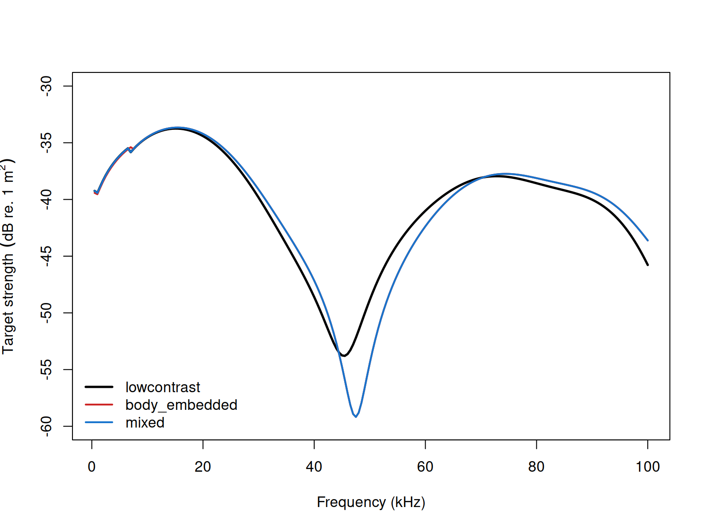
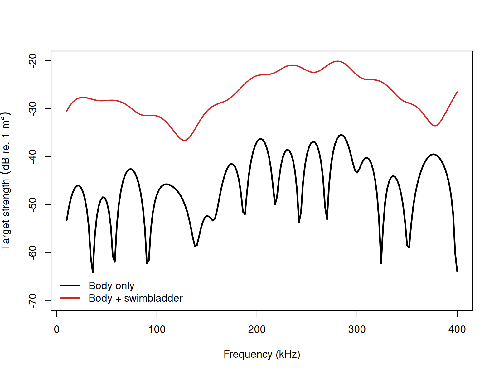

# acousticTS implementation

```{r model_family_header, echo=FALSE, results='asis'}
acousticTS:::.model_family_header(
  family = "krm",
  pages = c(
    Overview = "index.html",
    Theory = "krm-theory.html",
    Implementation = "krm-implementation.html",
    Benchmarks = "krm-benchmarks.html",
    Validation = "krm-validation.html"
  )
)
```


These pages follow the composite body-plus-swimbladder fish modeling literature initiated for cod and later generalized in open software implementations [@Clay_1991; @Clay_1994].

The acousticTS package uses object-based scatterers, so the KRM workflow follows the same broad structure used elsewhere in the package: define the geometry, attach material meaning to the body and any internal inclusion, evaluate the model over the desired frequency range, and then inspect the returned response carefully enough to understand what part of the target is driving it. For KRM, the main structural choice is whether the target is represented as a fluid-like body only or as a body plus an internal strongly contrasting inclusion such as a swimbladder.

This matters because KRM is not just a body-shape model. It is a composite body-plus-inclusion model. Readers should therefore treat object construction as part of the scientific interpretation rather than just a data-formatting step.

## Fish-like object generation

The example below creates a simple body shape and an embedded swimbladder shape with `arbitrary()` and passes both to `sbf_generate()`.

```{r}
library(acousticTS)

body_shape <- arbitrary(
  x_body = c(0.00, 0.04, 0.09, 0.15, 0.22, 0.28),
  w_body = c(0.00, 0.018, 0.028, 0.030, 0.018, 0.00),
  zU_body = c(0.000, 0.010, 0.016, 0.017, 0.010, 0.000),
  zL_body = c(0.000, -0.010, -0.016, -0.017, -0.010, 0.000)
)

bladder_shape <- arbitrary(
  x_bladder = c(0.06, 0.10, 0.14, 0.18, 0.21),
  w_bladder = c(0.00, 0.008, 0.012, 0.008, 0.00),
  zU_bladder = c(0.000, 0.004, 0.006, 0.004, 0.000),
  zL_bladder = c(0.000, -0.004, -0.006, -0.004, 0.000)
)

fish_object <- sbf_generate(
  body_shape = body_shape,
  bladder_shape = bladder_shape,
  density_body = 1070,
  sound_speed_body = 1570,
  density_bladder = 1.2,
  sound_speed_bladder = 340,
  theta_body = pi / 2,
  theta_bladder = pi / 2
)

fish_object
```

This object already encodes the key KRM assumptions. The body and bladder are described separately, their material properties are assigned separately, and the orientation of each is carried explicitly. That separation is important because the KRM assigns different scattering logic to weakly contrasting body tissue and to the strongly contrasting internal inclusion. If the geometry or placement of the bladder is unrealistic, the model may still run, but the interpretation of the result will no longer match the intended biological target.

## Calculating a TS-frequency spectrum

```{r}
frequency <- seq(18e3, 120e3, by = 6e3)

fish_object <- target_strength(
  object = fish_object,
  frequency = frequency,
  model = "krm"
)
```

This call evaluates the composite KRM response over the requested frequency grid. As with other approximations, it is worth choosing the grid with the interpretation in mind. A broader sweep is useful for seeing how the body-only and bladder-dominated regimes compare, while a narrower and finer grid may be more useful when the question is how strongly the bladder alters the spectrum over a particular band of interest.

## Comparison workflows

### Swimbladder variants

For fluid-only body targets, `krm_variant` is ignored because only the body Kirchhoff term is evaluated. The argument matters only for combined body-plus-swimbladder targets, where the model must decide what surrounding medium is used in the swimbladder terms [@Clay_1994; @Horne_1999].

In the high-`ka` swimbladder Kirchhoff term, acousticTS uses the empirical factors:

$$
  A_{SB,s} = \frac{ka_s}{ka_s + 0.083},
  \qquad
  \psi_{p,s} = \frac{ka_s}{40 + ka_s} - 1.05,
$$

and the local oscillatory term:

$$
  \mathcal{L}_{SB,s} \propto
  A_{SB,s}
  \big[(k_H a_s + 1)\sin\theta\big]^{1/2}
  e^{-i(2k_H v_s + \psi_{p,s})}\Delta u_s,
$$

where $k_H$ is the wavenumber assumed for the high-`ka` surrounding medium. In the low-`ka` breathing-mode term, the relevant acoustic size is:

$$
  ka_e = k_L a_e,
$$

where $k_L$ is the wavenumber assumed for the low-`ka` surrounding medium.

The three named variants therefore encode the modelling assumption directly:

1. `lowcontrast`: apply the low-contrast approximation $k_B \approx k$ in both swimbladder regimes, so $k_H = k_L = k$.
2. `mixed`: use the body-medium wavenumber for the high-`ka` swimbladder term but the low-contrast approximation for the low-`ka` breathing mode, so $k_H = k_B$ and $k_L = k$.
3. `body_embedded`: use the body-medium wavenumber in both swimbladder regimes, so $k_H = k_L = k_B$. This is the most literal body-embedded reading of @Clay_1994.

```{r echo=FALSE, out.width='85%', fig.align='center', fig.alt='Pre-rendered KRM comparison for the sardine example under the lowcontrast, body-embedded, and mixed swimbladder-medium conventions.'}

```

For the bundled `sardine` target over `12-400 kHz`, the `mixed` and `body_embedded` curves are numerically identical, so the practical split is between the default `lowcontrast` spectrum and the body-medium alternative.

:::
## Extracting model results

Model results can be extracted either visually or directly through `extract()`.

### Plotting results

```{r echo=FALSE, out.width=c('49%','49%'), fig.align='center', fig.alt='Pre-rendered KRM example plots showing the body-plus-swimbladder geometry and its stored target-strength spectrum.'}
knitr::include_graphics(c("krm-shape-plot.png", "krm-model-plot.png"))
```

### Accessing results

```{r}
krm_results <- extract(fish_object, "model")$KRM
head(krm_results)
```

At this stage, it is worth confirming more than the presence of a plotted curve. Readers should check that the returned frequencies match the request, that the target-strength scale is plausible for the assumed fish size and material contrasts, and that the result is being interpreted as a coherent composite response rather than as an isolated body or isolated bladder term.

### Body-only versus body-plus-swimbladder

The most common practical comparison in KRM work is the contribution of the swimbladder relative to the fluid-like body.

```{r echo=FALSE, out.width='85%', fig.align='center', fig.alt='Pre-rendered KRM comparison between the body-only and body-plus-swimbladder versions of the same fish geometry.'}

```

This comparison is often the most informative first diagnostic because it isolates the physical reason the KRM exists. Holding the body geometry fixed while adding or removing the internal inclusion shows whether the total response is dominated by weakly scattering tissue, by the strong internal contrast, or by coherent interaction between both contributions.

For practical KRM work, the first inputs to revisit are usually:

1. the body and bladder geometry, because the model assumes a sensible locally cylindrical segmentation,
2. the relative placement and scale of the bladder inside the body, because that strongly affects the composite interpretation, and
3. the material contrasts assigned to both regions, because they control whether the body remains weakly scattering and whether the bladder remains the dominant internal inclusion.

For more realistic biological examples, the bundled `cod` and `sardine` datasets are the natural next objects to inspect because they already package body and swimbladder geometry in the format expected by the model.

### Evidence references

For KRM evidence, use:

- [KRM benchmarks](krm-benchmarks.html)
- [KRM validation](krm-validation.html)
