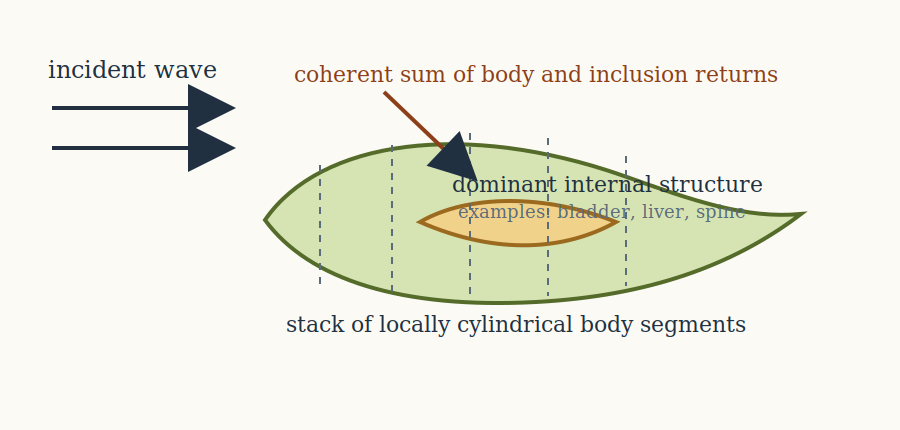
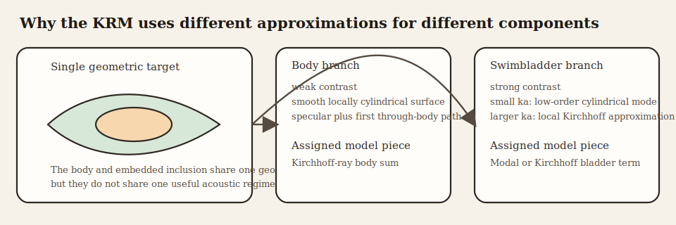
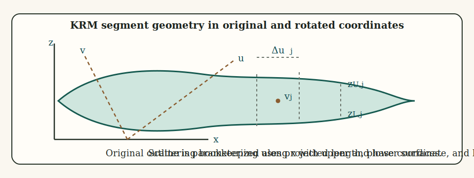
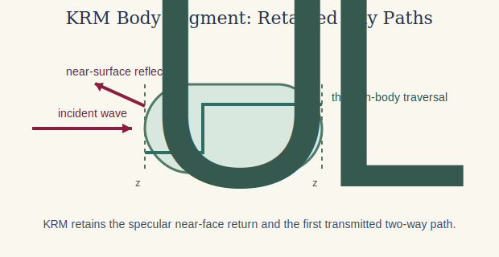

# Introduction

The Kirchhoff-Ray Mode (KRM) model is a composite scattering theory for elongated fish-like bodies. Its defining assumption is that different anatomical components can occupy different acoustic regimes. The fish body is treated with a Kirchhoff-ray approximation appropriate for a weakly contrasting, smoothly varying, elongated fluid-like body, while the swimbladder is treated either by a low-order modal approximation when its acoustic size is small or by a Kirchhoff approximation when it is larger.[^1][^2][^3]

Its body and swimbladder components rest on fluid-like and fluid-interface assumptions that overlap with the simple and weak fluid-like cases summarized in the companion [boundary conditions article](../boundary_conditions.html).

The name of the model follows directly from that hybrid structure: Kirchhoff for the geometric body treatment, ray for the body traversal terms, and mode for the low-frequency cylindrical contribution retained for the swimbladder. The point of the model is not that one approximation is universally best, but that a fish-like target naturally mixes a weakly scattering body with a much stronger internal inclusion. The KRM is designed to keep those two physical roles distinct rather than forcing the entire target into a single approximation regime.

The figure separates the two physical ingredients of the KRM used later in the derivation: the body is represented as a chain of short locally cylindrical Kirchhoff segments, while the swimbladder is the component that is assigned either the low-order modal treatment or the higher-frequency local Kirchhoff term.

::: {.note data-title="Swimbladders aren't a requirement"}
Although the swimbladder is the canonical internal scatterer in fisheries applications, the KRM formulation does not require a gas-filled inclusion. The internal term more generally represents any region of strong acoustic contrast embedded within a weakly scattering body. In the absence of such a feature, the model reduces naturally to the body-only Kirchhoff-ray formulation.
:::

# Physical basis of the KRM

## Kirchhoff approximation for a smooth body

The starting point for the KRM body contribution is the Kirchhoff approximation for scattering from a smooth convex surface. In that approximation, each small patch of the illuminated surface is replaced by its tangent plane, and the local scattered field is taken to be the field that would be produced by an infinite plane with the same local material boundary. This is a high-frequency approximation: the local radius of curvature must be large compared with the wavelength, and the surface must be smoothly varying over a scale of several wavelengths.

For a locally cylindrical fish body this means that a short segment can be treated as a small fluid cylinder whose scattering is dominated by specular reflection and a transmitted path through the body. The scattered field from the full body is then built by coherently summing the contributions of many such short segments.

In Kirchhoff form, the scattered pressure amplitude may be written schematically as a surface integral over the insonified body,

$$
  f_{bs} \propto \int_S \left[p\frac{\partial G}{\partial n} - G\frac{\partial p}{\partial n}\right] dS,
$$

where $G$ is the exterior Green's function and $n$ is the outward normal. The Kirchhoff approximation replaces $p$ and $\partial p/\partial n$ on each local patch by the corresponding tangent-plane values. For a smooth specular patch, stationary phase then reduces this surface integral to a local contribution proportional to the square root of acoustic size.

For a short cylindrical segment this produces a local amplitude of the form

$$
  d f_{K} \sim -i\frac{(ka\sin\theta)^{1/2}}{2\sqrt{\pi}}e^{-i2kz_U}\,du,
$$

where $du$ is projected segment length and $z_U$ is the upper-surface phase coordinate. The KRM body contribution starts from this Kirchhoff term and then augments it by the first transmitted traversal through the body.

## Why a hybrid body-swimbladder model is needed

The body of a fish is often only weakly contrasting relative to water, so a high-frequency surface-based approximation is reasonable when the body is not too small acoustically. The swimbladder is different. Because it is gas-filled, its contrast with the surrounding tissue is large, and when its acoustic size is small the lowest cylindrical response dominates the backscatter. A single asymptotic description is therefore not adequate across all components. The KRM is constructed specifically to combine these regimes in one coherent sum.

That distinction is the main conceptual reason the KRM exists. If one forced the whole animal into a weak-contrast body approximation, the dominant bladder contribution would be misrepresented. If one forced the whole animal into a gas-cylinder-style modal approximation, the body would be over-idealized in a different way. The hybrid formulation keeps the body and internal inclusion in the regimes that matter most physically.

# Segmented geometric description

## Rotated coordinates

Let the body axis be described by axial coordinate $x$ and dorsoventral coordinate $z$, with incident angle $\theta$. The geometry is transformed into rotated coordinates aligned with the incident wave through

$$
  u(j) = x(j)\sin\theta - z(j)\cos\theta,
$$

and

$$
  v(j) = x(j)\cos\theta + z(j)\sin\theta.
$$

The quantity $u(j)$ measures projected location across the insonified length, while $v(j)$ determines phase accumulation along the incident direction. This change of variables is not just a geometric convenience. It is the step that allows the segmented body to be written as a coherent sum of short contributions with the correct projected lengths and phases for the chosen angle of incidence.

The schematic makes the bookkeeping explicit. The axial body description is given in the original $(x,z)$ frame, but scattering is accumulated in the rotated $(u,v)$ frame aligned with the insonifying wave. The quantities $z_U$ and $z_L$ denote the upper and lower surfaces used in the two-path body term, while $\Delta u_j$ is the projected segment length that weights each local contribution.

## Segment lengths and radii

For adjacent points $j$ and $j+1$, the projected segment length is written as:

$$
  \Delta u_j = [x(j+1)-x(j)]\sin\theta,
$$

which follows the original KRM formulation. This expression is a slender-body approximation to the exact relation $\Delta u_j = u(j + 1) - u(j)$ in which the contribution from the cross-sectional variation, $\left[ z(j + 1) - z(j) \right] \cos \theta$, is neglected. The approximation assumes that the body is smoothly varying and primarily parameterized along its axis, so that changes in $z$ over a short segment are small compared with changes in $x$. Under this assumption, the projected length is controlled by the axial extent of the segment, consistent with the one-dimensional segmentation used in the KRM body formulation. The effective radius of the short locally cylindrical segment is

$$
  a_j = \frac{w(j)+w(j+1)}{4},
$$

where $w$ is local width. These definitions are the geometric ingredients needed to assign a local scattering contribution to each short segment. They also show why segmentation quality matters. If the body outline changes too abruptly from point to point, the locally cylindrical and smoothly varying assumptions become harder to defend.

# Body scattering contribution

## Interface coefficients

Treat the body as a fluid-like medium embedded in water. Let the reflection coefficient at the water-body interface be $\mathcal{R}_{wb}$. The transmitted ray that crosses the body and exits again carries the two-way transmission factor

$$
  \mathcal{T}_{wb}\mathcal{T}_{bw} = 1-\mathcal{R}_{wb}^2.
$$

This identity holds under lossless, locally planar, and near-normal incidence assumptions used in the KRM approximation.

For normal incidence on a fluid-fluid interface, the reflection coefficient is determined by impedance contrast:

$$
  \mathcal{R}_{wb} = \frac{Z_B-Z_w}{Z_B+Z_w},
  \qquad
  Z_w = \rho_w c_w,
  \qquad
  Z_B = \rho_B c_B.
$$

The corresponding transmission coefficients satisfy

$$
  \mathcal{T}_{wb} = 1+\mathcal{R}_{wb},
  \qquad
  \mathcal{T}_{bw} = 1-\mathcal{R}_{wb},
$$

so that

$$
  \mathcal{T}_{wb}\mathcal{T}_{bw} = 1-\mathcal{R}_{wb}^2.
$$

## Kirchhoff reduction of a short segment

For a short locally cylindrical segment, the Kirchhoff approximation implies that the scattering amplitude is obtained by integrating the local specular contribution over the projected illuminated area. Stationary-phase reduction of that surface integral gives an amplitude proportional to the square root of the local acoustic size and to the projected segment length. That is the origin of the factor

$$
  \frac{(ka_j\sin\theta)^{1/2}}{2\sqrt{\pi}}\Delta u_j.
$$

Thus the square-root dependence is not arbitrary. It is the standard stationary-phase scaling of a specular high-frequency contribution from a smooth curved segment.

## Near-surface and through-body rays

Each short body segment contributes two principal coherent terms. The first is a direct reflection from the dorsal surface. The second enters the body, propagates through it, reflects internally, and exits again. If $z_{U,j}$ and $z_{L,j}$ denote the dorsal and ventral surfaces of the segment in the rotated frame, then the two contributions are

$$
  \mathcal{R}_{wb} e^{-i2kz_{U,j}},
$$

and

$$
  \mathcal{T}_{wb}\mathcal{T}_{bw}
  e^{-i2kz_{U,j} + i2k_B(z_{U,j}-z_{L,j}) + i\psi_B}.
$$

Here $k$ is the wavenumber in water and $k_B$ is the wavenumber in the body medium. The first phase term locates the segment in the external field, while the second term includes the additional propagation through the body thickness.

The KRM body term is therefore a two-path approximation derived from Kirchhoff geometry. The local segment behaves like a short fluid slab: one contribution reflects from the first interface, while the other accumulates additional phase by traversing the body and returning. Higher-order internal traversals are neglected, which is one reason the model remains compact.

If the local body thickness in the incident direction is $z_{U,j}-z_{L,j}$, then the internal traversal phase is

$$
  2k_B(z_{U,j}-z_{L,j}),
$$

so the coherent local bracket becomes

$$
  \left[
    \mathcal{R}_{wb} e^{-i2kz_{U,j}}
    -
    \mathcal{T}_{wb}\mathcal{T}_{bw}
    e^{-i2kz_{U,j}+i2k_B(z_{U,j}-z_{L,j})+i\psi_B}
  \right].
$$

::: {.tip data-title="Note on notation"}
The relative sign arises from phase conventions in the transmission and internal reflection process and is retained here to match the standard KRM formulation.
:::

This is the explicit bridge from Kirchhoff surface scattering to the KRM body formula: start from the leading specular contribution, retain the first through-body transmitted return, and neglect higher multiple internal traversals.

The figure isolates the same two paths retained analytically: the near-surface reflected term and the first transmitted traversal through the body thickness. The KRM body expression is the coherent sum of those two contributions after local Kirchhoff scaling.

## Segment amplitude scaling

The body segment is treated as a short locally cylindrical reflector. Kirchhoff asymptotics therefore gives amplitude factor proportional to the square root of local acoustic size:

$$
  \frac{(ka_j\sin\theta)^{1/2}}{2\sqrt{\pi}}.
$$

Multiplying by the projected segment length $\Delta u_j$ gives the segment scattering length

$$
  \mathcal{L}_{B,j} \approx
  -i\frac{(ka_j\sin\theta)^{1/2}}{2\sqrt{\pi}}
  \Delta u_j
  \left[
    \mathcal{R}_{wb} e^{-i2kz_{U,j}}
    -
    \mathcal{T}_{wb}\mathcal{T}_{bw}
    e^{-i2kz_{U,j}+i2k_B(z_{U,j}-z_{L,j})+i\psi_B}
  \right].
$$

## Body phase correction

An empirical phase correction is introduced to improve agreement with finite-wavelength behavior across intermediate acoustic sizes:

$$
  \psi_B = -\frac{\pi k_B z_U}{2(k_B z_U + 0.4)}.
$$

As with other hybrid fisheries-acoustics formulas, this term compensates for the fact that a strict geometric traversal phase alone does not adequately describe the finite-wavelength body contribution over the full practical range.

## Coherent sum over the body

The total body contribution is the coherent sum over all body segments:

$$
  f_{body} = \sum_{j=1}^{N_b}\mathcal{L}_{B,j}.
$$

Thus body scattering is treated as a one-dimensional array of locally cylindrical contributions that interfere according to their individual phases.

# Swimbladder contribution

## Low-frequency modal approximation

When the swimbladder acoustic size is small, the scattering is dominated by the azimuthally symmetric ($m = 0$) mode, which may include resonance effects but does not require a sharp resonance. The swimbladder scattering length is then approximated by

$$
  L_M(ka)\big|_{m=0} = e^{i(\chi-\pi/4)}\frac{L_e}{\pi}\frac{\sin\Delta}{\Delta}b_0,
$$

where $L_e$ is an effective length, $\Delta$ is the same finite-length phase parameter used in short-cylinder scattering, and

$$
  b_0 = -\frac{1}{1+iC_0}.
$$

The coefficient $b_0$ is the zeroth-order cylindrical scattering coefficient obtained by imposing boundary conditions on a gas-filled cylinder in the long-wavelength limit. Thus the modal component of the KRM is literally the retention of the breathing-mode contribution and the neglect of higher cylindrical modes.

This point is essential to the logic of the KRM. The modal term is not merely another empirical correction. It comes from the low-frequency partial-wave description of a gas-filled cylinder, for which the azimuthally symmetric mode dominates as $ka \to 0$.

To see this explicitly, begin with the cylindrical expansions

$$
  p_{inc}(r,\phi) = \sum_{m=0}^{\infty} \epsilon_m i^m J_m(kr)\cos(m\phi),
$$

$$
  p_{scat}(r,\phi) = \sum_{m=0}^{\infty} \epsilon_m i^m b_m H_m^{(1)}(kr)\cos(m\phi),
$$

$$
  p_{int}(r,\phi) = \sum_{m=0}^{\infty} \epsilon_m i^m c_m J_m(k_g r)\cos(m\phi).
$$

Pressure continuity and normal-velocity continuity at the gas boundary $r=a$ give, for each mode $m$,

$$
  J_m(ka)+b_mH_m^{(1)}(ka)=c_mJ_m(k_ga),
$$

$$
  \frac{1}{\rho_w}\left[J_m'(ka)+b_mH_m^{(1)\prime}(ka)\right]
  = \frac{1}{\rho_g}\frac{k_g}{k}c_mJ_m'(k_ga).
$$

Eliminating $c_m$ gives the usual fluid-cylinder coefficient. In the long-wavelength limit, the $m=0$ term dominates, so one retains only

$$
  b_0 = -\frac{1}{1+iC_0},
$$

with

$$
  C_0 =
  \frac{
    \dfrac{J_0'(k_g a)}{J_0(k_g a)}Y_0(ka) - gh\,Y_0'(ka)
  }{
    \dfrac{J_0'(k_g a)}{J_0(k_g a)}J_0(ka) - gh\,J_0'(ka)
  },
$$

where $g=\rho_g/\rho_w$ and $h=c_g/c_w$ for the gas-filled cylinder. The low-frequency KRM bladder term therefore inherits its coefficient directly from the same pressure-continuity and normal-velocity conditions used in cylindrical modal theory. The additional KRM simplification is only the truncation to the azimuthally symmetric mode when $ka \ll 1$.

which is the modal ingredient used in the KRM swimbladder contribution.

## High-frequency Kirchhoff approximation for the swimbladder

When the swimbladder is no longer acoustically small, the same local-Kirchhoff logic used for the body is applied to the swimbladder. The segment contribution becomes

$$
  \mathcal{L}_{SB,j} \approx
  -i\frac{A_{SB,j}[(k_Ba_j+1)\sin\theta]^{1/2}}{2\sqrt{\pi}}
  \Delta u_j\mathcal{R}_{bc}\mathcal{T}_{wb}
  e^{-i(2k_Bv_j+\psi_p)},
$$

where $\mathcal{R}_{bc}$ is the body-to-bladder reflection coefficient.

Thus the KRM assigns the swimbladder to one of two regimes. In the long-wavelength regime it is treated by the leading cylindrical mode. In the larger-size regime it is treated as a chain of locally specular segments. The model is hybrid because it explicitly switches the physical description according to which asymptotic regime is more appropriate.

This is also the point at which readers should be careful about interpretation. The regime switch is not claiming that the swimbladder ceases to have modal structure above a particular threshold in any exact mathematical sense. It is a modeling choice that says one asymptotic description becomes more useful than the other as acoustic size increases.

## Swimbladder amplitude and phase corrections

The empirical amplitude correction is

$$
  A_{SB} = \frac{ka}{ka+0.083},
$$

and the phase correction is

$$
  \psi_p = \frac{ka}{40+ka}-1.05.
$$

As in the body term, these corrections account for the finite-wavelength transition between strict long-wavelength modal behavior and the regime in which a Kirchhoff treatment becomes reasonable.

## Coherent swimbladder sum

The total swimbladder contribution is

$$
  f_{bladder} = \sum_{j=1}^{N_s}\mathcal{L}_{SB,j},
$$

or, in the low-frequency regime, by the corresponding modal expression if the swimbladder is treated as a short resonant cylinder.

# Total scattering amplitude

The total scattering length is the coherent sum of body and swimbladder terms:

$$
  f_{bs} = f_{body}+f_{bladder}.
$$

The backscattering cross-section is therefore

$$
  \sigma_{bs} = |f_{bs}|^2,
$$

and the target strength is

$$
  TS = 20\log_{10}|f_{bs}|.
$$

The logarithmic definition uses $20\log_{10}$ because $f_{bs}$ is a scattering length rather than a cross-section.

# Mathematical assumptions

The KRM depends on several structural assumptions:

1. The target can be represented as chains of short locally cylindrical segments.
2. The body is fluid-like rather than elastically resonant.
3. The body contribution is dominated by specular and through-body ray terms.
4. The swimbladder is either in a low-order modal regime or a local Kirchhoff regime.
5. Multiple scattering between distant segments is neglected.
6. The Kirchhoff approximation is valid locally, implying smoothly varying geometry and sufficiently large local acoustic size.

Under these assumptions the KRM captures the leading scattering mechanisms of fish-like bodies with gas-filled inclusions, but it is not intended to model fine elastic resonances, anatomically complex multiple-scattering phenomena, or detailed three-dimensional end effects that fall outside the segmented locally cylindrical description.

## References

[^1]: Clay, C. S. (1991). Low resolution acoustic scattering models: fluid-filled cylinders and fish with swimbladders. *The Journal of the Acoustical Society of America*, 89, 2168-2179.

[^2]: Clay, C. S. (1992). Composite ray-mode approximations for backscattered sound from gas-filled cylinders and swimbladders. *The Journal of the Acoustical Society of America*, 92, 2173-2180.

[^3]: Clay, C. S., and Horne, J. K. (1994). Acoustic models of fish: the Atlantic cod (*Gadus morhua*). *The Journal of the Acoustical Society of America*, 96, 1661-1668.
