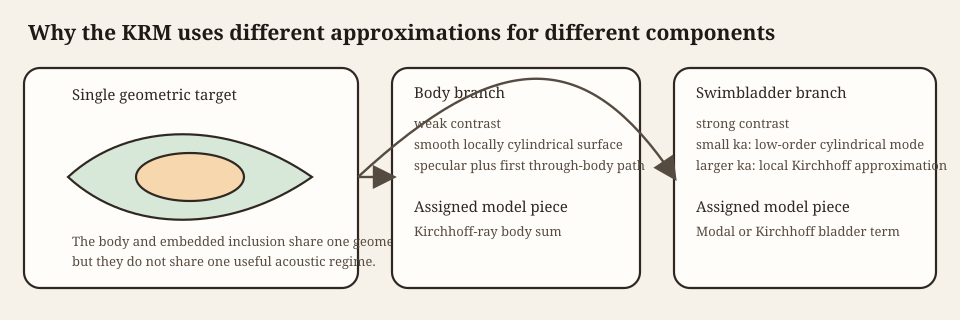
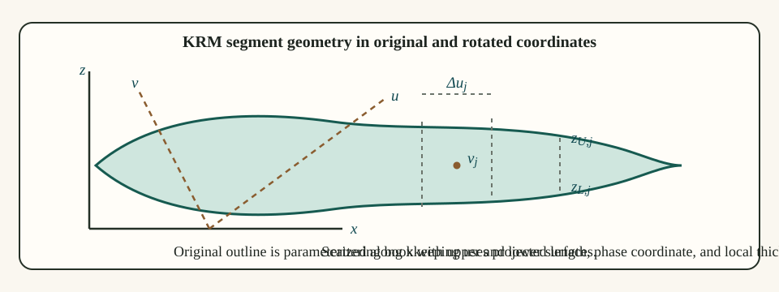

---
title: "Kirchhoff-Ray Mode (KRM) theory"
output:
  rmarkdown::html_vignette:
    toc: true
    number_sections: true
    fig_caption: yes
    fig_width: 3.5
    fig_height: 3.5
    dpi: 200
    dev.args: list(pointsize=11)
bibliography: ../REFERENCES.bib
link-citations: true
reference-section-title: References
vignette: >
  %\VignetteIndexEntry{Kirchhoff-Ray Mode (KRM) theory}
  %\VignetteEncoding{UTF-8}
  %\VignetteEngine{knitr::rmarkdown}
---

# Introduction

```{r model_family_header, echo=FALSE, results='asis'}
acousticTS:::.model_family_header(
  family = "krm",
  pages = c(
    Overview = "index.html",
    Implementation = "krm-implementation.html",
    Theory = "krm-theory.html"
  )
)
```

The Kirchhoff-ray mode (KRM) model assigns different approximations to the
anatomical components of an elongated fish. The weakly contrasting body uses a
segmented Kirchhoff-ray treatment. A strongly contrasting inclusion uses either
a low-order cylindrical mode at small acoustic size or a segmented Kirchhoff
term at larger acoustic size [@Clay_1991; @Clay_1994].

The name reflects that hybrid: Kirchhoff surface scattering, a through-body ray,
and the low-frequency mode of the inclusion.

::: {.note data-title="Shared conventions"}
Seawater is medium 1, body tissue is medium 2, and the internal inclusion is
medium 3. Other symbols follow [Notation and
symbols](../notation-and-symbols/notation-and-symbols.html).
:::



The body and inclusion amplitudes are evaluated separately and then added
coherently.

::: {.note data-title="Swimbladders aren't a requirement"}
The internal term can represent another strongly contrasting fluid inclusion.
Without one, KRM reduces to its body term.
:::

# Physical basis of the KRM

## Kirchhoff approximation for a smooth body

The Kirchhoff approximation replaces each illuminated surface patch by its
tangent plane. It requires a smooth surface and local radii of curvature large
relative to wavelength.

For a locally cylindrical fish body this means that a short segment can be treated as a small fluid cylinder whose scattering is dominated by specular reflection and a transmitted path through the body. The scattered field from the full body is then built by coherently summing the contributions of many such short segments.

In Kirchhoff form, the scattered pressure amplitude may be written schematically as a surface integral over the insonified body:

$$
  \mathcal{f}_\text{bs} \propto \int_S \left[p\frac{\partial G}{\partial n} - G\frac{\partial p}{\partial n}\right] dS,
$$

where $G$ is the exterior Green's function and $n$ is the outward normal. The Kirchhoff approximation replaces $p$ and $\partial p/\partial n$ on each local patch by the corresponding tangent-plane values. For a smooth specular patch, stationary phase then reduces this surface integral to a local contribution proportional to the square root of acoustic size.

For a short cylindrical segment this produces a local amplitude of the form:

$$
  d f_{K} \sim -i\frac{(k a)^{1/2}}{2\sqrt{\pi}} e^{-i2k v_U}\,\Delta u,
$$

where $\Delta u$ is projected segment length, $a$ is local radius, $k$ is the water wavenumber, $\theta$ is the angle of incidence, and $v_U$ is the rotated upper-surface phase coordinate of the segment. The KRM body contribution starts from this leading Kirchhoff term and then augments it by the first transmitted traversal through the body.

## Why a hybrid body-swimbladder model is needed

The body of a fish is often only weakly contrasting relative to water, so a high-frequency surface-based approximation is reasonable when the body is not too small acoustically. The swimbladder is different. Because it is gas-filled, its contrast with the surrounding tissue is large, and when its acoustic size is small the lowest cylindrical response dominates the backscatter. A single asymptotic description is therefore not adequate across all components. The KRM is constructed specifically to combine these regimes in one coherent sum.

The hybrid construction avoids applying the body's weak-contrast approximation
to the gas inclusion or applying a gas-cylinder model to the whole fish.

# Segmented geometric description

## Rotated coordinates

Let the body axis be described by axial coordinate $x$ and dorsoventral coordinate $z$, with incident angle $\theta$. The geometry is transformed into rotated coordinates aligned with the incident wave through:

$$
  u(j) = x(j)\sin\theta - z(j)\cos\theta,
$$

and:

$$
  v(j) = x(j)\cos\theta + z(j)\sin\theta.
$$

$u(j)$ measures position along the projected insonified length, while $v(j)$
sets propagation phase.



Scattering is accumulated in the rotated $(u,v)$ frame aligned with the insonifying wave even though the body description begins in $(x,z)$. The quantities $v_{U,j}$ and $v_{L,j}$ denote the rotated upper and lower surface phase coordinates used in the two-path body term, while $\Delta u_j$ is the projected segment length that weights each local contribution.

## Segment lengths and radii

For adjacent points $j$ and $j+1$, the projected segment length is written as:

$$
  \Delta u_j = [x(j+1)-x(j)]\sin\theta,
$$

which follows the original KRM formulation. This expression is a slender-body approximation to the exact relation $\Delta u_j = u(j + 1) - u(j)$ in which the contribution from the cross-sectional variation, $\left[ z(j + 1) - z(j) \right] \cos \theta$, is neglected. The approximation assumes that the body is smoothly varying and primarily parameterized along its axis, so that changes in $z$ over a short segment are small compared with changes in $x$. Under this assumption, the projected length is controlled by the axial extent of the segment, consistent with the one-dimensional segmentation used in the KRM body formulation. The effective radius of the short locally cylindrical segment is:

$$
  a_j = \frac{w(j)+w(j+1)}{4},
$$

where $w$ is local width. These definitions are the geometric ingredients needed to assign a local scattering contribution to each short segment. They also show why segmentation quality matters. If the body outline changes too abruptly from point to point, the locally cylindrical and smoothly varying assumptions become harder to defend.

# Body scattering contribution

## Interface coefficients

Treat the body as a fluid-like medium embedded in water. Let the reflection coefficient at the water-body interface be $\mathcal{R}_{wb}$. The transmitted ray that crosses the body and exits again carries the two-way transmission factor:

$$
  \mathcal{T}_{wb}\mathcal{T}_{bw} = 1-\mathcal{R}_{wb}^2.
$$

This identity uses lossless, locally planar, normal-incidence coefficients.

For normal incidence on a fluid-fluid interface, the reflection coefficient is determined by impedance contrast:

$$
  \mathcal{R}_{wb} = \frac{Z_B-Z_w}{Z_B+Z_w},
  \qquad
  Z_w = \rho_w c_w,
  \qquad
  Z_B = \rho_B c_B.
$$

The corresponding transmission coefficients satisfy:

$$
  \mathcal{T}_{wb} = 1+\mathcal{R}_{wb},
  \qquad
  \mathcal{T}_{bw} = 1-\mathcal{R}_{wb},
$$

These transmission formulas imply the two-way traversal identity:

$$
  \mathcal{T}_{wb}\mathcal{T}_{bw} = 1-\mathcal{R}_{wb}^2.
$$

## Kirchhoff reduction of a short segment

For a short locally cylindrical segment, the Kirchhoff approximation implies that the scattering amplitude is obtained by integrating the local specular contribution over the projected illuminated area. Stationary-phase reduction of that surface integral gives an amplitude proportional to the square root of the local acoustic size and to the projected segment length. That is the origin of the factor:

$$
  \frac{(k a_j)^{1/2}}{2\sqrt{\pi}}\Delta u_j.
$$

Thus the square-root dependence is not arbitrary. It is the standard stationary-phase scaling of a specular high-frequency contribution from a smooth curved segment.

## Near-surface and through-body rays

Each body segment retains a near-surface reflection and one through-body return.
With rotated upper and lower phase coordinates $v_{U,j}$ and $v_{L,j}$, the
normalized near-surface phase is:

$$
  e^{-i2k v_{U,j}}.
$$

The normalized through-body contribution is:

$$
  \mathcal{T}_{wb}\mathcal{T}_{bw}
  e^{-i2k v_{U,j} + i2k_B(v_{U,j}-v_{L,j}) + i\psi_{B,j}},
$$

Here $k$ is the wavenumber in water and $k_B$ is the wavenumber in the body medium. The first phase term locates the segment in the external field, while the second term includes the additional propagation through the body thickness expressed in rotated coordinates.

The KRM body term is therefore a two-path approximation derived from Kirchhoff geometry. The local segment behaves like a short fluid slab: one contribution reflects from the first interface, while the other accumulates additional phase by traversing the body and returning. Higher-order internal traversals are neglected, which is one reason the model remains compact.

In the compact KRM notation, the internal traversal phase is written as:

$$
  2k_B(v_{U,j}-v_{L,j}),
$$

so the coherent local bracket becomes:

$$
  \mathcal{R}_{wb}\left[
  e^{-i2k v_{U,j}} -
    \mathcal{T}_{wb}\mathcal{T}_{bw}
  e^{-i2k v_{U,j}+i2k_B(v_{U,j}-v_{L,j})+i\psi_{B,j}}
  \right].
$$

::: {.tip data-title="Note on notation"}
The relative sign arises from phase conventions in the transmission and internal reflection process and is retained here to match the standard KRM formulation.
:::

The body formula retains these two paths and neglects further internal
traversals.

## Segment amplitude scaling

The body segment is treated as a short locally cylindrical reflector. Kirchhoff asymptotics therefore gives amplitude factor proportional to the square root of local acoustic size:

$$
  \frac{(k a_j)^{1/2}}{2\sqrt{\pi}},
$$

Multiplying by the projected segment length $\Delta u_j$ gives the segment scattering length:

$$
  \mathcal{L}_{B,j} \approx -i\frac{\mathcal{R}_{wb}}{2\sqrt{\pi}}
  (k a_j)^{1/2}
  \Delta u_j
  \left[
  e^{-i2k v_{U,j}} -
    \mathcal{T}_{wb}\mathcal{T}_{bw}
  e^{-i2k v_{U,j}+i2k_B(v_{U,j}-v_{L,j})+i\psi_{B,j}}
  \right].
$$

## Body phase correction

An empirical phase correction is introduced to improve agreement with finite-wavelength behavior across intermediate acoustic sizes:

$$
  \psi_{B,j} = -\frac{\pi k_B z_{U,j}}{2(k_B z_{U,j} + 0.4)},
$$

where $z_{U,j}$ is the segment-averaged upper-surface coordinate used in the body bookkeeping. As with other hybrid fisheries-acoustics formulas, this term compensates for the fact that a strict geometric traversal phase alone does not adequately describe the finite-wavelength body contribution over the full practical range.

## Coherent sum over the body

The total body contribution is the coherent sum over all body segments:

$$
  f_{body} = \sum_{j=1}^{N_b}\mathcal{L}_{B,j}.
$$

Thus body scattering is treated as a one-dimensional array of locally cylindrical contributions that interfere according to their individual phases.

# Swimbladder contribution

## Low-frequency modal approximation

When the inclusion's acoustic size is small, the azimuthally symmetric
($m=0$) cylindrical mode dominates [@Clay_1994]. In the segmented notation, its
scattering length is:

$$
  f_M = -\frac{iL_e}{\pi}
  \frac{\sin\Delta}{\Delta}\,b_0\,\Phi,
$$

where $L_e$ is the equivalent length, $\Delta=k_mL_e\cos\theta$ is the
finite-length phase parameter, and $\Phi$ places the inclusion in the common
phase frame. For segments with midpoint coordinate $v_j$ and axial width
$\Delta x_j$, this phase factor is:

$$
  \Phi = \frac{1}{L_e}\sum_j e^{2ik_m v_j}\Delta x_j.
$$

The breathing-mode coefficient is:

$$
  b_0 = -\frac{1}{1+iC_0}.
$$

$b_0$ follows from the fluid-cylinder boundary conditions. Truncating at
$m=0$ retains the breathing mode and omits higher azimuthal orders.

For the low-frequency swimbladder term, the relevant local scattering problem is not gas in water. It is gas inside body tissue. Accordingly, let the surrounding body medium be region 2 and the internal gas be region 3. The modal derivation then begins with the cylindrical expansions:

$$
  \begin{align*}
    p_{2,inc}(r,\phi) &=
      \sum_{m=0}^{\infty} \epsilon_m i^m J_m(k_2 r)\cos(m\phi), \\
    p_{2,scat}(r,\phi) &=
      \sum_{m=0}^{\infty} \epsilon_m i^m b_m H_m^{(1)}(k_2 r)\cos(m\phi), \\
    p_{3}(r,\phi) &= \sum_{m=0}^{\infty} \epsilon_m i^m c_m J_m(k_3 r)\cos(m\phi).
  \end{align*}
$$

Pressure continuity and normal-velocity continuity at the gas boundary $r=a$ give, for each mode $m$:

$$
  \begin{align*}
    J_m(k_2 a) + b_m H_m^{(1)}(k_2 a) &= c_m J_m(k_3 a), \\
    \frac{1}{\rho_2}\left[J_m'(k_2 a)+b_mH_m^{(1)\prime}(k_2 a)\right] &=
      \frac{1}{\rho_3}\frac{k_3}{k_2}c_mJ_m'(k_3 a).
  \end{align*}
$$

Eliminating $c_m$ gives the usual fluid-cylinder coefficient. In the
long-wavelength limit, the $m=0$ term dominates, so one retains only:

$$
  b_0 = -\frac{1}{1+iC_0}
$$

The auxiliary coefficient entering the low-frequency modal term is:

$$
  C_0 =
    \frac{
  \dfrac{J_0'(k_3 a)}{J_0(k_3 a)}Y_0(k_2 a) - g_{32}h_{32}\,Y_0'(k_2 a)
  }{
  \dfrac{J_0'(k_3 a)}{J_0(k_3 a)}J_0(k_2 a) - g_{32}h_{32}\,J_0'(k_2 a)
  }
$$

where $g_{32}=\rho_3/\rho_2$ and $h_{32}=c_3/c_2$ for the gas-filled cylinder embedded in body tissue. The low-frequency KRM bladder term therefore inherits its coefficient directly from the same pressure-continuity and normal-velocity conditions used in cylindrical modal theory. The additional KRM simplification is only the truncation to the azimuthally symmetric mode when $ka \ll 1$.

This $b_0$ is used only in the low-acoustic-size branch.

## Medium convention for the inclusion

The inclusion is physically embedded in body tissue, suggesting
$k_m=k_2$, $g_{32}=\rho_3/\rho_2$, and $h_{32}=c_3/c_2$. Because body-water
contrast is often small, the classical approximation may instead use
$k_m\approx k_1$ and reference the inclusion properties to water [@Clay_1994].
These choices change both the modal coefficient and the propagation phase. A
mixed convention can use body-referenced propagation for the high-frequency
term and water-referenced properties for the low-frequency term. The convention
must therefore be reported with a KRM result.

## High-frequency Kirchhoff approximation for the swimbladder

When the swimbladder is no longer acoustically small, the same local-Kirchhoff logic used for the body is applied to the swimbladder. The segment contribution becomes:

$$
  \mathcal{L}_{SB,j} \approx -i\frac{\mathcal{R}_{bc}\mathcal{T}_{wb}\mathcal{T}_{bw}}{2\sqrt{\pi}}
  A_{SB,j}[(k a_j+1)\sin\theta]^{1/2}
  \Delta u_j
  e^{-i(2k_Bv_j+\psi_{p,j})}
$$

where $\mathcal{R}_{bc}$ is the body-to-bladder reflection coefficient and $v_j$ is the rotated phase coordinate of segment $j$.

The regime switch is an approximation. Modal structure does not disappear at
the threshold. The model changes formulas where the local Kirchhoff description
is expected to be more useful.

## Swimbladder amplitude and phase corrections

The empirical amplitude correction is:

$$
  A_{SB,j} = \frac{k a_j}{k a_j+0.083}
$$

and the phase correction is:

$$
  \psi_{p,j} = \frac{k a_j}{40+k a_j}-1.05
$$

As in the body term, these corrections account for the finite-wavelength transition between strict long-wavelength modal behavior and the regime in which a Kirchhoff treatment becomes reasonable.

## Coherent swimbladder sum

The total swimbladder contribution is:

$$
  f_{bladder} = \sum_{j=1}^{N_s}\mathcal{L}_{SB,j}
$$

or, in the low-frequency regime, by the corresponding modal expression if the swimbladder is treated as a short resonant cylinder.

# Total scattering amplitude

The total scattering length is the coherent sum of body and swimbladder terms:

$$
  \mathcal{f}_\text{bs} = f_{body}+f_{bladder}
$$

The backscattering cross-section is therefore:

$$
  \sigma_\text{bs} = |\mathcal{f}_\text{bs}|^2
$$

and target strength is [@MacLennan_2002]:

$$
  TS = 20\log_{10}\left(
  \frac{|\mathcal{f}_\text{bs}|}{1\ \mathrm{m}}
  \right).
$$

The logarithmic definition uses $20\log_{10}$ because $\mathcal{f}_\text{bs}$ is a scattering length rather than a cross-section.

# Mathematical assumptions

The KRM depends on several structural assumptions:

1. The target can be represented as chains of short locally cylindrical segments.
2. The body is fluid-like rather than elastically resonant.
3. The body contribution is dominated by specular and through-body ray terms.
4. The swimbladder is either in a low-order modal regime or a local Kirchhoff regime.
5. Multiple scattering between distant segments is neglected.
6. The Kirchhoff approximation is valid locally, implying smoothly varying geometry and sufficiently large local acoustic size.

KRM does not resolve fine elastic resonances, repeated scattering among distant
segments, or detailed three-dimensional end effects.


