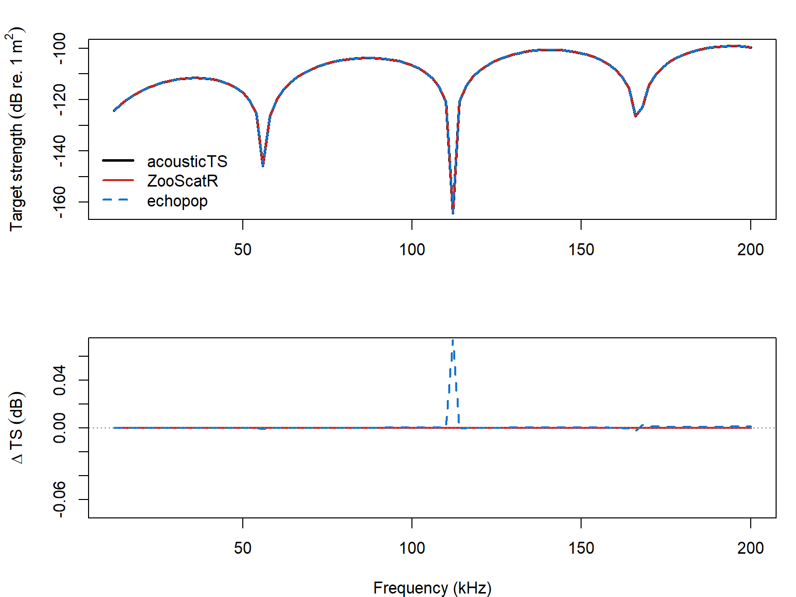

---
title: "Phase-compensated distorted wave Born approximation"
output:
  rmarkdown::html_vignette:
    toc: true
    number_sections: true
    fig_caption: yes
    fig_width: 3.5
    fig_height: 3.5
    dpi: 200
    dev.args: list(pointsize=11)
bibliography: ../REFERENCES.bib
link-citations: true
reference-section-title: References
vignette: >
  %\VignetteIndexEntry{Phase-compensated distorted wave Born approximation}
  %\VignetteEncoding{UTF-8}
  %\VignetteEngine{knitr::rmarkdown}
---

# acousticTS implementation

```{r model_family_header, echo=FALSE, results='asis'}
acousticTS:::.model_family_header(
  family = "pcdwba",
  pages = c(
    Overview = "index.html",
    Implementation = "pcdwba-implementation.html",
    Theory = "pcdwba-theory.html"
  )
)
```


These pages follow the phase-compensated weak-scattering literature for broadside elongated bodies and krill-style applications [@Chu_1999; @Chu_1993].

The phase-compensated distorted wave Born approximation is available through `target_strength(..., model = "pcdwba")`. The implementation is intended for weakly scattering fluid-like bodies and uses the same curved-cylinder bookkeeping whether the target starts as a canonical bent cylinder or an arbitrary fluid-like profile.

This page checks the implementation against two source-level references:

- the `pcdwba_fbs` routine in the `Python` package Echopop (@Echopop_software),
- the bent-cylinder DWBA routines in the `R`-package ZooScatR (@ZooScatR_software) .

::: {.experiment data-title="Validation scope"}
`PCDWBA` is validated here against source-level reference implementations rather than against a separate published benchmark table. The ZooScatR source agrees exactly on the shared case, while the remaining Echopop drift is attributable to that implementation's interpolated Bessel evaluation.
:::

## Reference case

The comparison uses a single reproducible bent-cylinder case:

- length `15 mm`
- radius `1 mm`
- taper order `10`
- curvature ratio `rho_c / L = 3`
- density contrast `g = 1.02`
- sound-speed contrast `h = 1.02`
- broadside incidence
- `12-200 kHz` in `2 kHz` steps
- `51` integration nodes in all three implementations

In acousticTS, that target is built as:

```{r}
library(acousticTS)

pcdwba_object <- fls_generate(
  shape = cylinder(
    length_body = 0.015,
    radius_body = 0.001,
    taper = 10,
    radius_curvature_ratio = 3,
    n_segments = 50
  ),
  g_body = 1.02,
  h_body = 1.02,
  theta_body = pi / 2
)

pcdwba_object <- target_strength(
  object = pcdwba_object,
  frequency = seq(12e3, 200e3, by = 2e3),
  model = "pcdwba",
  sound_speed_sw = 1500,
  density_sw = 1026
)

head(extract(pcdwba_object, "model")$PCDWBA)
```

## Validation outputs
### Comparison summary

```{r echo = FALSE}
pcdwba_summary <- utils::read.csv(
  file.path(
    "..",
    "..",
    "tools",
    "implementation-figures",
    "data",
    "pcdwba_reference_compare_summary.csv"
  )
)

knitr::kable(
  pcdwba_summary,
  digits = 6,
  col.names = c(
    "Comparison",
    "Max abs. $\\Delta$ TS (dB)",
    "Mean abs. $\\Delta$ TS (dB)"
  )
)
```

The ZooScatR and acousticTS outputs are indistinguishable on this grid. The Echopop comparison remains close as well, but it is not at machine precision because that implementation evaluates the cylindrical Bessel term through interpolation rather than a direct nodewise call. On this grid, the largest mismatch occurs near `112 kHz`; replacing the interpolated `J_1(x)/x` evaluation with a direct call collapses that residual onto the acousticTS / ZooScatR curve. So the remaining drift is numerical, not geometrical.

### Timings

```{r echo = FALSE}
pcdwba_timing <- utils::read.csv(
  file.path(
    "..",
    "..",
    "tools",
    "implementation-figures",
    "data",
    "pcdwba_reference_compare_timing.csv"
  )
)

knitr::kable(
  pcdwba_timing,
  digits = 4,
  col.names = c(
    "Implementation",
    "Elapsed (s)",
    "f min (kHz)",
    "f max (kHz)",
    "Step (kHz)",
    "Node count"
  )
)
```

### Spectrum overlay

```{r echo=FALSE, out.width='85%', fig.align='center', fig.alt='Pre-rendered PCDWBA comparison showing ZooScatR, acousticTS, and echopop spectra together with the acousticTS residuals against the two references.'}

```

## Closing note

This is the kind of implementation check that matters for a phase-compensated bent-cylinder solver. The comparison is not just against a benchmark curve. It is against two independently written source routines that share the same governing model. On this reference case, acousticTS reproduces the direct ZooScatR-style calculation exactly and stays very close to the Echopop implementation across the full frequency band.

