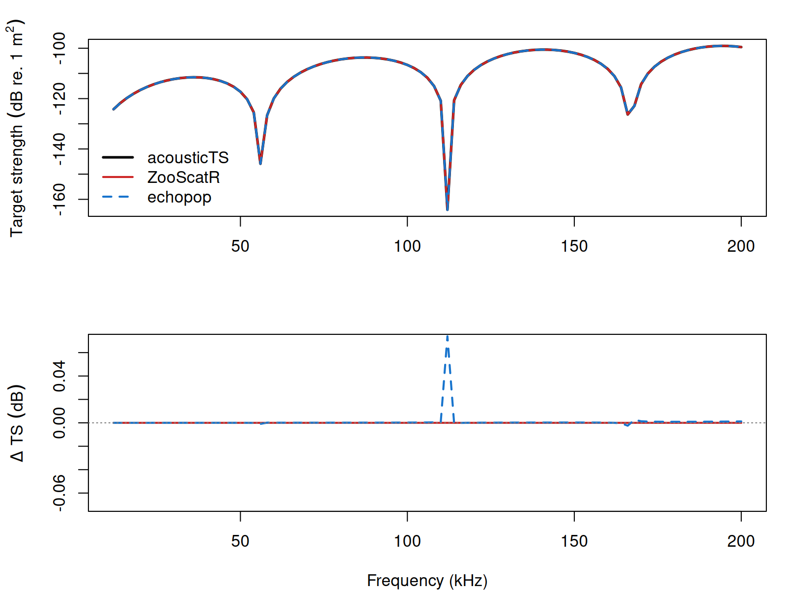

---
title: "Phase-compensated distorted wave Born approximation"
output:
  rmarkdown::html_vignette:
    toc: true
    number_sections: true
    fig_caption: yes
    fig_width: 3.5
    fig_height: 3.5
    dpi: 200
    dev.args: list(pointsize=11)
bibliography: ../REFERENCES.bib
link-citations: true
reference-section-title: References
vignette: >
  %\VignetteIndexEntry{Phase-compensated distorted wave Born approximation}
  %\VignetteEncoding{UTF-8}
  %\VignetteEngine{knitr::rmarkdown}
---

# acousticTS implementation

```{r model_family_header, echo=FALSE, results='asis'}
acousticTS:::.model_family_header(
  family = "pcdwba",
  pages = c(
    Overview = "index.html",
    Implementation = "pcdwba-implementation.html",
    Theory = "pcdwba-theory.html"
  )
)
```


PCDWBA follows the phase-compensated weak-scattering formulation for broadside
elongated targets [@Chu_1999; @Chu_1993].

The phase-compensated distorted wave Born approximation is available through `target_strength(..., model = "pcdwba")`. The implementation is intended for weakly scattering fluid-like bodies and uses the same curved-cylinder bookkeeping whether the target starts as a canonical bent cylinder or an arbitrary fluid-like profile.

This page checks the implementation against two source-level references:

- the `pcdwba_fbs` routine in the Python package Echopop [@Echopop_software]
- the bent-cylinder DWBA routines in the R package ZooScatR [@ZooScatR_software]

::: {.experiment data-title="Validation scope"}
`PCDWBA` is validated here against source-level reference implementations rather than against a separate published benchmark table. The ZooScatR source agrees exactly on the shared case, while the remaining Echopop drift is attributable to that implementation's interpolated Bessel evaluation.
:::

## Reference case

The comparison uses a single reproducible bent-cylinder case:

- length `15 mm`
- radius `1 mm`
- taper order `10`
- curvature ratio `rho_c / L = 3`
- density contrast `g = 1.02`
- sound-speed contrast `h = 1.02`
- broadside incidence
- `12-200 kHz` in `2 kHz` steps
- `51` integration nodes in all three implementations

In acousticTS, that target is built as:

```{r}
library(acousticTS)

pcdwba_object <- fls_generate(
  shape = cylinder(
    length_body = 0.015,
    radius_body = 0.001,
    taper = 10,
    radius_curvature_ratio = 3,
    n_segments = 50
  ),
  g_body = 1.02,
  h_body = 1.02,
  theta_body = pi / 2
)

pcdwba_object <- target_strength(
  object = pcdwba_object,
  frequency = seq(12e3, 200e3, by = 2e3),
  model = "pcdwba",
  sound_speed_sw = 1500,
  density_sw = 1026
)

head(extract(pcdwba_object, "model")$PCDWBA)
```

## Validation outputs
### Comparison summary

```{r echo = FALSE}
pcdwba_summary <- utils::read.csv(
  file.path(
    "..",
    "..",
    "tools",
    "implementation-figures",
    "data",
    "pcdwba_reference_compare_summary.csv"
  )
)

knitr::kable(
  pcdwba_summary,
  digits = 6,
  col.names = c(
    "Comparison",
    "Max abs. $\\Delta$ TS (dB)",
    "Mean abs. $\\Delta$ TS (dB)"
  )
)
```

The ZooScatR and acousticTS outputs are indistinguishable on this grid. Echopop
remains close but evaluates the cylindrical Bessel term through interpolation
rather than a direct nodewise call. The largest mismatch is near `112 kHz`.
Replacing the interpolated `J_1(x)/x` value with a direct call collapses the
residual onto the acousticTS and ZooScatR curve, identifying the drift as
numerical rather than geometrical.

### Spectrum overlay

```{r echo=FALSE, out.width='85%', fig.align='center', fig.alt='Pre-rendered PCDWBA comparison showing ZooScatR, acousticTS, and echopop spectra together with the acousticTS residuals against the two references.'}

```

## Closing note

The two source-level comparisons exercise the same governing model through
independent code paths. acousticTS reproduces the direct ZooScatR calculation
on this case and remains close to Echopop across the comparison band.

