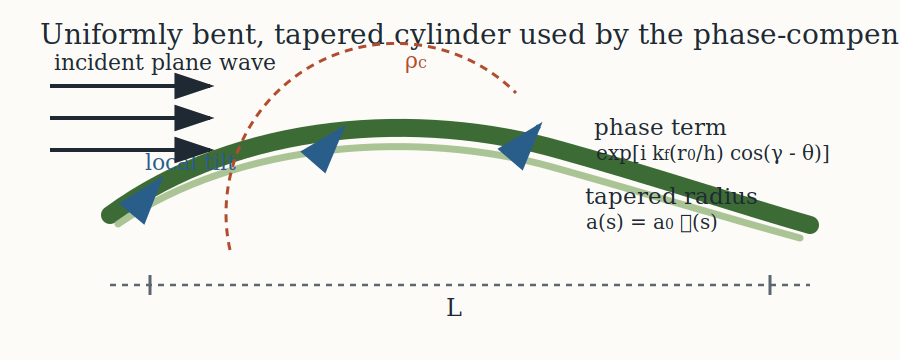

# Introduction

```{r model_family_header, echo=FALSE, results='asis'}
acousticTS:::.model_family_header(
  status = c("experimental", "validated"),
  pages = c(
    Overview = "index.html",
    Implementation = "pcdwba-implementation.html",
    Theory = "pcdwba-theory.html"
  )
)
```

The phase-compensated distorted wave Born approximation extends the ordinary weak-scattering DWBA to bodies whose centerlines are curved rather than straight. Chu and Ye (1999) introduced the model for bistatic scattering from weakly scattering elongated targets, and Stanton (1989) supplied the uniformly bent cylinder geometry that is commonly used to parameterize those targets[^1][^2]. In practical fisheries acoustics, that combination is useful for zooplankton-like targets whose curvature is large enough to matter but whose density and sound-speed contrasts remain small enough for a Born-type treatment to stay sensible.

[^1]: Chu, D., and Ye, Z. (**1999**). *A phase-compensated distorted wave Born approximation representation of the bistatic scattering by weakly scattering objects: Application to zooplankton*. J. Acoust. Soc. Am., 106: 1732-1743.

[^2]: Stanton, T.K. (**1989**). *Sound scattering by cylinders of finite length. III. Deformed cylinders*. J. Acoust. Soc. Am., 86: 691-705.

# Uniformly bent, tapered geometry

The canonical geometry is a uniformly bent cylinder with tapered ends. Its centerline is wrapped around an osculating circle of radius $\rho_c$, while the radius tapers smoothly toward the ends through a dimensionless taper function $\mathcal{T}(s)$. The curvature is usually reported in normalized form as $\rho_c/L$, where $L$ is body length.

```{r echo = FALSE, out.width = "90%", fig.align = "center", fig.cap = "Uniformly bent geometry and local phase bookkeeping used by the phase-compensated DWBA."}

```

For the regularly tapered canonical case, the normalized centerline coordinates can be written in terms of a curvature angle $\gamma = 0.5/(\rho_c/L)$ and a normalized longitudinal coordinate $z \in [-1, 1]$. The taper then scales the local body radius while the bent centerline determines both the local phase origin and the local tilt angle along the body.

# Contrast term

The model inherits the same weak-scattering contrast bookkeeping used in the straight DWBA. The local reflection factor is

$$
C_b =
\frac{1 - g h^2}{g h^2} -
\frac{g - 1}{g},
$$

where $g = \rho_b/\rho_{sw}$ is the density contrast and $h = c_b/c_{sw}$ is the sound-speed contrast. When $g$ and $h$ both remain close to unity, this contrast factor stays small and the Born approximation remains the relevant asymptotic regime.

# Phase-compensated sum

For backscatter, the model can be written as a discrete sum along the bent body:

$$
f_{bs}

\propto
\sum_j
\left(\frac{k a_j}{h}\right)^2
\frac{J_1\!\left(2(k a_j/h)\,|\cos(\beta_j-\theta)|\right)}
     {2(k a_j/h)\,|\cos(\beta_j-\theta)|}
\exp\!\left[
i\,kL\left(\frac{r_j}{h}\right)\cos(\gamma_j-\theta)
\right]
C_b\,\Delta r_j,
$$

where $a_j$ is the local tapered radius, $\beta_j$ is the local body-tilt angle, $r_j$ and $\gamma_j$ describe the bent-centerline position, and $\Delta r_j$ is the local spacing along that centerline. The cylindrical Bessel term retains the local cross-sectional response, while the exponential phase factor is what distinguishes the phase-compensated model from the straight-body DWBA.

# Relation to the `acousticTS` object model

`acousticTS` applies `PCDWBA` to `FLS` objects. Canonical cylinders can be bent either at shape construction time or at model call time through a supplied curvature ratio. Arbitrary fluid-like profiles can also be used as long as they resolve a meaningful centerline and nodewise radius profile. Internally, the model reduces everything to:

- a centerline position vector,
- a local tilt-angle vector,
- a local taper/radius vector, and
- nodewise contrast terms.

That means the curved canonical geometry and a hand-built arbitrary profile are treated in the same mathematical form once the geometry has been reduced to those nodewise quantities.

# Closing note

Conceptually, the model is best viewed as a curved-body extension of the ordinary DWBA rather than a separate scattering family. The cross-sectional response still comes from the weak-fluid cylindrical kernel. What changes is the phase bookkeeping along a curved axis, which is why the implementation lives most naturally alongside the other DWBA models in the package.
