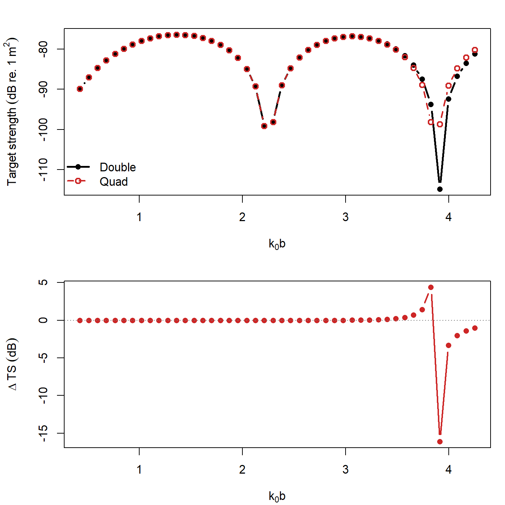
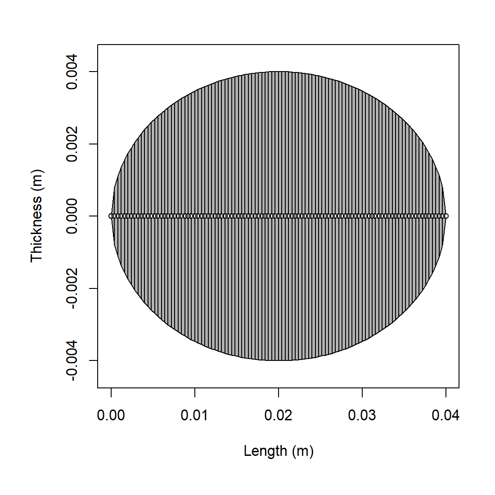
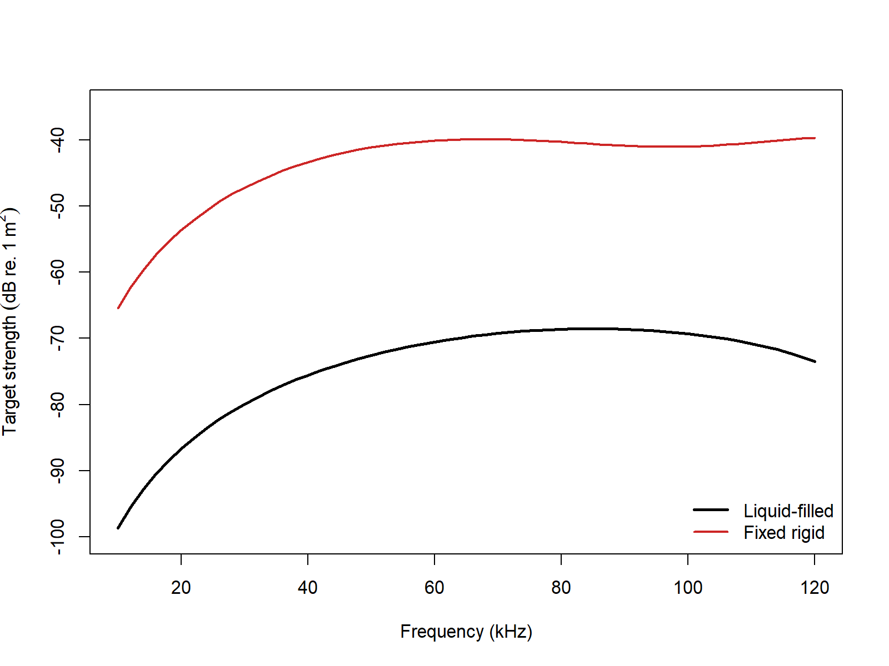

# acousticTS implementation

```{r model_family_header, echo=FALSE, results='asis'}
acousticTS:::.model_family_header(
  family = "psms",
  pages = c(
    Overview = "index.html",
    Implementation = "psms-implementation.html",
    Theory = "psms-theory.html"
  )
)
```


These pages are rooted in exact spheroidal-coordinate separations and later fisheries-acoustics use of prolate-spheroid models [@Spence_1951; @Furusawa_1988].

The acousticTS package uses object-based scatterers so the same implementation pattern carries across models: create a scatterer, run `target_strength()`, inspect the stored model output, and then compare a small set of physically important inputs. For PSMS, the main additional choices are the boundary condition, the incident roll angle `phi_body`, and the numerical settings that control how the retained spheroidal system is actually evaluated.

That last point is especially important for PSMS. Unlike some of the simpler modal models, the prolate spheroidal calculation can make numerical settings part of the practical interpretation of the run. The geometry and material properties still define the target, but convergence-related controls help determine how faithfully the truncated spheroidal system has been solved.

## Prolate spheroid object generation

```{r}
library(acousticTS)

prolate_shape <- prolate_spheroid(
  length_body = 40e-3,
  radius_body = 4e-3,
  n_segments = 100
)

prolate_object <- fls_generate(
  shape = prolate_shape,
  density_body = 1045,
  sound_speed_body = 1520,
  theta_body = pi / 2
)

prolate_object
```

This object setup is doing more than creating an elongated target. It is declaring that a prolate spheroid is the intended geometric idealization. That is a stronger statement than simply saying the object is elongated. A reader should use PSMS when the prolate spheroidal geometry itself is physically meaningful, not merely when a target looks somewhat longer than it is wide.

## Calculating a TS-frequency spectrum

```{r}
frequency <- seq(38e3, 120e3, by = 8e3)

prolate_object <- target_strength(
  object = prolate_object,
  frequency = frequency,
  model = "psms",
  boundary = "liquid_filled",
  phi_body = pi,
  n_integration = 96,
  simplify_Amn = TRUE
)
```

This example chooses the fluid-filled boundary because it shows the most demanding PSMS workflow. The `boundary` argument determines the physical interface conditions, `phi_body` controls the roll orientation used in the spheroidal geometry, and `n_integration` together with `simplify_Amn` affects how the coupled fluid-filled system is evaluated numerically.

For PSMS, `boundary = "liquid_filled"` and `boundary = "gas_filled"` use the same penetrable-interface formulation. The difference is not a separate boundary equation. It is the material contrast carried by the scatterer object itself: an `FLS` object supplies liquid-like body properties, while a `GAS` object supplies gas-like body properties. In that sense, the two options are best read as liquid-filled and gas-filled instantiations of the same underlying penetrable PSMS problem. In the current implementation, however, the public gas-filled path is routed onto the simplified penetrable formulation because that is the branch that stays externally consistent on the published benchmark geometry.

For rigid and pressure-release boundaries, the PSMS bookkeeping is simpler because the modal coefficients remain effectively diagonal by retained degree. For fluid-filled runs, the numerical settings deserve more attention because the overlap integrals and dense solves are part of the practical calculation.

::: {.caution data-title="Quad precision and fluid-filled PSMS"}
If `precision = "quad"` is requested, the main practical warning is cost. [Quad precision](https://en.wikipedia.org/wiki/Quadruple-precision_floating-point_format) remains substantially slower than double precision because the spheroidal functions, overlap integrals, and kernel matrices all grow quickly with acoustic size. That is true for every PSMS boundary, and it is especially important for the full liquid-filled solve and for the externally benchmarked gas-filled simplified branch.

The implementation reduces some of that burden by batching spheroidal-function calls over blocks of $m$, reusing the incident angular matrix to construct the backscatter angular matrix through parity, and avoiding unnecessary rectangular expansions of triangular modal data. Even with those savings, high-$ka$ PSMS sweeps in quad precision can take a very long time.

That means `precision = "quad"` should be read as a tool for difficult cases, not as a universal default. It is most useful when the double-precision solution shows visible instability at higher modal limits or when benchmark agreement deteriorates at larger reduced frequencies. When the double-precision and quadruple-precision curves already agree to within the scientific tolerance of interest, the faster double-precision path is usually the more practical choice.
:::

## Adaptive mode

The `adaptive` argument is the main switch that separates a fully literal retained-mode evaluation from a more pragmatic backscatter evaluation. The important point is that `adaptive = TRUE` does not redefine the PSMS mathematics. It changes how aggressively the implementation is allowed to stop once the retained modal tail has already become numerically inactive [@Press_2007; DLMF:ch1; DLMF:ch3].

The hard modal limits remain the same in both modes. The initialization step still defines:

$$
  m_{\max} = \left\lceil 2 k_0 b \right\rceil,
$$
and:

$$
  n_{\max} = m_{\max} + \left\lceil \frac{h_0}{2} \right\rceil.
$$

When `adaptive = FALSE`, those limits are carried through literally. When `adaptive = TRUE`, they are treated as upper bounds. The code is then allowed to stop early only if the tail is both small and flattening out, rather than continuing all the way to those caps by default.

That adaptive logic operates in three layers.

1. For the full liquid-filled backscatter solve, `adaptive = TRUE` owns the overlap quadrature order internally. In that path, a user-supplied `n_integration` is ignored on purpose. The implementation uses the retained modal ceilings themselves as the main difficulty scale, with a smaller bonus from the larger of $|\chi_1|$ and $|\chi_2|$. Lower modal difficulty therefore gets fewer quadrature nodes, while harder runs climb toward the same hard cap used by the literal path. This makes the quadrature rule general to the retained PSMS problem rather than tied to one particular example geometry.

2. Inside each retained azimuthal order $m$, the backscatter evaluators monitor the sizes of successive modal terms in $n$. The code only stops the inner tail if the current term remains below a numerical cutoff and its magnitude gradient relative to the previous term has also flattened. In other words, the rule is not "small enough once." It is "small enough and no longer recovering."

3. Across $m$, the same idea is applied to whole $m$-band contributions. Several successive $m$-bands must be both negligible and gradient-flat before the outer tail is stopped. This is what allows `adaptive = TRUE` to matter not only for `liquid_filled` and `gas_filled`, but also for `fixed_rigid` and `pressure_release`.

For the full liquid-filled backscatter path, there is one additional adaptive step before the dense system is even built for a given $m$. The code forms a cheap proxy from the angular and radial factors and uses that proxy to decide whether the far tail in $n$ is already inactive. If it is, the expensive overlap and kernel system is only built for the shorter active part of the retained degree range.

The cutoffs themselves are precision-aware. The relative tolerance used in the modal-tail checks remains tighter in quadruple precision than in double precision, and an absolute floor is also enforced so that the adaptive rule remains meaningful even when the accumulated sum is very small. This is why `adaptive = TRUE` should be read as a convergence-aware shortcut rather than as a looser approximation.

Two practical consequences follow from that design. First, `adaptive = TRUE` is most useful for backscatter spectra, which are the main PSMS workflow exposed by the package. Second, the runtime gain is usually largest for the full fluid and gas problems, because that is where early tail trimming can also reduce the size of the dense per-$m$ systems rather than only the final modal summation.

The safest way to use the switch is:

1. leave `adaptive = FALSE` when reproducing a benchmark or performing a strict convergence study,
2. use `adaptive = TRUE` when you want a faster exploratory backscatter sweep,
3. and then compare the two if the high-$ka$ part of the spectrum will be interpreted closely.

The code below shows the two usage patterns explicitly.

```{r eval=FALSE}
# Literal hard-cap evaluation
obj_literal <- target_strength(
  object = prolate_object,
  frequency = frequency,
  model = "psms",
  boundary = "liquid_filled",
  phi_body = pi,
  adaptive = FALSE,
  n_integration = 96,
  simplify_Amn = FALSE,
  precision = "quad"
)

# Adaptive backscatter evaluation
obj_adaptive <- target_strength(
  object = prolate_object,
  frequency = frequency,
  model = "psms",
  boundary = "liquid_filled",
  phi_body = pi,
  adaptive = TRUE,
  simplify_Amn = FALSE,
  precision = "quad"
)
```

In the second call, `n_integration` is omitted on purpose. For the full liquid-filled PSMS solve, `adaptive = TRUE` chooses the quadrature order internally from the retained modal difficulty and ignores a user-supplied `n_integration`. The public gas-filled path currently uses the simplified penetrable formulation instead, so it does not take that adaptive quadrature branch.

## Benchmark comparisons

The PSMS implementation is easiest to interpret when the main numerical switches are compared directly against the published benchmark geometry. For `fixed_rigid`, `pressure_release`, and `liquid_filled`, the summary below uses the bundled `benchmark_ts` data [@Jech_2015; @echoSMs_software]. For `gas_filled`, the same `140 x 10 mm` broadside prolate geometry is run directly, but the external reference are predictions from a boundary element method (BEM) model [@Bempp-cl_software].

Three coverage details matter when reading the numbers:

1. `fixed_rigid` and `pressure_release` benchmark values are only available at `12, 18, 38, 70 kHz`.
2. In Table III from @Jech_2015, `NB` is defined as "no benchmark." Instead, the gas-filled prolate spheroid was benchmarked against a BEM model at `12, 38, 70, 120 kHz`. 
3. The liquid-filled benchmark has values at `12, 18, 38, 70, 120, 200, 250, 300, 400 kHz`, but not at `333 kHz`.

The reported $\Delta$ values are therefore computed only where validated benchmark values exist.

### Benchmark summary
::: {.panel-tabset}

#### Rigid and pressure release

| Boundary | Precision | `adaptive` | `n_integration` | Max abs. $\Delta$ TS (dB) | Mean abs. $\Delta$ TS (dB) |
|:--|:--|:--|:--|--:|--:|
| `fixed_rigid` | `double` | `FALSE` | `96` | 0.00674 | 0.00230 |
| `fixed_rigid` | `double` | `TRUE` |  | 0.00674 | 0.00230 |
| `fixed_rigid` | `quad` | `FALSE` | `96` | 0.00096 | 0.00083 |
| `fixed_rigid` | `quad` | `TRUE` |  | 0.00096 | 0.00083 |
| `pressure_release` | `double` | `FALSE` | `96` | 0.00412 | 0.00251 |
| `pressure_release` | `double` | `TRUE` |  | 0.00412 | 0.00251 |
| `pressure_release` | `quad` | `FALSE` | `96` | 0.00433 | 0.00293 |
| `pressure_release` | `quad` | `TRUE` |  | 0.00433 | 0.00293 |

<!-- #### Gas filled

| Precision | `simplify_Amn` | `adaptive` | `n_integration` | Benchmark status | Max abs. $\Delta$ TS (dB) | Mean abs. $\Delta$ TS (dB) |
|:--|:--|:--|:--|:--|:--|:--|
| `double` | `FALSE` | `FALSE` | `96` | `Figure BEM` | `2.07744` | `0.57676` |
| `double` | `FALSE` | `TRUE` |  | `Figure BEM` | `2.07744` | `0.57676` |
| `double` | `TRUE` | `FALSE` | `96` | `Figure BEM` | `2.07744` | `0.57676` |
| `double` | `TRUE` | `TRUE` |  | `Figure BEM` | `2.07744` | `0.57676` |
| `quad` | `FALSE` | `FALSE` | `96` | `Figure BEM` | `0.06256` | `0.02246` |
| `quad` | `FALSE` | `TRUE` |  | `Figure BEM` | `0.06256` | `0.02246` |
| `quad` | `TRUE` | `FALSE` | `96` | `Figure BEM` | `0.06256` | `0.02246` |
| `quad` | `TRUE` | `TRUE` |  | `Figure BEM` | `0.06256` | `0.02246` | -->

#### Liquid filled

| Precision | `simplify_Amn` | `adaptive` | `n_integration` | Max abs. $\Delta$ TS (dB) | Mean abs. $\Delta$ TS (dB) |
|:--|:--|:--|:--|--:|--:|
| `double` | `FALSE` | `FALSE` | `96` | 8.67114 | 1.53575 |
| `double` | `FALSE` | `TRUE` |  | 17.34265 | 4.59850 |
| `double` | `TRUE` | `FALSE` | `96` | 7.18195 | 2.22574 |
| `double` | `TRUE` | `TRUE` |  | 7.18195 | 2.22574 |
| `quad` | `FALSE` | `FALSE` | `96` | 0.08263 | 0.02805 |
| `quad` | `FALSE` | `TRUE` |  | 0.08348 | 0.02806 |
| `quad` | `TRUE` | `FALSE` | `96` | 3.65223 | 1.46801 |
| `quad` | `TRUE` | `TRUE` |  | 3.65223 | 1.46801 |

:::

Several practical points follow from this comparison.

1. For `fixed_rigid` and `pressure_release`, both precisions remain benchmark-close over the frequencies for which benchmark values are available, and the adaptive early-stop logic does not materially change those benchmark $\Delta$ values on this short grid.
2. When `adaptive = FALSE`, the model keeps the literal fixed `n_integration = 96` default. When `adaptive = TRUE`, the table leaves that cell blank because the adaptive path no longer treats quadrature order as a user-fixed input.
3. `simplify_Amn` only affects the fluid or gas PSMS solve, so that column is blank for `fixed_rigid` and `pressure_release`.
4. For liquid-filled PSMS, the full formulation with `simplify_Amn = FALSE` and `precision = "quad"` remains the only configuration in this table that stays benchmark-close through the higher-frequency benchmark range.
5. The simplified gas-filled prolate spheroid model tracks closely with the BEM predictions. That behavior is exactly why `simplify_Amn` is currently better suited for gas-filled PSMS. The gas interior creates an extreme-contrast fluid problem, and the present dense overlap-coupled full gas solve becomes numerically unstable there. The simplified branch removes the unstable off-diagonal coupling and, for this benchmark geometry, is the one that agrees with `BEM` *and* `FEM` predictions, as well as external software references [@Prol_Spheroid_software]. In the current public implementation, requests for the full gas-filled branch are therefore routed onto this simplified formulation.
6. The adaptive liquid-filled path is useful in quad precision, but it is not universally beneficial. In particular, the `precision = "double"`, `simplify_Amn = FALSE`, `adaptive = TRUE` combination drifts much farther from benchmark on this grid than the literal double-precision run.
7. The largest liquid-filled deviations occur in deep null neighborhoods, where small phase or truncation differences can produce visibly larger `TS` differences in dB than they would on a linear scattering-amplitude scale.

The summary statistics are helpful, but they still compress where the differences actually occur. For the main liquid-filled benchmark configuration, the frequency-specific comparison is:

| Frequency (kHz) | Benchmark TS (dB) | Literal TS (dB) | Adaptive TS (dB) | Adaptive `n_integration` | Literal $\Delta$ TS (dB) | Adaptive $\Delta$ TS (dB) |
|--:|--:|--:|--:|--:|--:|--:|
| 12 | -87.05 | -87.05331 | -87.05331 | 32 | -0.00331 | -0.00331 |
| 18 | -81.19 | -81.19965 | -81.19965 | 32 | -0.00965 | -0.00965 |
| 38 | -77.17 | -77.20046 | -77.20046 | 32 | -0.03046 | -0.03046 |
| 70 | -76.92 | -76.95042 | -76.95042 | 32 | -0.03042 | -0.03042 |
| 120 | -80.58 | -80.55970 | -80.55951 | 32 | 0.02030 | 0.02049 |
| 200 | -89.31 | -89.39263 | -89.39348 | 48 | -0.08263 | -0.08348 |
| 250 | -79.39 | -79.42879 | -79.42819 | 56 | -0.03879 | -0.03819 |
| 300 | -77.52 | -77.51659 | -77.51653 | 64 | 0.00341 | 0.00347 |
| 333 | `NA` | -76.90684 | -76.90677 | 72 | `NA` | `NA` |
| 400 | -78.41 | -78.44349 | -78.44309 | 88 | -0.03349 | -0.03309 |

That table compares the literal run `adaptive = FALSE`, `n_integration = 96` against the adaptive run `adaptive = TRUE`, which selects the quadrature order internally. The largest differences occur near deeper nulls, which is why the absolute `TS` deltas can look more dramatic than the underlying linear-amplitude mismatch would suggest.

## Double- versus quadruple-precision drift

The benchmark table already shows that the full liquid-filled PSMS solve can separate materially between `precision = "double"` and `precision = "quad"` once the acoustic size grows. A direct way to see that is to hold every other setting fixed and then plot the `double - quad` difference against the reduced size parameter `k_0 b`, where `b` is the spheroid minor radius.

```{r fig.width = 7.5, fig.height = 5.5}
precision_freq <- c(12e3, 18e3, 38e3, 70e3, 100e3)
precision_obj <- fls_generate(
  shape = prolate_spheroid(
    length_body = 0.14,
    radius_body = 0.01,
    n_segments = 80
  ),
  theta_body = pi / 2,
  density_body = 1028.9,
  sound_speed_body = 1480.3
)

precision_double <- target_strength(
  object = precision_obj,
  frequency = precision_freq,
  model = "psms",
  boundary = "liquid_filled",
  phi_body = pi,
  adaptive = FALSE,
  precision = "double",
  simplify_Amn = FALSE,
  n_integration = 96,
  density_sw = 1026.8,
  sound_speed_sw = 1477.3
)

precision_quad <- target_strength(
  object = precision_obj,
  frequency = precision_freq,
  model = "psms",
  boundary = "liquid_filled",
  phi_body = pi,
  adaptive = FALSE,
  precision = "quad",
  simplify_Amn = FALSE,
  n_integration = 96,
  density_sw = 1026.8,
  sound_speed_sw = 1477.3
)

precision_df <- data.frame(
  frequency = precision_freq,
  k0b = 2 * pi * precision_freq * 0.01 / 1477.3,
  double_ts = precision_double@model$PSMS$TS,
  quad_ts = precision_quad@model$PSMS$TS
)
precision_df$delta_ts <- precision_df$double_ts - precision_df$quad_ts
```

```{r echo=FALSE, out.width='85%', fig.align='center', fig.alt='Pre-rendered PSMS precision comparison showing double- and quadruple-precision spectra versus reduced size together with the double-minus-quadruple residual.'}

```

For this full liquid-filled run, the double- and quadruple-precision curves are effectively indistinguishable through $k_1 b < 1$, differ by only about `1.4e-07 dB` at `38 kHz`, then separate to about `0.01 dB` by `70 kHz` ($k_1 b \approx 2.98$) and to about `1.02 dB` by `100 kHz` ($k_1 b \approx 4.25$). That is the practical reason the benchmark table above starts to favor quadruple precision once the retained PSMS system moves into the higher-frequency penetrable regime.

## Representative runtime

Absolute runtime depends strongly on the local machine, compiler, BLAS/LAPACK setup, and background system load, so the values below should be read as representative timings rather than portable expectations. These runs were recorded on:

1. Windows 10 Home
2. AMD Ryzen 5 5600XT 6-Core Processor (`6` physical cores, `12` logical processors)
3. `32 GB` RAM
4. R `4.5.2` (`x86_64-w64-mingw32`, `ucrt`)
5. `g++`

For `fixed_rigid`, `pressure_release`, `gas_filled`, and `liquid_filled`, the timed frequency grid was the same one used in the benchmark table:

$$
  12,\; 18,\; 38,\; 70,\; 120,\; 200,\; 250,\; 300,\; 333,\; 400\ \text{kHz}.
$$

For `gas_filled`, these timings use the same published `140 x 10 mm` broadside benchmark geometry discussed above rather than the shorter bundled fixture run.

### Runtime summary
::: {.panel-tabset}

#### Rigid and pressure release

| Boundary | Precision | `adaptive` | `n_integration` | Elapsed time (s) |
|:--|:--|:--|:--|--:|
| `fixed_rigid` | `double` | `FALSE` | `96` | 0.20 |
| `fixed_rigid` | `double` | `TRUE` |  | 0.14 |
| `fixed_rigid` | `quad` | `FALSE` | `96` | 13.61 |
| `fixed_rigid` | `quad` | `TRUE` |  | 13.53 |
| `pressure_release` | `double` | `FALSE` | `96` | 0.14 |
| `pressure_release` | `double` | `TRUE` |  | 0.14 |
| `pressure_release` | `quad` | `FALSE` | `96` | 13.38 |
| `pressure_release` | `quad` | `TRUE` |  | 13.36 |

#### Gas filled

| Precision | `simplify_Amn` | `adaptive` | `n_integration` | Elapsed time (s) |
|:--|:--|:--|:--|--:|
| `double` | `FALSE` | `FALSE` | `96` | `0.47` |
| `double` | `FALSE` | `TRUE` |  | `0.41` |
| `double` | `TRUE` | `FALSE` | `96` | `0.40` |
| `double` | `TRUE` | `TRUE` |  | `0.38` |
| `quad` | `FALSE` | `FALSE` | `96` | `16.92` |
| `quad` | `FALSE` | `TRUE` |  | `16.67` |
| `quad` | `TRUE` | `FALSE` | `96` | `16.83` |
| `quad` | `TRUE` | `TRUE` |  | `16.90` |

#### Liquid filled

| Precision | `simplify_Amn` | `adaptive` | `n_integration` | Elapsed time (s) |
|:--|:--|:--|:--|--:|
| `double` | `FALSE` | `FALSE` | `96` | 1.81 |
| `double` | `FALSE` | `TRUE` |  | 1.31 |
| `double` | `TRUE` | `FALSE` | `96` | 0.18 |
| `double` | `TRUE` | `TRUE` |  | 0.15 |
| `quad` | `FALSE` | `FALSE` | `96` | 59.66 |
| `quad` | `FALSE` | `TRUE` |  | 48.33 |
| `quad` | `TRUE` | `FALSE` | `96` | 14.75 |
| `quad` | `TRUE` | `TRUE` |  | 14.56 |

:::

The practical interpretation is straightforward:

1. The rigid and pressure-release PSMS paths are comparatively cheap, even in quadruple precision, because they avoid the dense overlap-driven fluid solve.
2. The full liquid-filled solve with `simplify_Amn = FALSE` is still by far the most expensive configuration in this benchmark set.
3. The gas-filled benchmark shape is no longer cheap once the published geometry is used, especially in quadruple precision.
4. The gas-filled runtime split is therefore diagnostic: `simplify_Amn = TRUE` is not just faster, it is the gas branch that is both stable and externally consistent on the benchmark geometry. In the current public implementation, rows with `simplify_Amn = FALSE` are routed onto that same simplified formulation, so their benchmark deltas now match and their runtime differences reduce to small wrapper overhead rather than different core solves.
5. The adaptive liquid-filled path is faster because it combines a smaller modal-content-based quadrature rule at lower reduced frequency with more aggressive $n$- and $m$-tail termination inside the backscatter assembly.
6. On this machine and grid, that reduces the full liquid-filled quad run from about `59.7 s` to about `48.3 s` without materially changing benchmark agreement.
7. The same statement is not automatically true in double precision: the adaptive full liquid-filled double run is faster here, but the benchmark table above shows that it also drifts much farther from the benchmark curve.
8. In this adaptive liquid-filled quad comparison, the internally selected quadrature orders were `32, 32, 32, 32, 32, 48, 56, 64, 72, 88`; that sequence is shown in the frequency-by-frequency table above because it is an internal implementation detail, not a user-specified input.

## Cross-software implementation checks

Beyond the published benchmark curves, it is also useful to check whether the same prolate spheroid definitions produce comparable spectra in other locally available implementations. The liquid-filled and rigid/pressure-release checks below use the shared `12, 18, 38, 70, 100 kHz` frequency set so that the cross-software comparison reaches more informative reduced frequencies while still remaining computationally manageable. The gas-filled comparison is summarized separately because the most informative current check is the published benchmark geometry run directly against live outputs from  Prol_Spheroid [@Prol_Spheroid_software] and echoSMs [@echoSMs_software].

`Prol_Spheroid` only treats penetrable prolate spheroids, so its cells are `N/A` for `fixed_rigid` and `pressure_release`. The original and vectorized `Prol_Spheroid` branches are split below because their numerical agreement is nearly identical while their runtimes are not.

### Cross-software summary
::: {.panel-tabset}

#### echoSMs

| Case | Frequency set (kHz) | Max abs. $\Delta$ TS | Mean abs. $\Delta$ TS (dB) |
|:--|:--|--:|--:|
| `fixed_rigid` | `12, 18, 38, 70, 100` | `0.49692` | `0.10091` |
| `pressure_release` | `12, 18, 38, 70, 100` | `0.08619` | `0.01757` |
| `liquid_filled` | `12, 18, 38, 70, 100` | `1.01676` | `0.20537` |

#### Prol_Spheroid

| Case | Frequency set (kHz) | Max abs. $\Delta$ TS (dB) | Mean abs. $\Delta$ TS (dB) | Max abs. $\Delta$ TS vs vectorized (dB) | Mean abs. $\Delta$ TS vs vectorized (dB) |
|:--|:--|--:|--:|--:|--:|
| `fixed_rigid` | `12, 18, 38, 70, 100` | `N/A` | `N/A` | `N/A` | `N/A` |
| `pressure_release` | `12, 18, 38, 70, 100` | `N/A` | `N/A` | `N/A` | `N/A` |
| `liquid_filled` | `12, 18, 38, 70, 100` | `0.00128` | `0.00055` | `0.00128` | `0.00055` |

#### Runtime

| Case | Frequency set (kHz) | $t_\text{acousticTS}$ (s) | $t_\text{echoSMs}$ (s) | $t_\text{Prol\_Spheroid}$ (s) | $t_\text{Prol\_Spheroid-vectorized}$ (s) |
|:--|:--|--:|--:|--:|--:|
| `fixed_rigid` | `12, 18, 38, 70, 100` | `0.86` | `0.34` | `N/A` | `N/A` |
| `pressure_release` | `12, 18, 38, 70, 100` | `0.93` | `0.33` | `N/A` | `N/A` |
| `liquid_filled` | `12, 18, 38, 70, 100` | `2.72` | `48.02` | `48.65` | `11.06` |

:::

These checks are informative in a more mixed way once `70` and `100 kHz` are included. The penetrable liquid-filled case remains extremely close to the independent Prol_Spheroid implementation in both branches, with a maximum absolute difference of only `0.00128 dB` over the full five-frequency set. The more interesting difference there is computational rather than acoustic: the vectorized branch reduces the liquid-filled runtime from about `48.65 s` to `11.06 s` on this machine while returning the same agreement to the displayed precision.

By contrast, the shared [echoSMs::PSMSModel](https://ices-tools-dev.github.io/echoSMs/api_reference/#echosms.PSMSModel) comparison begins to separate at the higher two frequencies, especially for the penetrable cases: the liquid-filled difference reaches about `1.02 dB` at `100 kHz`. The gas-filled comparison is summarized separately below because the current implementation story there is not “another representative case ladder.” It is the benchmark geometry itself and the fact that the simplified gas branch is the only one that presently stays stable and externally consistent.

### Gas-filled cross-software comparison

The gas-filled PSMS path is summarized here on the published benchmark geometry itself: `L = 140 mm`, `a = 10 mm`, `theta_body = 90 deg`, `phi_body = pi`, `density_body = 1.24 kg m^-3`, and `sound_speed_body = 345 m s^-1`. The frequency set is the external-reference overlap `12, 18, 38, 70, 120, 200 kHz`. The table below compares the stable benchmark-shape gas runs against live vectorized `Prol_Spheroid` outputs. The `acousticTS elapsed` values were recomputed on exactly this six-frequency grid. In the current public implementation, requests for the full gas-filled branch are routed onto the same simplified penetrable formulation used by the explicit `simplify_Amn = TRUE` rows.

| Case | Frequency set (kHz) | Max abs. $\Delta$ TS (dB) | Mean abs. $\Delta$ TS (dB) | $t_\text{acousticTS}$ (s) | $t_\text{Prol\_Spheroid}$ (s) |
|:--|:--|--:|--:|--:|--:|
| `benchmark broadside, double, simplified, literal` | `12, 18, 38, 70, 120, 200` | `2.19518` | `0.59593` | `0.13` | `89.93` |
| `benchmark broadside, double, simplified, adaptive` | `12, 18, 38, 70, 120, 200` | `2.19518` | `0.59593` | `0.14` | `89.93` |
| `benchmark broadside, quad, simplified, literal` | `12, 18, 38, 70, 120, 200` | `0.13946` | `0.04163` | `3.04` | `89.93` |
| `benchmark broadside, quad, simplified, adaptive` | `12, 18, 38, 70, 120, 200` | `0.13946` | `0.04163` | `3.21` | `89.93` |


### Plotting results

```{r echo=FALSE, out.width='49%', fig.align='center', fig.alt='Pre-rendered PSMS shape plot for the example prolate spheroid geometry.'}

```

### Accessing results

```{r}
psms_results <- extract(prolate_object, "model")$PSMS
head(psms_results)
```

## Comparing fluid-filled and rigid boundaries

The boundary condition changes the coefficient solve without changing the outer geometry, so it is a straightforward first comparison when checking whether a prolate spheroid is being parameterized consistently.

```{r echo=FALSE, out.width='85%', fig.align='center', fig.alt='Pre-rendered PSMS comparison between liquid-filled and fixed-rigid prolate spheroid spectra over the same frequency sweep.'}

```

This comparison is useful because it isolates one of the main PSMS decisions without changing the geometric idealization. If the rigid and fluid-filled curves differ substantially, that is not a sign of inconsistency by itself. It is evidence that the boundary physics is materially affecting the prolate-spheroidal response, which is exactly the kind of sensitivity the model is meant to expose.

For practical PSMS work, the first controls to revisit are usually:

1. the boundary condition, because it changes the coefficient problem fundamentally,
2. the orientation arguments such as `phi_body`, because spheroidal geometry is anisotropic,
3. `adaptive`, because it controls whether the hard truncation limits are treated as literal caps or as upper bounds for early tail stopping,
4. `n_integration`, because the overlap integrals must be resolved accurately whenever they are actually formed, and
5. `simplify_Amn` and `precision`, because they affect the stability and cost of the fluid-filled solve.

Those are the settings to revisit first when a spectrum appears unexpectedly noisy, unexpectedly sensitive, or unexpectedly expensive to evaluate.

