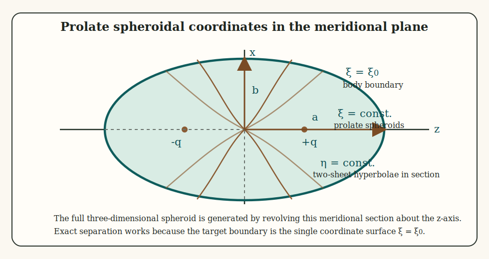
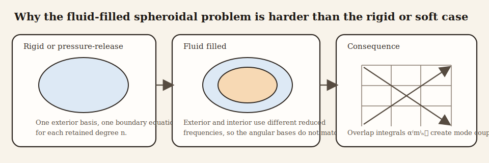
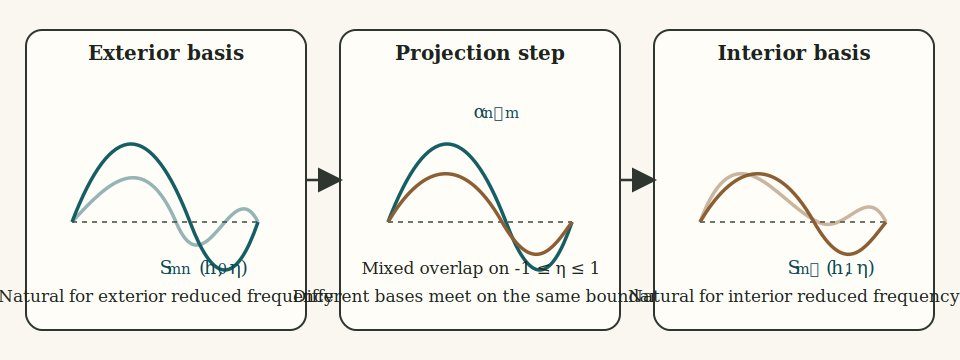

# Introduction

The prolate spheroidal modal series solution (PSMS) is the natural exact-separation analogue of spherical partial-wave theory for elongated bodies whose surface is better approximated by a prolate spheroid than by a sphere or cylinder. The key fact is that the Helmholtz equation is separable in prolate spheroidal coordinates, so the incident, scattered, and interior fields can all be expanded in spheroidal angular and radial wave functions.[^1][^2][^3]

The rigid, pressure-release, and fluid-filled boundary types used in the modal derivation below are summarized separately in the companion [boundary conditions article](../boundary_conditions.html).

The mathematical structure is the same as in spherical scattering, but with a more complicated basis. Instead of Legendre polynomials and spherical Bessel functions, one obtains angular spheroidal functions and radial spheroidal functions.

That similarity and difference should both be kept in view. The similarity is what makes the PSMS interpretable as a true modal scattering theory. The difference is what makes it numerically and algebraically more demanding. A reader who already understands spherical partial-wave scattering is therefore already close to the PSMS conceptually, but should still expect the fluid-filled spheroidal problem to be less diagonal and less forgiving than the spherical one.

# Physical basis of the PSMS

## Why prolate spheroidal coordinates are the natural starting point

The PSMS begins from a geometric observation. A prolate spheroid is a coordinate surface of the prolate spheroidal coordinate system, so the boundary of the scatterer is represented exactly by a single coordinate value $\xi=\xi_0$. That fact matters because exact separation of variables only becomes useful when the boundary condition can also be written on a coordinate surface. In that sense, the PSMS is derived by matching the coordinate system to the geometry from the outset.

## Linear time-harmonic scattering problem

Assume linear acoustics with harmonic time dependence $e^{-i\omega t}$. In each homogeneous region, the pressure satisfies the Helmholtz equation. The scattering problem then consists of three steps:

1. Expand the incident field in a complete set of regular spheroidal eigenfunctions.
2. Expand the scattered field in outgoing spheroidal eigenfunctions.
3. If the spheroid is fluid-filled, expand the interior field in regular interior spheroidal eigenfunctions.

The boundary conditions then determine the modal coefficients.

This summary is simple, but it already contains the main distinction between the rigid or pressure-release cases and the fluid-filled case. When only the exterior basis matters, the coefficient bookkeeping remains comparatively local. Once an interior medium with a different reduced frequency is introduced, the basis mismatch becomes part of the physics and part of the algebra.

# Prolate spheroidal coordinates and geometry

## Coordinate definitions

Let $q$ denote the semifocal length of the spheroid, and let $(\xi,\eta,\phi)$ be prolate spheroidal coordinates. In Cartesian coordinates,

$$
  x = q\sqrt{(\xi^2-1)(1-\eta^2)}\cos\phi,
$$

$$
  y = q\sqrt{(\xi^2-1)(1-\eta^2)}\sin\phi,
$$

$$
  z = q\xi\eta,
$$

with coordinate ranges

$$
  \xi \ge 1,
  \qquad -1 \le \eta \le 1,
  \qquad 0 \le \phi < 2\pi.
$$

Surfaces of constant $\xi$ are prolate spheroids.

The metric coefficients are

$$
  h_\xi = q\sqrt{\frac{\xi^2-\eta^2}{\xi^2-1}},
  \qquad
  h_\eta = q\sqrt{\frac{\xi^2-\eta^2}{1-\eta^2}},
  \qquad
  h_\phi = q\sqrt{(\xi^2-1)(1-\eta^2)}.
$$

These scale factors are the quantities that make separation of variables possible after the Helmholtz operator is written in curvilinear coordinates.

## Geometric parameters of the spheroid

If the body surface is the coordinate surface $\xi = \xi_0$, then the major semi-axis $a$ and minor semi-axis $b$ satisfy

$$
  a = \xi_0 q,
  \qquad
  b = q\sqrt{\xi_0^2-1}.
$$

Eliminating $q$ gives

$$
  \xi_0 = \left[1-\left(\frac{b}{a}\right)^2\right]^{-1/2},
$$

and

$$
  q = \frac{a}{\xi_0}.
$$

Thus $\xi_0$ is the natural shape parameter of the spheroid, while $q$ sets the absolute scale.

This diagram is tied to the coordinate derivation. The surface label $\xi=\xi_0$ is the boundary on which the condition is imposed, the focal points at $\pm q$ set the prolate geometry, and the marked $a$ and $b$ are the semi-axes that enter the relations between physical shape and spheroidal coordinates.

The second figure is meant to anticipate the fluid-filled derivation later on. In the rigid and pressure-release cases, the same exterior spheroidal basis appears on both sides of the boundary condition, so each retained degree stays effectively local. In the fluid-filled case, the interior and exterior reduced frequencies differ, so the angular bases no longer match exactly and the overlap integrals become the mechanism that couples degrees together.

This third schematic isolates the projection step that makes the fluid-filled derivation harder. The exterior angular basis is complete for the exterior reduced frequency $h_0$, and the interior basis is complete for the interior reduced frequency $h_1$, but those two families are not identical when $h_0 \ne h_1$. The overlap matrix is therefore the bridge between two valid but nonidentical angular descriptions of the same boundary data.

## Reduced frequency

For each medium one defines the reduced spheroidal frequency parameter

$$
  h = kq,
$$

where $k$ is the corresponding acoustic wavenumber. This parameter plays the same role in spheroidal scattering that $ka$ plays in spherical or cylindrical scattering.

The phrase "the same role" should be understood qualitatively rather than literally. The reduced frequency governs the oscillatory character of the spheroidal basis and therefore the number of degrees needed for accurate representation, but the resulting angular and radial structure is more intricate than in the spherical or cylindrical cases.

# Separation of the Helmholtz equation

## Separated form

In any homogeneous region, the pressure satisfies

$$
  \nabla^2 p + k^2p = 0.
$$

Seek a separated solution of the form

$$
  p(\xi,\eta,\phi) = R(\xi)S(\eta)\Phi(\phi).
$$

Substituting into the Helmholtz equation in prolate spheroidal coordinates yields three ordinary differential equations. The azimuthal dependence gives

$$
  \Phi(\phi) = \cos m\phi \quad \text{or} \quad \sin m\phi,
$$

with integer order $m \ge 0$. The remaining equations define the angular spheroidal functions $S_{mn}(h,\eta)$ and the radial spheroidal functions $R_{mn}^{(i)}(h,\xi)$, where $n \ge m$ is degree.

The separation succeeds because the metric factors of prolate spheroidal coordinates split into purely $\xi$-dependent and purely $\eta$-dependent parts after division by $RS\Phi$. The shared separation constant is the eigenvalue $\lambda_{mn}(h)$.

This is the exact analogue of what happens with associated Legendre functions in spherical scattering, but with one major difference: the eigenvalue itself depends on the reduced frequency $h$. That dependence is one reason the fluid-filled problem becomes coupled when the interior and exterior media differ.

Written explicitly, the Helmholtz operator in prolate spheroidal coordinates gives

$$
  \frac{\partial}{\partial\xi}\left[(\xi^2-1)\frac{\partial p}{\partial\xi}\right]
  + \frac{\partial}{\partial\eta}\left[(1-\eta^2)\frac{\partial p}{\partial\eta}\right]
  + \frac{\xi^2-\eta^2}{(\xi^2-1)(1-\eta^2)}\frac{\partial^2 p}{\partial\phi^2}
  + h^2(\xi^2-\eta^2)p = 0.
$$

Substituting $p=RS\Phi$ and dividing by $RS\Phi$ yields

$$
  \frac{1}{R}\frac{d}{d\xi}\left[(\xi^2-1)\frac{dR}{d\xi}\right]
  + h^2\xi^2
  + \frac{1}{S}\frac{d}{d\eta}\left[(1-\eta^2)\frac{dS}{d\eta}\right]
  - h^2\eta^2
  + \frac{1}{\Phi}\frac{\xi^2-\eta^2}{(\xi^2-1)(1-\eta^2)}\frac{d^2\Phi}{d\phi^2} = 0.
$$

Setting

$$
  \frac{1}{\Phi}\frac{d^2\Phi}{d\phi^2} = -m^2
$$

and separating the remaining $\xi$ and $\eta$ dependence with eigenvalue $\lambda_{mn}(h)$ produces the radial and angular equations stated below.

## Angular equation

The angular function satisfies an equation of the form

$$
  \frac{d}{d\eta}\left[(1-\eta^2)\frac{dS}{d\eta}\right]
  + \left(\lambda_{mn}(h) - h^2\eta^2 - \frac{m^2}{1-\eta^2}\right)S = 0,
$$

where $\lambda_{mn}(h)$ is the separation constant. When $h \to 0$, this reduces to the associated Legendre equation, so the spheroidal angular functions reduce smoothly to Legendre functions.

## Radial equation

The radial function satisfies

$$
  \frac{d}{d\xi}\left[(\xi^2-1)\frac{dR}{d\xi}\right]
  - \left(\lambda_{mn}(h) - h^2\xi^2 + \frac{m^2}{\xi^2-1}\right)R = 0.
$$

Its independent solutions are the radial spheroidal functions of the first, second, third, and fourth kinds. For scattering, the first and third kinds play the same roles as regular Bessel and outgoing Hankel functions in spherical theory.

# Field expansions

## Incident plane-wave expansion

A plane wave incident at polar angle $\theta'$ can itself be expanded in spheroidal harmonics. That expansion has the form

$$
  p_{inc} = 2\sum_{m=0}^{\infty}\sum_{n=m}^{\infty}
  \frac{\epsilon_m i^n}{N_{mn}(h_0)}
  S_{mn}^{(1)}(h_0,\cos\theta')
  S_{mn}^{(1)}(h_0,\eta)
  R_{mn}^{(1)}(h_0,\xi)
  \cos m(\phi-\phi').
$$

This is the spheroidal analogue of the spherical plane-wave expansion. It is the starting point for every boundary-condition derivation because it expresses the known incident field in the same basis used for the unknown scattered field.

The scattered and interior fields are expanded in the same angular basis but with different radial functions:

$$
  p_{scat} = 2\sum_{m=0}^{\infty}\sum_{n=m}^{\infty}
  \frac{\epsilon_m i^n}{N_{mn}(h_0)}
  S_{mn}^{(1)}(h_0,\cos\theta')
  A_{mn}S_{mn}^{(1)}(h_0,\eta)R_{mn}^{(3)}(h_0,\xi)
  \cos m(\phi-\phi'),
$$

$$
  p_{int} = 2\sum_{m=0}^{\infty}\sum_{\ell=m}^{\infty}
  \frac{\epsilon_m i^\ell}{N_{m\ell}(h_1)}
  B_{m\ell}S_{m\ell}^{(1)}(h_1,\eta)R_{m\ell}^{(1)}(h_1,\xi)
  \cos m(\phi-\phi').
$$

These are the full modal expansions from which the pressure-release, rigid, and fluid-filled boundary systems follow.

The important bookkeeping point is that the exterior incident and scattered fields share the same reduced frequency $h_0$, whereas the interior field carries $h_1$. That single difference is what later forces the projection step in the fluid-filled case.

## Far-field scattering amplitude

The scattered far-field amplitude is expanded as

$$
  f_\infty(\theta,\phi\mid\theta',\phi') =
  \frac{-2i}{k_0}
  \sum_{m=0}^{\infty}\sum_{n=m}^{\infty}
  \frac{\epsilon_m}{N_{mn}(h_0)}
  S_{mn}^{(1)}(h_0,\cos\theta')
  A_{mn}
  S_{mn}^{(1)}(h_0,\cos\theta)
  \cos m(\phi-\phi').
$$

Here $N_{mn}(h_0)$ is the norm of the angular function, $\epsilon_m$ is the Neumann factor, and $A_{mn}$ is the modal scattering coefficient to be determined from the boundary conditions.

## Backscatter geometry

For monostatic backscatter,

$$
  {\theta'} = \pi-\theta,
  \qquad
  \phi' = \pi+\phi.
$$

These relations substitute directly into the angular factors of the far-field amplitude.

# Boundary-condition derivations

## Pressure-release spheroid

For a pressure-release boundary, the total pressure vanishes on the surface $\xi=\xi_0$. If the incident field is expanded in regular radial functions $R_{mn}^{(1)}$ and the scattered field in outgoing functions $R_{mn}^{(3)}$, then for each $(m,n)$,

$$
  R_{mn}^{(1)}(h_0,\xi_0) + A_{mn}R_{mn}^{(3)}(h_0,\xi_0)=0.
$$

Therefore

$$
  A_{mn} = -\frac{R_{mn}^{(1)}(h_0,\xi_0)}{R_{mn}^{(3)}(h_0,\xi_0)}.
$$

## Fixed-rigid spheroid

For a rigid boundary, the normal velocity vanishes, so the derivative with respect to the radial spheroidal coordinate must vanish on the surface. Thus

$$
  \frac{\partial}{\partial\xi}R_{mn}^{(1)}(h_0,\xi_0)
  + A_{mn}\frac{\partial}{\partial\xi}R_{mn}^{(3)}(h_0,\xi_0)=0,
$$

which gives

$$
  A_{mn} = -\frac{R_{mn}^{(1)\prime}(h_0,\xi_0)}{R_{mn}^{(3)\prime}(h_0,\xi_0)}.
$$

These two cases are summarized compactly as

$$
  A_{mn} = -\frac{\Delta R_{mn}^{(1)}(h_0,\xi_0)}{\Delta R_{mn}^{(3)}(h_0,\xi_0)},
$$

where $\Delta=1$ for pressure release and $\Delta=\partial/\partial\xi$ for a rigid boundary.

## Fluid-filled spheroid

The fluid-filled case is more involved because the interior field uses a different reduced frequency $h_1=k_1q$ and therefore a different spheroidal basis. The exterior and interior angular functions are not identical when $h_0 \ne h_1$, so the boundary conditions do not remain diagonal in $n$.

Let the exterior scattered coefficients be $A_{mn}$ and the interior coefficients be $B_{m\ell}$. Pressure continuity at $\xi=\xi_0$ gives

$$
  \sum_{n=m}^{\infty} A_{mn}S_{mn}^{(1)}(h_0,\eta)R_{mn}^{(3)}(h_0,\xi_0)
  + \sum_{n=m}^{\infty} S_{mn}^{(1)}(h_0,\eta)R_{mn}^{(1)}(h_0,\xi_0)
$$

$$
  = \sum_{\ell=m}^{\infty} B_{m\ell}S_{m\ell}^{(1)}(h_1,\eta)R_{m\ell}^{(1)}(h_1,\xi_0).
$$

Normal-velocity continuity gives the corresponding derivative condition

$$
  \frac{1}{\rho_0}\sum_{n=m}^{\infty} A_{mn}S_{mn}^{(1)}(h_0,\eta)R_{mn}^{(3)\prime}(h_0,\xi_0)
  + \frac{1}{\rho_0}\sum_{n=m}^{\infty} S_{mn}^{(1)}(h_0,\eta)R_{mn}^{(1)\prime}(h_0,\xi_0)
$$

$$
  = \frac{1}{\rho_1}\sum_{\ell=m}^{\infty} B_{m\ell}S_{m\ell}^{(1)}(h_1,\eta)R_{m\ell}^{(1)\prime}(h_1,\xi_0).
$$

To solve these equations, project onto the interior angular basis using orthogonality. This introduces overlap integrals of the form

$$
  \alpha_{n\ell}^m = \frac{1}{N_{m\ell}(h_1)}
  \int_{-1}^{1}
  S_{mn}^{(1)}(h_0,\eta)S_{m\ell}^{(1)}(h_1,\eta)\,d\eta.
$$

These coefficients measure how strongly an exterior mode $(m,n)$ couples to an interior mode $(m,\ell)$.

The projection step is the exact analogue of multiplying a spherical expansion by a Legendre polynomial and integrating over angle. The difference is that because the exterior and interior spheroidal bases correspond to different reduced frequencies, the resulting overlap matrix is no longer diagonal.

The angular orthogonality relation for a fixed reduced frequency is

$$
  \int_{-1}^{1} S_{mn}^{(1)}(h,\eta)S_{m\ell}^{(1)}(h,\eta)\,d\eta
  = N_{mn}(h)\delta_{n\ell}.
$$

When $h_0 \ne h_1$, this orthogonality does not diagonalize the mixed products between the two media, which is exactly why the overlap coefficients $\alpha_{n\ell}^m$ appear.

After eliminating the interior coefficients, one obtains a coupled linear system in the exterior coefficients of the form

$$
  \sum_{n=m}^{\infty} K_{n\ell}^{m(3)}A_{mn} + \sum_{n=m}^{\infty}K_{n\ell}^{m(1)} = 0,
$$

where the kernels are built from the overlap coefficients and the radial boundary combinations. A convenient factorization is

$$
  K_{n\ell}^{m(z)} =
  \frac{i^n}{N_{mn}(h_0)}
  S_{mn}^{(1)}(h_0,\cos\theta')
  \alpha_{n\ell}^{m}
  E_{n\ell}^{m(z)},
$$

with

$$
  E_{n\ell}^{m(z)} =
  R_{mn}^{(z)}(h_0,\xi_0)
  - \frac{\rho_1}{\rho_0}
    \frac{R_{m\ell}^{(1)}(h_1,\xi_0)}{R_{m\ell}^{(1)\prime}(h_1,\xi_0)}
    R_{mn}^{(z)\prime}(h_0,\xi_0).
$$

This is the precise place where the fluid-filled spheroidal problem becomes harder than the spherical one: the mismatch between $h_0$ and $h_1$ causes mode coupling through the overlap integrals $\alpha_{n\ell}^m$.

That statement is worth emphasizing because it explains both the mathematics and the numerics. The overlap coefficients are not an arbitrary technical complication added after the fact. They are the direct mathematical expression of the fact that the interior and exterior media support different spheroidal angular bases on the same boundary.

## Weak-coupling simplification

If the interior and exterior reduced frequencies are close, the two angular bases are nearly the same and the overlap matrix becomes nearly diagonal. In that case,

$$
  \alpha_{n\ell}^m \approx 0 \quad \text{for } n\ne\ell,
$$

so the system decouples approximately by degree. The modal coefficient then reduces to

$$
  A_{mn} = -\frac{E_{nn}^{m(1)}}{E_{nn}^{m(3)}}.
$$

This approximation is physically the statement that each exterior mode couples mainly to the interior mode of the same degree. It should therefore be read as a near-matching-medium simplification, not as a general property of fluid-filled spheroidal scattering.

# Truncation of the infinite series

The exact solution is a double infinite series in $m$ and $n$. In practice, it is truncated at finite limits. A common estimate is

$$
  m_{max} = \lceil 2k_0b \rceil,
  \qquad
  n_{max} = m_{max} + \left\lceil \frac{h_0}{2} \right\rceil.
$$

These truncation rules express the same principle as in spherical scattering: the number of required modes grows with acoustic size.

For PSMS, however, truncation is not only a matter of how many modal terms to keep in an otherwise diagonal sum. In the fluid-filled case it also sets the size of the dense linear systems and of the overlap matrix that must be resolved accurately. That is why PSMS can become numerically demanding more quickly than the simpler spherical or cylindrical modal models.

## Matrix form of the truncated problem

After truncation, the infinite coupled system becomes a finite dense linear system for each fixed azimuthal order $m$. If the retained degrees are $n,\ell=m,\ldots,N_m$, define the coefficient vector

$$
  \mathbf{a}^{(m)} =
  \begin{bmatrix}
    A_{mm} & A_{m,m+1} & \cdots & A_{mN_m}
  \end{bmatrix}^T.
$$

The projected boundary equations can then be written as

$$
  \mathbf{M}^{(m)}\mathbf{a}^{(m)} = \mathbf{b}^{(m)},
$$

with entries

$$
  M_{\ell n}^{(m)} = K_{n\ell}^{m(3)},
  \qquad
  b_{\ell}^{(m)} = -\sum_{n=m}^{N_m} K_{n\ell}^{m(1)}.
$$

The matrix is generally dense rather than diagonal because every retained exterior mode can couple to several interior modes through the overlap coefficients $\alpha_{n\ell}^m$. In other words, truncation converts the analytic mode-coupling statement into an ordinary finite-dimensional linear algebra problem.

## Numerical evaluation of the overlap matrix

The overlap coefficients are themselves integrals on $[-1,1]$:

$$
  \alpha_{n\ell}^m = \frac{1}{N_{m\ell}(h_1)}
  \int_{-1}^{1}
  S_{mn}^{(1)}(h_0,\eta)S_{m\ell}^{(1)}(h_1,\eta)\,d\eta.
$$

For the truncated system these integrals are evaluated numerically, typically by Gauss-Legendre quadrature. That is, one replaces the integral by a weighted sum over quadrature nodes $\eta_j$:

$$
  \alpha_{n\ell}^m \approx \frac{1}{N_{m\ell}(h_1)}
  \sum_{j=1}^{J} w_j
  S_{mn}^{(1)}(h_0,\eta_j)S_{m\ell}^{(1)}(h_1,\eta_j).
$$

This step is mathematically natural because the overlap integrals are smooth on the finite interval and must be evaluated repeatedly for many pairs $(n,\ell)$.

It is also one of the points at which numerical settings become part of the practical model specification. The target has not changed when the quadrature is refined, but the fidelity with which the truncated spheroidal coupling problem is being solved has changed.

## Stable solution of each modal system

Once $\mathbf{M}^{(m)}$ and $\mathbf{b}^{(m)}$ are assembled, the truncated coefficients are obtained by solving the dense system for each $m$. Near resonances, or when the interior and exterior bases become nearly linearly dependent after truncation, $\mathbf{M}^{(m)}$ can be poorly conditioned. A stable approach is therefore to compute a singular-value decomposition,

$$
  \mathbf{M}^{(m)} = \mathbf{U}\mathbf{\Sigma}\mathbf{V}^*,
$$

and form a pseudoinverse solution

$$
  \mathbf{a}^{(m)} = \mathbf{V}\mathbf{\Sigma}^{+}\mathbf{U}^*\mathbf{b}^{(m)}.
$$

Very small singular values are discarded relative to the dominant singular value, which suppresses spurious growth associated with the truncated near-null directions. In practical terms, the SVD step separates the physically meaningful modal content from numerical noise introduced by truncation and basis mismatch.

The weak-coupling approximation described above is recovered when the overlap matrix is already close to diagonal. In that limit, $\mathbf{M}^{(m)}$ is nearly diagonal as well, and the full matrix solve collapses back to the simpler term-by-term ratio for $A_{mn}$.

# Backscattering cross-section and target strength

Once the modal coefficients are known, the far-field amplitude is evaluated and the backscattering cross-section becomes

$$
  \sigma_{bs} = |f_\infty|^2,
$$

with target strength

$$
  TS = 10\log_{10}(\sigma_{bs}).
$$

# Mathematical assumptions

The PSMS derivation rests on the following assumptions:

1. The body boundary is exactly prolate spheroidal.
2. Each region is homogeneous.
3. Linear, time-harmonic acoustics applies.
4. The Helmholtz equation is separable in prolate spheroidal coordinates.
5. The field expansions converge sufficiently rapidly after modal truncation.

The great advantage of the PSMS is that the geometry is matched directly. The mathematical cost is the appearance of spheroidal special functions and mode coupling in the fluid-filled case. That tradeoff is exactly what makes the model valuable: it keeps a much closer relationship to a truly prolate geometry than a sphere- or cylinder-based substitute, but it pays for that fidelity with more complicated basis functions, overlap integrals, and linear algebra.

## References

[^1]: Spencer, R. D., and Granger, S. (1951). The scattering of sound from a prolate spheroid. *The Journal of the Acoustical Society of America*, 23, 701-706.

[^2]: Furusawa, M. (1988). Prolate spheroidal models for predicting general trends of fish target strength. *Journal of the Acoustical Society of Japan*, 9, 13-24.

[^3]: Flammer, C. (1957). *Spheroidal Wave Functions*. Stanford University Press.
