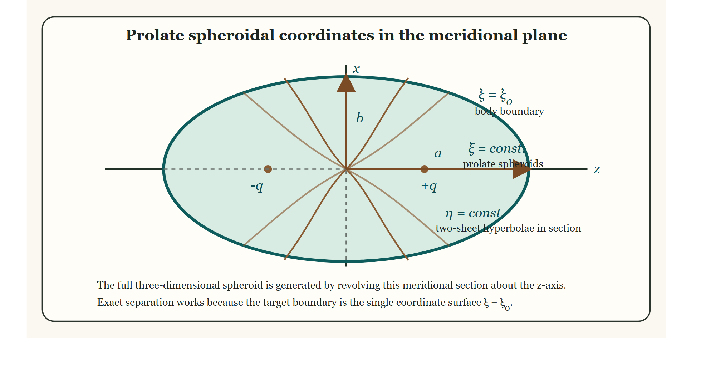
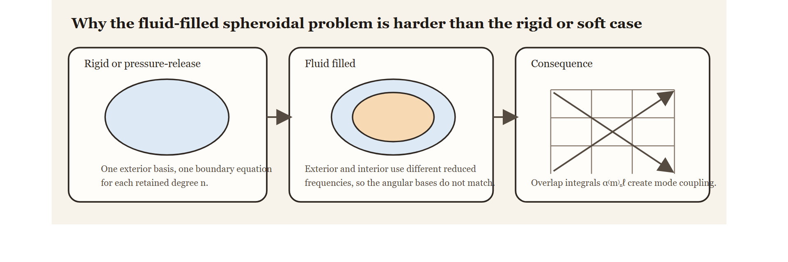
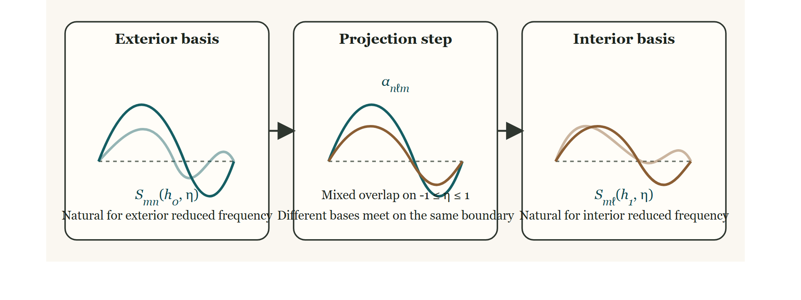

# Introduction

```{r model_family_header, echo=FALSE, results='asis'}
acousticTS:::.model_family_header(
  family = "psms",
  pages = c(
    Overview = "index.html",
    Implementation = "psms-implementation.html",
    Theory = "psms-theory.html"
  )
)
```

The prolate-spheroidal modal-series solution (PSMS) is the exact-separation
counterpart of spherical partial-wave theory for a prolate spheroid. The
Helmholtz equation separates in prolate spheroidal coordinates, allowing the
incident, scattered, and interior fields to be expanded in spheroidal angular
and radial functions [@Spence_1951; @Silbiger_1963].

The rigid case enforces zero normal velocity on $\xi = \xi_1$, the pressure-release case enforces zero pressure there, and the fluid-filled or gas-filled cases enforce continuity of pressure and normal velocity between the exterior and interior media. In the PSMS itself, the rigid and pressure-release cases remain comparatively simple because only the exterior basis is involved. The fluid-filled and gas-filled cases use the same interior-fluid algebra, but with different interior material properties and therefore different reduced frequencies. That basis mismatch is what makes the coupled interior problem harder.

Instead of Legendre polynomials and spherical Bessel functions, the separated
basis contains angular and radial spheroidal wave functions
[@Flammer_1957; @DLMF:ch30]. A penetrable spheroid is more demanding than a
sphere because its interior and exterior angular bases generally differ.

::: {.note data-title="Shared conventions"}
Symbols and medium indexing follow [Notation and
Symbols](../notation-and-symbols/notation-and-symbols.html). Numerical
evaluation of the spheroidal functions is described in [Numerical
Methods](../numerical-foundations/numerical-foundations.html).
:::

# Physical basis of the PSMS

## Why prolate spheroidal coordinates are the natural starting point

The PSMS begins from a geometric observation. A prolate spheroid is a coordinate surface of the prolate spheroidal system, so the boundary of the scatterer is represented exactly by a single coordinate value, $\xi = \xi_1$. That fact matters because exact separation of variables only becomes useful when the boundary condition can also be written on a coordinate surface. In that sense, the PSMS is derived by matching the coordinate system to the geometry from the outset.

## Linear time-harmonic scattering problem

Assume linear acoustics with harmonic time dependence $e^{-i\omega t}$. In each homogeneous region, the pressure satisfies the Helmholtz equation [@Morse_1968]. The scattering problem then proceeds in three steps. First, the incident field is expanded in regular spheroidal eigenfunctions. Second, the scattered field is expanded in outgoing spheroidal eigenfunctions. Third, if the spheroid contains an interior fluid or gas, the interior field is expanded in regular interior spheroidal eigenfunctions. The boundary conditions then determine the modal coefficients.

For fixed-rigid and pressure-release boundaries, only the exterior basis is
needed and the coefficient equations remain mode-local. A penetrable interior
introduces a second reduced frequency and therefore a second angular basis
[@Yeh_1967; @Furusawa_1988].

# Prolate spheroidal coordinates and geometry

## Coordinate definitions

Let $q$ denote the semifocal length of the spheroid, and let $(\xi,\eta,\phi)$ be prolate spheroidal coordinates. In Cartesian coordinates:

$$
  x = q\sqrt{(\xi^2-1)(1-\eta^2)}\cos\phi,
  \qquad
  y = q\sqrt{(\xi^2-1)(1-\eta^2)}\sin\phi,
  \qquad
  z = q\xi\eta.
$$

The coordinate ranges are:

$$
  \xi \ge 1,
  \qquad -1 \le \eta \le 1,
  \qquad 0 \le \phi < 2\pi.
$$

Surfaces of constant $\xi$ are prolate spheroids. The metric coefficients are:

$$
  h_\xi = q\sqrt{\frac{\xi^2-\eta^2}{\xi^2-1}},
  \qquad
  h_\eta = q\sqrt{\frac{\xi^2-\eta^2}{1-\eta^2}},
  \qquad
  h_\phi = q\sqrt{(\xi^2-1)(1-\eta^2)}.
$$

These scale factors are the quantities that make separation of variables possible after the Helmholtz operator is written in curvilinear coordinates [@Flammer_1957; @DLMF:ch30].

## Geometric parameters of the spheroid

If the body surface is the coordinate surface $\xi = \xi_1$, then the major semi-axis $a$ and minor semi-axis $b$ satisfy:

$$
  a = \xi_1 q,
  \qquad
  b = q\sqrt{\xi_1^2-1}.
$$

Eliminating $q$ gives:

$$
  \xi_1 = \left[1-\left(\frac{b}{a}\right)^2\right]^{-1/2},
  \qquad
  q = \frac{a}{\xi_1}.
$$

Thus $\xi_1$ is the natural shape parameter of the spheroid, while $q$ sets the absolute scale.





The boundary is imposed on $\xi = \xi_1$, with the focal points at $\pm q$ fixing the prolate geometry and the semi-axes $a$ and $b$ setting the physical scale. In the rigid and pressure-release cases, one exterior spheroidal basis is sufficient, so each retained degree stays effectively local. In the fluid-filled and gas-filled cases, the interior and exterior reduced frequencies differ, so the angular bases no longer match exactly and the overlap integrals become the mechanism that couples degrees together.



The projection step is the part of the interior-fluid derivation that makes the PSMS algebra noticeably harder. The exterior angular basis is complete for the exterior reduced frequency $\mathbb{k}_1$, and the interior basis is complete for the interior reduced frequency $\mathbb{k}_2$, but those two families are not identical when $\mathbb{k}_1 \ne \mathbb{k}_2$. The overlap matrix is therefore the bridge between two valid but nonidentical angular descriptions of the same boundary data.

## Reduced frequency

For each medium one defines the reduced spheroidal frequency parameter:

$$
  \mathbb{k} = kq.
$$

This parameter plays the same qualitative role in spheroidal scattering that $ka$ plays in spherical or cylindrical scattering. It governs the oscillatory character of the spheroidal basis and therefore the number of degrees needed for accurate representation, but the resulting angular and radial structure is more intricate than in the spherical or cylindrical cases.

# Separation of the Helmholtz equation

## Separated form

In any homogeneous region, the pressure satisfies:

$$
  \nabla^2 p + k^2p = 0
$$

Write the pressure as a product of radial, angular, and azimuthal factors:

$$
  p(\xi,\eta,\phi) = R(\xi)S(\eta)\Phi(\phi)
$$

Substituting this product into the Helmholtz equation in prolate spheroidal coordinates yields three ordinary differential equations. The azimuthal dependence gives:

$$
  \Phi(\phi) = \cos m\phi \quad \text{or} \quad \sin m\phi
$$

with integer order $m \ge 0$. The remaining equations define the angular spheroidal functions $S_{mn}(h,\eta)$ and the radial spheroidal functions $R_{mn}^{(i)}(h,\xi)$, where $n \ge m$ is degree.

The separation succeeds because the metric factors of prolate spheroidal coordinates split into purely $\xi$-dependent and purely $\eta$-dependent parts after division by $RS\Phi$. The shared separation constant is the eigenvalue $\lambda_{mn}(h)$. This is the exact analogue of what happens with associated Legendre functions in spherical scattering, but with one important difference: the eigenvalue itself depends on the reduced frequency $\mathbb{k}$. That dependence is one reason the fluid-filled problem becomes coupled when the interior and exterior media differ.

Written explicitly, the Helmholtz operator in prolate spheroidal coordinates gives:

$$
  \frac{\partial}{\partial\xi}\left[(\xi^2-1)\frac{\partial p}{\partial\xi}\right] + \frac{\partial}{\partial\eta}\left[(1-\eta^2)\frac{\partial p}{\partial\eta}\right] + \\ 
  \frac{\xi^2-\eta^2}{(\xi^2-1)(1-\eta^2)}\frac{\partial^2 p}{\partial\phi^2} + \mathbb{k}^2(\xi^2-\eta^2)p = 0
$$

Substituting $p = RS\Phi$ and dividing by $RS\Phi$ gives:

$$
  \frac{1}{R}\frac{d}{d\xi}\left[(\xi^2-1)\frac{dR}{d\xi}\right] + \mathbb{k}^2\xi^2 + \frac{1}{S}\frac{d}{d\eta}\left[(1-\eta^2)\frac{dS}{d\eta}\right] - \\ 
  \mathbb{k}^2\eta^2 + \frac{1}{\Phi}\frac{\xi^2-\eta^2}{(\xi^2-1)(1-\eta^2)}\frac{d^2\Phi}{d\phi^2} = 0
$$

The azimuthal dependence is separated by imposing:

$$
  \frac{1}{\Phi}\frac{d^2\Phi}{d\phi^2} = -m^2
$$

and separating the remaining $\xi$ and $\eta$ dependence with eigenvalue $\lambda_{mn}(h)$ produces the radial and angular equations stated below.

## Angular equation

The angular function satisfies:

$$
  \frac{d}{d\eta}\left[(1-\eta^2)\frac{dS}{d\eta}\right] + \left(\lambda_{mn}(\mathbb{k}) - \mathbb{k}^2\eta^2 - \frac{m^2}{1-\eta^2}\right)S = 0
$$

where $\lambda_{mn}(\mathbb{k})$ is the separation constant. When
$\mathbb{k}\to0$, this reduces to the associated Legendre equation, so the
spheroidal angular functions reduce smoothly to associated Legendre functions
[@Flammer_1957; @DLMF:ch30; @DLMF:ch14].

## Radial equation

The radial function satisfies:

$$
  \frac{d}{d\xi}\left[(\xi^2-1)\frac{dR}{d\xi}\right] - \left(\lambda_{mn}(\mathbb{k}) - \mathbb{k}^2\xi^2 + \frac{m^2}{\xi^2-1}\right)R = 0
$$

Its independent solutions are the radial spheroidal functions of the first, second, third, and fourth kinds [@Flammer_1957; @DLMF:ch30]. For scattering, the first and third kinds play the same roles as regular Bessel and outgoing Hankel functions in spherical theory.

# Field expansions

## Incident plane-wave expansion

A plane wave incident at polar angle $\theta'$ can be expanded in spheroidal harmonics. Let region $1$ denote the surrounding medium and region $2$ the spheroid interior. The exterior incident field then has the form:

$$
  p_{1,\text{inc}} = 2\sum_{m=0}^{\infty}\sum_{n=m}^{\infty}
  \frac{\epsilon_m i^n}{N_{mn}(\mathbb{k}_1)}
  S_{mn}^{(1)}(\mathbb{k}_1,\cos\theta')
  S_{mn}^{(1)}(\mathbb{k}_1,\eta) \\
  R_{mn}^{(1)}(\mathbb{k}_1,\xi)
  \cos m(\phi-\phi')
$$

This is the spheroidal analogue of the spherical plane-wave expansion [@Spence_1951; @Furusawa_1988]. It is the starting point for every boundary-condition derivation because it expresses the known incident field in the same basis used for the unknown scattered field.

The scattered and interior fields are expanded in the same angular structure but with different radial functions:

$$
  \begin{aligned}
  p_{1,\text{scat}} &=
    2\sum_{m=0}^{\infty}\sum_{n=m}^{\infty} \frac{\epsilon_m i^n}{N_{mn}(\mathbb{k}_1)}
  S_{mn}^{(1)}(\mathbb{k}_1,\cos\theta')
  A_{mn}S_{mn}^{(1)}(\mathbb{k}_1,\eta)R_{mn}^{(3)}(\mathbb{k}_1,\xi), \\
    p_{2, \text{interior}} &=
    2\sum_{m=0}^{\infty}\sum_{\ell=m}^{\infty} \frac{\epsilon_m i^\ell}{N_{m\ell}(\mathbb{k}_2)}
  B_{m\ell}S_{m\ell}^{(1)}(\mathbb{k}_2,\eta) R_{m\ell}^{(1)}(\mathbb{k}_2,\xi)
  \cos m(\phi-\phi').
  \end{aligned}
$$

The exterior incident and scattered fields share reduced frequency
$\mathbb{k}_1$, whereas the interior field carries $\mathbb{k}_2$. This
difference requires projection between the two angular bases.

## Far-field scattering amplitude

The scattered far-field amplitude is expanded as:

$$
  f_\infty(\theta,\phi\mid\theta',\phi') = \\
    \frac{-2i}{k_1}
  \sum_{m=0}^{\infty}\sum_{n=m}^{\infty}
  \frac{\epsilon_m}{N_{mn}(\mathbb{k}_1)} 
  S_{mn}^{(1)}(\mathbb{k}_1,\cos\theta')
  A_{mn}
  S_{mn}^{(1)}(\mathbb{k}_1,\cos\theta)
  \cos m(\phi-\phi')
$$

Here $N_{mn}(\mathbb{k}_1)$ is the norm of the angular function, $\epsilon_m$ is the Neumann factor, and $A_{mn}$ is the modal scattering coefficient determined by the boundary conditions.

## Backscatter geometry

For monostatic backscatter:

$$
  \theta' = \pi-\theta,
  \qquad
  \phi' = \pi + \phi
$$

These relations substitute directly into the angular factors of the far-field amplitude.

# Boundary-condition derivations

## Pressure-release spheroid

For a pressure-release boundary, the total pressure vanishes on the surface $\xi = \xi_1$. If the incident field is expanded in regular radial functions $R_{mn}^{(1)}$ and the scattered field in outgoing functions $R_{mn}^{(3)}$, then for each $(m,n)$:

$$
  R_{mn}^{(1)}(\mathbb{k}_1,\xi_1) + A_{mn}R_{mn}^{(3)}(\mathbb{k}_1,\xi_1) = 0
$$

This boundary condition gives the modal coefficient:

$$
  A_{mn} = -\frac{R_{mn}^{(1)}(\mathbb{k}_1,\xi_1)}{R_{mn}^{(3)}(\mathbb{k}_1,\xi_1)}
$$

## Fixed-rigid spheroid

For a rigid boundary, the normal velocity vanishes, so the derivative with respect to the radial spheroidal coordinate must vanish on the surface. Thus:

$$
  \frac{\partial}{\partial\xi}R_{mn}^{(1)}(\mathbb{k}_1,\xi_1) + A_{mn}\frac{\partial}{\partial\xi}R_{mn}^{(3)}(\mathbb{k}_1,\xi_1) = 0
$$

This condition gives the corresponding modal coefficient:

$$
  A_{mn} = -\frac{R_{mn}^{(1)\prime}(\mathbb{k}_1,\xi_1)}{R_{mn}^{(3)\prime}(\mathbb{k}_1,\xi_1)}
$$

These two cases are summarized compactly as:

$$
  A_{mn} = -\frac{\Delta R_{mn}^{(1)}(\mathbb{k}_1,\xi_1)}{\Delta R_{mn}^{(3)}(\mathbb{k}_1,\xi_1)}
$$

where $\Delta = 1$ for pressure release and $\Delta = \partial/\partial\xi$ for a rigid boundary.

## Fluid-filled and gas-filled spheroid

The penetrable case is more involved because the interior field uses reduced
frequency $\mathbb{k}_2=k_2q$ rather than the exterior value
$\mathbb{k}_1=k_1q$ [@Yeh_1967; @Furusawa_1988; @Ye_1997_2]. The angular
functions are not identical when $\mathbb{k}_1\ne\mathbb{k}_2$, so the
boundary conditions do not remain diagonal in degree $n$. Liquid-filled and
gas-filled cases use the same equations with different interior properties.

Here $\mathbb{k}_1=k_1q$ and $\mathbb{k}_2=k_2q$ are the exterior and interior
reduced frequencies, while $\rho_1$ and $\rho_2$ are the corresponding
densities. Because the boundary is the coordinate surface $\xi=\xi_1$, the
same metric factor multiplies $\partial/\partial\xi$ on both sides and cancels
from normal-velocity continuity.

Let the exterior scattered coefficients be $A_{mn}$ and the interior
coefficients be $B_{m\ell}$. With exterior total pressure
$p_1=p_{1,\text{inc}}+p_{1,\text{scat}}$ and interior pressure $p_2$, pressure
continuity at $\xi=\xi_1$ gives:

$$
  \begin{aligned}
  &\sum_{n=m}^{\infty} A_{mn}S_{mn}^{(1)}(\mathbb{k}_1,\eta)R_{mn}^{(3)}(\mathbb{k}_1,\xi_1) +
    \sum_{n=m}^{\infty} S_{mn}^{(1)}(\mathbb{k}_1,\eta)R_{mn}^{(1)}(\mathbb{k}_1,\xi_1) \\ &= \sum_{\ell=m}^{\infty} B_{m\ell}S_{m\ell}^{(1)}(\mathbb{k}_2,\eta)R_{m\ell}^{(1)}(\mathbb{k}_2,\xi_1).
  \end{aligned}
$$

Normal-velocity continuity gives the corresponding derivative condition:

$$
  \begin{aligned}
  &\frac{1}{\rho_1}\sum_{n=m}^{\infty} A_{mn}S_{mn}^{(1)}(\mathbb{k}_1,\eta)R_{mn}^{(3)\prime}(\mathbb{k}_1,\xi_1) + \frac{1}{\rho_1}\sum_{n=m}^{\infty} S_{mn}^{(1)}(\mathbb{k}_1,\eta)R_{mn}^{(1)\prime}(\mathbb{k}_1,\xi_1) \\ &= \frac{1}{\rho_2}\sum_{\ell=m}^{\infty} B_{m\ell}S_{m\ell}^{(1)}(\mathbb{k}_2,\eta)R_{m\ell}^{(1)\prime}(\mathbb{k}_2,\xi_1).
  \end{aligned}
$$

To solve these equations, one projects onto the interior angular basis using orthogonality. This introduces overlap integrals of the form:

$$
  \alpha_{n\ell}^m = \frac{1}{N_{m\ell}(\mathbb{k}_2)}
  \int_{-1}^{1}
  S_{mn}^{(1)}(\mathbb{k}_1,\eta)S_{m\ell}^{(1)}(\mathbb{k}_2,\eta)\,d\eta
$$

These coefficients measure how strongly an exterior mode $(m,n)$ couples to an interior mode $(m,\ell)$. The projection step is the exact analogue of multiplying a spherical expansion by a Legendre polynomial and integrating over angle. The difference is that because the exterior and interior spheroidal bases correspond to different reduced frequencies, the resulting overlap matrix is no longer diagonal.

The angular orthogonality relation for a fixed reduced frequency is:

$$
  \int_{-1}^{1} S_{mn}^{(1)}(h,\eta)S_{m\ell}^{(1)}(h,\eta)\,d\eta =
    N_{mn}(h)\delta_{n\ell}
$$

When $\mathbb{k}_1 \ne \mathbb{k}_2$, this orthogonality does not diagonalize the mixed products between the two media, which is exactly why the overlap coefficients $\alpha_{n\ell}^m$ appear.

After eliminating the interior coefficients, one obtains a coupled linear system in the exterior coefficients of the form:

$$
  \sum_{n=m}^{\infty} K_{n\ell}^{m(3)}A_{mn} + \sum_{n=m}^{\infty}K_{n\ell}^{m(1)} = 0
$$

where the kernels are built from the overlap coefficients and the radial boundary combinations. A convenient factorization of those kernels is:

$$
  K_{n\ell}^{m(z)} =
    \frac{i^n}{N_{mn}(\mathbb{k}_1)}
  S_{mn}^{(1)}(\mathbb{k}_1,\cos\theta')
  \alpha_{n\ell}^{m}
  E_{n\ell}^{m(z)}
$$

The boundary combination entering that factorization is:

$$
  E_{n\ell}^{m(z)} = R_{mn}^{(z)}(\mathbb{k}_1,\xi_1) - \frac{\rho_2}{\rho_1}
  \frac{R_{m\ell}^{(1)}(\mathbb{k}_2,\xi_1)}{R_{m\ell}^{(1)\prime}(\mathbb{k}_2,\xi_1)}
  R_{mn}^{(z)\prime}(\mathbb{k}_1,\xi_1)
$$

The mismatch between $\mathbb{k}_1$ and $\mathbb{k}_2$ therefore couples
degrees through $\alpha_{n\ell}^m$. These coefficients are the projection of
one medium's angular basis onto the other, not an empirical correction.

## Weak-coupling simplification

If the interior and exterior reduced frequencies are close, the two angular bases are nearly the same and the overlap matrix becomes nearly diagonal. Under that near-matching condition:

$$
  \alpha_{n\ell}^m \approx 0 \quad \text{for } n \ne \ell
$$

so the system decouples approximately by degree. The modal coefficient then reduces to:

$$
  A_{mn} = -\frac{E_{nn}^{m(1)}}{E_{nn}^{m(3)}}
$$

This approximation is the statement that each exterior mode couples mainly to the interior mode of the same degree. It should therefore be read as a near-matching-medium simplification, not as a general property of fluid-filled or gas-filled spheroidal scattering.

# Truncation of the infinite series

The exact solution is a double infinite series in $m$ and $n$. In practice, it is truncated at finite limits. A common estimate is [@Furusawa_1988]:

$$
  m_{max} = \lceil 2k_1b \rceil,
  \qquad
  n_{max} = m_{max} + \left\lceil \frac{\mathbb{k}_1}{2} \right\rceil
$$

These truncation rules express the same principle as in spherical scattering: the number of required modes grows with acoustic size.

For the PSMS, however, truncation is not only a matter of how many modal terms to keep in an otherwise diagonal sum. In the interior-fluid case it also sets the size of the dense linear systems and of the overlap matrix that must be resolved accurately. That is why the PSMS can become numerically demanding more quickly than the simpler spherical or cylindrical modal models.

## Matrix form of the truncated problem

After truncation, the infinite coupled system becomes a finite dense linear system for each fixed azimuthal order $m$. If the retained degrees are $n,\ell = m,\ldots,N_m$, define the coefficient vector:

$$
  \mathbf{a}^{(m)} =
    \begin{bmatrix}
  A_{mm} & A_{m,m+1} & \cdots & A_{mN_m}
  \end{bmatrix}^T
$$

The projected boundary equations can then be written as:

$$
  \mathbf{M}^{(m)}\mathbf{a}^{(m)} = \mathbf{b}^{(m)}
$$

with entries:

$$
  M_{\ell n}^{(m)} = K_{n\ell}^{m(3)},
  \qquad
  b_{\ell}^{(m)} = -\sum_{n=m}^{N_m} K_{n\ell}^{m(1)}
$$

The matrix is generally dense because each retained exterior mode can couple
to several interior modes through $\alpha_{n\ell}^m$. Truncation converts the
infinite coupled system into a finite-dimensional linear algebra problem.

## Numerical evaluation of the overlap matrix

The overlap coefficients are themselves integrals on $[-1,1]$:

$$
  \alpha_{n\ell}^m = \frac{1}{N_{m\ell}(\mathbb{k}_2)}
  \int_{-1}^{1}
  S_{mn}^{(1)}(\mathbb{k}_1,\eta)S_{m\ell}^{(1)}(\mathbb{k}_2,\eta)\,d\eta
$$

For the truncated system these integrals are evaluated numerically, typically by Gauss-Legendre quadrature [@Abramowitz_1964; @Press2007; @DLMF:ch3]. That is, one replaces the integral by a weighted sum over quadrature nodes $\eta_j$:

$$
  \alpha_{n\ell}^m \approx \frac{1}{N_{m\ell}(\mathbb{k}_2)}
  \sum_{j=1}^{J} w_j
  S_{mn}^{(1)}(\mathbb{k}_1,\eta_j)S_{m\ell}^{(1)}(\mathbb{k}_2,\eta_j)
$$

This step is mathematically natural because the overlap integrals are smooth on the finite interval and must be evaluated repeatedly for many pairs $(n,\ell)$. It is also one of the points at which numerical settings become part of the practical model specification.

## Stable solution of each modal system

Once $\mathbf{M}^{(m)}$ and $\mathbf{b}^{(m)}$ are assembled, the truncated coefficients are obtained by solving the dense system for each $m$. Near resonances, or when the interior and exterior bases become nearly linearly dependent after truncation, $\mathbf{M}^{(m)}$ can be poorly conditioned. A stable approach is therefore to compute a singular-value decomposition [@Press2007]:

$$
  \mathbf{M}^{(m)} = \mathbf{U}\mathbf{\Sigma}\mathbf{V}^*
$$

and form a pseudoinverse solution:

$$
  \mathbf{a}^{(m)} = \mathbf{V}\mathbf{\Sigma}^{+}\mathbf{U}^*\mathbf{b}^{(m)}
$$

Very small singular values are discarded relative to the dominant singular value, which suppresses spurious growth associated with the truncated near-null directions. In practical terms, the SVD step separates the physically meaningful modal content from numerical noise introduced by truncation and basis mismatch. The weak-coupling approximation described above is recovered when the overlap matrix is already close to diagonal. In that limit, $\mathbf{M}^{(m)}$ is nearly diagonal as well, and the full matrix solve collapses back to the simpler term-by-term ratio for $A_{mn}$.

# Backscattering cross-section and target strength

Once the modal coefficients are known, the far-field amplitude is evaluated. The backscattering cross-section then becomes:

$$
  \sigma_\text{bs} = |f_\infty|^2
$$

with target strength [@MacLennan_2002]:

$$
  TS = 10\log_{10}\left(
  \frac{\sigma_\text{bs}}{1\ \mathrm{m}^2}\right).
$$

Equivalently, $TS=20\log_{10}(|f_\infty|/1\ \mathrm{m})$.

# Mathematical assumptions

The PSMS derivation rests on the following assumptions:

1. The body boundary is exactly prolate spheroidal.
2. Each region is homogeneous.
3. Linear, time-harmonic acoustics applies.
4. The Helmholtz equation is separable in prolate spheroidal coordinates.
5. The field expansions converge sufficiently rapidly after modal truncation.

PSMS matches the prolate boundary exactly. Its cost is the evaluation of
spheroidal special functions and, for penetrable targets, overlap integrals and
dense mode-coupling systems. Implementation-specific convergence and precision
controls are documented on the [PSMS implementation
page](psms-implementation.html).


