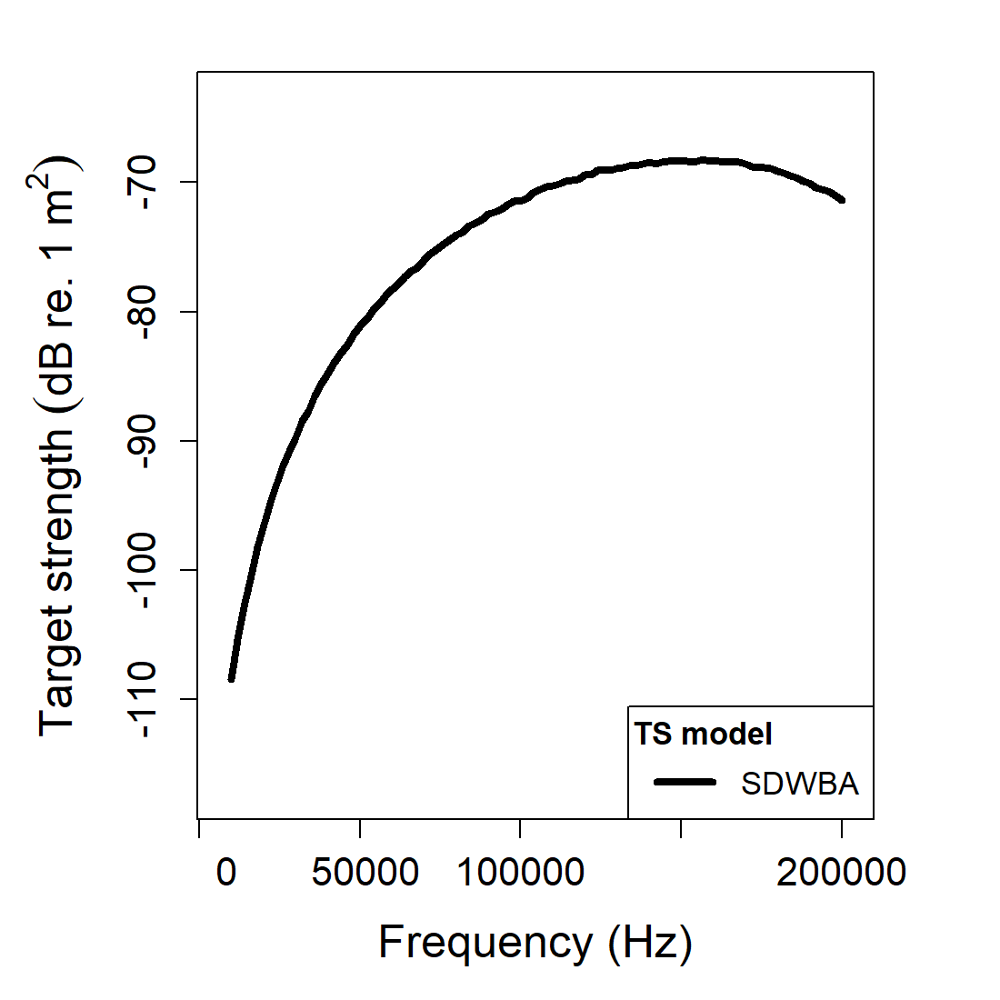
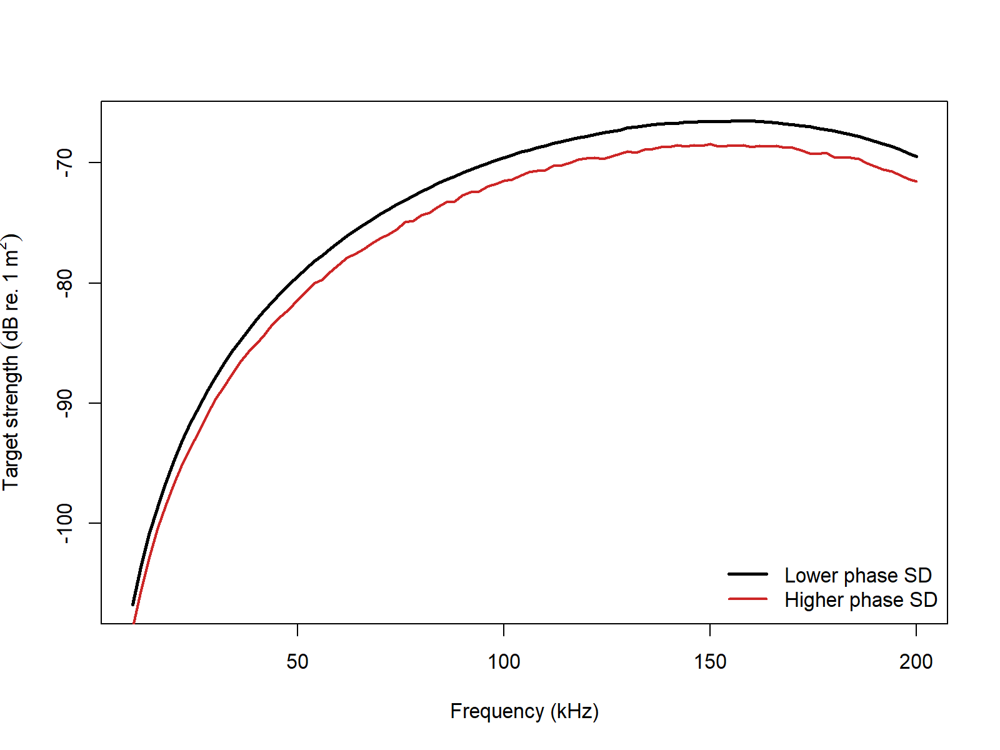

# acousticTS implementation

```{r model_family_header, echo=FALSE, results='asis'}
acousticTS:::.model_family_header(
  family = "sdwba",
  pages = c(
    Overview = "index.html",
    Implementation = "sdwba-implementation.html",
    Theory = "sdwba-theory.html"
  )
)
```


These pages connect krill-body DWBA models to phase variability, orientation effects, and practical survey use [@demer_reconciling_2003; @demer_validation_2003; @conti_improved_2006; @demer_new_2005].

The acousticTS package uses object-based scatterers so the same implementation pattern carries across models: create a scatterer, run `target_strength()`, inspect the stored model output, and then compare a small set of physically important inputs. For SDWBA, the required object class is still `FLS`, but `target_strength()` also receives stochastic controls for phase variability and resampling.

The important implementation point is that the SDWBA does not replace the underlying DWBA geometry. It uses the same fluid-like target description and then layers a stochastic phase model onto the segment contributions. In practice, that means the object-building step remains deterministic, while the model call is where unresolved variability is introduced.

## Fluid-like scatterer object generation

```{r}
library(acousticTS)

cylinder_shape <- cylinder(
  length_body = 15e-3,
  radius_body = 2e-3,
  n_segments = 50
)

stochastic_scatterer <- fls_generate(
  shape = cylinder_shape,
  g_body = 1.058,
  h_body = 1.058,
  theta_body = pi / 2
)

stochastic_scatterer
```

## Calculating deterministic and stochastic TS

The example below runs both `dwba` and `sdwba` so the stochastic averaging can be compared directly with the baseline deterministic response.

```{r}
frequency <- seq(50e3, 200e3, by = 10e3)

stochastic_scatterer <- target_strength(
  object = stochastic_scatterer,
  frequency = frequency,
  model = c("dwba", "sdwba"),
  n_iterations = 30,
  n_segments_init = 14,
  phase_sd_init = sqrt(2) / 2,
  length_init = 15e-3,
  frequency_init = 120e3
)
```

This paired run is useful because it keeps the target fixed while changing only the coherence assumption. The `DWBA` result shows what the segmented body would predict if every segment phase were known exactly. The `SDWBA` result shows what happens when unresolved phase variability is allowed to soften that deterministic interference pattern through repeated stochastic realizations.

The stochastic controls should be read together rather than independently. `n_iterations` controls how well the ensemble average is approximated numerically. `n_segments_init`, `phase_sd_init`, `length_init`, and `frequency_init` define the reference scale from which the segmentation and phase variability are propagated over the actual run conditions. Those arguments therefore encode the stochastic interpretation of the target, not just the cost of the calculation.

## Extracting model results

Model results can be extracted either visually or directly through `extract()`.

### Plotting results

```{r echo=FALSE, out.width='49%', fig.align='center', fig.alt='Pre-rendered SDWBA example plot showing the stored stochastic target-strength spectrum.'}

```

### Accessing results

```{r}
dwba_results <- extract(stochastic_scatterer, "model")$DWBA
sdwba_results <- extract(stochastic_scatterer, "model")$SDWBA

head(dwba_results)
head(sdwba_results)
```

The SDWBA results include the same main fields as DWBA plus `TS_sd`, which summarizes how much the stochastic realizations vary at each frequency.

That additional field is important for interpretation. A smoothed mean `TS` curve by itself does not tell the reader whether the stochastic realizations were tightly clustered or broadly dispersed. `TS_sd` provides that missing context and helps distinguish between a stable partially incoherent prediction and one that is still strongly realization-dependent.

## Comparison workflows

### Phase-disorder sensitivity

One practical way to tune the SDWBA is to compare a smaller and larger phase standard deviation while keeping the geometry fixed.

```{r echo=FALSE, out.width='85%', fig.align='center', fig.alt='Pre-rendered SDWBA comparison showing how the spectrum changes when the phase-disorder standard deviation is increased.'}

```

In practical krill-style applications, `phase_sd_init`, `length_init`, and `frequency_init` should be treated as a linked parameterization rather than as independent tuning knobs.

This comparison is best interpreted as a change in phase disorder rather than a change in gross target-strength mechanism. The geometry and material contrasts are the same in both runs. What changes is how strongly unresolved variability suppresses the coherent cross terms. A larger `phase_sd_init` therefore does not mean the target has become physically larger or more reflective. It means the model is allowing more stochastic phase scrambling across segment contributions.

For practical SDWBA work, the first controls to revisit are usually:

1. `phase_sd_init`, because it sets the reference strength of phase disorder,
2. `n_iterations`, because too few realizations can leave the ensemble average noisy,
3. `n_segments_init`, `length_init`, and `frequency_init`, because together they define the scale-invariant reference for segmentation and phase variability, and
4. the underlying `FLS` geometry itself, because the stochastic phase model does not compensate for a poorly chosen deterministic target description.

### Published reference comparisons

SDWBA should be judged against the exact modal-series `Benchmark` column in the Jech weakly scattering sphere, prolate-spheroid, and cylinder files. The table below reports that direct comparison together with the representative runtime on the current machine.

| Geometry | Max abs. delta vs benchmark (dB) | Mean abs. delta vs benchmark (dB) | Elapsed (s) |
|:--|--:|--:|--:|
| Weakly scattering sphere | 10.08475 | 0.35609 | 0.72 |
| Weakly scattering prolate spheroid | 2.05918 | 0.07638 | 3.58 |
| Weakly scattering cylinder | 2.07406 | 0.15895 | 1.91 |

These runs use the same stochastic reference values throughout the benchmark set: `N0 = 50`, `phase_sd_init = sqrt(2) / 32`, `L0 = 38.35 mm`, `f0 = 120 kHz`, and `n_iterations = 100`.

For SDWBA, the most important additional implementation control is `n_iterations`, because it determines how well the stochastic ensemble average is actually resolved numerically. The table below keeps the same Jech targets and changes only `n_iterations`.

| Geometry | `n_iterations` | Max abs. delta vs benchmark (dB) | Mean abs. delta vs benchmark (dB) | Elapsed (s) |
|:--|--:|--:|--:|--:|
| Weakly scattering sphere | 25 | 9.30458 | 0.34871 | 0.58 |
| Weakly scattering sphere | 100 | 10.08475 | 0.35609 | 0.63 |
| Weakly scattering sphere | 500 | 9.97080 | 0.35343 | 1.11 |
| Weakly scattering prolate spheroid | 25 | 1.26004 | 0.06948 | 3.08 |
| Weakly scattering prolate spheroid | 100 | 2.05918 | 0.07638 | 3.63 |
| Weakly scattering prolate spheroid | 500 | 1.28403 | 0.07107 | 6.50 |
| Weakly scattering cylinder | 25 | 2.07406 | 0.15899 | 1.75 |
| Weakly scattering cylinder | 100 | 2.07406 | 0.15895 | 2.03 |
| Weakly scattering cylinder | 500 | 2.07403 | 0.15895 | 3.39 |

That sensitivity table is useful because it shows two things at once. First, the runtime cost does scale with the number of stochastic realizations, just as the implementation description says it should. Second, once the reference stochastic parameters are fixed, simply driving `n_iterations` upward does not force SDWBA onto the exact benchmark family. It mainly stabilizes the ensemble average around the stochastic approximation itself.

### Bundled krill implementation comparison

The bundled `krill` object serves a different role from the canonical weakly scattering targets above. Here the goal is not to compare against an exact modal-series solution, but to compare the same stored krill geometry across four SDWBA implementations using a common frequency grid, a common broadside incidence, and the same stochastic reference values used for the benchmark calculations (`N0 = 50`, `phase_sd_init = sqrt(2) / 32`, `L0 = 38.35 mm`, `f0 = 120 kHz`, `n_iterations = 100`).

| Comparison | Mean abs. delta TS (dB) | Max abs. delta TS (dB) |
|:--|--:|--:|
| acousticTS vs `echoSMs` | 1.70257 | 30.63630 |
| acousticTS vs CCAMLR MATLAB | 0.06978 | 0.18270 |
| acousticTS vs NOAA HTML | 0.06158 | 0.52846 |
| `echoSMs` vs CCAMLR MATLAB | 1.74808 | 30.72119 |
| `echoSMs` vs NOAA HTML | 1.69189 | 30.27117 |
| CCAMLR MATLAB vs NOAA HTML | 0.13036 | 0.65798 |

Those values should be read as implementation differences rather than benchmark errors. All four calculations use the same bundled krill dimensions and the same initial stochastic reference values, but they do not use the same stochastic convention. In the current external implementations, both the CCAMLR MATLAB code and the NOAA HTML code square the phase term in the stochastic multiplier, while acousticTS keeps the paper-style linear phase standard deviation and `echoSMs` follows its own direct stochastic-phase application. So the bundled krill comparison is complementary to the canonical tables above: one set checks the stochastic model against published weakly scattering reference cases, and the other checks how the same biological krill geometry separates across existing SDWBA implementations.
